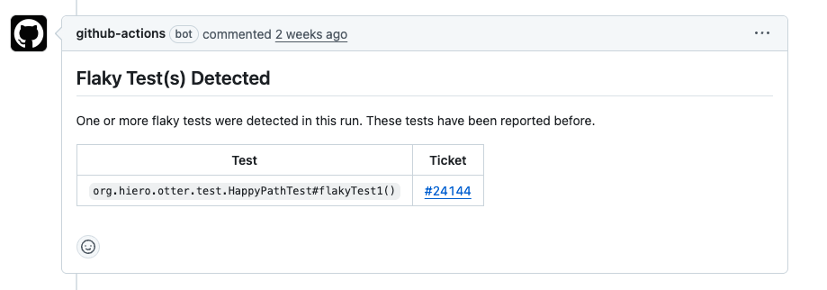
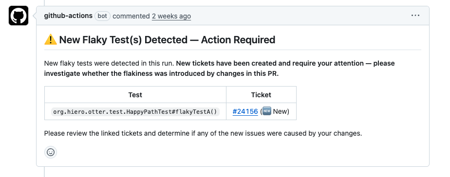

# Flaky Test Detection Plugin — Developer Guide

## Overview

A new flaky test detection plugin is being enabled across CI workflows. This document explains how the plugin works, what changes you can expect in your CI experience, and what is expected of you when a flaky test is detected.

The plugin is provided by **Develocity** and operates as a Gradle plugin within the test execution step of CI workflows. When a test fails during the `gradlew test` process, the plugin automatically retries it up to a configured number of times. If the test succeeds on any retry, it is classified as **flaky** — the workflow run will still report success, and the flaky test will be tracked separately.

## Where the Plugin Is Enabled

The plugin is active in the following CI workflows:

- **Pull Request (PR) CI**
- **Minimal Acceptance Test Suite (MATS) on main**
- **eXtended Test Suite (XTS) executions**

> **Important:** The plugin operates exclusively within the test execution step — specifically, the step that runs the `gradlew test` command. It does **not** apply to any other workflow steps. Failures that occur outside of the test step (e.g., compilation, static analysis, or other non-test stages) are unaffected by this plugin and will continue to fail the workflow as they do today.

## How the Plugin Works

1. A test fails during the `gradlew test` step.
2. The plugin automatically retries the failed test up to a configured number of times.
3. **If the test passes on any retry**, it is marked as flaky. The overall workflow run is **not** failed.
4. **If the test fails on all retries**, it is treated as a genuine failure. The workflow run fails as it normally would.

This means flaky tests will no longer block PR merges or cause MATS/XTS runs to report failure, as long as the test succeeds within the allowed retries. Note that passing MATS/XTS runs on the main branch will still send a Slack message confirming the run passed, but noting that flaky tests were detected.

> **Fail-safe:** If the number of flaky tests detected in a single run exceeds a configured threshold, the overall run will fail regardless of retry outcomes. This prevents situations where a large number of flaky tests mask a systemic issue.

## What Happens When a Flaky Test Is Detected

The behavior depends on where the flaky test was detected.

### On a Pull Request

A comment is left on the PR by the `github-actions` bot. The content of the comment depends on whether the flaky test is already known:

- **Known flaky test (ticket already exists):** The comment includes a link to the existing ticket for informational purposes. No new ticket is created. The CI run is linked in the existing ticket for tracking purposes. No action is required from the PR author unless they believe their changes may have worsened the flake.

- **New flaky test (no existing ticket):** A new ticket is automatically created on the flaky test project board and linked in the PR comment. The CI run is also linked in the new ticket. The PR author is expected to **investigate whether the flakiness was introduced by their changes**. If the flake is unrelated to the PR, no further action is required from the author — the ticket will be triaged by the assigned team.

### On MATS / XTS

When a new flaky test is detected during a MATS or XTS run:

- A ticket is **automatically created** on the flaky test project board.
- The ticket is **assigned to the manager** of the team responsible for that test category (e.g., HAPI tests are assigned to the HAPI team manager, Otter tests to the Otter team manager). Unit tests, which span multiple areas, are assigned to the Consensus and Foundation team manager.
- A warning message is posted to **#continuous-integration-test-operations** on Slack.

If the flaky test already has an existing ticket, no new ticket is created. Instead, the MATS/XTS run is linked in the existing ticket for tracking purposes.

### On Dry Runs

The Dry Run workflow runs the same checks as the PR CI workflow but does **not** automatically create tickets for newly detected flaky tests.

If you kick off a dry run, it is **your responsibility** to:

1. Check the workflow results for any detected flaky tests.
2. Investigate whether the flakiness is related to changes in the branch you ran the workflow against.
3. Create a ticket manually if the flake is new and not caused by your changes.

## Ticket Details

All tickets created by the plugin (automatically or manually) follow this convention:

- **Title format:** `[Flaky Test] {class}#{method}`
  - Example: `[Flaky Test] org.hiero.otter.test.HappyPathTest#flakyTestA`
- **Project board:** All flaky test tickets are tracked on a dedicated [project board](https://github.com/orgs/hiero-ledger/projects/50/views/1)

## PR Comment Examples

Below are examples of the comments the `github-actions` bot will leave on PRs.

**Known flaky test — informational only:**

**New flaky test — action required:**

## Scope and Limitations

- The plugin is a **Gradle plugin** that operates solely within the `gradlew test` process. It cannot detect or retry failures that occur outside of this step.
- If a test depends on an external service and that service is unavailable, the test will fail and the plugin will retry it just like any other failure. These failures still need to be investigated using the same process you follow today — the plugin does not change the level of effort required for infrastructure-related failures that occur inside of the test step.

## Summary of Responsibilities

| Scenario | Ticket Created Automatically? | Who Investigates? |
|---|---|---|
| New flaky test on a **PR** | Yes | PR author (to determine if their changes caused the flake) |
| Known flaky test on a **PR** | No (existing ticket linked) | Assigned team manager |
| New flaky test on **MATs / XTS** | Yes | Assigned team manager |
| Known flaky test on **MATs / XTS** | No (existing ticket linked) | Assigned team manager |
| New flaky test on a **Dry Run** | No | Person who initiated the dry run |
