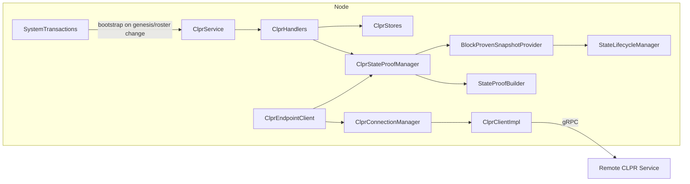
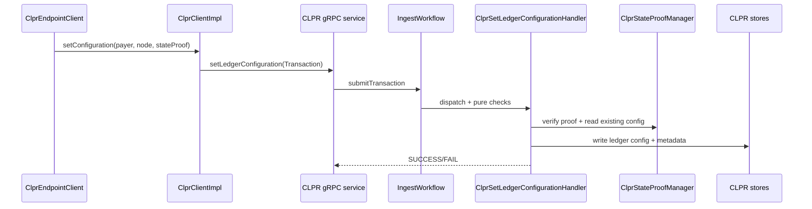
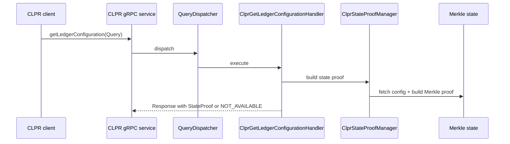

# CLPR (Cross-Ledger Protocol) Prototype Overview

## Purpose and audience

This document explains the current CLPR prototype as implemented in this branch. It is written for engineers who are new to the code base and want to understand what CLPR does today, how it is wired into the node, and how it differs from the pre-CLPR main branch.

## Before vs after (local main vs this branch)

Before these changes, the node had no CLPR service, no CLPR protobuf surface, and no CLPR state. There was no mechanism to build or verify state proofs for CLPR, no CLPR endpoints, and the HAPI test framework could only run a single local network at a time.

After these changes, the node exposes a CLPR gRPC service, persists CLPR state, and can generate a development-mode CLPR ledger configuration at genesis and on roster changes. The CLPR prototype can publish and pull ledger configurations between multiple locally running networks, and the HAPI test framework can orchestrate those networks.

## Current scope and limitations

The implementation is intentionally a prototype with development shortcuts. The goal is to exchange ledger configurations (roster + endpoints) between networks and to prove them with a temporary, locally constructed state proof.

Current capabilities
- Define CLPR protobuf messages and gRPC service operations.
- Persist ledger configurations in state and query them via gRPC.
- Generate a local ledger configuration at genesis and when the roster or publicize flag changes.
- Produce a development-mode state proof from the latest immutable state snapshot.
- Periodically publish/pull ledger configurations to and from remote CLPR endpoints.
- Emit CLPR state changes through block stream output for debugging and tooling.

Known limitations
- State proofs use local Merkle state and the state root hash as the signature (dev-mode only).
- Ingest signature checking is bypassed for CLPR set-config transactions in dev mode.
- The CLPR client uses a dev-mode signer and may submit empty signature maps if no key is found.
- Payment, queue metadata, and message queue content exchange are not implemented.
- Remote exchange requires published service endpoints; networks configured to hide endpoints can only be reached if another path is used.
- When the local ledger id is not yet available, the endpoint client skips publish/pull until bootstrap completes.

## Core data model

- ClprLedgerId: unique ledger identifier (bytes).
- ClprLedgerConfiguration: ledger id, timestamp, and a list of endpoints.
- ClprEndpoint: contains node account id, gossip certificate, and optional service endpoint.
- ClprLocalLedgerMetadata: stores ledger id and roster hash for local bootstrap decisions.

State stores (CLPR service)
- CLPR ledger configurations map (ledger id -> configuration).
- CLPR metadata singleton (local ledger id + roster hash).

API surface (protobuf)
- Query: `ClprGetLedgerConfiguration` returns a state proof, or fails with `CLPR_LEDGER_CONFIGURATION_NOT_AVAILABLE`,
`WAITING_FOR_LEDGER_ID`, or `NOT_SUPPORTED`.
- Transaction: `ClprSetLedgerConfiguration` stores a configuration or fails with `CLPR_INVALID_STATE_PROOF`,
`WAITING_FOR_LEDGER_ID`, or `NOT_SUPPORTED`.

## Architecture and wiring

The CLPR prototype consists of a service API, service implementation, state proof tooling, and a client + endpoint loop.

Key modules and entry points
- Protobuf surface: `hapi/hedera-protobuf-java-api/src/main/proto/interledger/*`.
- CLPR service API: `hedera-node/hiero-clpr-interledger-service`.
- CLPR service implementation: `hedera-node/hiero-clpr-interledger-service-impl`.
- State proof utilities: `hedera-node/hapi-utils/src/main/java/com/hedera/node/app/hapi/utils/blocks/*`.
- State snapshot provider: `hedera-node/hedera-app/src/main/java/com/hedera/node/app/state/BlockProvenStateAccessor.java`.
- Genesis/bootstrap dispatch: `hedera-node/hedera-app/src/main/java/com/hedera/node/app/workflows/handle/record/SystemTransactions.java`.

Node integration points (service wiring)
- Service registration and handler binding in the app workflow modules and dispatchers.
- Store factory additions for CLPR metadata/configuration stores and roster access.
- Block stream listeners updated to map CLPR state changes.

## Local ledger configuration generation

A local CLPR ledger configuration is generated as a synthetic transaction when bootstrap conditions are met.

Trigger points
- Genesis setup and certain startup flows.
- Roster changes (e.g., add/remove node, upgrade).
- The `clpr.publicizeNetworkAddresses` flag toggles endpoint visibility and triggers regeneration.

Bootstrap logic (high level)
1. Read active roster and current roster hash.
2. Read CLPR metadata to see the last roster hash and ledger id.
3. If CLPR is enabled and roster or endpoint visibility changed, build a new configuration.
4. Dispatch a synthetic `CLPR_SET_LEDGER_CONFIG` transaction using the system admin payer.

Bootstrap details that matter for determinism
- Payer is the system admin account to keep synthetic transaction ids consistent across nodes.
- If metadata already exists, the previous ledger id is reused for stability across restarts.
- Endpoints are sourced from network metadata when available, otherwise from the node store.
- When endpoints are not publicized, only gossip certificates and node account ids are stored.

Endpoint exchange cycle (publish/pull)
1. Read local ledger id, local configuration, and local state proof.
2. For each known remote configuration, select a candidate service endpoint.
3. Publish the local configuration to the remote endpoint.
4. Pull the remote configuration back and store it locally if newer.
5. (Planned) Publish/pull queue metadata.
6. (Planned) Publish/pull queue content.

## Transaction flow: CLPR_SET_LEDGER_CONFIG

Notes
- When the node itself dispatches a synthetic config, the handler bypasses proof validation.
- In dev mode, payer signature expansion is skipped in ingest for this transaction type.
- The handler enforces monotonic timestamps and refuses to overwrite the local ledger configuration with a remote submission.

## Query flow: CLPR_GET_LEDGER_CONFIG

## State proof tooling (dev mode)

To support CLPR without the full history service, this branch adds local state-proof helpers:
- `MerklePathBuilder`, `StateProofBuilder`, and `StateProofVerifier` build and validate proofs from Merkle state.
- `BlockProvenSnapshotProvider` (app-spi) and `BlockProvenStateAccessor` (app) provide the latest immutable state.
- CLPR uses these helpers to build state proofs for ledger configurations.
- `ClprStateProofUtils` validates state proofs and extracts configurations, using `StateProofVerifier`.

## Configuration and observability

- `clpr.clprEnabled`: master enable switch.
- `clpr.connectionFrequency`: endpoint loop frequency in milliseconds.
- `clpr.publicizeNetworkAddresses`: include or omit service endpoints in configurations.
- `clpr.devModeEnabled`: enables dev-mode shortcuts for signature and proof handling.

Logging targets were adjusted to make CLPR and query behavior visible in local runs.

Default values (as defined in config)
- `clpr.clprEnabled=false`
- `clpr.connectionFrequency=5000`
- `clpr.publicizeNetworkAddresses=true`
- `clpr.devModeEnabled=true`

## Related files (entry points)

- `hedera-node/hedera-app/src/main/java/com/hedera/node/app/workflows/handle/record/SystemTransactions.java`
- `hedera-node/hiero-clpr-interledger-service/src/main/java/org/hiero/interledger/clpr/ClprService.java`
- `hedera-node/hiero-clpr-interledger-service-impl/src/main/java/org/hiero/interledger/clpr/impl/ClprEndpointClient.java`
- `hedera-node/hiero-clpr-interledger-service-impl/src/main/java/org/hiero/interledger/clpr/impl/ClprStateProofManager.java`
- `hedera-node/hapi-utils/src/main/java/com/hedera/node/app/hapi/utils/blocks/StateProofBuilder.java`
