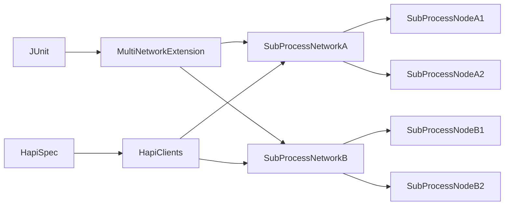
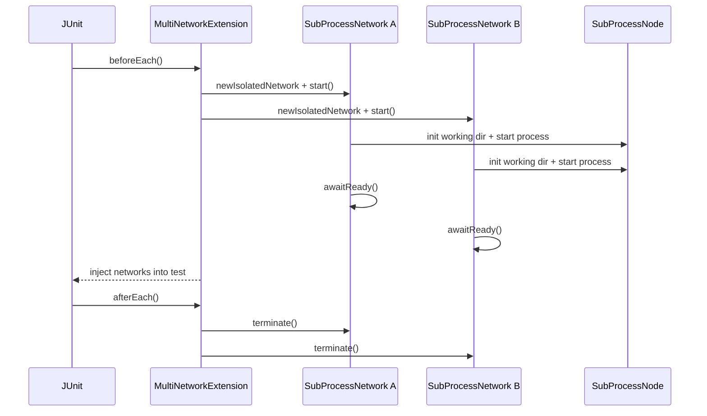

---

scope: clpr
audience: engineering
status: draft
last_updated: 2026-02-04
------------------------

# HAPI Test Framework Changes for CLPR Ship of Theseus

## Purpose

The Ship of Theseus suite requires multiple independent ledgers running at once. This file documents the major HAPI test framework changes that enable multi-network orchestration, CLPR-specific operations, and network lifecycle control.

## Before vs after

Before these changes, the HAPI test framework assumed a single network per test run, with shared ports, shared working directories, and a single injected `HederaNetwork` object. There was no way to model interactions between two independent networks or to run cross-ledger integration tests.

After these changes, the framework can spin up multiple isolated subprocess networks, inject them into test methods, and target individual networks within a single test. It also includes CLPR-specific transactions and queries used by the Ship of Theseus suite.

## Major additions

### 1) Multi-network test annotation and extension

- `@MultiNetworkHapiTest` declares one or more networks and their sizes.
- `MultiNetworkExtension` provisions subprocess networks before each test and injects them into parameters in declaration order.

Responsibilities
- Creates isolated networks with unique port ranges.
- Applies per-network bootstrap overrides (including CLPR config).
- Ensures startup and readiness checks for every network.
- Ensures deterministic teardown on failure.
- Defaults CLPR to disabled unless explicitly overridden per network.

### 2) Multi-network test builder

- `MultiNetworkHapiTestBuilder` allows a single test to run ordered operations against multiple networks.
- `HapiSpec` supports targeting via `.onNetwork("NAME", ops)` and thread-local routing.

### 3) Subprocess network isolation

`SubProcessNetwork` and `SubProcessNode` were extended to:
- Allocate disjoint port ranges per network.
- Use per-network working directory scopes (e.g., `SHIP_A-test`, `SHIP_B-test`).
- Generate network-specific address books and candidate rosters.
- Support node lifecycle actions needed during upgrade and roster rotation.

### 4) Working directory and roster utilities

`WorkingDirUtils` and `AddressBookUtils` were enhanced to:
- Build per-network `config.txt`, `genesis-network.json`, and candidate roster files.
- Sync per-network gossip certificates.
- Rewrite bootstrap log configuration so per-node logs go into the network working directory.
- Generate service endpoints that match the per-network port layout.

### 5) Multi-network client routing

- `HapiClients` and `ChannelStubs` route requests to the active target network.
- `HapiSpec` binds the target network in a thread-local to keep concurrent specs isolated.
- `SharedNetworkLauncherSessionListener` enables CLPR overrides automatically when CLPR-tagged tests are present.
- `NetworkTargetingExtension` coordinates the thread-local target network and property overrides.

### 6) CLPR test operations

New HAPI operations allow tests to drive the CLPR protocol directly:
- `HapiGetLedgerConfig` (query)
- `HapiSetLedgerConfig` (transaction)

### 7) Test infrastructure support

Additional changes make large multi-network tests more stable:
- Network targeting extensions and registry updates.
- Process and readiness utilities for subprocess nodes.
- Updated validators and lifecycle utilities for multi-network runs.

## Component diagram: multi-network harness

## Sequence diagram: multi-network test startup

## Why these changes were required for CLPR

The Ship of Theseus test needs:
- Two isolated ledgers with distinct rosters and ledger ids.
- Independent configuration overrides (e.g., one network publicizes endpoints, one does not).
- The ability to submit CLPR transactions to one network while querying another.
- Repeated node replacements and upgrades without cross-network interference.

Without multi-network support, these behaviors cannot be expressed in a single test run.

## Files to review

- `hedera-node/test-clients/src/main/java/com/hedera/services/bdd/junit/MultiNetworkHapiTest.java`
- `hedera-node/test-clients/src/main/java/com/hedera/services/bdd/junit/extensions/MultiNetworkExtension.java`
- `hedera-node/test-clients/src/main/java/com/hedera/services/bdd/spec/MultiNetworkHapiTestBuilder.java`
- `hedera-node/test-clients/src/main/java/com/hedera/services/bdd/junit/hedera/subprocess/SubProcessNetwork.java`
- `hedera-node/test-clients/src/main/java/com/hedera/services/bdd/junit/hedera/utils/WorkingDirUtils.java`
- `hedera-node/test-clients/src/main/java/com/hedera/services/bdd/spec/queries/clpr/HapiGetLedgerConfig.java`
- `hedera-node/test-clients/src/main/java/com/hedera/services/bdd/spec/transactions/clpr/HapiSetLedgerConfig.java`
