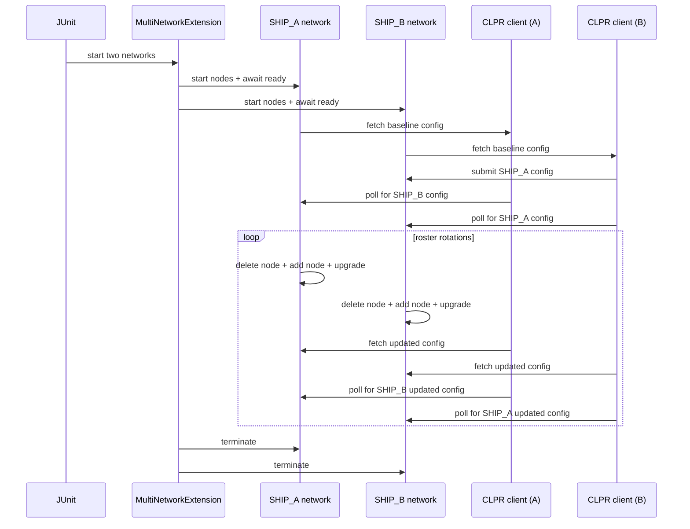

---

scope: clpr
audience: engineering
status: draft
last_updated: 2026-02-04
------------------------

# CLPR Ship of Theseus Suite

## Purpose and scope

The Ship of Theseus suite is an end-to-end, multi-network test that verifies CLPR ledger configuration exchange across two independent networks while each network is progressively replaced node-by-node. The test validates that CLPR continues to function as the roster evolves, proving that configuration exchange survives continuous change.

This suite targets the CLPR prototype and the multi-network HAPI test framework added in this branch.

## Before vs after

Before these changes, HAPI tests could only provision a single local network, so it was not possible to validate CLPR behavior across multiple isolated ledgers. There was also no CLPR ledger configuration generation at genesis and no CLPR endpoint client to exchange configurations between networks.

After these changes, the test can bring up two isolated subprocess networks, enable CLPR on both, and use CLPR clients to exchange configurations. It then performs multiple node rotations and upgrades while asserting that configurations remain current and consistent.

## Test setup

The suite uses `@MultiNetworkHapiTest` to provision two networks:
- SHIP_A: 4 nodes, CLPR enabled, endpoints publicized.
- SHIP_B: 4 nodes, CLPR enabled, endpoints not publicized.

Important overrides used in the test:
- `clpr.clprEnabled=true`
- `clpr.publicizeNetworkAddresses` differs across networks
- `clpr.connectionFrequency=1000` (1s loop)

## High-level behavior

The test follows a staged scenario (mirrors the in-code documentation):

1. Start both networks and ensure they are ready.
2. Fetch baseline ledger configurations from both networks.
3. Submit SHIP_A's configuration to SHIP_B, triggering SHIP_B to publish its configuration back.
4. Confirm both networks have each other's configurations.
5. Mutate SHIP_A (delete node, add node, upgrade) and validate updated configuration.
6. Confirm SHIP_B receives SHIP_A's updated configuration.
7. Mutate SHIP_B similarly and validate updated configuration.
8. Repeat incremental roster rotations for both networks until all original nodes are replaced.

Each stage asserts that:
- Ledger ids remain stable across roster changes.
- Timestamps advance when configurations are regenerated.
- Endpoint visibility matches `clpr.publicizeNetworkAddresses`.
- Both networks eventually store each other's latest configurations.

Stage highlights (what changes between stages)
| Stage | Action | Key assertions |
| --- | --- | --- |
| 1-2 | Bring up two ledgers and fetch baseline configs | Endpoint visibility matches per-network config |
| 3-4 | Seed each network with the other network's config | Both ledgers store the peer configuration |
| 5-7 | Delete and add nodes, then upgrade | Timestamp advances, roster matches expectations |
| 8 | Repeat replacements until all original nodes are gone | Exchange still works after full roster turnover |

## Sequence diagram: test flow

## What the test proves

- CLPR configurations are generated at genesis and after roster updates.
- Two independent networks can exchange configurations in both directions.
- Roster churn does not break configuration exchange or ledger identity stability.
- The multi-network HAPI harness can reliably spin up and manage independent ledgers.

## Key CLPR assertions

- Endpoints are present in SHIP_A configurations and absent in SHIP_B configurations.
- Updated configurations have newer timestamps than the baseline.
- The roster inside the configuration matches the expected node ids after each upgrade.

## Key framework utilities used

- `MultiNetworkHapiTest` for network provisioning.
- `SubProcessNetwork` for isolated per-network working directories and port allocations.
- `HapiGetLedgerConfig` and `HapiSetLedgerConfig` for CLPR queries and transactions.
- Upgrade orchestration via upgrade files, `BuildUpgradeZipOp`, and marker file waits.
- Roster mutation via `nodeDelete`, `nodeCreate`, and candidate roster validation.

## Known limitations

- The CLPR proof is dev-mode only and does not use a TSS signature.
- Endpoint discovery uses local loopback addresses and dev-mode certificates.
- The test is long-running (tens of minutes) due to roster rotation and upgrade cycles.

## Where to look in code

- `hedera-node/test-clients/src/main/java/com/hedera/services/bdd/suites/interledger/ClprShipOfTheseusSuite.java`
- `hedera-node/test-clients/src/main/java/com/hedera/services/bdd/spec/queries/clpr/HapiGetLedgerConfig.java`
- `hedera-node/test-clients/src/main/java/com/hedera/services/bdd/spec/transactions/clpr/HapiSetLedgerConfig.java`
