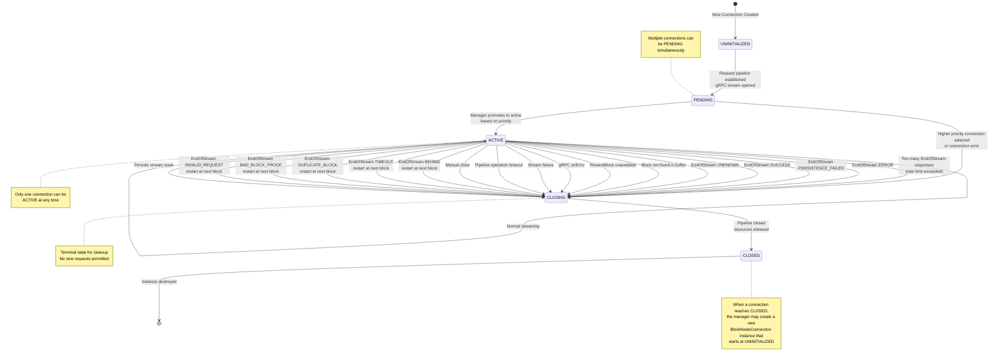
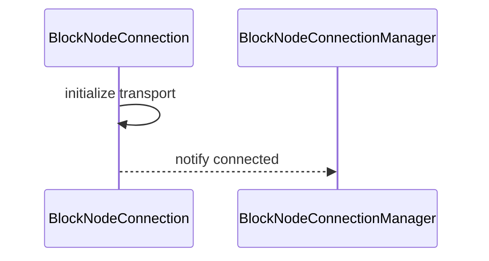
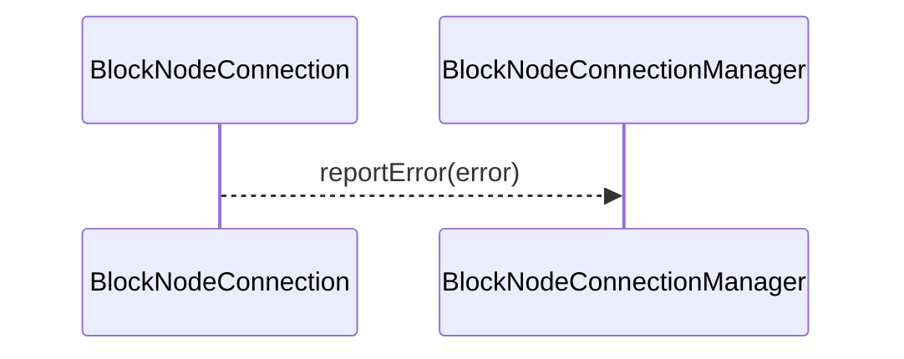

# BlockNodeConnection.md

## Table of Contents

1. [Abstract](#abstract)
2. [Definitions](#definitions)
3. [Component Responsibilities](#component-responsibilities)
4. [Component Interaction](#component-interaction)
5. [State Management](#state-management)
6. [State Machine Diagrams](#state-machine-diagrams)
7. [Error Handling](#error-handling)

## Abstract

`BlockNodeConnection` represents a single connection between a consensus node and a block node.
It manages connection state, handles communication, and reports errors to the `BlockNodeConnectionManager`.

## Definitions

<dl>
<dt>BlockNodeConnection</dt>
<dd>A connection instance managing communication and state with a block node.</dd>

<dt>ConnectionState</dt>
<dd>Represents current connection status: UNINITIALIZED, PENDING, ACTIVE, CLOSING, CLOSED.</dd>
</dl>

## Component Responsibilities

- Establish and maintain the connection transport.
- Handle incoming and outgoing message flow.
- Detect unresponsive block nodes via configurable timeouts on pipeline operations.
- Report connection errors promptly.
- Coordinate with `BlockNodeConnectionManager` on lifecycle events.
- Notify the block buffer (via connection manager) when a block has been acknowledged and therefore eligible to be
  pruned.

## Component Interaction

- Communicates bi-directionally with `BlockNodeConnectionManager`.

## State Management

- Tracks connection lifecycle state.
- Handles status transitions.

### Connection States

- **UNINITIALIZED**: Initial state when a connection object is created. The bidi RequestObserver needs to be created.
- **PENDING**: The bidi RequestObserver is established, but this connection has not been chosen as the active one (priority-based selection).
- **ACTIVE**: Connection is active and the Block Stream Worker Thread is sending `PublishStreamRequest`s to the block node through the async bidirectional stream. Only one connection can be ACTIVE at a time.
- **CLOSING**: The connection is being closed. This is a terminal state where only cleanup operations are permitted. No more requests can be sent.
- **CLOSED**: Connection has been fully closed and the pipeline terminated. This is a terminal state. No more requests can be sent and no more responses will be received.

## State Machine Diagrams

### Connection Initialization

## Error Handling

- Detects and reports connection errors.
- Cleans up resources on disconnection.

### Consensus Node Behavior on EndOfStream Response Codes

| Code                          | Connect to Other Node | Retry Behavior      | Initial Retry Delay | Exponential Backoff | Restart at Block | Special Behaviour                                                                                   |
|:------------------------------|:----------------------|:--------------------|:--------------------|:--------------------|:-----------------|:----------------------------------------------------------------------------------------------------|
| `SUCCESS`                     | Yes (immediate)       | Fixed delay         | 30 seconds          | No                  | Latest           |                                                                                                     |
| `BEHIND` with block in buffer | No (retry same)       | Exponential backoff | 1 second            | Yes (2x, jittered)  | blockNumber + 1  |                                                                                                     |
| `BEHIND` w/o block in buffer  | Yes (immediate)       | Fixed delay         | 30 seconds          | No                  | Latest           | CN sends `EndStream.TOO_FAR_BEHIND` to indicate the BN to look for the block from other Block Nodes |
| `ERROR`                       | Yes (immediate)       | Fixed delay         | 30 seconds          | No                  | Latest           |                                                                                                     |
| `PERSISTENCE_FAILED`          | Yes (immediate)       | Fixed delay         | 30 seconds          | No                  | Latest           |                                                                                                     |
| `TIMEOUT`                     | No (retry same)       | Exponential backoff | 1 second            | Yes (2x, jittered)  | blockNumber + 1  |                                                                                                     |
| `DUPLICATE_BLOCK`             | No (retry same)       | Exponential backoff | 1 second            | Yes (2x, jittered)  | blockNumber + 1  |                                                                                                     |
| `BAD_BLOCK_PROOF`             | No (retry same)       | Exponential backoff | 1 second            | Yes (2x, jittered)  | blockNumber + 1  |                                                                                                     |
| `INVALID_REQUEST`             | No (retry same)       | Exponential backoff | 1 second            | Yes (2x, jittered)  | blockNumber + 1  |                                                                                                     |
| `UNKNOWN`                     | Yes (immediate)       | Fixed delay         | 30 seconds          | No                  | Latest           |                                                                                                     |

**Notes:**
- **Exponential Backoff**: When enabled, delay starts at 1 second and doubles (2x multiplier) on each retry attempt with jitter applied (delay/2 + random(0, delay/2)) to spread out retry attempts. Max backoff is configurable via `maxBackoffDelay`.
- **Connect to Other Node**: When "Yes (immediate)", the manager will immediately attempt to connect to the next available priority node while the failed node is rescheduled for retry.
- **Restart at Block**: "Latest" means reconnection starts at the latest produced block; "blockNumber + 1" means reconnection continues from the block following the acknowledged block.

### EndOfStream Rate Limiting

The connection implements a configurable rate limiting mechanism for EndOfStream responses to prevent rapid reconnection cycles and manage system resources effectively.

### Configuration Parameters

<dl>
<dt>maxEndOfStreamsAllowed</dt>
<dd>The maximum number of EndOfStream responses permitted within the configured time window.</dd>

<dt>endOfStreamTimeFrame</dt>
<dd>The duration of the sliding window in which EndOfStream responses are counted.</dd>

<dt>endOfStreamScheduleDelay</dt>
<dd>The delay duration before attempting reconnection when the rate limit is exceeded.</dd>

<dt>pipelineOperationTimeout</dt>
<dd>The maximum duration allowed for pipeline onNext() and onComplete() operations before considering the block node unresponsive. Default: 30 seconds.</dd>
</dl>

### Pipeline Operation Timeout

To detect unresponsive block nodes during message transmission, the connection implements configurable timeouts for both `onNext()` and `onComplete()` operations on the gRPC pipeline.

#### Timeout Behavior

Pipeline operations (`onNext()` and `onComplete()`) are blocking I/O operations that are executed on a dedicated virtual thread executor with timeout enforcement using `Future.get(timeout)`. Each connection instance creates its own virtual thread executor to isolate pipeline operations from other tasks and prevent blocking.

- **onNext() timeout**: When sending block items via `sendRequest()`, the operation is submitted to the connection's dedicated executor and the calling thread blocks waiting for completion with a timeout. If the operation does not complete within the configured timeout period:
  - The Future is cancelled to interrupt the blocked operation
  - The timeout metric is incremented
  - `handleStreamFailure()` is triggered (only if connection is still ACTIVE)
  - The connection follows standard failure handling with exponential backoff retry
  - The connection manager will select a different block node for the next attempt if one is available
  - `TimeoutException` is caught and handled internally
- **onComplete() timeout**: When closing the stream via `closePipeline()`, the operation is submitted to the same dedicated executor with the same timeout mechanism. If the operation does not complete within the configured timeout period:
  - The Future is cancelled to interrupt the blocked operation
  - The timeout metric is incremented
  - Since the connection is already in CLOSING state, only the timeout is logged
  - The connection completes the close operation normally

**Note**: The dedicated virtual thread executor is shut down when the connection closes, ensuring no resource leaks.

#### Exception Handling

The implementation handles multiple exception scenarios:
- **TimeoutException**: Pipeline operation exceeded the timeout - triggers failure handling for `onNext()`, logged for `onComplete()`
- **InterruptedException**: Thread was interrupted while waiting - interrupt status is restored via `Thread.currentThread().interrupt()` before propagating the exception (for `onNext()`) or logging it (for `onComplete()`)
- **ExecutionException**: Error occurred during pipeline operation execution - the underlying cause is unwrapped and re-thrown (for `onNext()`) or logged (for `onComplete()`)

#### Metrics

A new metric `conn_pipelineOperationTimeout` tracks the total number of timeout events for both `onNext()` and `onComplete()` operations, enabling operators to monitor block node responsiveness.
