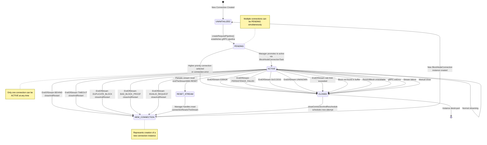
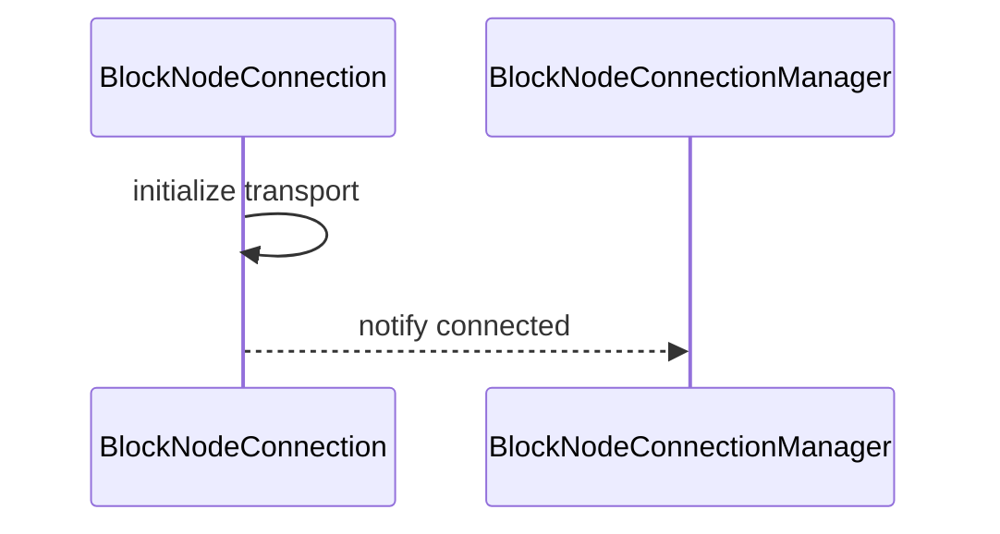
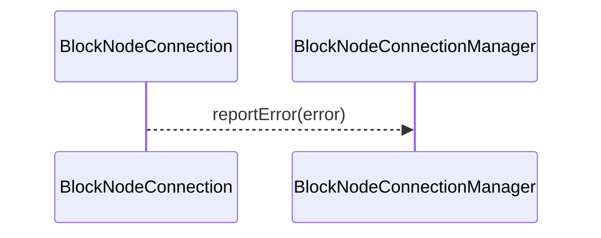

# BlockNodeConnection.md

## Table of Contents

1. [Abstract](#abstract)
2. [Definitions](#definitions)
3. [Component Responsibilities](#component-responsibilities)
4. [Component Interaction](#component-interaction)
5. [State Management](#state-management)
6. [Sequence Diagrams](#sequence-diagrams)
7. [Error Handling](#error-handling)

## Abstract

`BlockNodeConnection` represents a single connection between a consensus node and a block node.
It manages connection state, handles communication, and reports errors to the `BlockNodeConnectionManager`.

## Definitions

<dl>
<dt>BlockNodeConnection</dt>
<dd>A connection instance managing communication and state with a block node.</dd>

<dt>ConnectionState</dt>
<dd>Represents current connection status: UNINITIALIZED, PENDING, ACTIVE, CONNECTING.</dd>
</dl>

## Component Responsibilities

- Establish and maintain the connection transport.
- Handle incoming and outgoing message flow.
- Report connection errors promptly.
- Coordinate with `BlockNodeConnectionManager` on lifecycle events.
- Notify the block buffer when a block has been acknowledged and therefore eligible to be pruned.

## Component Interaction

- Communicates bi-directionally with `BlockNodeConnectionManager`.

## Lifecycle

A block node connection gets spawned by the `BlockNodeConnectionManager`. There are multiple ways in which a connection
may get created, such as:
- Initial consensus node startup, which randomly selects a node with the highest priority
- Periodic connection reset
- Connection failure (e.g. `EndStream` response received) that causes the connection to restart

When the connection is created, it starts in the `INITIALIZED` state. This state signals that the connection object is
created, but the underlying gRPC connection between the consensus node and the block node is not yet established. When
the connection was created, optionally a specific block number to begin streaming with can be passed in. If one is not
specified, then the connection will pick a block based on the state of the block buffer.

The next transitional state is `PENDING`. When the underlying gRPC connection is established (by invoking
`#createRequestPipeline`) the state will transition to `PENDING` indicating that the connection was successfully created.
No traffic is occurring over the connection in this state, merely this state indicates that the connection is _ready_ to
start handling traffic.

Once the connection manager has established that a connection is to become the new active connection, the connection's
state will get updated to `ACTIVE`. This state signals that the connection is actively processing requests and responses
to and from the block node.

Once the state transitions to `ACTIVE`, a worker thread is spawned for the connection. This worker is responsible for
sending requests to the block node. The worker operates in a loop, sleeping for a short period of time - determined by
the configuration property `blockNode.connectionWorkerSleepDuration`. When not sleeping, the worker will first check if
the currently streaming block node needs to be updated. If this is the first time the worker has performed this check,
one of the following will happen:
- If the connection with initialized with an explicit block to start with, then that block will be loaded from the block buffer.
- If the connection wasn't initialized with an explicit block, then the earliest, unacknowledged block in the block buffer will be selected as the starting point.
- If no blocks in the block buffer have been acknowledged, then the earliest block in the buffer will be selected.
- If at any point during the lifespan of the connection a `SkipBlock` or `ResendBlock` response is received, then the worker will detect this and switch to that block.

If the block is not available yet (e.g. no items yet) then the worker will go back to sleep and try again later. If the
block does exist, then the worker thread will start collecting one or more block items to form a "pending" request that
we will ultimately send to the block node. If there are multiple block items to send, but they are found - in aggregate -
that they are too large to send in one request, then multiple requests will be sent. In general, sending a request will
happen in one of three scenarios:
- The pending request cannot support more block items because it would be too large, so the current pending request will be sent.
- If the pending request contains the last item(s) - including the proof - and the block is marked as closed, send the request.
- If a request hasn't been sent recently (determined by the configuration property `blockNode.maxRequestDelay`) and there is a pending request with at least one block item, it will get sent.

If none of these conditions are met, the worker will sleep and try again the next time it wakes up. If a block item is
found that would exceed the maximum request size (as measured in bytes) supported, then an error will be recorded and
the connection will be closed after sending an `EndStream` request to the block node, which the error code `ERROR`. Such
a scenario is considered a fatal, unrecoverable error condition. Manual intervention would be needed to recover from this
(for example: increasing the maximum size allowed, if possible.)

Under normal situations, the worker will continue advancing to the next block after it has successfully sent all items
associated with the current block. This process will repeat until the connection is terminated for any reason. (A
conditional check is performed each time the worker wakes up ensuring the connection is not in a terminal state.)

For cases where an `EndStream` response is received from the block node or some other internal error condition is meant - e.g.
transient network error, then the connection will transition to a `CLOSING` state. This state signals that the connection
has entered a terminal state and is in the process of stopping and being cleaned up. Once final cleanup processes complete,
the connection will transition to the final end state: `CLOSED`. Once a connection enters a terminal state, no further
actions - such as sending requests - should be performed on the connection. Likewise, once the connection worker detects
the transition to a terminal state, it too will cease operations.

To establish a connection back to the block node, a new connection object will need to be created.

## State Machine Diagrams

### Connection Initialization

## Error Handling

- Detects and reports connection errors.
- Cleans up resources on disconnection.

### Consensus Node Behavior on EndOfStream Response Codes

| Code                          | Connect to Other Node | Retry Current Node Interval | Exponential Backoff | Max Retry Delay |                                          Special Behaviour                                          |
|:------------------------------|-----------------------|:----------------------------|---------------------|-----------------|-----------------------------------------------------------------------------------------------------|
| `SUCCESS`                     | Immediate             | 30 seconds                  | No                  | 10 seconds      |                                                                                                     |
| `BEHIND` with block in buffer | No                    | 1 second                    | Yes                 | 10 seconds      |                                                                                                     |
| `BEHIND` w/o block in buffer  | Yes                   | 30 seconds                  | No                  | 10 seconds      | CN sends `EndStream.TOO_FAR_BEHIND` to indicate the BN to look for the block from other Block Nodes |
| `ERROR`                       | Immediate             | 30 seconds                  | No                  | 10 seconds      |                                                                                                     |
| `PERSISTENCE_FAILED`          | Immediate             | 30 seconds                  | No                  | 10 seconds      |                                                                                                     |
| `TIMEOUT`                     | No                    | 1 second                    | Yes                 | 10 seconds      |                                                                                                     |
| `DUPLICATE_BLOCK`             | No                    | 1 second                    | Yes                 | 10 seconds      |                                                                                                     |
| `BAD_BLOCK_PROOF`             | No                    | 1 second                    | Yes                 | 10 seconds      |                                                                                                     |
| `INVALID_REQUEST`             | No                    | 1 second                    | Yes                 | 10 seconds      |                                                                                                     |
| `UNKNOWN`                     | Yes                   | 30 seconds                  | No                  | 10 seconds      |                                                                                                     |

### EndOfStream Rate Limiting

The connection implements a configurable rate limiting mechanism for EndOfStream responses to prevent rapid reconnection cycles and manage system resources effectively.

### Configuration Parameters

<dl>
<dt>blockNode.maxEndOfStreamsAllowed</dt>
<dd>The maximum number of EndOfStream responses permitted within the configured time window.</dd>

<dt>blockNode.endOfStreamTimeFrame</dt>
<dd>The duration of the sliding window in which EndOfStream responses are counted.</dd>

<dt>blockNode.endOfStreamScheduleDelay</dt>
<dd>The delay duration before attempting reconnection when the rate limit is exceeded.</dd>

<dt>blockNode.connectionWorkerSleepDuration</dt>
<dd>The amount of time the connection worker thread will sleep between attempts to send block items to the block node.</dd>

<dt>blockNode.maxRequestDelay</dt>
<dd>The maximum amount of time between attempting to send block items to a block node, regardless of the number of items ready to send.</dd>
</dl>
