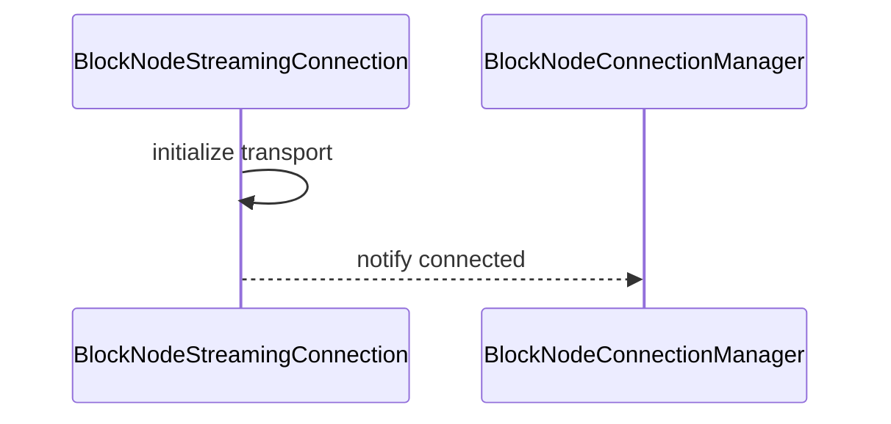
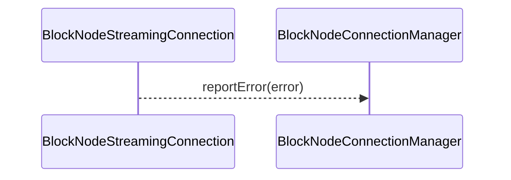

# BlockNodeStreamingConnection.md

## Table of Contents

1. [Abstract](#abstract)
2. [Definitions](#definitions)
3. [Component Responsibilities](#component-responsibilities)
4. [Component Interaction](#component-interaction)
5. [Lifecycle](#lifecycle)
6. [State Machine Diagrams](#state-machine-diagrams)
7. [Error Handling](#error-handling)
   - [Consensus Node Behavior on EndOfStream Response Codes](#consensus-node-behavior-on-endofstream-response-codes)
   - [Consensus Node Behavior on BehindPublisher Response](#consensus-node-behavior-on-behindpublisher-response)
   - [EndOfStream Rate Limiting](#endofstream-rate-limiting)
   - [Pipeline Operation Timeout](#pipeline-operation-timeout)

## Abstract

`BlockNodeStreamingConnection` represents a single connection between a consensus node and a block node.
It manages connection state, handles communication, and reports errors to the `BlockNodeConnectionManager`.

## Definitions

<dl>
<dt>BlockNodeStreamingConnection</dt>
<dd>A connection instance managing communication and state with a block node.</dd>

<dt>ConnectionState</dt>
<dd>Represents current connection status: UNINITIALIZED, PENDING, ACTIVE, CLOSING, CLOSED.</dd>
</dl>

## Component Responsibilities

- Establish and maintain the connection transport.
- Handle incoming and outgoing message flow.
- Detect unresponsive block nodes via configurable timeouts on pipeline operations.
- Report connection errors promptly.
- Coordinate with `BlockNodeConnectionManager` on lifecycle events.
- Notify the block buffer when a block has been acknowledged and therefore eligible to be pruned.

## Component Interaction

- Communicates bi-directionally with `BlockNodeConnectionManager`.

## Lifecycle

A block node connection gets spawned by the `BlockNodeConnectionManager`. There are multiple ways in which a connection
may get created, such as:
- Initial consensus node startup, which randomly selects a node with the highest priority
- Periodic connection reset
- Connection failure (e.g. `EndStream` response received) that causes the connection to restart

When the connection is created, it starts in the `UNINITIALIZED` state. This state signals that the connection object is
created, but the underlying gRPC connection between the consensus node and the block node is not yet established. When
the connection was created, optionally a specific block number to begin streaming with can be passed in. If one is not
specified, then the connection will pick a block based on the state of the block buffer.

The next transitional state is `PENDING`. When the underlying gRPC connection is established (by invoking
`#createRequestPipeline`) the state will transition to `PENDING` indicating that the connection was successfully created.
No traffic is occurring over the connection in this state, merely this state indicates that the connection is _ready_ to
start handling traffic.

Once the connection manager has established that a connection is to become the new active connection, the connection's
state will get updated to `ACTIVE`. This state signals that the connection is actively processing requests and responses
to and from the block node.

Once the state transitions to `ACTIVE`, a worker thread is spawned for the connection. This worker is responsible for
sending requests to the block node. The worker operates in a loop, sleeping for a short period of time - determined by
the configuration property `blockNode.connectionWorkerSleepDuration`. When not sleeping, the worker will first check if
the current streaming block needs to be updated. If this is the first time the worker has performed this check, one of
the following will happen:
- If the connection was initialized with an explicit block to start with, then that block will be loaded from the block buffer.
- If the connection wasn't initialized with an explicit block, then the most recent block produced is chosen as the block to start streaming.
- If at any point during the lifespan of the connection a `SkipBlock`, `ResendBlock` or `BehindPublisher` response is received, then the
worker will detect this and switch to that block.

If the block is not available yet (e.g. no items yet) then the worker will go back to sleep and try again later. If the
block does exist, then the worker thread will start collecting one or more block items to form a "pending" request that
will ultimately be sent to the block node. If there are multiple block items to send, but they are found - in aggregate -
that they are too large to send in one request, then multiple requests will be sent. In general, sending a request will
happen in one of three scenarios:
- The pending request cannot support more block items because it would be too large, so the current pending request will be sent.
- If the pending request contains the last item(s) - including the proof - and the block is marked as closed, send the request.
- If a request hasn't been sent recently (determined by the configuration property `blockNode.maxRequestDelay`) and there
is a pending request with at least one block item, it will get sent.

If none of these conditions are met, the worker will sleep and try again the next time it wakes up. If a block item is
found that would exceed the maximum request size (as measured in bytes) supported, then an error will be recorded and
the connection will be closed after sending an `EndStream` request to the block node, which the error code `ERROR`. Such
a scenario is considered a fatal, unrecoverable error condition. Manual intervention would be needed to recover from this
(for example: increasing the maximum size allowed, if possible.)

When the final items of a block are sent (including all of the `BlockProof`s), the worker ensures to send a `EndOfBlock` `PublishStreamRequest`.
This `EndOfBlock` request signals the completion of the current block's transmission to the block node. After sending the
`EndOfBlock` request, the worker will proceed to process the next block if available.

Under normal situations, the worker will continue advancing to the next block after it has successfully sent all items
associated with the current block. This process will repeat until the connection is terminated for any reason. (A
conditional check is performed each time the worker wakes up ensuring the connection is not in a terminal state.)

For cases where an `EndOfStream` response is received from the block node or some other internal error condition is encountered
\- e.g. transient network error - then the connection will transition to a `CLOSING` state. This state signals that the connection
has entered a terminal state and is in the process of stopping and being cleaned up. Once final cleanup processes complete,
the connection will transition to the final end state: `CLOSED`. Once a connection enters a terminal state, no further
actions - such as sending requests - should be performed on the connection. Likewise, once the connection worker detects
the transition to a terminal state, it too will cease operations.

To establish a connection back to the block node, a new connection object will need to be created.

### Request Sizing

There are two configurations that govern the size of a `PublishStreamRequest` that gets sent to a block node.
These configurations are `messageSizeSoftLimitBytes` and `messageSizeHardLimitBytes`. These configurations can be
customized for each block node via the `block-nodes.json` file.

Under normal circumstances, requests are packed with multiple block items such that they get as close to the soft
limit message size as possible. If a block item is large and would cause the request to exceed the soft limit, then
the large item will be sent in its own request. The absolute maximum size a request can be is defined by the hard
limit message size. If an item (or serialized request) exceeds this hard limit, then the consensus node cannot send
the item/request to the block node.

It is **strongly** recommended that the hard limit be set to `6292480`. This size is 6 MB + 1 KB. The
largest block items currently supported are 6 MB, and the additional 1 KB is for overhead. If the hard limit is set to
smaller than 6 MB and one of these large items are produced, then it cannot be sent to a block node.

The default soft limit size is 2 MB. The default hard limit size is 6 MB + 1 KB.

### Graceful Connection Close

When a connection is closed, a best effort attempt to gracefully close the connection will be performed. There are two
aspects to this "graceful close":
1. Unless the connection is unstable, or we are notifying the block node it is too far behind, before closing an attempt
will be made to send an EndStream request to the block with the code `RESET`.
2. If the connection is actively streaming a block, a best effort to stream the rest of the block will be performed
before closing the connection.

A caveat to this is if the connection manager is being shutdown, then the connections will NOT be closed gracefully.

### Connection States

- **UNINITIALIZED**: Initial state when a connection object is created. The bidi RequestObserver needs to be created.
- **READY**: The bidi RequestObserver is established, but this connection has not been chosen as the active one (priority-based selection).
- **ACTIVE**: Connection is active and the Block Stream Worker Thread is sending `PublishStreamRequest`s to the block node through the async bidirectional stream. Only one connection can be ACTIVE at a time.
- **CLOSING**: The connection is being closed. This is a terminal state where only cleanup operations are permitted. No more requests can be sent.
- **CLOSED**: Connection has been fully closed and the pipeline terminated. This is a terminal state. No more requests can be sent and no more responses will be received.

## State Machine Diagrams

```mermaid
stateDiagram-v2
    [*] --> UNINITIALIZED : New Connection Created
    UNINITIALIZED --> READY : Request pipeline established<br/>gRPC stream opened
    READY --> ACTIVE : Manager promotes to active<br/>based on priority
    READY --> CLOSING : Higher priority connection selected<br/>or connection error
    ACTIVE --> CLOSING : Too many EndOfStream responses<br/>(rate limit exceeded)
    ACTIVE --> CLOSING : EndOfStream ERROR
    ACTIVE --> CLOSING : EndOfStream PERSISTENCE_FAILED
    ACTIVE --> CLOSING : EndOfStream SUCCESS
    ACTIVE --> CLOSING : EndOfStream UNKNOWN
    ACTIVE --> CLOSING : Block not found in buffer
    ACTIVE --> CLOSING : ResendBlock unavailable
    ACTIVE --> CLOSING : BehindPublisher unavailable
    ACTIVE --> CLOSING : gRPC onError
    ACTIVE --> CLOSING : Stream failure
    ACTIVE --> CLOSING : Pipeline operation timeout
    ACTIVE --> CLOSING : Manual close
    ACTIVE --> ACTIVE : BlockAcknowledgement
    ACTIVE --> ACTIVE : SkipBlock
    ACTIVE --> ACTIVE : ResendBlock available
    ACTIVE --> ACTIVE : BehindPublisher available
    ACTIVE --> ACTIVE : Normal streaming
    ACTIVE --> CLOSING : EndOfStream TIMEOUT<br/>restart at next block
    ACTIVE --> CLOSING : EndOfStream DUPLICATE_BLOCK<br/>restart at next block
    ACTIVE --> CLOSING : EndOfStream BAD_BLOCK_PROOF<br/>restart at next block
    ACTIVE --> CLOSING : EndOfStream INVALID_REQUEST<br/>restart at next block
    ACTIVE --> CLOSING : Periodic stream reset
    CLOSING --> CLOSED : Pipeline closed<br/>resources released
    CLOSED --> [*] : Instance destroyed
    note right of ACTIVE
        Only one connection can be
        ACTIVE at any time
    end note
    note left of PENDING
        Multiple connections can
        be PENDING simultaneously
    end note
    note right of CLOSING
        Terminal state for cleanup
        No new requests permitted
    end note
    note right of CLOSED
        When a connection reaches CLOSED,
        the manager may create a new
        BlockNodeStreamingConnection instance that
        starts at UNINITIALIZED
    end note
```

### Connection Initialization



## Error Handling

- Detects and reports connection errors.
- Cleans up resources on disconnection.



### Consensus Node Behavior on EndOfStream Response Codes

| Code                 | Connect to Other Node | Retry Behavior      | Initial Retry Delay | Exponential Backoff | Restart at Block | Special Behaviour |
|:---------------------|:----------------------|:--------------------|:--------------------|:--------------------|:-----------------|:------------------|
| `SUCCESS`            | Yes (immediate)       | Fixed delay         | 30 seconds          | No                  | Latest           |                   |
| `ERROR`              | Yes (immediate)       | Fixed delay         | 30 seconds          | No                  | Latest           |                   |
| `PERSISTENCE_FAILED` | Yes (immediate)       | Fixed delay         | 30 seconds          | No                  | Latest           |                   |
| `TIMEOUT`            | No (retry same)       | Exponential backoff | 1 second            | Yes (2x, jittered)  | blockNumber + 1  |                   |
| `DUPLICATE_BLOCK`    | No (retry same)       | Exponential backoff | 1 second            | Yes (2x, jittered)  | blockNumber + 1  |                   |
| `BAD_BLOCK_PROOF`    | No (retry same)       | Exponential backoff | 1 second            | Yes (2x, jittered)  | blockNumber + 1  |                   |
| `INVALID_REQUEST`    | No (retry same)       | Exponential backoff | 1 second            | Yes (2x, jittered)  | blockNumber + 1  |                   |
| `UNKNOWN`            | Yes (immediate)       | Fixed delay         | 30 seconds          | No                  | Latest           |                   |

**Notes:**
- **Exponential Backoff**: When enabled, delay starts at 1 second and doubles (2x multiplier) on each retry attempt with jitter applied (delay/2 + random(0, delay/2)) to spread out retry attempts. Max backoff is configurable via `maxBackoffDelay`.
- **Connect to Other Node**: When "Yes (immediate)", the manager will immediately attempt to connect to the next available priority node while the failed node is rescheduled for retry.
- **Restart at Block**: "Latest" means reconnection starts at the latest produced block; "blockNumber + 1" means reconnection continues from the block following the acknowledged block.

### Consensus Node Behavior on BehindPublisher Response

The `BehindPublisher` response indicates that the block node is behind the publisher (consensus node) and needs earlier blocks. This is a separate response type from `EndOfStream`, and crucially **does not close the stream** when the consensus node can help.

| Condition                            | Connection Behavior  | Stream Closed | Resume at Block | Special Behaviour                                                                             |
|:-------------------------------------|:---------------------|:--------------|:----------------|:----------------------------------------------------------------------------------------------|
| Block available in buffer            | Stay connected       | No            | blockNumber + 1 | Connection remains open; streaming resumes from the earlier block                             |
| Block not available (too far behind) | Close and reschedule | Yes           | Latest          | CN sends `EndStream.TOO_FAR_BEHIND` to indicate the BN should catch up from other Block Nodes |
| Block not available (future block)   | Close and reschedule | Yes           | Latest          | CN sends `EndStream.ERROR` - this indicates an unexpected state                               |

**Key Behavioral Notes:**
- If the consensus node has the requested block in its buffer, it simply updates the streaming block and continues on the same connection.
- The connection is only closed when the consensus node cannot provide the requested block.

### EndOfStream Rate Limiting

The connection implements a configurable rate limiting mechanism for EndOfStream responses to prevent rapid reconnection cycles and manage system resources effectively.

### Configuration Parameters

<dl>
<dt>blockNode.maxEndOfStreamsAllowed</dt>
<dd>The maximum number of EndOfStream responses permitted within the configured time window.</dd>

<dt>blockNode.endOfStreamTimeFrame</dt>
<dd>The duration of the sliding window in which EndOfStream responses are counted.</dd>

<dt>blockNode.endOfStreamScheduleDelay</dt>
<dd>The delay duration before attempting reconnection when the rate limit is exceeded.</dd>

<dt>blockNode.connectionWorkerSleepDuration</dt>
<dd>The amount of time the connection worker thread will sleep between attempts to send block items to the block node.</dd>

<dt>blockNode.maxRequestDelay</dt>
<dd>The maximum amount of time between attempting to send block items to a block node, regardless of the number of items ready to send.</dd>

<dt>pipelineOperationTimeout</dt>
<dd>The maximum duration allowed for pipeline onNext() and onComplete() operations before considering the block node unresponsive. Default: 30 seconds.</dd>
</dl>

### Pipeline Operation Timeout

To detect unresponsive block nodes during message transmission and connection establishment, the connection implements configurable timeouts for pipeline operations.

#### Timeout Behavior

Pipeline operations (`onNext()`, `onComplete()`, and pipeline creation) are potentially blocking I/O operations that are executed on a dedicated virtual thread executor with timeout enforcement using `Future.get(timeout)`. The executor is provided via dependency injection through the constructor, allowing for flexible configuration and easier testing.

- **Pipeline creation timeout**: When establishing the gRPC connection via `createRequestPipeline()`, both the gRPC client creation and bidirectional stream setup are executed with timeout protection. If the operation does not complete within the configured timeout period:
  - The Future is cancelled to interrupt the blocked operation
  - The timeout metric is incremented
  - A `RuntimeException` is thrown with the underlying `TimeoutException`
  - The connection remains in UNINITIALIZED state
  - The connection manager's error handling will schedule a retry with exponential backoff
- **onNext() timeout**: When sending block items via `sendRequest()`, the operation is submitted to the connection's dedicated executor and the calling thread blocks waiting for completion with a timeout. If the operation does not complete within the configured timeout period:
  - The Future is cancelled to interrupt the blocked operation
  - The timeout metric is incremented
  - `handleStreamFailure()` is triggered (only if connection is still ACTIVE)
  - The connection follows standard failure handling with exponential backoff retry
  - The connection manager will select a different block node for the next attempt if one is available
  - `TimeoutException` is caught and handled internally
- **onComplete() timeout**: When closing the stream via `closePipeline()`, the operation is submitted to the same dedicated executor with the same timeout mechanism. If the operation does not complete within the configured timeout period:
  - The Future is cancelled to interrupt the blocked operation
  - The timeout metric is incremented
  - Since the connection is already in CLOSING state, only the timeout is logged
  - The connection completes the close operation normally

**Note**: The dedicated executor (typically a virtual thread executor in production) is provided during construction and properly shut down when the connection closes with a 5-second grace period for termination, ensuring no resource leaks. If tasks don't complete within the grace period, `shutdownNow()` is called to forcefully terminate them.

#### Exception Handling

The implementation handles multiple exception scenarios across all timeout-protected operations:
- **TimeoutException**: Pipeline operation exceeded the timeout - triggers failure handling for `onNext()` and pipeline creation, logged for `onComplete()`
- **InterruptedException**: Thread was interrupted while waiting - interrupt status is restored via `Thread.currentThread().interrupt()` before propagating the exception (for `onNext()` and pipeline creation) or logging it (for `onComplete()` and executor shutdown)
- **ExecutionException**: Error occurred during pipeline operation execution - the underlying cause is unwrapped and re-thrown (for `onNext()` and pipeline creation) or logged (for `onComplete()`)

All exception scenarios include appropriate DEBUG-level logging with context information to aid in troubleshooting.

#### Metrics

A new metric `conn_pipelineOperationTimeout` tracks the total number of timeout events for pipeline creation, `onNext()`, and `onComplete()` operations, enabling operators to monitor block node responsiveness and connection establishment issues.
