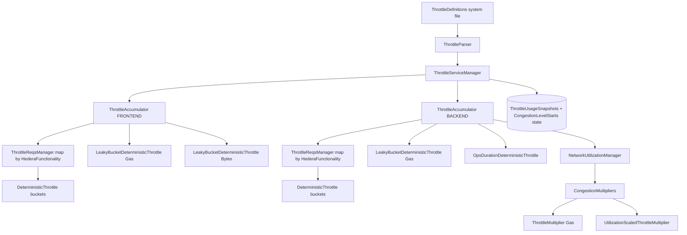
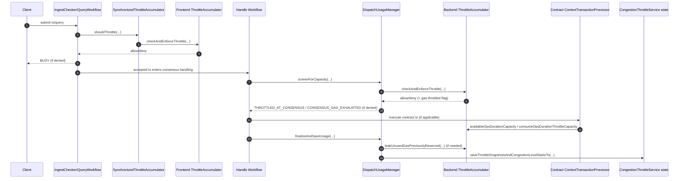
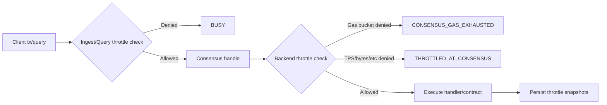

# Throttles

This document explains how throttling is organized in `hedera-services`, where each class fits, and how a transaction
flows through the throttle system.

## Scope

This page focuses on Hedera application throttling in:

- `hedera-node/hapi-utils/.../throttles` (core bucket primitives)
- `hedera-node/hedera-app/.../throttle` (runtime orchestration and enforcement)
- `hedera-node/hedera-app/.../fees/congestion` (congestion multipliers)

It does **not** cover unrelated throttles in `platform-sdk` (for example stream/reconnect/log rate-limiting).

## High-Level Model

Hedera uses leaky-bucket throttles with deterministic time progression.

- A transaction can map to one or more throttle buckets.
- The transaction is allowed only if **all required buckets** have capacity.
- There are separate runtime throttle contexts:

1. **Frontend (ingest/query):** per-node admission control.
2. **Backend (handle/consensus):** network-deterministic usage and congestion accounting.

In addition to TPS-style buckets, there are specialized throttles for:

- EVM gas per second
- Jumbo transaction excess bytes per second
- Contract EVM ops-duration units

## Code Organization

### 1) Core primitives (`hapi-utils`)

- `DiscreteLeakyBucket`: Raw used/capacity bucket with leak and consume operations.
- `BucketThrottle` : TPS/MTPS leaky-bucket arithmetic (capacity units per tx, leak-by-elapsed-nanos).
- `DeterministicThrottle` : Wraps `BucketThrottle` with monotonic `Instant` decisions and snapshots.
- `LeakyBucketThrottle` + `LeakyBucketDeterministicThrottle`: Generic scalar limiter used for gas/bytes style limits.
- `OpsDurationDeterministicThrottle` : Contract execution "ops duration" limiter with configured capacity and leak rate.
- `CongestibleThrottle` : Common read surface (`used`, `capacity`, `instantaneousPercentUsed`) for congestion pricing.

### 2) Definitions and mapping

- `ThrottleParser` validates and parses uploaded system-file bytes
- Logical mapping:
  - `ThrottleBucket` (domain model) turns groups into:
    - a `DeterministicThrottle` bucket instance, and
    - per-function operation requirements
- `ThrottleReqsManager` enforces "all required bucket claims must pass"

### 3) Runtime enforcement

- `ThrottleAccumulator` (core runtime engine) : Holds active bucket mappings and specialized throttles
  (gas/bytes/ops-duration), and performs allow/deny decisions.
- `SynchronizedThrottleAccumulator` : Thread-safe wrapper used by ingest/query workflows.
- `ThrottleServiceManager` : Lifecycle orchestration: init, config refresh, system-file rebuild, save/load snapshots.
- `NetworkUtilizationManagerImpl` : Backend/consensus tracking entrypoint used by handle workflow.

## Component Diagram

## Transaction Flow Diagram

## Quick Reference Diagram

## Frontend vs Backend Summary

- Frontend (`ThrottleType.FRONTEND_THROTTLE`)
  - Used at ingest/query precheck time.
  - Capacity split by number of nodes.
  - Returns precheck-style throttling (`BUSY`).
  - Thread-safe access via `SynchronizedThrottleAccumulator`.
- Backend (`ThrottleType.BACKEND_THROTTLE`)
  - Used during handle/consensus.
  - Deterministic tracking for congestion and state snapshots.
  - Produces consensus throttle outcomes (`THROTTLED_AT_CONSENSUS`, `CONSENSUS_GAS_EXHAUSTED`).
  - Drives congestion multipliers.

## Specialized Throttles

- Gas throttle
  - Enforced for contract operations when enabled.
  - Config in `ContractsConfig`:
    - `contracts.maxGasPerSec` (frontend)
    - `contracts.maxGasPerSecBackend` (backend)
    - `contracts.throttle.throttleByGas`
- Bytes throttle (jumbo tx)
  - Enforced on excess bytes for configured functionalities.
  - Config in `JumboTransactionsConfig`:
    - `jumboTransactions.maxBytesPerSec`
    - `jumboTransactions.isEnabled`
- Ops-duration throttle (contracts)
  - Enforced in contract execution path via `ThrottleAdviser`.
  - Config in `ContractsConfig`:
    - `contracts.opsDurationThrottleCapacity`
    - `contracts.opsDurationThrottleUnitsFreedPerSecond`
    - `contracts.throttle.throttleByOpsDuration`

## State and Recovery

Throttle state is persisted in `CongestionThrottleService`:

- `THROTTLE_USAGE_SNAPSHOTS`
- `CONGESTION_LEVEL_STARTS`

On startup/reconnect, `ThrottleServiceManager`:
1. Applies config (gas/bytes/ops-duration)
2. Rebuilds mappings from throttle definitions
3. Resets multiplier expectations
4. Rehydrates usage snapshots and congestion starts (non-genesis)

## Status Mapping

This table maps common throttle-related statuses to the exact decision point where they are emitted.

|          Status           |    Emitted in phase     |                                   Decision point                                    |            Source path             |
|---------------------------|-------------------------|-------------------------------------------------------------------------------------|------------------------------------|
| `BUSY`                    | Ingest precheck         | `synchronizedThrottleAccumulator.shouldThrottle(txInfo, ...)` returns true          | `IngestChecker.java`               |
| `BUSY`                    | Query handling precheck | `synchronizedThrottleAccumulator.shouldThrottle(function, query, ...)` returns true | `QueryWorkflowImpl.java`           |
| `CONSENSUS_GAS_EXHAUSTED` | Handle/consensus        | Backend check failed and last tx was gas-throttled (`wasLastTxnGasThrottled()`)     | `DispatchUsageManager.java`        |
| `THROTTLED_AT_CONSENSUS`  | Handle/consensus        | Backend check failed for non-gas reason                                             | `DispatchUsageManager.java`        |
| `CONSENSUS_GAS_EXHAUSTED` | Contract execution path | Ops-duration throttle had zero available capacity before EVM execution              | `ContextTransactionProcessor.java` |

**SEE ALSO: [High-Volume Pricing (HIP-1313)](high-volume-pricing.md)**
**NEXT: [Workflows](workflows.md)**
