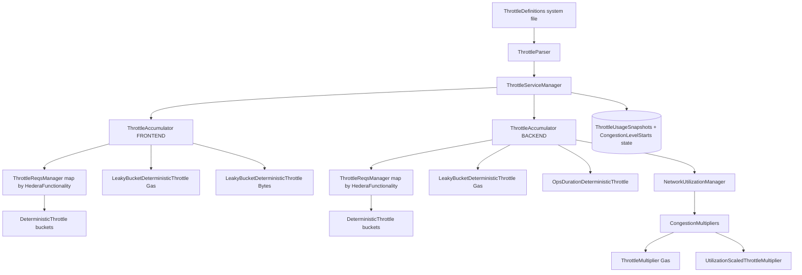
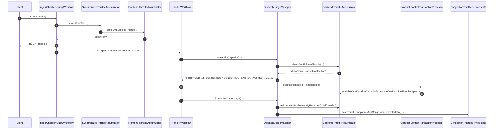
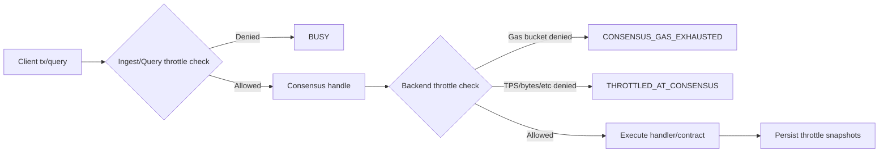

# Throttles

This document explains how throttling is organized in `hedera-services`, where each class fits, and how a transaction
flows through the throttle system.

## Scope

This page focuses on Hedera application throttling in:

- `hedera-node/hapi-utils/.../throttles` (core bucket primitives)
- `hedera-node/hedera-app/.../throttle` (runtime orchestration and enforcement)
- `hedera-node/hedera-app/.../fees/congestion` (congestion multipliers)

It does **not** cover unrelated throttles in `platform-sdk` (for example stream/reconnect/log rate-limiting).

## High-Level Model

Hedera uses leaky-bucket throttles with deterministic time progression.

- A transaction can map to one or more throttle buckets.
- The transaction is allowed only if **all required buckets** have capacity.
- There are separate runtime throttle contexts, modeled by `ThrottleAccumulator.ThrottleType`:

1. **Frontend (`FRONTEND_THROTTLE`):** per-node admission control at ingest/query.
2. **Backend (`BACKEND_THROTTLE`):** network-deterministic usage and congestion accounting at consensus.
3. **No-op (`NOOP_THROTTLE`):** disables all `checkAndEnforceThrottle` decisions and reports
   `Long.MAX_VALUE` capacity. Selected by `StandaloneModule` / `TransactionExecutors` when
   their `disableThrottling` flag is set (e.g. for transaction replay and other standalone
   executor scenarios).

In addition to TPS-style buckets, there are specialized throttles for:

- EVM gas per second
- Jumbo transaction excess bytes per second
- Contract EVM ops-duration units

## Code Organization

### 1) Core primitives (`hapi-utils`)

- `DiscreteLeakyBucket`: Raw used/capacity bucket with leak and consume operations.
- `BucketThrottle` : TPS/MTPS leaky-bucket arithmetic (capacity units per tx, leak-by-elapsed-nanos).
- `DeterministicThrottle` : Wraps `BucketThrottle` with monotonic `Instant` decisions and snapshots.
- `LeakyBucketThrottle` + `LeakyBucketDeterministicThrottle`: Generic scalar limiter used for gas/bytes style limits.
- `OpsDurationDeterministicThrottle` : Contract execution "ops duration" limiter with configured capacity and leak rate.
- `CongestibleThrottle` : Common read surface (`used`, `capacity`, `mtps`, `name`, `instantaneousPercentUsed`) used by congestion pricing.

### 2) Definitions and mapping

- `ThrottleParser` validates and parses uploaded system-file bytes
- Logical mapping:
  - `ThrottleBucket` (domain model) turns groups into:
    - a `DeterministicThrottle` bucket instance, and
    - per-function operation requirements
- `ThrottleReqsManager` enforces "all required bucket claims must pass"

### 3) Runtime enforcement

- `ThrottleAccumulator` (core runtime engine) : Holds two function→requirements maps (normal
  and high-volume; see [High-Volume Buckets](#high-volume-buckets-hip-1313)) plus specialized
  throttles (gas/bytes/ops-duration), and performs allow/deny decisions.
- `SynchronizedThrottleAccumulator` : Thread-safe wrapper used by ingest/query workflows.
- `ThrottleServiceManager` : Lifecycle orchestrator. Owns the init / rebuild / refresh path for
  the gas, bytes, and ops-duration configuration; persists and restores `CongestionThrottleService`
  snapshots (with an unconditional reset variant used during dispatch screening); reclaims
  frontend capacity on failed implicit creates / auto-associates; and refreshes throttle metric
  gauges. It does **not** read system files itself — it accepts already-decoded `Bytes` and uses
  `ThrottleParser` to deserialize them. See `ThrottleServiceManager.java` for the current method
  set and contracts.
- `NetworkUtilizationManagerImpl` : Backend/consensus tracking entrypoint used by handle workflow.

## Component Diagram

```mermaid
flowchart TD
    TD[ThrottleDefinitions system file] --> TP[ThrottleParser]
    TP --> TSM[ThrottleServiceManager]
    TSM --> IA[ThrottleAccumulator FRONTEND]
    TSM --> BA[ThrottleAccumulator BACKEND]

    IA --> TRM1[ThrottleReqsManager map by HederaFunctionality]
    BA --> TRM2[ThrottleReqsManager map by HederaFunctionality]

    TRM1 --> DT1[DeterministicThrottle buckets]
    TRM2 --> DT2[DeterministicThrottle buckets]

    IA --> G1[LeakyBucketDeterministicThrottle Gas]
    IA --> BY1[LeakyBucketDeterministicThrottle Bytes]
    BA --> G2[LeakyBucketDeterministicThrottle Gas]
    BA --> OD2[OpsDurationDeterministicThrottle]

    BA --> NUM[NetworkUtilizationManager]
    NUM --> CM[CongestionMultipliers]
    CM --> TMG[ThrottleMultiplier Gas]
    CM --> TMU[UtilizationScaledThrottleMultiplier]

    TSM --> ST[(ThrottleUsageSnapshots + CongestionLevelStarts state)]
```

## Transaction Flow Diagram

```mermaid
sequenceDiagram
    autonumber
    participant Client
    participant Ingest as IngestChecker/QueryWorkflow
    participant Sync as SynchronizedThrottleAccumulator
    participant Front as Frontend ThrottleAccumulator
    participant Handle as Handle Workflow
    participant Dispatch as DispatchUsageManager
    participant Back as Backend ThrottleAccumulator
    participant Ctx as Contract ContextTransactionProcessor
    participant State as CongestionThrottleService state

    Client->>Ingest: submit tx/query
    Ingest->>Sync: shouldThrottle(...)
    Sync->>Front: checkAndEnforceThrottle(...)
    Front-->>Ingest: allow/deny
    Ingest-->>Client: BUSY (if denied)

    Ingest->>Handle: accepted tx enters consensus handling
    Handle->>Dispatch: screenForCapacity(...)
    Dispatch->>Back: checkAndEnforceThrottle(...)
    Back-->>Dispatch: allow/deny (+ gas-throttled flag)
    Dispatch-->>Handle: THROTTLED_AT_CONSENSUS / CONSENSUS_GAS_EXHAUSTED (if denied)

    Handle->>Ctx: execute contract tx (if applicable)
    Ctx->>Back: availableOpsDurationCapacity / consumeOpsDurationThrottleCapacity

    Handle->>Dispatch: finalizeAndSaveUsage(...)
    Dispatch->>Back: leakUnusedGasPreviouslyReserved(...) (if needed)
    Dispatch->>State: saveThrottleSnapshotsAndCongestionLevelStartsTo(...)
```

## Quick Reference Diagram

```mermaid
flowchart LR
    A[Client tx/query] --> B{Ingest/Query throttle check}
    B -->|Denied| C[BUSY]
    B -->|Allowed| D[Consensus handle]
    D --> E{Backend throttle check}
    E -->|Gas bucket denied| F[CONSENSUS_GAS_EXHAUSTED]
    E -->|TPS/bytes/etc denied| G[THROTTLED_AT_CONSENSUS]
    E -->|Allowed| H[Execute handler/contract]
    H --> I[Persist throttle snapshots]
```

## Frontend vs Backend Summary

- Frontend (`ThrottleType.FRONTEND_THROTTLE`)
  - Used at ingest/query precheck time.
  - Capacity split by number of nodes.
  - Returns precheck-style throttling (`BUSY`).
  - Thread-safe access via `SynchronizedThrottleAccumulator`.
- Backend (`ThrottleType.BACKEND_THROTTLE`)
  - Used during handle/consensus.
  - Deterministic tracking for congestion and state snapshots.
  - Produces consensus throttle outcomes (`THROTTLED_AT_CONSENSUS`, `CONSENSUS_GAS_EXHAUSTED`).
  - Drives congestion multipliers.

## Specialized Throttles

- Gas throttle
  - Enforced for contract operations when enabled.
  - Config in `ContractsConfig`:
    - `contracts.maxGasPerSec` (frontend)
    - `contracts.maxGasPerSecBackend` (backend)
    - `contracts.throttle.throttleByGas`
- Bytes throttle (jumbo tx)
  - **Frontend-only**: `ThrottleServiceManager.applyBytesConfig()` only applies to the ingest
    accumulator. Backend handle does not re-check excess bytes.
  - Enforced on excess bytes for configured functionalities.
  - Config in `JumboTransactionsConfig`:
    - `jumboTransactions.maxBytesPerSec`
    - `jumboTransactions.isEnabled`
- Ops-duration throttle (contracts)
  - Enforced in contract execution path via `ThrottleAdviser`.
  - Config in `ContractsConfig`:
    - `contracts.opsDurationThrottleCapacity`
    - `contracts.opsDurationThrottleUnitsFreedPerSecond`
    - `contracts.throttle.throttleByOpsDuration`

## High-Volume Buckets (HIP-1313)

`ThrottleAccumulator` keeps **two** `EnumMap<HederaFunctionality, ThrottleReqsManager>`:

- `functionReqs` — normal-volume bucket requirements.
- `highVolumeFunctionReqs` — separate requirements that drive high-volume pricing tiers.

Both maps are rebuilt by `rebuildFor(ThrottleDefinitions)`. Snapshot persistence (via
`ThrottleServiceManager.saveThrottleSnapshotsAndCongestionLevelStartsTo`) iterates the
combined list returned by `allActiveThrottlesIncludingHighVolume()`. High-volume utilization
is exposed via `ThrottleAccumulator.getHighVolumeThrottleInstantaneousUtilizationBps(function, now)`
and read through `ThrottleAdviser.highVolumeThrottleUtilization(function)` (wired through
`NetworkUtilizationManager` and `AppThrottleAdviser`). Handlers use that basis-points reading
to apply HIP-1313 pricing tiers; the high-volume map does **not** drive allow/deny decisions,
which remain governed by the normal-volume map.

## State and Recovery

Throttle state is persisted by `CongestionThrottleService` (service name
`"CongestionThrottleService"`), whose schema `V0490CongestionThrottleSchema` (version `0.49.0`)
declares two singletons keyed by `SingletonType` proto ordinals:

|            Key             |         Constant on schema          |                         Proto message                          |
|----------------------------|-------------------------------------|----------------------------------------------------------------|
| `THROTTLE_USAGE_SNAPSHOTS` | `THROTTLE_USAGE_SNAPSHOTS_STATE_ID` | `proto.ThrottleUsageSnapshots` (TPS list + gas + ops-duration) |
| `CONGESTION_LEVEL_STARTS`  | `CONGESTION_LEVEL_STARTS_STATE_ID`  | `proto.CongestionLevelStarts` (generic + gas level starts)     |

At **genesis**, `CongestionThrottleService.doGenesisSetup` writes the proto `DEFAULT` instances
into both singletons.

On startup/reconnect, `ThrottleServiceManager.init(...)`:
1. Applies config (gas/bytes/ops-duration).
2. Rebuilds the bucket mappings from `ThrottleDefinitions` (incl. high-volume buckets).
3. Resets congestion multiplier expectations.
4. Rehydrates from state when **not genesis**: TPS bucket usage is restored from
`ThrottleUsageSnapshots`, and `generic` / `gas` congestion level starts are restored from
`CongestionLevelStarts`.

The snapshot restore is **size-matched** against the active throttle list and has a backwards
compatibility path: when the snapshot's TPS list is shorter (state saved before high-volume
buckets existed), the restore falls back to the normal-only throttle list and logs at INFO. If
neither size matches, the restore is silently skipped and the just-rebuilt throttles keep their
zero usage. See `ThrottleServiceManager.init` for the exact decision logic.

### Snapshot ordering

`ThrottleUsageSnapshots.tps_throttles` is a positional list. The order **must** match the
iteration order produced by `allActiveThrottlesIncludingHighVolume()` (or `allActiveThrottles()`
on legacy fallback). Mismatch is detected only by length — index alignment is implicit. The
proto file itself flags the ordering as an open question.

### Null vs. EPOCH encoding for congestion-level starts

`ThrottleMultiplier` uses `null` `Instant` to mean "this congestion level has not started at the
current consensus time." Proto cannot store `null`, so `ThrottleServiceManager.translateToList`
encodes `null → EPOCH` (1970-01-01T00:00:00Z), and `asMultiplierStarts` decodes `EPOCH → null`
on read. Treat `EPOCH` in `CongestionLevelStarts` as a sentinel for "unset," not a real start.

### Dispatch-time persistence

Before a dispatch is run, `DispatchUsageManager` resets the backend throttles to their last
saved usage (so child-dispatch attempts under a failed parent do not double-count) and triggers
the backend throttle check, raising `ThrottleException` with `CONSENSUS_GAS_EXHAUSTED` or
`THROTTLED_AT_CONSENSUS` on denial.

After the dispatch, it credits back unused gas for contract operations, reclaims frontend
capacity on **non-success** USER/NODE dispatches whose failed implicit `CRYPTO_CREATE` or
failed auto-associate `TOKEN_ASSOCIATE_TO_ACCOUNT` originally consumed it on *this* node, and
persists the updated snapshots and congestion-level starts. See `DispatchUsageManager` for the
exact entry points (`screenForCapacity`, `finalizeAndSaveUsage`).

## Schedule Throttle (HSS)

The Hedera Schedule Service uses a **separate** throttle, created by
`AppScheduleThrottleFactory` and exposed as `com.hedera.node.app.spi.throttle.ScheduleThrottle`,
to gate transactions scheduled for future execution. Important differences from the main
runtime throttle:

- Built on top of a fresh `ThrottleAccumulator` typed `BACKEND_THROTTLE`, configured from the
  active `ThrottleDefinitions`, optionally seeded with `ThrottleUsageSnapshots`.
- Polarity is inverted vs. `ThrottleAccumulator.checkAndEnforceThrottle`:
  `ScheduleThrottle.allow(...)` returns `true` when capacity was consumed (i.e. when the txn is
  permitted to be scheduled).
- Its own `usageSnapshots()` view is independent of `CongestionThrottleService` state — HSS
  manages persistence separately.

## Status Mapping

This table maps common throttle-related statuses to the exact decision point where they are emitted.

|          Status           |    Emitted in phase     |                                   Decision point                                    |            Source path             |
|---------------------------|-------------------------|-------------------------------------------------------------------------------------|------------------------------------|
| `BUSY`                    | Ingest precheck         | `synchronizedThrottleAccumulator.shouldThrottle(txInfo, ...)` returns true          | `IngestChecker.java`               |
| `BUSY`                    | Query handling precheck | `synchronizedThrottleAccumulator.shouldThrottle(function, query, ...)` returns true | `QueryWorkflowImpl.java`           |
| `CONSENSUS_GAS_EXHAUSTED` | Handle/consensus        | Backend check failed and last tx was gas-throttled (`wasLastTxnGasThrottled()`)     | `DispatchUsageManager.java`        |
| `THROTTLED_AT_CONSENSUS`  | Handle/consensus        | Backend check failed for non-gas reason                                             | `DispatchUsageManager.java`        |
| `CONSENSUS_GAS_EXHAUSTED` | Contract execution path | Ops-duration throttle had zero available capacity before EVM execution              | `ContextTransactionProcessor.java` |

**SEE ALSO:**
- [High-Volume Pricing (HIP-1313)](high-volume-pricing.md)
- [Steady-state throttling test suite](state-throttling-tests.md) — the `STATE_THROTTLING` CI suite.

**NEXT: [Workflows](workflows.md)**
