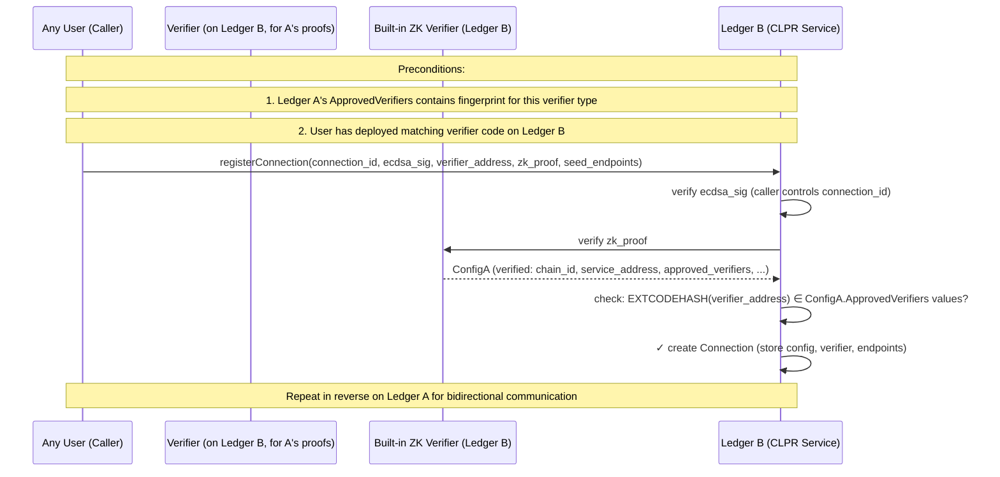
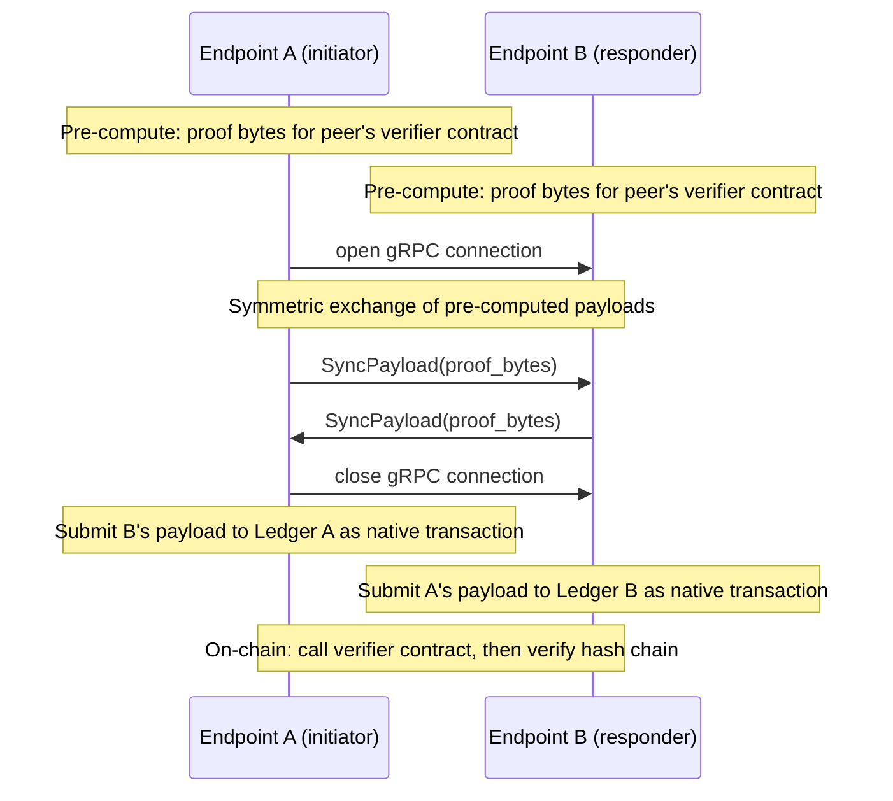
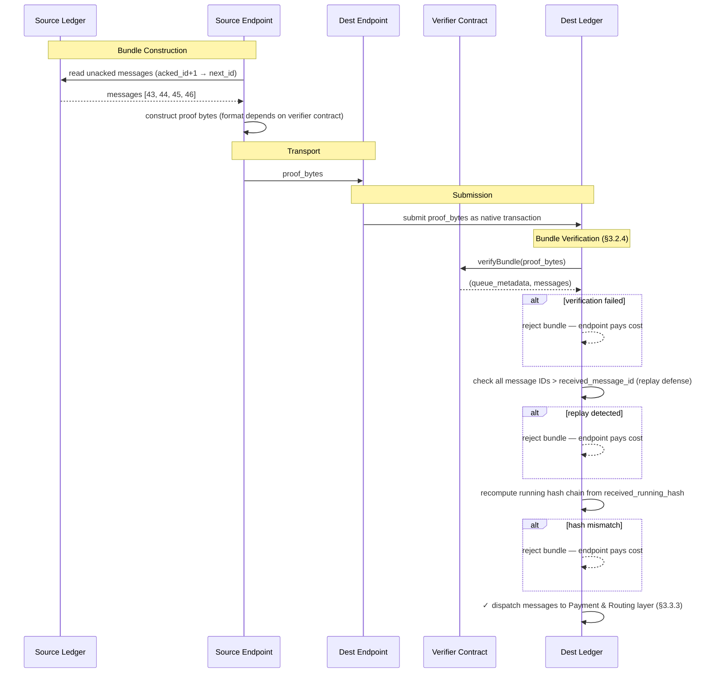
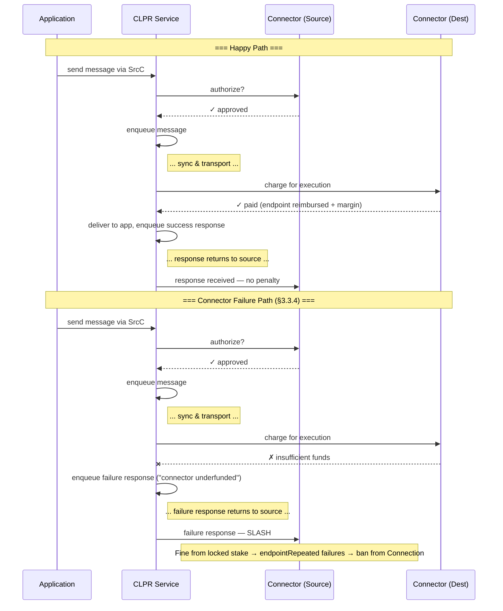

# 1. Executive Summary

CLPR (pronounced "Clipper") is a **Cross Ledger Protocol** that enables reliable, asynchronous message passing between
independent ledger networks. Unlike existing interledger solutions that weaken trust by introducing intermediary
consensus layers or federated bridges, CLPR relies on each ledger's native finality guarantees and verifiable state
proofs to achieve direct, ledger-to-ledger communication.

Messages are arbitrary byte payloads, making CLPR a general transport primitive suitable for cross-ledger smart contract
invocation, token movement, oracle data propagation, or application-specific messaging. When both participating ledgers
provide ABFT finality, CLPR inherits those guarantees and requires only a single honest endpoint node per ledger for
correct operation.

CLPR introduces no new token. All incentives and penalties are denominated in native ledger tokens and mediated through
**Connectors** — economic actors who front payment for message execution and are subject to slashing for misbehavior.

## Why CLPR

- **Preserves ABFT guarantees** — if both networks are ABFT, interledger communication inherits ABFT properties.
- **Eliminates intermediary trust** — ledgers rely on each other's verifiable state proofs rather than bridge
  validators.
- **Improves on existing solutions** — faster, cheaper, and/or more reliable than current interledger protocols.
- **Supports hybrid topologies** — enables communication between public and private Hiero networks and cross-ledger
  application orchestration.
- **Unlocks new business use cases** — positions Hedera competitively as the financial rails of tomorrow are being
  decided today.

## SMART Goal

> *"Interledger communication deployed from Ethereum to Hedera Mainnet, and at least 1K transactions processed between
Ethereum and Mainnet by end of 2026."*

---

# 2. Core Concepts and Terminology

CLPR connects one ledger to another without any intermediary nodes or networks. In a very real sense, *the ledgers are
communicating directly*. Users only have to trust the two ledgers they send messages between.

>💡 **A note on Hedera and Hiero:** Throughout this document, "Hiero" refers to the open-source ledger software stack
(the node software, its APIs, and its state model). "Hedera" refers to the specific public network that runs Hiero. When
describing behavior that applies to any network running Hiero (including private deployments), this document uses
"Hiero." When describing the public mainnet specifically, it uses "Hedera."

## 2.1 Common Terminology

- **Peer Ledger** — The "other" ledger this ledger is communicating with.
- **State Proof** — A cryptographic proof that a specific piece of data exists in a ledger's committed state and/or
  history. State proofs are the mechanism of trust — they allow one ledger to verify claims about another ledger's state
  without trusting any intermediary.
- **Endpoint** — A node responsible for periodically communicating with peer ledger endpoints to exchange configurations
  and messages.
- **CLPR Service** — The core business logic and state implementing CLPR on a particular ledger.
- **Connection** — An on-ledger entity representing a communication channel with a specific peer. Identified by a
  **Connection ID** derived from an ECDSA_secp256k1 keypair. Multiple Connections may exist between the same pair of
  ledgers (e.g., with different verifiers at different commitment levels).
- **Connector** — An economic entity that authorizes messages on the source ledger and pays for their execution on the
  destination ledger.
- **Message** — An arbitrary byte payload plus metadata representing a single unit of communication from one ledger to
  another.
- **Bundle** — An ordered batch of messages transmitted together between two ledgers, accompanied by a state proof.
- **Data Message** — A message carrying application-level content from one ledger to another. This is the primary unit
  of cross-ledger communication
- **Response Message** — A special message generated on the destination ledger and sent back to the source ledger,
  indicating success or a specific failure condition. Every Data Message produces exactly one Response Message in order.
- **Control Message** — A protocol-level message that manages the state of a Connection rather than carrying application
  data. Endpoint roster updates and configuration updates are delivered as Control Messages.
- **Source Ledger / Destination Ledger** — The originating and receiving ledgers for a given message, respectively.
- **Configuration** — The chain ID and other metadata describing a ledger participating in CLPR.
- **HashSphere** — A private or permissioned network running Hiero software, typically deployed for enterprise or
  regulated use cases.

## 2.2 High-Level Message Flow

A good way to think about CLPR is by considering a simple message flow. In this flow, an application on the **source**
ledger will **initiate** a message transfer to a **destination** ledger. On the source ledger the application will call
the **CLPR Service** (which may be a native service on Hedera, or a smart contract on Ethereum or other ledgers). This
service maintains a queue of outgoing messages, and some information about which messages have been **acknowledged** as
having been received by the destination ledger.


Before adding a message to the end of the queue, the service will call a **connector** (chosen by the application) to
ask it whether it will be willing to facilitate payment on the destination ledger for this message. Connectors (noun)
represent economic actors. A connector has a presence on both the source and destination ledger. The connector on the
source is literally saying, "I am willing to pay for this on the destination". If the connector is willing, then the
message is added to the queue.

Once in the queue, **endpoints** on either the source or destination ledger initiate a connection with a peer endpoint.
When they do, they exchange a **bundle** of messages that have *not yet* been confirmed as received by the other ledger.
Among these messages are **responses** to formerly sent messages, along with **state proofs** to prove everything they
communicate with each other. It is through these proofs that cryptographic trust is established.

The endpoint on the destination that receives this bundle constructs a transaction native to its ledger (e.g., a HAPI
`Transaction` on Hiero or a RLP-encoded transaction on Ethereum) and submits the bundle, metadata, and proofs to its
ledger. Post-consensus, the transaction is handled by the CLPR Service on the destination. For each message, it checks
to make sure the connector exists and is able to pay. If so, it sets a max-gas limit and calls the application on the
destination. When this call returns, the connection is debited to pay for the gas used along with a small tax to be paid
to the destination node that submitted the transaction. A **response** message is created and queued to send back to the
source ledger.

On a subsequent **sync** between the source and destination, messages are exchanged, and the source sees the response
message. It records that this message has been received by updating the source ledger state. It then delivers the
response to the source application, and the entire message flow has completed.

Subsequent sections will dive into the details of how this is accomplished, including implementation notes for Hiero and
Ethereum networks, and security measures to prevent various attacks and misuses of CLPR.

---

# 3. Architecture

CLPR is organized into four distinct layers:

| **Layer**                   | **Responsibility**                                                                                                  | **Key Abstractions**                                                                 | **Capability**                                                                                                                  |
|-----------------------------|---------------------------------------------------------------------------------------------------------------------|--------------------------------------------------------------------------------------|---------------------------------------------------------------------------------------------------------------------------------|
| **Network Layer**           | Physical data transport between ledger endpoints; handshaking, trust updates, throttle negotiation                  | Connection, endpoint, verifier contracts, gRPC channels, encoding format             | Two ledgers can connect. Misbehaving nodes are punishable.                                                                      |
| **Messaging Layer**         | Ordered, reliable, state-proven message queuing and delivery between ledgers                                        | Message queues, bundles, running hashes, state proofs for messages                   | Two ledgers can pass messages between each other. Additional misbehavior detection unlocked.                                    |
| **Payment & Routing Layer** | Connector authorization and payment, message dispatch to applications, response generation, and penalty enforcement | Connector contracts, application interfaces, slashing mechanisms                     | Messages are validated against Connectors, Connectors reimburse nodes, and misbehaving Connectors are punishable.               |
| **Application Layer**       | User-facing distributed applications built on CLPR                                                                  | Cross-ledger smart contract calls, asset management, atomic swaps                    | Applications can send messages between each other across ledgers by specifying the destination ledger, application, and connector. |

Network communication uses gRPC and protobuf. All messages and protocol types are encoded in protobuf. State proofs are
verified by **verifier contracts** — external smart contracts registered on each Connection that know how to verify
proofs from a specific source ledger. CLPR itself is proof-system-agnostic; all cryptographic verification is delegated
to verifier contracts (see §3.1.5).

> 💡**Encoding format under review.** Jasper is examining XDR as an alternative that may be more gas-efficient on
Ethereum than protobuf.

---

## 3.1 Network Layer

The network layer defines the CLPR Service and the state it maintains (§3.1.0), how ledgers identify themselves
(§3.1.1), how the endpoint roster is managed (§3.1.2), how connections are formed and maintained (§3.1.3), how endpoints
communicate (§3.1.4), how verifier contracts provide the underlying trust mechanism (§3.1.5), and network-level
misbehavior detection and reporting mechanisms that protect the protocol (§3.1.6).

### 3.1.0 The CLPR Service

The **CLPR Service** is the core on-ledger component that implements the CLPR protocol. It is the single source of truth
for all CLPR state on a given ledger, and it contains all protocol logic — message routing, payment processing, proof
verification, misbehavior enforcement, and fund custody. On Hiero networks it is a native service built into the node
software; on Ethereum it is a smart contract deployed on-chain.


**State owned by the CLPR Service:**

- **Local configuration** — The configuration describing this ledger: its `ChainID`, approved verifier
  contracts, and throttle parameters. There is exactly one local configuration per CLPR Service instance.
- **Connections** — Each Connection is keyed by its **Connection ID** (see §3.1.3 for how this ID is derived).
  Multiple Connections may target the same peer CLPR Service instance — for example, with different verifiers operating
  at different commitment levels. Each Connection holds the peer's `ChainID` and `ServiceAddress`, the peer's
  last-known configuration timestamp, the verifier contract used to verify inbound proofs, all message queue metadata,
  and the peer's endpoint roster.
- **Locked funds** — Balances posted by endpoints (bonds held against misbehavior) and Connectors (funds held to pay for
  message execution on arrival, and bonds held against misbehavior). The CLPR Service is the custodian of these funds
  and the sole authority for releasing or slashing them.

The CLPR Service holds all protocol logic that acts on its state — proof verification delegation, bundle processing,
application dispatch, Connector charging, endpoint reimbursement, and misbehavior enforcement, etc.

> 💡 **Hiero:** The CLPR Service is a native Hedera service, co-located with the node software. State is stored in the
Merkle state tree alongside other Hiero state (accounts, tokens, etc.), making it directly provable via Hiero state
proofs.

> 💡 **Ethereum:** The CLPR Service is a smart contract. All state it maintains lives in contract storage and is
provable via Ethereum state proofs (`eth_getProof`). The contract is the authoritative registry for Connections,
endpoint rosters, Connectors, and all locked funds on the Ethereum side.

### 3.1.1 Ledger Identity and Configuration

Each ledger participating in CLPR maintains a **configuration** describing its identity and communication parameters.
The primary fields in the configuration are: `ChainID`, `ApprovedVerifiers`, `Timestamp`, and `Throttles`. The endpoint
roster is maintained separately and is not part of the configuration — see §3.1.2.

The *local configuration* describes *this* ledger. It is shared as the *remote configuration* with any peer ledger that
wants to connect.

**Authority.** The local configuration may only be updated by the admin of the CLPR Service — on Hiero this is a
privileged system operation, on Ethereum this is a call from the contract's designated admin account. The remote
configuration and its accompanying state proof, however, may be submitted to the CLPR Service by anyone. The state proof
guarantees authenticity regardless of who submits it.

---

**ChainID**

Every ledger is identified by its `ChainID`, which is
a [CAIP-2](https://github.com/ChainAgnostic/CAIPs/blob/main/CAIPs/caip-2.md) chain identifier string of the form
`namespace:reference`. This identifies the chain but does **not** uniquely identify a CLPR Service instance — multiple
CLPR Service deployments may exist on the same chain (e.g., two competing CLPR Service contracts on Ethereum, both
claiming `eip155:1`).

A peer CLPR Service instance is identified by the compound key **`(ChainID, ServiceAddress)`**, where `ServiceAddress`
is the on-ledger address of the peer's CLPR Service (a contract address on EVM chains, a well-known constant on Hiero
where the CLPR Service is native). The `ChainID` comes from the configuration; the `ServiceAddress` is extracted from
the ZK proof at connection registration (the proof attests to state at a specific contract address). However,
`(ChainID, ServiceAddress)` does **not** uniquely identify a Connection — multiple Connections may target the same
peer CLPR Service instance (see §3.1.3). Each Connection is identified by its own **Connection ID**, derived from an
ECDSA_secp256k1 keypair at registration time. Applications specify the Connection ID when sending messages.

**Examples:**

| Network                      | ChainID                |
|------------------------------|------------------------|
| Hedera Mainnet               | `hedera:mainnet`       |
| Hedera Testnet               | `hedera:testnet`       |
| Ethereum Mainnet             | `eip155:1`             |
| Ethereum Sepolia             | `eip155:11155111`      |
| Private / HashSphere network | `hashsphere:acme-prod` |

For public networks, the namespace and reference SHOULD correspond to a registered CAIP-2 namespace. For private or
permissioned networks (e.g. HashSphere deployments), operators MAY self-assign a `ChainID` using an unregistered
namespace; uniqueness within the deployment is the operator's responsibility.

> ‼️ Anyone could maliciously construct a ledger configuration using any `ChainID` of their choosing. Because Connection
creation is permissionless (see §3.1.3), applications that use CLPR **must** independently verify that they are
interacting with the correct Connection for their intended peer ledger. A Connection existing on a ledger does not mean
the peer is legitimate — it only means someone provided a valid ZK proof of verifier endorsement.

> ‼️ **Trust model.** Connecting to a peer ledger via CLPR means trusting not only the peer ledger's consensus mechanism
but also the **admin of the peer ledger's CLPR Service**. The CLPR Service admin controls which verifier implementations
are endorsed in `ApprovedVerifiers`. If the admin is compromised or malicious, they can endorse a fraudulent verifier
that returns fabricated data — and the ZK proof of endorsement will faithfully prove that fraudulent endorsement. On
Hedera, the CLPR Service admin is the governing council (strong security). On Ethereum, it is whoever controls the CLPR
Service contract (which should use multisig governance). On a private HashSphere, it is whoever deployed the
network. **Before connecting to any peer ledger, evaluate the security of its CLPR Service admin.**

---

**ApprovedVerifiers**

Each CLPR Service instance declares which exact deployed verifier contract on each peer ledger it endorses. This allows
peer ledgers to independently verify that the verifier they are using to verify proofs from the source ledger is
authentic and endorsed by the source ledger's admin.

The `ApprovedVerifiers` field is a map from a **verifier type label** to an **implementation fingerprint** (a hash of
the verifier's deployed code). It declares: "if you want to verify my proofs, deploy a verifier whose code matches one
of these fingerprints." This field is part of the ledger's provable state.

The verifier type label is a human-readable identifier for a platform-specific implementation — e.g.,
`HederaProofs-EVM`, `HederaProofs-Hiero`, `HederaProofs-Solana`. All entries verify the **same proof format** (the
source ledger generates one kind of proof); the label distinguishes implementations for different target platforms. It
has no protocol-level semantics; the implementation fingerprint is what matters for verification.

The implementation fingerprint is chain-agnostic in concept but chain-specific in mechanism. On EVM chains it is the
`EXTCODEHASH` of the deployed verifier contract. On Hiero it is the hash of the system contract bytecode. On other
platforms (e.g., Solana) it is whatever mechanism that platform provides to verify deployed program code against a known
hash. The CLPR protocol requires only that the receiving ledger can verify "the deployed verifier's code matches the
endorsed fingerprint" — the specific mechanism is a per-platform implementation detail.

For example, Hedera's configuration might contain:

```
ApprovedVerifiers {
  "HederaProofs-EVM":    0xA1B2C3...   // for EVM chains: verifies Hedera TSS proofs in Solidity
  "HederaProofs-Hiero":  0xD4E5F6...   // for Hiero chains: verifies Hedera TSS proofs as native callback
  "HederaProofs-Solana": 0x789ABC...   // for Solana: verifies Hedera TSS proofs as BPF program
}
```

Each entry represents a verifier *implementation* that the source ledger endorses for verifying its proofs. The source
ledger's admin is responsible for building, auditing, and publishing these verifier implementations and registering
their fingerprints in the configuration. Any peer ledger can independently deploy the endorsed code and use it — without
requiring any administrative action on the receiving chain or any prior relationship between the two ledgers.

When a Connection is registered on a receiving ledger, the CLPR Service verifies the verifier's legitimacy via ZK
proof: the proof attests that the source ledger's `ApprovedVerifiers` contains an entry whose implementation fingerprint
matches the locally deployed verifier's code hash. A rogue verifier deployed by an unauthorized party cannot pass this
check, because its code hash will not match any fingerprint in the source ledger's authentic state. See §3.1.3 for the
full bootstrap flow.

> 💡 **Private networks.** This design allows a private HashSphere to connect to Hedera Mainnet without any action by
Hedera's governing council. The HashSphere admin deploys the endorsed Hedera verifier code locally, registers a
Connection on Hedera with a ZK proof of endorsement, and begins syncing. Hedera never needs to know the HashSphere
exists. For the reverse direction (Hedera verifying HashSphere proofs), anyone can deploy the HashSphere's endorsed
verifier on Hedera and register the Connection — again without council involvement.

---

**Timestamp**

Each configuration carries a `timestamp` set to the consensus time of the transaction that last modified the
configuration. It is a monotonically increasing value used to determine which of two configurations is more recent. Any
configuration update advances the timestamp. Endpoint roster changes do not affect the configuration timestamp, as the
roster is managed separately.

---

**Throttles and Acceptance Criteria**

Each ledger specifies the following capacity limits in its configuration:

`MaxMessagesPerBundle` is a hard capability limit. It reflects the maximum number of messages that can be included in a
single bundle without exceeding the receiving ledger's gas or execution budget. Sending endpoints MUST respect
this limit.

`MaxMessagePayloadBytes` is the maximum size of a single message payload that the ledger will accept. The source
ledger's CLPR Service MUST reject any message whose payload exceeds the destination's advertised limit. See §3.2.5 for
the full enforcement rules.

`MaxGasPerMessage` caps the computation budget for processing a single message on the destination ledger. This bounds
the worst-case execution time per message and prevents a single expensive message from monopolizing block resources.

`MaxSyncPayloadBytes` is the maximum total size of a sync payload (proof bytes, queue metadata, and message bundle
combined) that the ledger will accept from a peer endpoint. This caps the data an endpoint must receive and process at
the gRPC level before submitting it as a transaction. An endpoint MAY terminate a gRPC stream that exceeds this limit
without submitting anything.

`MaxQueueDepth` is the maximum number of unacknowledged messages allowed in the outbound queue for a single Connection.
When the queue is full, new messages are rejected until the peer catches up. This provides natural backpressure when
one ledger is faster than the other and prevents unbounded state growth from accumulating undelivered messages.

`MaxSyncsPerSec` is an advisory hint and not enforced by the protocol. It exists to help well-behaved sending endpoints
avoid wasteful duplication. The problem it addresses is redundancy: on Ethereum, for example, multiple source endpoints
receiving the same sync simultaneously may each independently construct and submit a transaction to the mempool,
potentially incurring gas costs even if duplicates are rejected. A sending ledger that respects `MaxSyncsPerSec` can
pace its endpoints to reduce this. Endpoints that persistently violate this hint are subject to shunning and eviction —
see §3.1.6.

**Protocol strictness.** All limits in the configuration are published so that both sides know the rules. A peer that
exceeds any published limit — whether on payload size, bundle size, sync payload size, or sync frequency — is
committing a measurable, attributable violation. The receiving side MUST reject the offending submission and MAY count
repeated violations toward misbehavior thresholds (§3.1.6). A peer should never be penalized for reasons it cannot
determine from the published configuration. Conversely, any submission that does not conform to the protocol
specification (unknown fields, malformed metadata, unexpected message types) MUST be rejected outright. The CLPR
protocol is strict: implementations MUST NOT silently ignore unrecognized data.

### 3.1.2 Endpoint Roster

The endpoint roster is the set of endpoints a ledger exposes for CLPR communication with a specific peer. It is
maintained as separate ledger state, indexed by connection, and is not embedded in the configuration. This keeps
configuration updates lightweight — a ledger with thousands of endpoints does not need to re-transmit or re-prove the
entire roster whenever an unrelated configuration field changes.

An endpoint has:

- **Service Endpoint** — The IP address and port of the endpoint. Optional; may be omitted for private networks that
  only initiate outbound syncs.
- **Signing Certificate** — A DER-encoded RSA public certificate used for TLS and payload verification.
- **Account ID** — The on-ledger account associated with this endpoint node. A byte array whose length depends on the
  ledger (e.g., 20 bytes for Hiero and Ethereum, 32 bytes for Solana).

**Bootstrap.** When a connection is first established (§3.1.3), the initiating party SHOULD supply at least one endpoint
for the remote peer as part of the connection setup call. This single seed endpoint is the minimum needed for the local
ledger to know who to contact. Without it, the connection exists but cannot participate in any syncs.

**Ongoing updates.** After bootstrap, changes to the peer endpoint roster are propagated via Control Messages in the
message queue (see §3.2.2 for the Control Message types and ordering guarantees). Each receiving ledger's CLPR Service
is responsible for applying these updates to its local copy of the peer roster.

**Recovery.** If the automatic sync channel breaks down — for example, because a ledger has completely rotated its
endpoint set and none of the new endpoints are known to the peer — any user may submit a `recoverEndpointRoster` call
directly to the CLPR Service API. This call takes opaque proof bytes, which the Connection's verifier contract
validates via `verifyEndpoints` (§3.1.5), returning the peer's current endpoint list. The CLPR Service replaces the
stale peer roster with the verified endpoints. No live sync is required, and any user may submit the call — it is not
a privileged operation.

**How local endpoints are established** varies by ledger type:

> 💡 **Hiero:** Every consensus node is automatically a CLPR endpoint. When CLPR is first enabled, the node software
reads the active roster and registers all nodes as local endpoints. From that point forward, any roster change — a node
joining, leaving, or upgrading — automatically updates the local endpoint set. No manual management is required. On
Hiero, misbehavior penalties (§3.1.6) are enforced through the node's existing account — a misbehaving endpoint node's
account can be slashed or the node can be removed from the active roster by governance action. No separate CLPR-specific
bond is required because Hedera consensus nodes are permissioned, but this may change in the future, especially for
Hiero nodes.

> 💡 **Ethereum:** There are no local endpoints by default. Validators opt in as CLPR endpoints by calling a
registration method on the CLPR Service contract and posting a bond (ETH locked in escrow against misbehavior). They can
remove themselves by calling a deregistration method. There is no automatic synchronization with the Ethereum validator
set — endpoint participation is explicitly managed through contract calls.

> ‼️ **Sybil resistance.** On ledgers where endpoint registration is open (e.g., Ethereum), the endpoint bond must be
large enough to make Sybil attacks economically infeasible. An attacker who registers many cheap endpoints can eclipse
honest endpoints — controlling which bundles get submitted and enabling censorship or selective delay. The bond size
should be calibrated so that controlling a majority of endpoints costs more than the value that could be extracted
through censorship. Additionally, peer endpoint selection during sync should incorporate randomization to prevent
persistent pairing, and endpoint reputation scoring (see §5.2) can help honest endpoints preferentially select reliable
peers. On Hiero, where all consensus nodes are automatically endpoints, Sybil resistance is inherited from the
network's stake-weighted consensus.

### 3.1.3 Establishing and Updating Connections

Connection creation is **permissionless**. Anyone can register a new Connection by deploying a verifier contract,
and providing a ZK proof that the source ledger endorses the verifier. No admin approval is required.
The local admin retains the power to **sever** any Connection at any time (see below).



**Connection ID.** Each Connection is identified by a **Connection ID** that is the same on both ledgers. The registrant
generates an ECDSA_secp256k1 keypair and derives the Connection ID from the public key (e.g., `keccak256(pubkey)`).
Registration on each ledger requires a signature from this key, proving the registrant controls the identity. Because
the Connection ID is deterministic from the keypair, the registrant can register on both ledgers independently, in any
order, without a pairing ceremony. An attacker who observes a registration on one ledger cannot front-run registration
on the other because they do not hold the private key. ECDSA_secp256k1 is chosen for universal platform support:
Ethereum has the `ecrecover` precompile, Solana has the secp256k1 program, and Hiero supports it natively.

**Registration flow.** The caller submits a `registerConnection` call specifying:

1. The **Connection ID** and an **ECDSA_secp256k1 signature** over the registration data, proving the caller controls
   the identity keypair.
2. The address of a **verifier contract** already deployed on the local ledger.
3. A **ZK proof** attesting to the source ledger's current configuration. This proof is verified by a
   **built-in ZK verifier** hardcoded into the CLPR Service (not the verifier contract itself — the bootstrap cannot
   rely on a verifier whose legitimacy has not yet been established).
4. At least one **seed endpoint** for the peer.

The CLPR Service verifies the ECDSA signature (confirming the caller controls the Connection ID), then verifies the ZK
proof using its built-in verifier, extracting the source ledger's configuration. It checks that the locally deployed
verifier contract's **implementation fingerprint** (code hash) matches one of the entries in the source ledger's
`ApprovedVerifiers`. If the fingerprint matches, the Connection is created: the Connection ID is recorded, the peer's
configuration is stored, the verifier contract address and fingerprint are recorded, and the seed endpoints are saved.

**Initial acceptance criteria.** The ZK proof submitted during registration carries the peer's full
configuration, including all acceptance-criteria parameters. These values take effect immediately on the new Connection
and govern message enqueuing from the first message onward. Subsequent changes are propagated via the messaging layer's
Control Message mechanism (§3.2.2), which ensures total ordering with data messages.

**Multiple Connections to the same peer.** Because Connections are keyed by Connection ID (not by the peer's identity),
multiple Connections may exist between the same pair of ledgers. This is useful when a peer ledger supports multiple
commitment levels in its state proofs — for example, Ethereum offers `latest`, `safe`, and `finalized` block
confirmations. Each Connection uses a different verifier tuned to a specific commitment level, giving applications a
choice between lower latency and stronger finality guarantees. Each Connection has its own independent queue, endpoint
roster, and Connector set. See §3.4 for application-layer patterns that leverage this.

**Severing connections.** The local CLPR Service admin can **sever** (permanently close) any Connection at any time.
This is an emergency power — it immediately stops all message processing on the Connection and rejects new bundles.
Severing is appropriate when a peer ledger is compromised, when a verifier is found to be buggy,
or when the Connection is being used for abuse. The admin can also **pause** a Connection (temporarily halt processing
without closing it) to investigate issues before deciding whether to sever.

**Verifier migration.** For a given Connection, there is exactly one active verifier — the one deployed on the local
platform. If the source ledger upgrades its proof format, the migration is fully automated and driven by the existing
ack mechanism:

1. **Deploy** new verifier implementations (supporting the new proof format) on all target platforms.
2. **Update `ApprovedVerifiers`** — remove the old fingerprints and add the new ones. This enqueues a ConfigUpdate
   Control Message on every active Connection (§3.2.2).
3. **Continue proving with the old format.** The bundle carrying the ConfigUpdate is verified by the old verifier on
   each destination. After the destination processes the ConfigUpdate, it knows the new `ApprovedVerifiers` and can
   `updateConnectionVerifier` locally to switch to the new verifier.
4. **Per Connection, switch to the new proof format once the ConfigUpdate is acked.** The source ledger already tracks
   acks per Connection — once a Connection's ack covers the ConfigUpdate message, the source knows that Connection has
   processed the change and begins generating proofs in the new format for that Connection.

No dual-format verifiers are needed. No unobservable "wait" step exists. The source controls the pace entirely through
the ack mechanism it already has.

Any user can update the verifier on an existing Connection by deploying the new verifier code locally and calling
`updateConnectionVerifier`. This call supports **two verification paths**:

- **Local check (normal case).** The CLPR Service checks the new verifier's code hash against the `ApprovedVerifiers`
  already stored on the Connection (delivered via ConfigUpdate Control Messages — see §3.2.2). If the fingerprint
  matches, the verifier is replaced. No ZK proof is needed because the peer's config is already known and
  authenticated.
- **ZK proof (recovery case).** If the sync channel is broken and the stored `ApprovedVerifiers` is stale (e.g., the
  peer changed its proof format and the old verifier cannot read new proofs), the caller may supply a ZK proof — the
  same kind used at Connection registration. The built-in ZK verifier extracts the peer's current config, the CLPR
  Service checks the new verifier's code hash against the freshly proven `ApprovedVerifiers`, and the Connection's
  stored config is updated. This re-bootstraps trust without severing the Connection or losing queue state.

This allows verifier upgrades without re-establishing the Connection and without admin involvement on the destination.

> 💡 **When is the ZK path needed?** In normal operation, ConfigUpdate Control Messages keep the stored
`ApprovedVerifiers` current, and the local check suffices. The ZK path is needed only when the in-band update channel
has broken down — typically because the endpoints have rotated (§3.1.2 recovery) AND the proof format has changed,
leaving no way for the old verifier to read new bundles containing the ConfigUpdate.

> 💡 **Hiero:** Connection creation is a non-privileged HAPI transaction. The built-in ZK verifier is part of the
node software. The CLPR Service admin (governing council) can sever or pause any Connection via privileged HAPI
transactions.

> 💡 **Ethereum:** Connection creation is a non-privileged call on the CLPR Service contract. The built-in ZK verifier
is a hardcoded verification function within the contract. The CLPR Service admin (contract governance) can sever or
pause any Connection via admin-only contract functions.

### 3.1.4 Endpoint Communication Protocol

Every CLPR endpoint runs a gRPC server that implements the CLPR Endpoint API. The core of this API is a **sync**
method — when one endpoint contacts a peer endpoint, they exchange whatever information needs to flow between the two
ledgers. The sync method is the single entry point for all interledger data exchange at the network layer.


A sync call is initiated by one endpoint selecting a peer endpoint from the Connection's peer roster and opening a gRPC
connection to it. **The sync is bidirectional within a single call** — both sides exchange their data, minimizing
round trips. The initiating endpoint pre-computes its outbound payload before opening the connection — it packages
its proof bytes (in whatever format the peer's verifier contract expects), reads any unacked messages, and bundles
everything together. The responding endpoint computes its payload upon receiving the incoming connection. The gRPC
call is then a symmetric exchange of these payloads.

**Proof structure.** Each direction of the sync carries **opaque proof bytes** that will be passed to the Connection's
verifier contract on the receiving ledger. The verifier contract performs the expensive cryptographic verification and
returns the verified queue metadata and messages. What the proof bytes contain internally — state roots, Merkle paths,
ZK proofs, TSS signatures, BLS aggregate signatures — is entirely up to the verifier contract. CLPR does not interpret
or constrain the proof format.

> 💡 **Important:** Endpoints **MUST** verify the proof before submitting transactions to their own ledger. On
Hiero and Ethereum, this is done by executing the verifier contract *locally* before submitting the transaction. This
must be done, otherwise the endpoint will have to pay for invalid payloads that fail verification post-consensus.

The two sides exchange:

- **Proof bytes** — Opaque bytes that the receiving ledger's verifier contract knows how to interpret. Contains
  whatever the verifier needs to extract and verify the queue metadata and messages.
- **Queue metadata** — Current message IDs and running hashes (defined in §3.2.1), so each side knows what the other has
  sent and received. Extracted and verified by the verifier contract.
- **Message bundles** — Any pending messages that the peer has not yet acknowledged. Extracted and verified by the
  verifier contract.

The queue metadata exchange is the mechanism by which acknowledgements are communicated — the peer's reported
`received_message_id` becomes the sender's `acked_message_id`, enabling deletion of acknowledged response messages and
ordering verification for initiating messages (see §3.2.6 and §3.2.7).



**Private networks.** Not all ledgers need to expose their endpoints publicly. A ledger may choose to keep its endpoint
addresses private by omitting service endpoints from its endpoint roster entries. In this case, the private ledger's
endpoints are the only ones that can initiate sync calls — since the peer ledger does not know their addresses, it
cannot reach them. This is useful for enterprise or regulated networks (e.g., a HashSphere) that need to communicate
with a public ledger like Hedera or Ethereum without exposing any network infrastructure.

When a ledger is private, its endpoints are responsible for initiating communication with the peer ledger.

> 💡 **Hiero:** A gRPC server is built into the consensus node software. Every node runs the CLPR Endpoint API alongside
the existing HAPI gRPC services. Nodes periodically initiate sync calls to peer endpoints on a configurable frequency.

> 💡 **Ethereum:** The gRPC server runs as a sidecar process alongside the Besu client (or as a built-in module if CLPR
support is contributed to Besu). The sidecar reads from and writes to the CLPR Service contract via standard Ethereum
JSON-RPC, but communicates with peer endpoints over gRPC.

### 3.1.5 Verifier Contracts

CLPR is **proof-system-agnostic** — all cryptographic verification is delegated to verifier contracts, and the protocol
never interprets proof bytes directly. A verifier contract is a smart contract (on EVM chains) or a system contract /
native callback (on Hiero) that implements three methods:

- **`verifyConfig(bytes) → ClprLedgerConfiguration`** — Accepts opaque proof bytes, performs whatever cryptographic
  verification is appropriate for the source ledger, and returns a verified configuration. Used during connection
  registration (§3.1.3) and `updateConnectionVerifier` with ZK proof path (§3.1.3).
- **`verifyBundle(bytes) → (ClprQueueMetadata, ClprMessagePayload[])`** — Accepts opaque proof bytes, performs
  verification, and returns verified queue metadata and messages. Used during bundle processing (§3.2.4).
- **`verifyEndpoints(bytes) → ClprEndpoint[]`** — Accepts opaque proof bytes, performs verification, and returns a
  verified list of endpoints for a specific Connection on the source ledger. Used during endpoint roster recovery
  (§3.1.2) when the sync channel is broken and the peer's endpoint set must be re-bootstrapped from a state proof.

What happens inside the verifier contract is entirely its own concern. A verifier for Hiero might check TSS signatures
and Merkle paths. A verifier for Ethereum might validate BLS aggregate signatures from the sync committee, or verify a
ZK proof that wraps the Ethereum consensus attestation. A verifier for a new chain might use an entirely novel proof
system. CLPR does not constrain or even inspect the proof format — it only requires that the verifier return structured,
verified data.

**Trust model.** CLPR trusts the verifier contract's output — if the verifier lies, the Connection is compromised.
The verifier's legitimacy is established at Connection creation via ZK proof of endorsement (§3.1.3). CLPR independently
verifies running hash chain integrity, message ID sequencing, and response ordering (§3.2.4) — these checks catch
verifier bugs but not a compromised verifier, which would return fabricated data with matching hashes.

**Finality and reorg risk.** For ledgers without instant finality (e.g., Ethereum), the commitment level at which the
verifier accepts proofs determines the reorg risk. A verifier that accepts proofs at `latest` commitment level is
vulnerable to chain reorganizations: a message may be processed on the destination and then the source block is
reverted, producing a "phantom message" that never actually existed on the source. For token bridges, this enables
double-spending. The commitment level is a property of the verifier implementation — CLPR does not enforce or inspect
it. Source ledger admins choosing which verifier to endorse, and applications choosing which Connections to use, must
evaluate the verifier's commitment level relative to their risk tolerance. For high-value or irreversible operations,
only verifiers that enforce `finalized` commitment (or equivalent) should be used. Ledgers with ABFT finality (e.g.,
Hiero) do not have this concern — finality is instant and reorgs are not possible under honest supermajority.

**Adding new chains.** Adding CLPR support for a new ledger does not require changes to the CLPR protocol or to existing
implementations on other ledgers. It requires: (1) deploying a CLPR Service on the new ledger, (2) building a verifier
contract that can verify that ledger's proofs, (3) registering the verifier's implementation fingerprint in the new
ledger's `ApprovedVerifiers` configuration, and (4) anyone deploying the verifier on a target peer ledger and
registering a Connection with a ZK proof of endorsement. No admin action on the peer ledger is required. The source
ledger's ecosystem is responsible for building and maintaining its verifier contracts — including proof generation,
trust anchor tracking (e.g., validator set rotation, committee changes), and any internal state the verifier needs to
maintain.

**Verifier contract examples.** The following are illustrative examples of verifier contracts that might be deployed for
different ledger pairs. Each is a separate implementation; CLPR treats them identically.

- **Hiero TSS Verifier** — For Hiero-to-Hiero connections (including HashSphere deployments). Verifies Merkle paths,
  block proofs, and TSS signatures from the source network's consensus nodes. Provides the lowest-latency verification
  path: sub-second message delivery with ABFT guarantees inherited from both networks.
- **Ethereum BLS Verifier** — For Ethereum-to-Hiero connections. Validates BLS aggregate signatures from Ethereum's
  sync committee. Internally manages validator set tracking (committee rotation every ~27 hours). The commitment level
  (e.g., `finalized` vs. `safe` vs. `latest`) is a property of the verifier implementation — different deployments may
  enforce different levels depending on the source ledger's risk profile.
- **ZK Verifier** — A universal adapter for any source ledger. Verifies a zero-knowledge proof (Groth16, PLONK, STARK,
  etc.) that wraps the source ledger's native consensus attestation. The source ledger's ecosystem builds the prover;
  the verifier contract only needs to check the proof. This is the natural choice when the receiving ledger cannot
  natively verify the source ledger's consensus mechanism.

> ‼️ **Upgradeable verifier contracts.** Verifier contracts may be deployed behind upgradeable proxies (e.g., EIP-1967)
to allow the source ledger to upgrade verification logic without requiring every Connection to run
`updateConnectionVerifier`.
> 
> When proxies are used, the implementation fingerprint in `ApprovedVerifiers` is the proxy's code hash (since that is
what `EXTCODEHASH` returns), and the proxy owner can change the underlying implementation. This is acceptable
**only if** the proxy's upgrade authority is controlled by the source ledger's CLPR Service admin (or equivalent
governance). The verifier contract is an extension of the source ledger's CLPR Service running on a foreign chain — its
upgrade authority must be the same trust boundary. A verifier whose upgrade key is controlled by a third party is a
critical vulnerability: that third party could silently replace the verification logic, and the source ledger would have
no recourse.

> 💡 **Note:** Chain-specific verifier specifications (e.g., how to construct a Hiero TSS verifier for Ethereum, or how
to build a ZK prover wrapping Ethereum sync committee consensus) are out of scope for this document. Each is a separate
specification maintained by the relevant chain's ecosystem or by the team implementing CLPR support for that chain.

---

### 3.1.6 Misbehavior Detection and Reporting

Every sync event is doubly attributable. The sync payload is signed by the **remote peer endpoint** that originated it,
and the transaction submitting it to the local ledger is signed by the **local endpoint** that received and forwarded
it. This two-signature property allows the receiving ledger to unambiguously attribute misbehavior to either a local or
remote endpoint, and to produce cryptographically self-proving evidence that the remote ledger can verify independently.

**Remote endpoint: duplicate broadcast** — If the same payload (identified by its remote endpoint signature) is
submitted by multiple distinct local endpoints within a single sync round, the remote peer endpoint must have sent that
payload to more than one local endpoint simultaneously. No honest local endpoint would fabricate a foreign signature, so
the evidence is conclusive.

**Remote endpoint: excess sync frequency** — If distinct payloads signed by the same remote endpoint arrive more
frequently than the receiving ledger's `MaxSyncsPerSec`, the remote endpoint is not respecting the advertised throttle.

**Local endpoint: duplicate submission** —If the same payload is submitted more than once by the same local endpoint,
that local endpoint is misbehaving. Deduplication before submission is a local obligation; no honest local endpoint
should submit the same payload twice.

| Observation                                             | Culprit              |
|---------------------------------------------------------|----------------------|
| Same payload, multiple local endpoints                  | Remote peer endpoint |
| Same remote endpoint signature, excess frequency        | Remote peer endpoint |
| Same payload, same local endpoint, submitted repeatedly | Local endpoint       |

When a remote endpoint is identified as the culprit, the local ledger MAY assemble the evidence into a
`MisbehaviorReport` and submit it as a transaction to the remote ledger.

```mermaid
MisbehaviorReport {
  offendingEndpoint:  PublicKey       // the remote endpoint being reported
  evidenceType:       EvidenceType    // DuplicateBroadcast | ExcessFrequency
  payloads:           SignedPayload[] // the signed payloads constituting the evidence
  reporterChainID:    ChainID         // the reporting ledger
}
```

The signed payloads are self-proving: the remote ledger can verify the offending endpoint's signature on each payload
without trusting the reporter. No honest remote endpoint can produce two validly-signed conflicting or duplicate
payloads, so a valid `MisbehaviorReport` is conclusive by itself.

Upon receiving and verifying a `MisbehaviorReport`, the remote ledger SHOULD:

1. Verify the authenticity of the report
2. Confirm the evidence meets the threshold for the reported `evidenceType`.
3. Slash and remove the offending endpoint from its active roster.
4. Issue an updated roster notifying affected peer ledgers that the endpoint has been removed.

The remote ledger is under no obligation to act on an unverifiable or malformed report, and reporters that submit
frivolous or fabricated reports MAY themselves be subject to penalties (such as the connection being terminated with the
remote ledger).

Misbehavior involving sync frequency MUST be measured in **sync rounds or blocks**, not wall-clock time. Block
timestamps are subject to bounded manipulation by validators and are unsuitable as the sole basis for a slashing
decision. A tolerance band SHOULD be applied when evaluating frequency violations near round boundaries.

If a local endpoint is identified as the culprit, the local ledger handles the matter
internally — slashing and removing the offending endpoint from its own roster. No `MisbehaviorReport` to the remote
ledger is warranted, since the fault is local.

---

## 3.2 Messaging Layer

The messaging layer provides ordered, reliable, state-proven message queuing and delivery between ledgers. It builds on
the network layer's ability to transport data and verify trust. This layer is concerned with message sequencing,
integrity, and transport. Connector payment, application dispatch, and failure handling are the responsibility of the
Payment and Routing layer (§3.3).

The messaging layer defines three classes of messages that share a single ordered queue per Connection:

- **Data Messages** — Application-level content sent from one ledger to another. This is the primary unit of
  cross-ledger communication.
- **Response Messages** — Generated on the destination ledger after processing a Data Message. Every Data Message
  produces exactly one Response Message, indicating success or a specific failure condition.
- **Control Messages** — Protocol-level messages that manage the state of a Connection. Configuration updates and
  endpoint roster changes are delivered as Control Messages, sequenced alongside data messages to ensure total ordering.
  Control Messages do not involve Connectors, are not dispatched to applications, and do not generate responses.

### 3.2.1 Message Queue Metadata

The network layer introduced the Connection as the on-ledger entity for a peer relationship. The messaging layer extends
the Connection with message queue metadata — the bookkeeping needed to send, receive, and acknowledge messages reliably.

Each Connection tracks the following queue state:

- **Next Message ID** (`next_message_id`) — The next sequence number to assign to an outgoing message. Strictly
  increasing. Stored as `uint64`; at one million messages per second this would take ~584,000 years to overflow, so
  wraparound is not a practical concern.
- **Acknowledged Message ID** (`acked_message_id`) — The ID of the most recent outgoing message confirmed received by
  the peer. Updated when the peer reports its `received_message_id` during sync (§3.1.4). This is a transport-level
  acknowledgement, distinct from application-level responses — see §3.2.7 for the full lifecycle.
- **Sent Running Hash** (`sent_running_hash`) — A cumulative hash over all enqueued outgoing messages. Used by the peer
  to verify message integrity and ordering.
- **Received Message ID** (`received_message_id`) — The ID of the most recent message received from the peer. This is
  what gets reported back to the peer so it knows what has been delivered.
- **Received Running Hash** (`received_running_hash`) — A cumulative hash over all received messages. Used to verify
  inbound bundles against state-proven values.

The gap between `next_message_id` and `acked_message_id` represents messages that are queued but not yet acknowledged —
the "in flight" window. The Connection enforces `MaxQueueDepth` (see §3.1.1) to bound this window.

### 3.2.2 Message Storage

Each Connection conceptually maintains an ordered message queue for communication with its peer ledger. The queue
metadata on the Connection is described in §3.2.1 above. Message payloads, however, are stored separately from the
Connection (keyed by Ledger ID plus Message ID) because they are accessed by specific ID ranges during bundle
construction and are deleted after acknowledgement. The Connection itself only holds the metadata — counters and hashes.

The queue carries all three message types — Data, Response, and Control — in a single intermixed stream. When the
destination ledger processes an incoming Data Message and generates a response (whether a success result, an application
error, or a Connector failure), that response is enqueued in the same outbound queue as any new initiating messages or
Control Messages the destination ledger may be sending. All types share the same running hash chain, the same state
proof mechanism, and the same bundle transport — there are no separate channels.

Messages are enqueued with an ID and a running hash that chains each message to the previous one, forming a verifiable
log. This enables the receiving ledger to validate message integrity and ordering without trusting the relay. The
running hash uses **SHA-256**, computed as `SHA-256(previous_running_hash ‖ message_payload)` where `‖` denotes
concatenation. SHA-256 is chosen for universal platform availability (EVM `sha256` precompile, Hiero native, Solana
`sol_sha256` syscall) and consistency with Hiero's existing hash infrastructure. Under Grover's algorithm, SHA-256
retains 128-bit preimage resistance, which remains adequate for the running hash chain's security requirements. Should
post-quantum threat models evolve, the hash algorithm can be upgraded via a protocol version bump and connection
renegotiation — the `running_hash` fields are opaque `bytes`, so no wire format change is needed.

Each queued entry contains:

- **Payload** — One of:
    - **Data Message** — An initiating message containing routing metadata (Connector, target application, sender) and
      opaque byte data. The encoding and semantics of the payload are defined by higher-level protocol layers.
    - **Response Message** — A reply to a previously received Data Message, containing the original message ID, a
      structured status, and opaque reply bytes.
    - **Control Message** — A protocol-level message. There are three subtypes:
        - **EndpointJoin** — Announces a new endpoint joining the peer's roster. Carries the endpoint's signing
          certificate, service endpoint (if any), and account ID (see §3.1.2).
        - **EndpointLeave** — Announces an endpoint's departure. Carries the departing endpoint's account ID. Sent
          when an endpoint is removed for any reason.
        - **ConfigUpdate** — Carries updated configuration parameters (throttles, payload limits, `ApprovedVerifiers`,
          etc.). When the local admin changes a configuration parameter, the CLPR Service enqueues a ConfigUpdate on
          **every active Connection**. The peer processes it at a well-defined point in the message stream, so messages
          enqueued before the ConfigUpdate were valid under the old config and MUST be accepted; messages enqueued after
          it comply with the new config. This total ordering eliminates race conditions where a source enqueues a
          message valid under the config it has seen but that would be rejected under a change it hasn't learned about.
- **Running Hash After Processing** — The cumulative hash computed from the prior running hash and this message's
  payload. When this message is the last one in a bundle, this hash must match the state-proven value, enabling
  verification without requiring the entire queue history.

> 💡 **Hiero:** Queued messages are stored in the Merkle state as a separate key-value map. They are deleted after
acknowledgement.

> 💡 **Ethereum:** Queued messages are stored in the CLPR Service contract's storage. Gas costs for storage are a
significant design consideration — message payloads are deleted aggressively after acknowledgement.

### 3.2.3 Bundle Transport

Messages do not travel individually between ledgers — they travel in **bundles**. A bundle is an ordered batch of
message payloads accompanied by a state proof that attests to their authenticity and ordering.

When an endpoint takes its turn to synchronize with a peer (as part of the sync call described in §3.1.4), it checks
whether there are messages waiting to be delivered. It does this by comparing the Connection's `next_message_id` (the
total number of messages enqueued) against what the peer has acknowledged receiving. If there is a gap, those messages
need to go.

The endpoint reads the unacknowledged messages from the message store, packages them into a bundle, and constructs a
state proof over the last message in the batch. This state proof covers the running hash at that point — which means the
receiver can verify not just that these messages exist in the sender's state, but that they are in the correct order and
none have been tampered with or omitted.

On the receiving side, when an endpoint gets a bundle from a peer, it cannot just trust the data — it must submit it to
its own ledger as a native transaction. On Hiero this is a HAPI transaction; on Ethereum it is a call to the CLPR
Service contract. The actual processing happens post-consensus, not within the endpoint itself.

If the peer has also sent messages in the other direction, acknowledgments flow naturally as part of the same sync — the
`received_message_id` reported by each side tells the other how far along it is, and acknowledged messages can be
deleted.

### 3.2.4 Bundle Verification

When a bundle arrives on a ledger (post-consensus), the CLPR Service verifies it through two stages before handing
individual messages off to the Payment and Routing layer for processing.



First, the CLPR Service **calls the Connection's verifier contract** with the proof bytes (see §3.1.5). The verifier
contract performs whatever cryptographic verification is appropriate for the source ledger and returns the verified
queue metadata and messages. If the verifier contract rejects the proof (reverts, returns an error, or fails
verification), the entire bundle is rejected. A legitimate endpoint would never produce a bad proof, so this is also a
signal that the submitting endpoint may be misbehaving. The submitting node will have paid the transaction cost and will
not be reimbursed. Repeated invalid proof submissions from the same endpoint constitute provable misbehavior (§3.1.6)
and _may_ lead to bond slashing and removal from the endpoint roster. On EVM chains, verifier contracts SHOULD fail fast
on obviously malformed inputs (e.g., wrong proof length) before performing expensive cryptographic operations to bound
the computational cost of invalid submissions.

Next, the CLPR Service **enforces monotonic message ordering** — the primary replay defense. Every message in the
bundle MUST have an ID strictly greater than the Connection's current `received_message_id`, and message IDs within the
bundle MUST be contiguous and ascending. Any bundle containing a message with an ID ≤ `received_message_id` is rejected
outright, regardless of whether the verifier accepted the proof. This check is performed by the CLPR Service itself and
is the authoritative defense against replay attacks; it holds even if the verifier is buggy and accepts stale proofs.

Then, the CLPR Service **verifies the running hash chain**. Starting from the Connection's current
`received_running_hash`, it recomputes the cumulative hash over each message in the bundle (see §3.2.2 for the hash
formula) and compares the result against the `sent_running_hash` from the verifier-returned `ClprQueueMetadata`. A
mismatch means the message ordering or content is corrupt, and the bundle is rejected. This check is performed by the
CLPR Service independently of the verifier contract and defends against **verifier bugs** (e.g., a verifier that
authenticates a proof but returns garbled messages). It does **not** defend against a compromised verifier, which would
return fabricated messages with a matching fabricated hash.

Once both verification stages pass, the service dispatches each message in order to the Payment and Routing layer for
Connector validation, charging, and application delivery (see §3.3.3).

### 3.2.5 Bundle Size and Throughput Limits

Since messages are delivered in bundles, and since ledgers typically impose a maximum gas or computation limit per block
or transaction, the maximum number of messages per bundle must be carefully configured.

For example, on a ledger with 30M max gas per block, the ledger may be configured to accept a maximum of 10 messages per
bundle with 2M gas maximum per message, preserving enough gas for the CLPR Service contract's own logic.

On Hiero networks, the configuration must be based on operations-per-second limits per message so that oversized bundles
are rejected at ingest rather than during post-consensus handling. Once a bundle starts execution, it must be able to
finish — a failure due to an ops/sec throttle post-consensus would be unacceptable.

`MaxMessagePayloadBytes` (§3.1.1) is enforced on both sides. The source ledger's CLPR Service MUST reject any message
submission whose payload exceeds the destination's advertised limit. The source ledger may also enforce its own lower
limit (it may refuse to enqueue messages it considers too large even if the destination would accept them), but it
MUST NOT enqueue a message that exceeds the destination's declared maximum. On the destination side, the CLPR Service
MUST reject any bundle containing a message whose payload exceeds `MaxMessagePayloadBytes` — this is the authoritative
enforcement, regardless of what the source allowed.

These limits are configured per Connection.

### 3.2.6 Message Lifecycle and Redaction

**Response messages** in the outbound queue can be deleted as soon as the peer acknowledges them. **Initiating Data
Messages** must be retained after acknowledgement because they serve as the ordering reference for response verification
(see §3.2.7); they are deleted only when their corresponding response has been received and matched.

CLPR also supports **redaction** of message payloads that are still in the queue and have not yet been delivered.
This is intended for situations where illegal or inappropriate content has been placed into the queue — for example, on
a permissioned chain where an authority determines that a message must not be transmitted. When a message is redacted,
the payload is removed but the message slot and its stored `running_hash_after_processing` are retained. The message
slot remains in the queue (so sequence numbering and ID assignment are unaffected) and the running hash chain remains
verifiable: verification skips over redacted slots by using the stored `running_hash_after_processing` directly rather
than recomputing from the (now absent) payload. On the destination side, a redacted message is delivered as an empty
payload with a protocol-level "redacted" indicator — the destination generates a deterministic response and processing
continues normally.

### 3.2.7 Response Ordering and Correlation

CLPR distinguishes between two kinds of confirmation. An **acknowledgement** (ack) is a transport-level signal: the
peer's `received_message_id`, reported during every sync, tells the sender which queue entries have been delivered. Ack
authorizes deletion of Response Messages in the outbound queue but not Data Messages — those must be retained until
their corresponding response arrives (see below). A **response** is an application-level result: when the destination
processes a Data Message, it generates a `ClprMessageReply` and enqueues it for return to the source.

Because the destination ledger processes each incoming message sequentially (§3.3.3), responses are generated in the
same order as the originating messages arrived. If Ledger A sends messages M1, M2, M3 to Ledger B, the responses R1, R2,
R3 are enqueued on Ledger B in that same order — regardless of whether each individual response indicates success or
failure. This ordering guarantee is fundamental to the protocol and is enforced by the running hash chain.

**Correlation.** Each `ClprMessageReply` carries the `message_id` of the originating message it responds to. The source
ledger can verify that the response sequence matches the send sequence: the first response received must correspond to
the oldest unresponded message, the second to the next, and so on. Any deviation is a protocol violation.

**Mixed bundles.** A bundle received from a peer may contain a mix of new initiating messages and responses to
previously sent messages. For example, Ledger A might receive a bundle from Ledger B containing
`[B_msg_1, R_for_A_msg_5, B_msg_2, R_for_A_msg_6]`. All are processed in order, but each type is handled differently:
initiating messages are dispatched to the Payment and Routing layer (§3.3.3), while responses are delivered back to the
originating application and trigger cleanup.

**Response cleanup and ordering verification.** Initiating Data Messages in the outbound queue are retained after
acknowledgement because they serve as the ordered reference list for verifying responses. Control Messages and Response
Messages in the queue do not produce responses and are **skipped** during this walk — they are deleted on ack per the
normal rules. When responses arrive from the peer, the source ledger walks its queue of unresponded Data Messages in
order and matches each incoming response to the next expected Data Message. If Rb1 matches Ma1 (the oldest unresponded
Data Message), the order is correct and Ma1 can be deleted. Then Rb2 is matched against Ma2, and so on. If a response
arrives that does not match the next expected Data Message, the peer ledger has violated the ordering guarantee.

Response messages in the outbound queue, by contrast, are deleted on ack — since responses do not generate responses,
once the peer confirms receipt there is nothing left to verify.

**Example.** Suppose `A`'s outbound queue contains `[Ma1, Ma2, Ra3, Ma4]` and these are sent to `B`. `B` eventually acks
through `Ma2`. `A` cannot yet delete `Ma1` or `Ma2` — it needs them to verify response ordering. `Ra3` and `Ma4` are not
yet acked. Later, `B` sends `Rb1` and `Rb2`. `A` matches `Rb1` to `Ma1` (correct order), deletes `Ma1`. Matches `Rb2`
to `Ma2` (correct order), deletes `Ma2`. In a subsequent sync, `B` acks through `Ma4`. `A` deletes `Ra3` immediately
(it is a response, no further action needed) but retains `Ma4` until `Rb4` arrives.

**Protocol violation and halting.** The ordering guarantee is verified by the source ledger. If a peer ledger sends a
valid state proof but the responses within it are out of order (e.g., R3 arrives before R2), the source ledger's CLPR
Service halts acceptance of new outbound messages on that Connection. It does not slash — you cannot slash a peer
ledger, only individual endpoints. Instead, it waits for the peer ledger to send a subsequent bundle containing valid,
correctly ordered data. This could happen if the peer ledger had a bug that was subsequently fixed. Once valid data
resumes, the Connection unblocks and normal operation continues.

---

## 3.3 Payment & Routing Layer

The messaging layer can move arbitrary bytes between ledgers, but it says nothing about who pays for that movement or
how messages get routed to their final destination. That is the job of the Payment and Routing layer. This layer
introduces Connectors — the economic actors that authorize messages, pay for their execution, and bear the consequences
when things go wrong.



### 3.3.1 Connectors

A Connector is a separate entity (a smart contract) that sits outside the CLPR Service but interacts with it. To create
a Connector, a party must specify which Connections it operates on, provide an initial balance of native tokens (to pay
for message handling when receiving messages), and lock a stake that can be slashed for misbehavior. The Connector also
specifies an admin authority that can top up funds, adjust settings, or shut it down.

A Connector must exist on **both** ledgers — one side authorizes and enqueues messages, the other side pays for their
execution on arrival, depending on the direction of message passing. The relationship is many-to-many: multiple
Connectors may serve the same Connection, and a single Connector may operate across multiple Connections.

**Cross-ledger identity.** When a Connector registers on the destination ledger, it specifies the address of its
counterpart on the source ledger. The CLPR Service maintains an index mapping
`(Connection, source_connector_address) → local_connector` so that when a message arrives with a `connector_id`
stamped on the source chain, the destination can resolve it to the local Connector that will pay for execution. On
ledger pairs that share an address format (e.g., Hiero and Ethereum both use EVM addresses), the source and destination
Connectors MAY share the same address — but this is a convenience, not a requirement. The explicit mapping is the
authoritative mechanism and works across any chain combination.

### 3.3.2 Sending a Message

When an application wants to send a cross-ledger message, it does not interact with the Connection directly. Instead, it
calls the CLPR Service and specifies which Connector to use, the Ledger ID of the destination ledger, and the target
application. The CLPR Service then asks the Connector whether it authorizes this particular message.

This authorization step is where the Connector earns its keep. The Connector can inspect the message metadata — who is
sending it, what application it targets, how large it is — and decide whether to accept it. A simple pass-through
Connector might accept everything. A sophisticated one might enforce allow-lists, rate limits, or require the sender to
attach payment. The Connector's authorization logic is implemented as a smart contract with programmatic verification
rules. The application may also pass funds to the Connector as part of the call, paying for the Connector's services.

If the Connector approves, the message is enqueued in the Connection's outbound queue tagged with the Connector's
identity. The sender pays only the native transaction fee for the enqueue operation — there is no additional protocol
fee on the sending side. If the Connector rejects the message (or does not exist, or the caller cannot pay the
transaction fees), the whole thing reverts and the user pays only for the failed attempt.

By approving a message, the source Connector is making a commitment: it is asserting that its counterpart on the
destination ledger has sufficient funds to pay for the message's execution there, and that it itself has sufficient
funds to pay for handling the eventual response.

### 3.3.3 Receiving, Routing, and Paying

When a verified bundle's messages are dispatched by the messaging layer (see §3.2.4), each message is processed
sequentially. The processing path depends on the message type:

**Control Messages** are processed directly by the CLPR Service — no Connector is involved, no application is
dispatched to, and no response is generated. The cost is absorbed by the submitting endpoint as part of the bundle
submission.

**Data Messages** are processed by the Payment and Routing layer. For each Data Message, the CLPR Service resolves the
source-chain `connector_id` to a local Connector using the cross-chain mapping (see §3.3.1).

If the Connector exists and has sufficient funds, the Connector is charged for the cost of handling the message plus a
margin. This margin is the sole mechanism by which CLPR endpoint nodes are compensated — there is no payment to nodes on
the sending side. The endpoint that submitted the bundle on the destination ledger initially fronted the execution cost
out of pocket; the Connector's payment reimburses them and then some. This makes running an endpoint economically viable
on the receiving side.

After charging the Connector, the CLPR Service dispatches the message to the target application. The application
processes it and returns a result. Regardless of whether the application succeeds or fails, a response is generated and
enqueued in the outbound queue for return to the source ledger. Because messages are processed sequentially, responses
are always generated in the same order as the originating messages, which is critical for the source ledger's ordering
verification (see §3.2.7). The Connection's `received_message_id` and `received_running_hash` are updated after each
message.

If the Connector does not exist on the destination ledger, or exists but does not have enough funds, the message still
produces a deterministic outcome. A failure response is generated — "connector not found" or "connector underfunded" —
and queued for return. The endpoint that submitted the bundle absorbs the execution cost for this particular message,
but the slashing mechanism described in §3.3.4 makes an intentional attack by the sender economically infeasible.

> 💡 **Ethereum: reentrancy.** When the CLPR Service contract dispatches a message to the target application, the
application receives execution control and can make arbitrary external calls — including calling back into the CLPR
Service contract. The Ethereum CLPR Service implementation MUST use reentrancy guards on all state-modifying functions
and MUST follow the checks-effects-interactions pattern: update all Connection state (message IDs, running hashes,
Connector charges) **before** dispatching to the application. Application callbacks should be called with a fixed gas
stipend to bound execution cost.

**Response Messages** are delivered back to the originating application and trigger ordering verification and cleanup
(§3.2.7). The `ClprMessageReplyStatus` determines whether to slash the source Connector (§3.3.4). No Connector is
charged for processing responses.

Critically, a failure on one message does not stop processing of the remaining messages in the bundle. Each message is
handled independently. This ensures that a single bad message (e.g., referencing a missing Connector) does not block an
entire batch of otherwise valid messages behind it.

> ⚠️ **Untrusted payloads.** Both messages and responses carry opaque application-layer payloads. A malicious
> destination application could return a crafted response designed to exploit the source application (e.g., triggering
> integer overflow, reentrancy, or unexpected state transitions). Similarly, a malicious source could send crafted
> messages to exploit the destination. Applications MUST treat all cross-ledger payloads as **untrusted input** and
> validate them defensively, just as they would validate input from an untrusted external caller. CLPR guarantees that
> the payload was authentically produced on the peer ledger and has not been tampered with in transit, but it makes no
> guarantees about the payload's semantic correctness or safety.

> ⚠️ **No confidentiality.** CLPR provides **integrity** and **authenticity** but not **confidentiality**. Message
> payloads are stored on-chain in plaintext on both the source and destination ledgers, and are visible to all
> participants (validators, endpoints, and anyone with read access to the ledger state). Applications that require
> confidentiality MUST encrypt payloads at the application layer before submitting them to CLPR. The protocol
> deliberately avoids built-in encryption because on-chain storage of ciphertext still leaks metadata (timing, size,
> sender/receiver, Connector identity), and key management for cross-ledger encryption is an application-specific
> concern that CLPR cannot solve generically.

### 3.3.4 Failure Consequences and Slashing

When a response arrives on the source ledger, the CLPR Service inspects its status. Only
**Connector-attributable failures** trigger slashing: `CONNECTOR_NOT_FOUND` and `CONNECTOR_UNDERFUNDED`. Application
errors (`APPLICATION_ERROR`) do not result in slashing — the Connector fulfilled its obligation to pay; the application
simply reverted. `SUCCESS` and `REDACTED` are non-penalized outcomes. The source Connector is penalized because it
approved the message and implicitly promised that the destination side would pay. If the destination side could not or
did not pay, that is the source Connector's fault — either it was not monitoring its counterpart's balance, or it was
being reckless.

Penalties are enforced on **both sides** of the Connection, and in both cases the endpoint that did the work receives
the slash proceeds:

- **Destination side.** When a message arrives and the destination Connector cannot pay, the CLPR Service slashes
  the **destination Connector's** bond and pays the proceeds to the endpoint that submitted the bundle. This
  compensates the endpoint immediately, on the same ledger, with no cross-chain payment needed.
- **Source side.** When the failure response arrives back on the source ledger, the CLPR Service slashes the **source
  Connector's** locked stake and pays the proceeds to the endpoint that submitted the bundle carrying the response.
  This is punitive — the source Connector approved a message it couldn't back — and it also compensates the endpoint
  for its submission work.

Penalties escalate. A single failure results in a fine. Repeated failures may result in the Connector being banned from
the Connection entirely — removed from service and its remaining stake forfeited.

This mechanism keeps the system honest without requiring nodes to have accounts on remote ledgers. Nodes never need to
trust Connectors — they submit every message regardless, knowing that if the Connector does not pay, the Connector gets
slashed and the submitting endpoint gets compensated on its own ledger. This also incentivizes endpoint participation:
every bundle submission is an opportunity to earn slash proceeds if a Connector misbehaves.

> ‼️ **Stake-to-exposure invariant.** For this guarantee to hold, each side's Connector bond must be sufficient to cover
the worst-case endpoint losses on that ledger. On the destination side, the bond must cover the maximum execution cost
of in-flight messages that might arrive with an underfunded Connector. On the source side, the locked stake must cover
the penalty exposure from failure responses. If either bond is too small, a malicious actor can create a Connector with
minimal stake, authorize a burst of messages, and drain endpoints of more execution cost than the slash can reimburse.
The minimum Connector bond on each side must be calibrated to this worst-case exposure. This is an unresolved economic
design parameter that must be quantified before production deployment.

**Receive-side economics.** Endpoint nodes are compensated only when they submit bundles on the destination
ledger — there is no direct payment for the work of sending bundles (constructing state proofs, transmitting data,
initiating sync calls). This creates a potential free-rider problem: a node could refuse to send and only receive,
hoping other nodes will do the sending work. The mitigation is **peer preference** — destination-side endpoints should
prioritize syncing with source-side endpoints that actually deliver bundles to them. Nodes that contribute outbound work
will be more likely to be selected as sync partners, and therefore more likely to earn the receive-side reimbursement
when the other side sends back responses and messages. Nodes that never send will find fewer willing peers. This is an
acknowledged limitation: on a ledger that is predominantly sending and rarely receiving, the receive-side margin may be
insufficient to incentivize endpoint participation.

### 3.3.5 Open Economic Design Issues

> ‼️ **Queue monopolization (DoS vector).** A single Connector could authorize a large volume of messages to fill the
queue to `maxQueueDepth`, blocking all other Connectors on the Connection from sending. This is a denial-of-service
attack on cross-ledger communication for the affected Connection. Mitigations under consideration: (a) require each
message to escrow funds at send time, returned when the response arrives — this forces high-volume senders to commit
capital proportional to their queue usage; (b) per-Connector queue quotas, limiting the fraction of the queue any single
Connector can occupy; (c) priority pricing, where queue slots become more expensive as the queue fills. Since Ethereum
does not support state rent, escrowed capital is the natural alternative to rent-based models. This is an unresolved
design issue that must be addressed before production deployment.

See also §5.2 for additional open economic questions (application-Connector agreements).

---

## 3.4 Application Layer

> 💡 **Note:** This section is a placeholder. The interaction patterns below are outlined at a high level. Detailed
application-layer specifications will be developed as specific use cases (e.g., HashDEX cross-ledger settlement, HTS
asset bridging) are designed.

CLPR supports multiple interaction patterns at the application layer, built on top of the general messaging primitive.

**Choosing a Connection.** When multiple Connections exist between the same pair of ledgers — for example, one per
Ethereum commitment level (`latest`, `safe`, `finalized`) — applications choose which Connection to use based on their
latency vs. finality requirements. A price feed oracle might use a `latest`-level Connection for low-latency updates,
accepting the risk of an Ethereum reorg. A token bridge transferring high-value assets should use a `finalized`-level
Connection, where the verifier only accepts proofs from finalized blocks and reorg risk is eliminated. The Connection
choice is made at send time and is the application's responsibility — CLPR does not impose a default or recommend a
commitment level.

### 3.4.1 Remote Smart Contract Call

A contract on Ledger A calls a proxy contract, which creates a state change. An endpoint picks up the change, submits it
to Ledger B's proxy, which invokes the target contract. The result is proxied back asynchronously. Applications must be
cross-chain aware and support asynchronous callback APIs.

### 3.4.2 Escrow, Mint, then Burn

Assets are escrowed on the source ledger, then minted on the destination. If minting succeeds, source assets may be
burned. If it fails, source assets revert. Requires atomic semantics and a common asset standard.

### 3.4.3 N-Ledger Atomic Swap (2PC)

Multiple ledgers make state changes tied together via two-phase commit. All ledgers enter a commit-ready-or-rollback
state. If any ledger fails, all roll back. All participating chains must be aware of each other's 2PC protocol and must
be able to validate each other's protocol messages.

### 3.4.4 Native Hiero Asset Management

CLPR-native handling of HTS tokens (fungible and non-fungible) across Hiero networks, using the messaging layer directly
rather than smart contract proxies.

---

# 4. Recovery Scenarios

This section enumerates the failure modes that can disrupt a Connection and the recovery path for each. These scenarios
should be used as the basis for integration and fault-tolerance testing.

| #   | Scenario                                                                                                                                    | Sync channel         | Recovery path                                                                                                                                                                                                                           | Status                                           |
|-----|---------------------------------------------------------------------------------------------------------------------------------------------|----------------------|-----------------------------------------------------------------------------------------------------------------------------------------------------------------------------------------------------------------------------------------|--------------------------------------------------|
| R1  | **Endpoints rotated during partition.** Peer has completely replaced its endpoint set; local ledger knows none of the new endpoints.        | Broken               | Any user submits `recoverEndpointRoster` (§3.1.2) with proof bytes. The Connection's verifier validates via `verifyEndpoints` (§3.1.5) and returns the peer's current endpoints. Syncs resume.                                          | **Works.**                                       |
| R2  | **Planned verifier migration (sync channel working).** Source ledger upgrades proof format while syncs are active.                          | Working              | 4-step migration sequence (§3.1.3): deploy new verifiers, update `ApprovedVerifiers`, continue old proofs until ConfigUpdate acked, switch per-Connection.                                                                              | **Works.**                                       |
| R3  | **Endpoints rotated, verifier changed, proof format unchanged.** Sync channel broken, but old verifier can still read new proofs.           | Broken               | Endpoint recovery first (R1), then ConfigUpdate flows normally once syncs resume. `updateConnectionVerifier` local check works because proof format is compatible.                                                                      | **Works.**                                       |
| R4  | **Endpoints rotated AND proof format changed.** Sync channel broken, old verifier cannot read new proofs, ConfigUpdate cannot be delivered. | Broken               | `updateConnectionVerifier` with **ZK proof** path (§3.1.3) to re-bootstrap the peer's config and switch to the new verifier. Then endpoint recovery (R1) using the new verifier's `verifyEndpoints`. Queue state is preserved.          | **Works.**                                       |
| R5  | **Verifier compromised or broken.** The Connection's verifier is returning fabricated or incorrect data.                                    | Suspect              | Admin severs or pauses the Connection. If the verifier is simply buggy (not malicious), a new verifier can be deployed and `updateConnectionVerifier` called. If compromised, sever and re-register from scratch — queue state is lost. | **Works** (data loss on sever).                  |
| R6  | **Queue state permanently corrupted on peer.** Peer cannot produce correctly ordered responses.                                             | Working              | Connection halts (§3.2.7). No automatic recovery — severing loses in-flight messages. Applications need out-of-band reconciliation.                                                                                                     | **No recovery path defined** (open question #7). |
| R7  | **Network partition (endpoints unchanged).** Temporary connectivity loss between endpoints.                                                 | Temporarily broken   | Syncs resume automatically when connectivity returns. Monotonic IDs and running hash verify integrity. No intervention needed.                                                                                                          | **Works.**                                       |
| R8  | **Peer ledger down entirely.** The remote ledger is offline.                                                                                | Broken               | Messages queue up to `MaxQueueDepth`, then backpressure rejects new messages. When peer comes back, syncs resume from where they left off.                                                                                              | **Works.**                                       |
| R9  | **Both sides' endpoints change simultaneously.** Neither side knows the other's endpoints.                                                  | Broken on both sides | Endpoint recovery (R1) submitted independently on both ledgers by any user.                                                                                                                                                             | **Works.**                                       |
| R10 | **Built-in ZK verifier becomes obsolete.** The bootstrap verifier hardcoded in the CLPR Service needs updating.                             | N/A                  | Requires a software upgrade (Hiero) or contract upgrade (Ethereum) to the CLPR Service itself. Existing Connections are unaffected — they use their own verifier. Only new Connection registration is impacted.                         | **Works** (requires platform upgrade).           |

> 💡 All recovery scenarios except R6 (permanent queue corruption) have defined recovery paths. R6 remains an open
design question (§5.2 #7).

---

# 5. Known Risks and Open Questions

## 5.1 Risks

- **Time to market.** Some HashSphere customers are already turning to existing solutions (LayerZero, Wormhole, etc.).
- **Testing complexity.** Requires multiple concurrent networks in the same test environment; new test drivers and
  frameworks are needed.
- **Performance and throughput.** Maximum theoretical transmission rate is unknown; CLPR introduces a new transaction
  gateway that interplays with existing throttles.
- **Malicious node hardening.** Replay attacks, wasted computation, and false data submission all need mitigation.
- **Multi-team coordination.** Development requires contributions from Execution, Smart Contracts, Block Node, Mirror
  Node, SDK, Release Engineering, Performance, Security, Docs, DevRel, and Product.

## 5.2 Open Questions

1. Do messages across different Connectors between the same ledger pair need global ordering, or only within-Connector
   ordering?
2. How do applications formalize agreements with Connectors?
3. What is the format for application-level error propagation (e.g., releasing locked assets on cross-ledger transfer
   failure)?
4. Should endpoint reputation or scoring be added to help nodes preferentially select reliable peers?
5. How should protocol overhead costs (configuration updates, queue metadata sync, bundle transmission) be funded — can
   they be made "free" from the user's perspective?
6. Should CLPR message enqueueing use child transaction dispatch or direct Java API invocation?
7. **Recovery from permanent response ordering violation.** If a peer ledger's queue state is permanently corrupted
   and it can never produce correctly ordered responses, the Connection is stuck (§3.2.7). Severing the Connection
   leaves in-flight messages in an ambiguous state — the source cannot determine which messages were processed on the
   destination before the corruption and which were not. CLPR cannot skip or reorder messages without breaking ABFT
   properties. What recovery mechanism, if any, can resolve this without violating ordering guarantees? Applications
   may need their own out-of-band reconciliation, but the protocol-level recovery path is undefined.