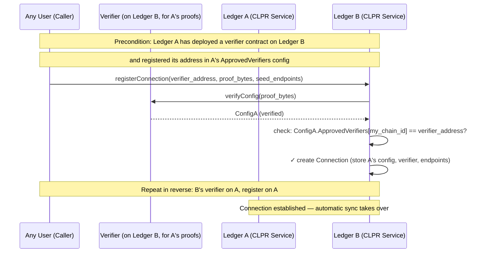
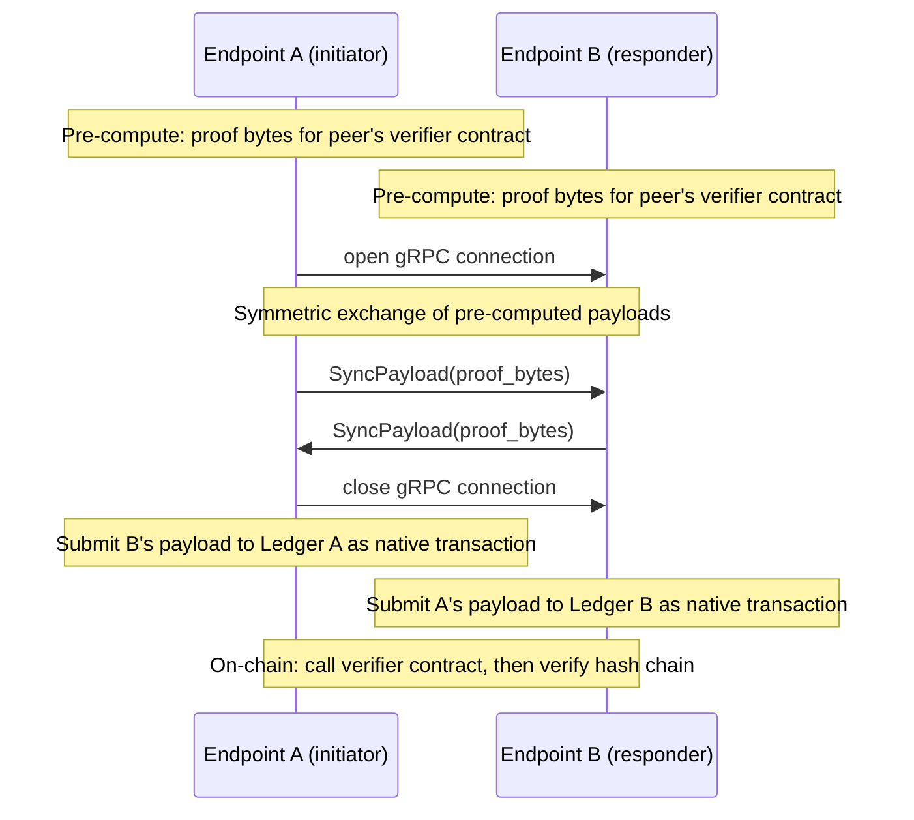
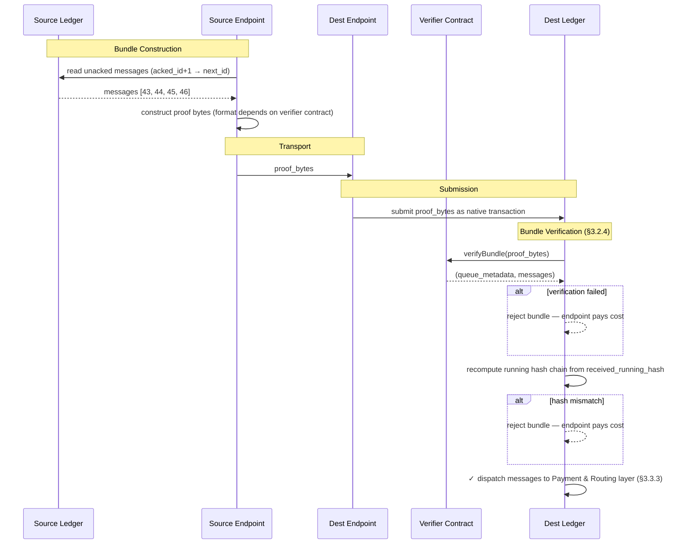
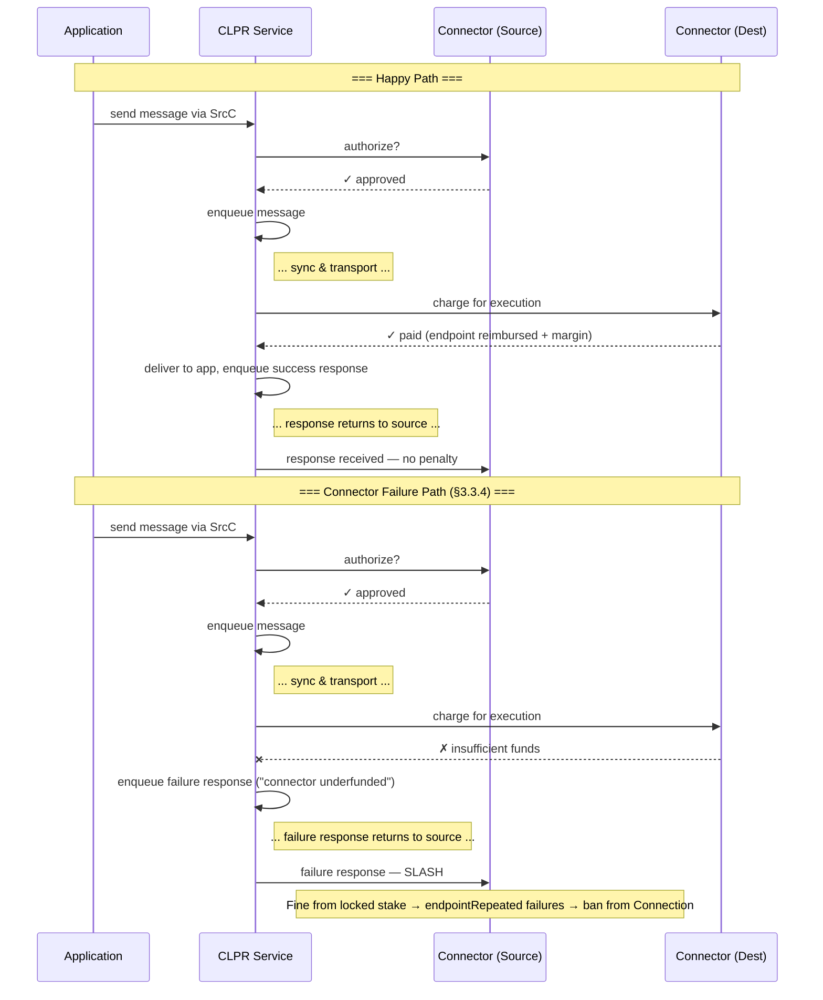

# 1. Executive Summary

CLPR (pronounced "Clipper") is a **Cross Ledger Protocol** that enables reliable, asynchronous message passing between
independent ledger networks. Unlike existing interledger solutions that weaken trust by introducing intermediary
consensus layers or federated bridges, CLPR relies on each ledger's native finality guarantees and verifiable state
proofs to achieve direct, ledger-to-ledger communication.

Messages are arbitrary byte payloads, making CLPR a general transport primitive suitable for cross-ledger smart contract
invocation, token movement, oracle data propagation, or application-specific messaging. When both participating ledgers
provide ABFT finality, CLPR inherits those guarantees and requires only a single honest endpoint node per ledger for
correct operation.

CLPR introduces no new token. All incentives and penalties are denominated in native ledger tokens and mediated through
**Connectors** — economic actors who front payment for message execution and are subject to slashing for misbehavior.

## Why CLPR

- **Preserves ABFT guarantees** — if both networks are ABFT, interledger communication inherits ABFT properties.
- **Eliminates intermediary trust** — ledgers rely on each other's verifiable state proofs rather than bridge
  validators.
- **Improves on existing solutions** — faster, cheaper, and/or more reliable than current interledger protocols.
- **Supports hybrid topologies** — enables communication between public and private Hiero networks and cross-ledger
  application orchestration.
- **Unlocks new business use cases** — positions Hedera competitively as the financial rails of tomorrow are being
  decided today.

## SMART Goal

> *"Interledger communication deployed from Ethereum to Hedera Mainnet, and at least 1K transactions processed between
Ethereum and Mainnet by end of 2026."*

---

# 2. Core Concepts and Terminology

CLPR connects one ledger to another without any intermediary nodes or networks. In a very real sense, *the ledgers are
communicating directly*. Users only have to trust the two ledgers they send messages between.

>💡 **A note on Hedera and Hiero:** Throughout this document, "Hiero" refers to the open-source ledger software stack
(the node software, its APIs, and its state model). "Hedera" refers to the specific public network that runs Hiero. When
describing behavior that applies to any network running Hiero (including private deployments), this document uses "
Hiero." When describing the public mainnet specifically, it uses "Hedera."

## 2.1 Common Terminology

- **Peer Ledger** — The "other" ledger this ledger is communicating with.
- **State Proof** — A cryptographic proof that a specific piece of data exists in a ledger's committed state and/or
  history. State proofs are the mechanism of trust — they allow one ledger to verify claims about another ledger's state
  without trusting any intermediary.
- **Endpoint** — A node responsible for periodically communicating with peer ledger endpoints to exchange configurations
  and messages.
- **Connection** — An on-ledger entity representing one side of a peer relationship between the local ledger and a
  specific remote ledger. Maintains the queue of outbound messages that have not yet been acknowledged by the peer
  ledger.
- **Connector** — An economic entity that provides access to a Connection. A Connector is a separate contract that holds
  balances of native tokens on each ledger, authorizes messages on the source ledger, and pays for message execution on
  the destination ledger. Multiple Connectors may serve the same Connection. Connectors are subject to slashing for
  provable misbehavior (see §3.3.4).
- **Message** — An arbitrary byte payload plus metadata representing a single unit of communication from one ledger to
  another.
- **Bundle** — An ordered batch of messages transmitted together between two ledgers, accompanied by a state proof.
- **Data Message** — A message carrying application-level content from one ledger to another. This is the primary unit
  of cross-ledger communication
- **Response Message** — A special message generated on the destination ledger and sent back to the source ledger,
  indicating success or a specific failure condition. Every Data Message produces exactly one Response Message in order.
- **Control Message** — A protocol-level message that manages the state of a Connection rather than carrying application
  data. Endpoint roster updates and configuration updates are delivered as Control Messages.
- **Source Ledger / Destination Ledger** — The originating and receiving ledgers for a given message, respectively.
- **Configuration** — The chain ID and other metadata describing a ledger participating in CLPR.
- **CLPR Service** — The core business logic and state implementing CLPR on a particular ledger.
- **HashSphere** — A private or permissioned network running Hiero software, typically deployed for enterprise or
  regulated use cases.

## 2.2 High-Level Message Flow

A good way to think about CLPR is by considering a simple message flow. In this flow, an application on the **source**
ledger will **initiate** a message transfer to a **destination** ledger. On the source ledger the application will call
the **CLPR Service** (which may be a native service on Hedera, or a smart contract on Ethereum or other ledgers). This
service maintains a queue of outgoing messages, and some information about which messages have been **acknowledged** as
having been received by the destination ledger.


Before adding a message to the end of the queue, the service will call a **connector** (chosen by the application) to
ask it whether it will be willing to facilitate payment on the destination ledger for this message. Connectors (noun)
represent economic actors. A connector has a presence on both the source and destination ledger. The connector on the
source is literally saying "I am willing to pay for this on the destination". If the connector is willing, then the
message is added to the queue.

Once in the queue, **endpoints** on either the source or destination ledger initiate a connection with a peer endpoint.
When they do, they exchange a **bundle** of messages that have *not yet* been confirmed as received by the other ledger.
Among these messages are **responses** to formerly sent messages, along with **state proofs** to prove everything they
communicate with each other. It is through these proofs that cryptographic trust is established.

The endpoint on the destination that receives this bundle constructs a transaction native to its ledger (e.g. a HAPI
`Transaction` on Hiero or a RLP-encoded transaction on Ethereum) and submits the bundle, metadata, and proofs to its
ledger. Post-consensus, the transaction is handled by the CLPR Service on the destination. For each message, it checks
to make sure the connector exists and is able to pay. If so, it sets a max-gas limit and calls the application on the
destination. When this call returns, the connection is debited to pay for the gas used along with a small tax to be paid
to the node that submitted the transaction. A **response** message is created and queued to send back to the source
ledger, and state is updated to indicate that the message has been acknowledged by the destination.

On a subsequent **sync** between the source and destination, messages are exchanged, and the source sees the response
message. It then delivers the response to the source application, and the entire message flow has completed.

Subsequent sections will dive into the details of how this is accomplished, including implementation notes for Hiero and
Ethereum networks, and security measures to prevent various attacks and misuses of CLPR.

---

# 3. Architecture

CLPR is organized into four distinct layers:

| **Layer**                   | **Responsibility**                                                                                                  | **Key Abstractions**                                                                 | **Capability**                                                                                                                  |
|-----------------------------|---------------------------------------------------------------------------------------------------------------------|--------------------------------------------------------------------------------------|---------------------------------------------------------------------------------------------------------------------------------|
| **Network Layer**           | Physical data transport between ledger endpoints; handshaking, trust updates, throttle negotiation                  | Connection, endpoint, verifier contracts, gRPC channels, encoding format             | Two ledgers can connect and exchange ledger configuration. Misbehaving nodes are punishable.                                    |
| **Messaging Layer**         | Ordered, reliable, state-proven message queuing and delivery between ledgers                                        | Message queues, bundles, running hashes, state proofs for messages                   | Two ledgers can pass messages between each other. Additional misbehavior detection unlocked.                                    |
| **Payment & Routing Layer** | Connector authorization and payment, message dispatch to applications, response generation, and penalty enforcement | Connector contracts, application interfaces, slashing mechanisms                     | Messages are validated against Connectors, Connectors reimburse nodes, and misbehaving Connectors are punishable.               |
| **Application Layer**       | User-facing distributed applications built on CLPR                                                                  | Cross-ledger smart contract calls, asset management, atomic swaps                    | Applications can send messages between each other across ledgers by specify the destination ledger, application, and connector. |

Network communication uses gRPC and protobuf. All messages and protocol types are encoded in protobuf. State proofs are
verified by **verifier contracts** — external smart contracts registered on each Connection that know how to verify
proofs from a specific source ledger. CLPR itself is proof-system-agnostic; all cryptographic verification is delegated
to verifier contracts (see §3.1.5).

> 💡**Encoding format under review.** Jasper is examining XDR as an alternative that may be more gas-efficient on
Ethereum than protobuf.

---

## 3.1 Network Layer

The network layer defines the CLPR Service and the state it maintains (§3.1.0), how ledgers identify themselves (
§3.1.1), how the endpoint roster is managed (§3.1.2), how connections are formed and maintained (§3.1.3), how endpoints
communicate (§3.1.4), how verifier contracts provide the underlying trust mechanism (§3.1.5), and network-level
misbehavior detection and reporting mechanisms that protect the protocol (§3.1.6). The network layer also defines the
three classes of messages that flow between ledgers — `Data` messages, `Response` messages, and `Control` messages.

### 3.1.0 The CLPR Service

The **CLPR Service** is the core on-ledger component that implements the CLPR protocol. It is the single source of truth
for all CLPR state on a given ledger, and it contains all protocol logic — message routing, payment processing, proof
verification, misbehavior enforcement, and fund custody. On Hiero networks it is a native service built into the node
software; on Ethereum it is a smart contract deployed on-chain.


**State owned by the CLPR Service:**

- **Local configuration** — The `ClprLedgerConfiguration` describing this ledger: its `ChainID`, approved verifier
  contracts, and throttle parameters. There is exactly one local configuration per CLPR Service instance.
- **Connections** — One `ClprConnection` per peer ledger. Each Connection holds the peer's `ChainID`, the peer's
  last-known configuration timestamp, the verifier contract used to verify inbound proofs from that peer, all message
  queue metadata, and the endpoint roster for that peer.
- **Locked funds** — Balances posted by endpoints (bonds held against misbehavior) and Connectors (funds held to pay for
  message execution on arrival). The CLPR Service is the custodian of these funds and the sole authority for releasing
  or slashing them.

**Logic owned by the CLPR Service:**

The CLPR Service contains all protocol logic across all layers. This includes delegating proof verification to verifier
contracts, processing and routing message bundles, dispatching messages to application contracts, charging Connectors,
reimbursing endpoint nodes, enforcing misbehavior penalties, and managing endpoint roster updates via Control Messages.
Connections hold state while the CLPR Service holds the logic that acts on that state.


> 💡 **Hiero:** The CLPR Service is a native Hedera service, co-located with the node software. State is stored in the
Merkle state tree alongside other Hiero state (accounts, tokens, etc.), making it directly provable via Hiero state
proofs.

> 💡 **Ethereum:** The CLPR Service is a smart contract. All state it maintains lives in contract storage and is
provable via Ethereum state proofs (`eth_getProof`). The contract is the authoritative registry for Connections,
endpoint rosters, Connectors, and all locked funds on the Ethereum side.

### 3.1.1 Ledger Identity and Configuration

Each ledger participating in CLPR maintains a **configuration** describing its identity and communication parameters.
The primary fields in the configuration are: `ChainID`, `ApprovedVerifiers`, `Timestamp`, and `Throttles`. The endpoint
roster is maintained separately and is not part of the configuration — see §3.1.2.

The *local configuration* describes *this* ledger. It is shared as the *remote configuration* with any peer ledger that
wants to connect.

**Authority.** The local configuration may only be updated by the admin of the CLPR Service — on Hiero this is a
privileged system operation, on Ethereum this is a call from the contract's designated admin account. The remote
configuration and its accompanying state proof, however, may be submitted to the CLPR Service by anyone. The state proof
guarantees authenticity regardless of who submits it.

---

**ChainID**

Every ledger is identified by its `ChainID`, which is
a [CAIP-2](https://github.com/ChainAgnostic/CAIPs/blob/main/CAIPs/caip-2.md) chain identifier string of the form
`namespace:reference`. This represents the ledger's public identity and is unique among all connections within a single
CLPR Service.

**Examples:**

| Network                      | ChainID                |
|------------------------------|------------------------|
| Hedera Mainnet               | `hedera:mainnet`       |
| Hedera Testnet               | `hedera:testnet`       |
| Ethereum Mainnet             | `eip155:1`             |
| Ethereum Sepolia             | `eip155:11155111`      |
| Private / HashSphere network | `hashsphere:acme-prod` |

For public networks, the namespace and reference SHOULD correspond to a registered CAIP-2 namespace. For private or
permissioned networks (e.g. HashSphere deployments), operators MAY self-assign a `ChainID` using an unregistered
namespace; uniqueness within the deployment is the operator's responsibility.

> ‼️ Anyone could maliciously construct a ledger configuration using any `ChainID` of their choosing. Either the CLPR
Service requires an admin to vet new connections, or users of CLPR must vet those connections to make sure they are
using the **correct** connection for their ledger of choice.

---

**ApprovedVerifiers**

The `ApprovedVerifiers` field is a map from `ChainID` to a verifier contract address on that chain. It declares: "if
you are on chain X and want to verify my proofs, use the verifier contract at this address." This field is part of the
ledger's provable state.

For example, Hedera's configuration might contain:

```
ApprovedVerifiers {
  "eip155:1":        "0xABC..."      // Ethereum mainnet: use this EVM contract to verify Hedera proofs
  "eip155:11155111": "0xDEF..."      // Ethereum Sepolia: use this EVM contract to verify Hedera proofs
  "hashsphere:example":  "0x123..."  // HashSphere: use this Hiero contract to verify Hedera Mainnet proofs
}
```

Each entry represents a verifier contract that the source ledger has deployed (or endorses) on the target chain. The
source ledger's admin is responsible for deploying these verifier contracts and registering their addresses in the
configuration. This gives each ledger full control over how its proofs are verified on other chains — without requiring
any administrative action on the receiving chain.

When a Connection is registered on a receiving ledger, the verifier contract proves its own legitimacy: the proof bytes
it verifies include the source ledger's configuration, and the CLPR Service checks that the configuration's
`ApprovedVerifiers` map endorses the verifier contract's address on the local chain. A rogue verifier contract deployed
by an unauthorized party cannot pass this check, because the source ledger's authentic state will not endorse it. See
§3.1.3 for the full bootstrap flow.

---

**Timestamp**

Each configuration carries a `timestamp` set to the consensus time of the transaction that last modified the
configuration. It is a monotonically increasing value used to determine which of two configurations is more recent. Any
configuration update advances the timestamp. Endpoint roster changes do not affect the configuration timestamp, as the
roster is managed separately.

---

**Throttles**

Each ledger specifies two throttle values in its configuration: `MaxMessagesPerSync` and `MaxSyncsPerSec`.

`MaxMessagesPerSync` is a hard capability limit. It reflects the maximum number of messages that can be included in a
single sync transaction without exceeding the receiving ledger's gas or execution budget. Sending endpoints MUST respect
this limit.

`MaxSyncsPerSec` is an advisory hint and not enforced by the protocol. It exists to help well-behaved sending endpoints
avoid wasteful duplication. The problem it addresses is redundancy: on Ethereum, for example, multiple source endpoints
receiving the same sync simultaneously may each independently construct and submit a transaction to the mempool,
potentially incurring gas costs even if duplicates are rejected. A sending ledger that respects `MaxSyncsPerSec` can
pace its endpoints to reduce this. Endpoints that persistently violate this hint are subject to shunning and eviction —
see §3.1.5.6.

### 3.1.2 Endpoint Roster

The endpoint roster is the set of endpoints a ledger exposes for CLPR communication with a specific peer. It is
maintained as separate ledger state, indexed by connection, and is not embedded in the configuration. This keeps
configuration updates lightweight — a ledger with thousands of endpoints does not need to re-transmit or re-prove the
entire roster whenever an unrelated configuration field changes.

An endpoint has:

- **Service Endpoint** — The IP address and port of the endpoint. Optional; may be omitted for private networks that
  only initiate outbound syncs.
- **Signing Certificate** — A DER-encoded RSA public certificate used for TLS and payload verification.
- **Account ID** — The on-ledger account associated with this endpoint node. A byte array whose length depends on the
  ledger (e.g. 20 bytes for Hiero and Ethereum, 32 bytes for Solana).

**Bootstrap.** When a connection is first established (§3.1.4), the initiating party SHOULD supply at least one endpoint
for the remote peer as part of the connection setup call. This single seed endpoint is the minimum needed for the local
ledger to know who to contact. Without it, the connection exists in state but cannot initiate any syncs.

**Ongoing updates.** After bootstrap, endpoint changes are propagated as Control Messages delivered over the established
connection:

- **EndpointJoin** — Announces a new endpoint joining the roster. Carries the endpoint's signing certificate, service
  endpoint, and account ID.
- **EndpointLeave** — Announces an endpoint's departure. Carries the departing endpoint's account ID. Sent by the
  protocol when an endpoint is removed due to confirmed misbehavior (§3.1.5.6) or by an authorized governance action on
  the ledger.

Each receiving ledger's CLPR Service is responsible for applying these updates to its local copy of the peer roster and
keeping it current.

**Recovery.** If the automatic sync channel breaks down — for example, because a ledger has completely rotated its
endpoint set and none of the new endpoints are known to the peer — any user may submit a recovery call directly to the
CLPR Service API. This call takes a fresh endpoint list (or a single new endpoint) and updates the peer roster for the
specified connection without requiring a live sync. This operation requires a state proof. Any user may submit a
recovery call — it is not a privileged operation.

**How local endpoints are established** varies by ledger type:

> 💡 **Hiero:** Every consensus node is automatically a CLPR endpoint. When CLPR is first enabled, the node software
reads the active roster and registers all nodes as local endpoints. From that point forward, any roster change — a node
joining, leaving, or upgrading — automatically updates the local endpoint set. No manual management is required.

> 💡 **Ethereum:** There are no local endpoints by default. Validators opt in as CLPR endpoints by calling a
registration method on the CLPR Service contract and posting a bond (ETH locked in escrow against misbehavior). They can
remove themselves by calling a deregistration method. There is no automatic synchronization with the Ethereum validator
set — endpoint participation is explicitly managed through contract calls.

### 3.1.3 Establishing and Updating Connections



A Connection is established when the CLPR Service admin submits a `registerConnection` call. The call specifies
the address of a **verifier contract** already deployed on the local ledger, opaque **proof bytes**, and at least one
**seed endpoint** for the peer.

The CLPR Service calls the verifier contract's `verifyConfig` method with the proof bytes. The verifier contract
performs whatever cryptographic verification is appropriate for the source ledger (ZK proof verification, TSS signature
checks, BLS aggregate signature validation, etc.) and returns a verified `ClprLedgerConfiguration`. If verification
succeeds, the Connection is created with the peer's configuration, and the verifier contract address is recorded on the
Connection for use in subsequent bundle verification and configuration updates.

**Why admin-gated.** Connection creation requires admin approval because the initial trust decision — "this verifier
contract correctly verifies proofs from ledger X" — cannot be verified by the protocol alone. A malicious actor could
deploy a fake verifier that returns fabricated configurations claiming to represent any ledger. Without an external
trust anchor, the protocol cannot distinguish a legitimate verifier from a fraudulent one. The admin (or governance
mechanism) provides that trust anchor by vetting the verifier contract before registering the Connection.

> 💡 **Future: trustless bootstrap via built-in ZK verification.** A future protocol extension could define a
built-in ZK verification path that enables permissionless connection creation. In this model, the CLPR Service would
include a hardcoded ZK verifier for a well-known proving scheme (e.g., Groth16). The source ledger would register its
approved verifier contract address in its `ApprovedVerifiers` configuration (see §3.1.1), and the bootstrap proof
would be a ZK proof that the source ledger's state contains the endorsement. The built-in verifier would verify the
proof, extract the configuration, and confirm the `ApprovedVerifiers` endorsement — all without admin involvement. This
would allow any ledger to connect to any other ledger by deploying a verifier contract and producing a valid ZK proof
of endorsement. This extension is out of scope for the initial protocol but is a natural evolution that preserves the
verifier contract architecture described here.

**Bootstrap.** The initiating party SHOULD include at least one seed endpoint for the remote peer as part of the
`registerConnection` call. This seed roster is stored immediately and enables the connection to begin syncing without
waiting for an `EndpointJoin` Control Message to arrive. The seed endpoints do not need to be exhaustive — additional
endpoints will be learned via Control Messages as the connection operates.

Configuration proofs include a monotonically increasing timestamp; newer proofs supersede older ones once verified. Only
one honest and reachable endpoint on each side is required for the Connection to function.

**Verifier contract updates.** The admin can update the verifier contract on an existing Connection at any time. This
allows verifier rotation (e.g., to upgrade ZK circuits or change verification strategies) without re-establishing the
Connection.

**Ongoing configuration updates.** Once a Connection is established with a trusted verifier, configuration updates are
permissionless. Any user can submit proof bytes through the Connection's existing verifier contract, and the CLPR
Service will call the verifier, extract the updated configuration, and apply it if the timestamp is newer. The verifier
contract ensures authenticity — admin approval is only needed for the initial trust decision (creating the Connection)
and for changing the verifier itself.

**Ongoing endpoint updates.** Endpoint roster changes are propagated automatically via Control Messages during the sync
protocol (§3.1.4). When endpoints synchronize, they exchange queue metadata and message bundles. Endpoint roster updates
flow as Control Messages within the sync. Under normal operation, no manual intervention is needed. The Connection stays
current as endpoints come and go on either side.

**Manual bootstrap and recovery** is necessary in two scenarios: when first establishing a Connection between two
ledgers that have never communicated, and when the automatic sync breaks down (for example, if one ledger completely
rotates its endpoint set and none of the new endpoints are known to the peer). In the first case, the admin creates the
Connection. In the second case, any user can submit proof bytes through the Connection's existing verifier contract to
update the peer's configuration and endpoint roster.

> 💡 **Hiero:** Connection creation is a privileged HAPI transaction submitted by network admins. Subsequent
configuration updates use a non-privileged HAPI transaction that includes opaque proof bytes. The CLPR Service calls
the Connection's verifier contract, which extracts and returns the verified Configuration.

> 💡 **Ethereum:** Connection creation is a privileged call on the CLPR Service contract from the designated admin
account. Subsequent configuration updates can be submitted by any Ethereum account — the CLPR Service contract calls
the Connection's verifier contract, which performs verification and returns the Configuration.

### 3.1.4 Endpoint Communication Protocol

Every CLPR endpoint runs a gRPC server that implements the CLPR Endpoint API. The core of this API is a **sync**
method — when one endpoint contacts a peer endpoint, they exchange whatever information needs to flow between the two
ledgers. The sync method is the single entry point for all interledger data exchange at the network layer.


A sync call is initiated by one endpoint selecting a peer endpoint from the Connection's peer roster and opening a gRPC
connection to it. **The sync is bidirectional within a single call** — both sides exchange their data simultaneously,
minimizing round trips. This works because each endpoint **pre-computes its entire outbound payload before the call
begins**. The endpoint packages its proof bytes (in whatever format the peer's verifier contract expects), reads any
unacked messages, and bundles everything together. The gRPC call is then a symmetric exchange of pre-computed
packages.

**Proof structure.** Each direction of the sync carries **opaque proof bytes** that will be passed to the Connection's
verifier contract on the receiving ledger. The verifier contract performs the expensive cryptographic verification and
returns the verified queue metadata and messages. What the proof bytes contain internally — state roots, Merkle paths,
ZK proofs, TSS signatures, BLS aggregate signatures — is entirely up to the verifier contract. CLPR does not interpret
or constrain the proof format.

The two sides exchange:

- **Proof bytes** — Opaque bytes that the receiving ledger's verifier contract knows how to interpret. Contains
  whatever the verifier needs to extract and verify the queue metadata and messages.
- **Queue metadata** — Current message IDs and running hashes (defined in §3.2.1), so each side knows what the other has
  sent and received. Extracted and verified by the verifier contract.
- **Message bundles** — Any pending messages that the peer has not yet acknowledged. Extracted and verified by the
  verifier contract.

**Configuration is not part of the sync payload.** Configuration changes (to `ApprovedVerifiers`, `Throttles`, etc.) are
infrequent administrative events, not transactional state that needs to be atomically ordered with messages. Nothing in
the configuration is order-dependent with respect to message delivery. If throttles change and the peer doesn't know
yet, it might send an oversized bundle that gets rejected — but there is no corruption or ordering violation, just
wasted work that self-corrects on the next sync. Configuration updates are propagated through the mechanism described in
§3.1.3: any user may submit proof bytes through the Connection's verifier contract to update the peer's configuration.
Endpoints may include a lightweight configuration timestamp in the sync handshake so the peer can detect staleness and
trigger an out-of-band configuration fetch, but the configuration data and its proof travel separately from the message
sync path.

The queue metadata exchange is the mechanism by which acknowledgements are communicated — the peer's reported
`received_message_id` becomes the sender's `acked_message_id`, enabling deletion of acknowledged response messages and
ordering verification for initiating messages (see §3.2.6 and §3.2.7).



**Private networks.** Not all ledgers need to expose their endpoints publicly. A ledger may choose to keep its endpoint
addresses private by omitting service endpoints from its Configuration. In this case, the private ledger's endpoints are
the only ones that can initiate sync calls — since the peer ledger does not know their addresses, it cannot reach them.
This is useful for enterprise or regulated networks (e.g., a HashSphere) that need to communicate with a public ledger
like Hedera or Ethereum without exposing any network infrastructure.

When a ledger is private, its endpoints are responsible for initiating communication with the peer ledger.

> 💡 **Hiero:** A gRPC server is built into the consensus node software. Every node runs the CLPR Endpoint API alongside
the existing HAPI gRPC services. Nodes periodically initiate sync calls to peer endpoints on a configurable frequency.

> 💡 **Ethereum:** The gRPC server runs as a sidecar process alongside the Besu client (or as a built-in module if CLPR
support is contributed to Besu). The sidecar reads from and writes to the CLPR Service contract via standard Ethereum
JSON-RPC, but communicates with peer endpoints over gRPC.

### 3.1.5 Verifier Contracts

Verifier contracts are the trust mechanism that underpins all of CLPR. Every piece of information exchanged between
ledgers — configurations, queue metadata, message bundles — is verified by a verifier contract that the receiving
ledger's admin has approved for the Connection. CLPR itself is **proof-system-agnostic** — all cryptographic
verification is delegated to verifier contracts, and the protocol never interprets proof bytes directly.

A verifier contract is a smart contract (on Ethereum or other EVM chains) or a system contract / native callback (on
Hiero) that implements two methods:

- **`verifyConfig(bytes) → ClprLedgerConfiguration`** — Accepts opaque proof bytes, performs whatever cryptographic
  verification is appropriate for the source ledger, and returns a verified configuration. Used during connection
  registration and configuration updates (§3.1.3).
- **`verifyBundle(bytes) → (ClprQueueMetadata, ClprMessagePayload[])`** — Accepts opaque proof bytes, performs
  verification, and returns verified queue metadata and messages. Used during bundle processing (§3.2.4).

What happens inside the verifier contract is entirely its own concern. A verifier for Hiero might check TSS signatures
and Merkle paths. A verifier for Ethereum might validate BLS aggregate signatures from the sync committee, or verify a
ZK proof that wraps the Ethereum consensus attestation. A verifier for a new chain might use an entirely novel proof
system. CLPR does not constrain or even inspect the proof format — it only requires that the verifier return structured,
verified data.

**Trust model.** CLPR trusts the verifier contract's output — if the verifier lies, the Connection is compromised. This
is why connection creation (which sets the verifier) is admin-gated. However, CLPR independently verifies properties it
can check without understanding the proof format: running hash chain integrity, message ID sequencing, and response
ordering. These checks catch data corruption or protocol violations even if the verifier is honest but the source
ledger has a bug.

**Adding new chains.** Adding CLPR support for a new ledger does not require changes to the CLPR protocol or to existing
implementations on other ledgers. It requires: (1) deploying a CLPR Service on the new ledger, (2) building a verifier
contract that can verify that ledger's proofs and deploying it on each target peer ledger, and (3) having the peer
ledger's admin register a Connection using that verifier. The source ledger's ecosystem is responsible for building and
maintaining its verifier contracts — including proof generation, trust anchor tracking (e.g., validator set rotation,
committee changes), and any internal state the verifier needs to maintain.

**Verifier contract examples.** The following are illustrative examples of verifier contracts that might be deployed for
different ledger pairs. Each is a separate implementation; CLPR treats them identically.

- **Hiero TSS Verifier** — For Hiero-to-Hiero connections (including HashSphere deployments). Verifies Merkle paths,
  block proofs, and TSS signatures from the source network's consensus nodes. Provides the lowest-latency verification
  path: sub-second message delivery with ABFT guarantees inherited from both networks.
- **Ethereum BLS Verifier** — For Ethereum-to-Hiero connections. Validates BLS aggregate signatures from Ethereum's
  sync committee. Internally manages validator set tracking (committee rotation every ~27 hours) and supports
  configurable commitment levels (`latest`, `safe`, `finalized`).
- **ZK Verifier** — A universal adapter for any source ledger. Verifies a zero-knowledge proof (Groth16, PLONK, STARK,
  etc.) that wraps the source ledger's native consensus attestation. The source ledger's ecosystem builds the prover;
  the verifier contract only needs to check the proof. This is the natural choice when the receiving ledger cannot
  natively verify the source ledger's consensus mechanism.

> 💡 **Note:** Chain-specific verifier specifications (e.g., how to construct a Hiero TSS verifier for Ethereum, or how
to build a ZK prover wrapping Ethereum sync committee consensus) are out of scope for this document. Each is a separate
specification maintained by the relevant chain's ecosystem or by the team implementing CLPR support for that chain.

---

### 3.1.6 Misbehavior Detection and Reporting

Every sync event is doubly attributable. The sync payload is signed by the **remote peer endpoint** that originated it,
and the transaction submitting it to the local ledger is signed by the **local endpoint** that received and forwarded
it. This two-signature property allows the receiving ledger to unambiguously attribute misbehavior to either a local or
remote endpoint, and to produce cryptographically self-proving evidence that the remote ledger can verify independently.

**Remote endpoint: duplicate broadcast** — ****If the same payload (identified by its remote endpoint signature) is
submitted by multiple distinct local endpoints within a single sync round, the remote peer endpoint must have sent that
payload to more than one local endpoint simultaneously. No honest local endpoint would fabricate a foreign signature, so
the evidence is conclusive.

**Remote endpoint: excess sync frequency** — If distinct payloads signed by the same remote endpoint arrive more
frequently than the receiving ledger's `MaxSyncsPerSec`, the remote endpoint is not respecting the advertised throttle.

**Local endpoint: duplicate submission** —If the same payload is submitted more than once by the same local endpoint,
that local endpoint is misbehaving. Deduplication before submission is a local obligation; no honest local endpoint
should submit the same payload twice.

| Observation                                             | Culprit              |
|---------------------------------------------------------|----------------------|
| Same payload, multiple local endpoints                  | Remote peer endpoint |
| Same remote endpoint signature, excess frequency        | Remote peer endpoint |
| Same payload, same local endpoint, submitted repeatedly | Local endpoint       |

When a remote endpoint is identified as the culprit, the local ledger MAY assemble the evidence into a
`MisbehaviorReport` and submit it as a transaction to the remote ledger.

```mermaid
MisbehaviorReport {
  offendingEndpoint:  PublicKey       // the remote endpoint being reported
  evidenceType:       EvidenceType    // DuplicateBroadcast | ExcessFrequency
  payloads:           SignedPayload[] // the signed payloads constituting the evidence
  reporterChainID:    ChainID         // the reporting ledger
}
```

The signed payloads are self-proving: the remote ledger can verify the offending endpoint's signature on each payload
without trusting the reporter. No honest remote endpoint can produce two validly-signed conflicting or duplicate
payloads, so a valid `MisbehaviorReport` is conclusive by itself.

Upon receiving and verifying a `MisbehaviorReport`, the remote ledger SHOULD:

1. Verify the authenticity of the report
2. Confirm the evidence meets the threshold for the reported `evidenceType`.
3. Slash and remove the offending endpoint from its active roster.
4. Issue an updated roster notifying affected peer ledgers that the endpoint has been removed.

The remote ledger is under no obligation to act on an unverifiable or malformed report, and reporters that submit
frivolous or fabricated reports MAY themselves be subject to penalties (such as the connection being terminated with the
remote ledger).

Misbehavior involving sync frequency MUST be measured in **sync rounds or blocks**, not wall-clock time. Block
timestamps are subject to bounded manipulation by validators and are unsuitable as the sole basis for a slashing
decision. A tolerance band SHOULD be applied when evaluating frequency violations near round boundaries.

If a local endpoint is identified as the culprit, the local ledger handles the matter
internally — slashing and removing the offending endpoint from its own roster. No `MisbehaviorReport` to the remote
ledger is warranted, since the fault is local.

---

## 3.2 Messaging Layer

The messaging layer provides ordered, reliable, state-proven message queuing and delivery between ledgers. It builds on
the network layer's ability to transport data and verify trust. This layer is concerned with message sequencing,
integrity, and transport. Connector payment, application dispatch, and failure handling are the responsibility of the
Payment and Routing layer (§3.3).

### 3.2.1 Message Queue Metadata

The network layer introduced the Connection as the on-ledger entity for a peer relationship. The messaging layer extends
the Connection with message queue metadata — the bookkeeping needed to send, receive, and acknowledge messages reliably.

Each Connection tracks the following queue state:

- **Next Message ID** (`next_message_id`) — The next sequence number to assign to an outgoing message. Strictly
  increasing.
- **Acknowledged Message ID** (`acked_message_id`) — The ID of the most recent outgoing message confirmed received by
  the peer. This value is updated when the peer reports its `received_message_id` during queue metadata exchange in the
  sync protocol (§3.1.4) — it is a transport-level acknowledgement, distinct from application-level responses. Response
  messages in the outbound queue can be deleted on ack; initiating messages must be retained until their corresponding
  response arrives (see §3.2.6).
- **Sent Running Hash** (`sent_running_hash`) — A cumulative hash over all enqueued outgoing messages. Used by the peer
  to verify message integrity and ordering.
- **Received Message ID** (`received_message_id`) — The ID of the most recent message received from the peer. This is
  what gets reported back to the peer so it knows what has been delivered.
- **Received Running Hash** (`received_running_hash`) — A cumulative hash over all received messages. Used to verify
  inbound bundles against state-proven values.

The gap between `next_message_id` and `acked_message_id` represents messages that are queued but not yet acknowledged —
the "in flight" window. The Connection should enforce a configurable maximum queue depth to prevent unbounded state
growth. If the queue is full (too many unacknowledged messages), new messages are rejected until the peer catches up.
This also provides natural backpressure when one ledger is faster than the other.

### 3.2.2 Message Storage

Each Connection conceptually maintains an ordered message queue for communication with its peer ledger. The queue
metadata on the Connection is described in §3.2.1 above. Message payloads, however, are stored separately from the
Connection (keyed by Ledger ID plus Message ID) because they are accessed by specific ID ranges during bundle
construction and are deleted after acknowledgement. The Connection itself only holds the metadata — counters and hashes.

The queue carries both initiating messages and response messages in a single intermixed stream. When the destination
ledger processes an incoming message and generates a response (whether a success result, an application error, or a
Connector failure), that response is enqueued in the same outbound queue as any new initiating messages the destination
ledger may be sending back. Both types share the same running hash chain, the same state proof mechanism, and the same
bundle transport — there is no separate response channel. The `ClprMessagePayload` proto distinguishes the two via a
`oneof`: a `ClprMessage` is an initiating message, and a `ClprMessageReply` is a response carrying the original
`message_id` for correlation.

Messages are enqueued with an ID and a running hash that chains each message to the previous one, forming a verifiable
log. This enables the receiving ledger to validate message integrity and ordering without trusting the relay.

Each queued entry contains:

- **Payload** — One of:
    - **Message** — An initiating message containing opaque byte data. The encoding and semantics are defined by
      higher-level protocol layers (middleware and application).
    - **Message Reply** — A reply to a previously received message, containing the original message ID and opaque reply
      bytes.
- **Running Hash After Processing** — The cumulative hash computed from the prior running hash and this message's
  payload. When this message is the last one in a bundle, this hash must match the state-proven value, enabling
  verification without requiring the entire queue history.

> 💡 **Hiero:** Queued messages are stored in the Merkle state as a separate key-value map. They are deleted after
acknowledgement.

> 💡 **Ethereum:** Queued messages are stored in the CLPR Service contract's storage. Gas costs for storage are a
significant design consideration — message payloads are deleted aggressively after acknowledgement.

### 3.2.3 Bundle Transport

Messages do not travel individually between ledgers — they travel in **bundles**. A bundle is an ordered batch of
message payloads accompanied by a state proof that attests to their authenticity and ordering.

When an endpoint takes its turn to synchronize with a peer (as part of the sync call described in §3.1.4), it checks
whether there are messages waiting to be delivered. It does this by comparing the Connection's `next_message_id` (the
total number of messages enqueued) against what the peer has acknowledged receiving. If there is a gap, those messages
need to go.

The endpoint reads the unacknowledged messages from the message store, packages them into a bundle, and constructs a
state proof over the last message in the batch. This state proof covers the running hash at that point — which means the
receiver can verify not just that these messages exist in the sender's state, but that they are in the correct order and
none have been tampered with or omitted.

On the receiving side, when an endpoint gets a bundle from a peer, it cannot just trust the data — it must submit it to
its own ledger as a native transaction. On Hiero this is a HAPI transaction; on Ethereum it is a call to the CLPR
Service contract. The actual processing happens post-consensus, not within the endpoint itself.

If the peer has also sent messages in the other direction, acknowledgments flow naturally as part of the same sync — the
`received_message_id` reported by each side tells the other how far along it is, and acknowledged messages can be
deleted.

### 3.2.4 Bundle Verification

When a bundle arrives on a ledger (post-consensus), the CLPR Service verifies it through two stages before handing
individual messages off to the Payment and Routing layer for processing.



First, the CLPR Service **calls the Connection's verifier contract** with the proof bytes (see §3.1.5). The verifier
contract performs whatever cryptographic verification is appropriate for the source ledger and returns the verified queue
metadata and messages. If the verifier contract rejects the proof (reverts, returns an error, or fails verification),
the entire bundle is rejected. A legitimate endpoint would never produce a bad proof, so this is also a signal that the
submitting endpoint may be misbehaving. The submitting node will have paid the transaction cost and will not be
reimbursed.

Next, the CLPR Service **verifies the running hash chain**. Starting from the Connection's current
`received_running_hash`, the service recomputes the hash by walking through each message payload returned by the
verifier sequentially. If the final computed hash does not match the verifier-returned value, the bundle is
rejected — something is wrong with the message ordering or content. This check is performed by the CLPR Service itself,
independently of the verifier contract, providing defense-in-depth against data corruption.

Once both verification stages pass, the service dispatches each message in order to the Payment and Routing layer for
Connector validation, charging, and application delivery (see §3.3.3).

### 3.2.5 Bundle Size and Throughput Limits

Since messages are delivered in bundles, and since ledgers typically impose a maximum gas or computation limit per block
or transaction, the maximum number of messages per bundle must be carefully configured.

For example, on a ledger with 30M max gas per block, the ledger may be configured to accept a maximum of 10 messages per
bundle with 2M gas maximum per message, preserving enough gas for the CLPR Service contract's own logic.

On Hiero networks, the configuration must be based on operations-per-second limits per message so that oversized bundles
are rejected at ingest rather than during post-consensus handling. Once a bundle starts execution, it must be able to
finish — a failure due to an ops/sec throttle post-consensus would be unacceptable.

These limits are configured per Connection. See §5 for the relevant configuration parameters.

### 3.2.6 Message Lifecycle and Redaction

The outbound queue contains both initiating messages and response messages, and their deletion rules differ. **Response
messages** can be deleted as soon as the peer acknowledges them (i.e., `acked_message_id` advances past them), because
responses do not themselves generate responses — once B confirms receipt, no further action is needed. **Initiating
messages** must be retained even after acknowledgement, because they serve as the ordering reference for verifying that
responses arrive in the correct sequence (see §3.2.7). An initiating message is only deleted when its corresponding
response has been received and matched. The running hash chain preserves integrity verification without the original
data in both cases.

Separately, CLPR supports **redaction** of message payloads that are still in the queue and have not yet been delivered.
This is intended for situations where illegal or inappropriate content has been placed into the queue — for example, on
a permissioned chain where an authority determines that a message must not be transmitted. In that case, the authorized
party can replace the message payload with its hash, preserving the running hash chain's integrity while removing the
offending content. The message slot remains in the queue (so sequence numbering is unaffected) but the payload is no
longer readable.

Redaction is a governance tool, not a storage optimization mechanism. It requires appropriate authority on the ledger
and should only be used in exceptional circumstances.

### 3.2.7 Response Ordering and Correlation

CLPR distinguishes between two kinds of confirmation. An **acknowledgement** (ack) is a transport-level signal: during
every sync, the peer reports how far it has progressed through the inbound queue via its `received_message_id`. This
tells the sender that the peer has received and processed those queue entries. For response messages in the outbound
queue, ack authorizes immediate deletion. For initiating messages, ack confirms delivery but the message must be
retained until its corresponding response arrives, because it serves as the ordering reference (see below). An ack says
nothing about the application-level outcome — only that the message was delivered.

A **response** is an application-level result. When the destination ledger processes an incoming message, it generates a
`ClprMessageReply` containing the outcome (success, application error, or Connector failure) and enqueues it in its own
outbound queue for eventual delivery back to the source. If the destination has a large backlog of outbound messages,
the response may not arrive for some time — but the source ledger already knows from the ack that the original message
was received.

Because the destination ledger processes each incoming message sequentially (§3.3.3), responses are generated in the
same order as the originating messages arrived. If Ledger A sends messages M1, M2, M3 to Ledger B, the responses R1, R2,
R3 are enqueued on Ledger B in that same order — regardless of whether each individual response indicates success or
failure. This ordering guarantee is fundamental to the protocol and is enforced by the running hash chain.

**Correlation.** Each `ClprMessageReply` carries the `message_id` of the originating message it responds to. The source
ledger can verify that the response sequence matches the send sequence: the first response received must correspond to
the oldest unresponded message, the second to the next, and so on. Any deviation is a protocol violation.

**Mixed bundles.** A bundle received from a peer may contain a mix of new initiating messages and responses to
previously sent messages. For example, Ledger A might receive a bundle from Ledger B containing
`[B_msg_1, R_for_A_msg_5, B_msg_2, R_for_A_msg_6]`. The `oneof` in `ClprMessagePayload` cleanly distinguishes the two
types. All are processed in order, but each type is handled differently: initiating messages are dispatched to the
Payment and Routing layer (§3.3.3), while responses are delivered back to the originating application and trigger
cleanup.

**Response cleanup and ordering verification.** Initiating messages in the outbound queue are retained after
acknowledgement because they serve as the ordered reference list for verifying responses. When responses arrive from the
peer, the source ledger walks its queue of unresponded initiating messages in order and matches each incoming response
to the next expected initiating message. If Rb1 matches Ma1 (the oldest unresponded initiating message), the order is
correct and Ma1 can be deleted. Then Rb2 is matched against Ma2, and so on. If a response arrives that does not match
the next expected initiating message, the peer ledger has violated the ordering guarantee.

Response messages in the outbound queue, by contrast, are deleted on ack — since responses do not generate responses,
once the peer confirms receipt there is nothing left to verify.

**Example.** Suppose A's outbound queue contains `[Ma1, Ma2, Ra3, Ma4]` and these are sent to B. B eventually acks
through Ma2. A cannot yet delete Ma1 or Ma2 — it needs them to verify response ordering. Ra3 and Ma4 are not yet acked.
Later, B sends Rb1 and Rb2. A matches Rb1 to Ma1 (correct order), deletes Ma1. Matches Rb2 to Ma2 (correct order),
deletes Ma2. In a subsequent sync, B acks through Ma4. A deletes Ra3 immediately (it is a response, no further action
needed) but retains Ma4 until Rb4 arrives.

**Protocol violation and halting.** The ordering guarantee is verified by the source ledger. If a peer ledger sends a
valid state proof but the responses within it are out of order (e.g., R3 arrives before R2), the source ledger's CLPR
Service halts acceptance of new outbound messages on that Connection. It does not slash — you cannot slash a peer
ledger, only individual endpoints. Instead, it waits for the peer ledger to send a subsequent bundle containing valid,
correctly ordered data. This could happen if the peer ledger had a bug that was subsequently fixed. Once valid data
resumes, the Connection unblocks and normal operation continues.

**Throughput implication.** Because messages are processed sequentially on the destination, a single slow-processing
message (e.g., one that triggers an expensive contract call) delays response generation for every message behind it in
the bundle. The `clpr.maxGasPerMessage` configuration parameter (§5) mitigates this by capping per-message computation,
but this sequential-processing constraint is an inherent throughput consideration for bundle sizing.

---

## 3.3 Payment & Routing Layer

The messaging layer can move arbitrary bytes between ledgers, but it says nothing about who pays for that movement or
how messages get routed to their final destination. That is the job of the Payment and Routing layer. This layer
introduces Connectors — the economic actors that authorize messages, pay for their execution, and bear the consequences
when things go wrong.



### 3.3.1 Connectors

A Connector is a separate entity (a smart contract) that sits outside the CLPR Service but interacts with it. To create
a Connector, a party must specify which Connections it operates on, provide an initial balance of native tokens (to pay
for message handling when receiving messages), and lock a stake that can be slashed for misbehavior. The Connector also
specifies an admin authority that can top up funds, adjust settings, or shut it down.

A Connector must exist on **both** ledgers in a Connection — one side authorizes and enqueues messages, the other side
pays for their execution on arrival. Multiple Connectors may serve the same Connection, and the same Connector operator
may run Connectors across multiple Connections.

### 3.3.2 Sending a Message

When an application wants to send a cross-ledger message, it does not interact with the Connection directly. Instead, it
calls the CLPR Service and specifies which Connector to use, the Ledger ID of the destination ledger, and the target
application. The CLPR Service then asks the Connector whether it authorizes this particular message.

This authorization step is where the Connector earns its keep. The Connector can inspect the message metadata — who is
sending it, what application it targets, how large it is — and decide whether to accept it. A simple pass-through
Connector might accept everything. A sophisticated one might enforce allow-lists, rate limits, or require the sender to
attach payment. The Connector's authorization logic is implemented as a smart contract with programmatic verification
rules. The application may also pass funds to the Connector as part of the call, paying for the Connector's services.

If the Connector approves, the message is enqueued in the Connection's outbound queue tagged with the Connector's
identity. The sender pays only the native transaction fee for the enqueue operation — there is no additional protocol
fee on the sending side. If the Connector rejects the message (or does not exist, or the caller cannot pay the
transaction fees), the whole thing reverts and the user pays only for the failed attempt.

By approving a message, the source Connector is making a commitment: it is asserting that its counterpart on the
destination ledger has sufficient funds to pay for the message's execution there, and that it itself has sufficient
funds to pay for handling the eventual response.

### 3.3.3 Receiving, Routing, and Paying

When a verified bundle's messages are dispatched by the messaging layer (see §3.2.4), each message is processed
sequentially by the Payment and Routing layer. For each message, the CLPR Service looks up the Connector identified in
the message metadata.

If the Connector exists and has sufficient funds, the Connector is charged for the cost of handling the message plus a
margin. This margin is the sole mechanism by which CLPR endpoint nodes are compensated — there is no payment to nodes on
the sending side. The endpoint that submitted the bundle on the destination ledger initially fronted the execution cost
out of pocket; the Connector's payment reimburses them and then some. This makes running an endpoint economically viable
on the receiving side.

After charging the Connector, the CLPR Service dispatches the message to the target application. The application
processes it and returns a result. Regardless of whether the application succeeds or fails, a response is generated and
enqueued in the outbound queue for return to the source ledger. Because messages are processed sequentially, responses
are always generated in the same order as the originating messages, which is critical for the source ledger's ordering
verification (see §3.2.7). The Connection's `received_message_id` and `received_running_hash` are updated after each
message.

If the Connector does not exist on the destination ledger, or exists but does not have enough funds, the message still
produces a deterministic outcome. A failure response is generated — "connector not found" or "connector underfunded" —
and queued for return. The endpoint that submitted the bundle absorbs the execution cost for this particular message,
but the slashing mechanism described in §3.3.4 ensures the endpoint is eventually made whole.

Critically, a failure on one message does not stop processing of the remaining messages in the bundle. Each message is
handled independently. This ensures that a single bad message (e.g., referencing a missing Connector) does not block an
entire batch of otherwise valid messages behind it.

### 3.3.4 Failure Consequences and Slashing

When a failure response makes it back to the source ledger, the source Connector is penalized. After all, it approved
the message and implicitly promised that the destination side would pay. If the destination side could not or did not
pay, that is the source Connector's fault — either it was not monitoring its counterpart's balance, or it was being
reckless.

Penalties escalate. A single failure results in a fine drawn from the Connector's locked stake, with the proceeds going
to the endpoint that was stuck with the unpaid execution cost. Repeated failures may result in the Connector being
banned from the Connection entirely — removed from service and its remaining stake redistributed.

This mechanism is what keeps the system honest without requiring nodes to have accounts on remote ledgers. Nodes never
need to trust Connectors — they submit every message regardless, knowing that if the Connector does not pay, the
Connector gets punished and the node gets compensated from the slash. The worst case for a node is a short-term float on
execution costs while the failure response makes the round trip.

### 3.3.5 Design Principles

Several principles underpin this design:

**No nodes need accounts on remote ledgers.** Nodes submit transactions on their own ledger and get reimbursed on their
own ledger. The Connectors handle the cross-ledger economics.

**Every accepted message produces a deterministic outcome.** Whether the Connector pays or does not, the message is
processed and a response is generated. There are no silent failures or messages that disappear into a void.

**No new token.** All incentives, penalties, and payments use the native tokens of each ledger. Connectors hold HBAR on
Hedera and ETH on Ethereum (or whatever the native token is on each side).

**Connectors internalize risk.** If a Connector is underfunded, mispriced, or poorly managed, the Connector bears the
cost — not the nodes, not the applications, not the protocol. The slashing mechanism ensures this.

**Receive-side economics only.** Endpoint nodes are compensated only when they submit bundles on the destination
ledger — there is no direct payment for the work of sending bundles (constructing state proofs, transmitting data,
initiating sync calls). This creates a potential free-rider problem: a node could refuse to send and only receive,
hoping other nodes will do the sending work. The mitigation is **peer preference** — destination-side endpoints should
prioritize syncing with source-side endpoints that actually deliver bundles to them. Nodes that contribute outbound work
will be more likely to be selected as sync partners, and therefore more likely to earn the receive-side reimbursement
when the other side sends back responses and messages. Nodes that never send will find fewer willing peers. This is an
acknowledged limitation: on a ledger that is predominantly sending and rarely receiving, the receive-side margin may be
insufficient to incentivize endpoint participation. Future protocol revisions may introduce a sending-side incentive
mechanism if this proves to be a practical problem.

### 3.3.6 Open Economic Design Issues

> ❓ **Queue monopolization.** A single Connector could authorize a large volume of messages to fill the queue,
preventing other Connectors from being able to send anything. One mitigation is to require each message to escrow funds
at send time, with those funds returned when the response arrives. This forces high-volume senders to commit capital
proportional to their queue usage. Since Ethereum does not support state rent, a simple "pay more rent for more queue
space" model is not viable — escrowed capital is the natural alternative.

> ❓ **Connection creation deposits.** How should Connection creation deposits work to protect nodes from non-functional
Connectors? (See also §6.2.)

> ❓ **Application-Connector agreements.** How do applications formalize agreements with Connectors? What interfaces and
registration mechanisms are needed? (See also §6.2.)

---

## 3.4 Application Layer

> 💡 **Note:** This section is a placeholder. The interaction patterns below are outlined at a high level. Detailed
application-layer specifications will be developed as specific use cases (e.g., HashDEX cross-ledger settlement, HTS
asset bridging) are designed.

CLPR supports multiple interaction patterns at the application layer, built on top of the general messaging primitive.

### 3.4.1 Remote Smart Contract Call

A contract on Ledger A calls a proxy contract, which creates a state change. An endpoint picks up the change, submits it
to Ledger B's proxy, which invokes the target contract. The result is proxied back asynchronously. Applications must be
cross-chain aware and support asynchronous callback APIs.

### 3.4.2 Escrow, Mint, then Burn

Assets are escrowed on the source ledger, then minted on the destination. If minting succeeds, source assets may be
burned. If it fails, source assets revert. Requires atomic semantics and a common asset standard.

### 3.4.3 N-Ledger Atomic Swap (2PC)

Multiple ledgers make state changes tied together via two-phase commit. All ledgers enter a commit-ready-or-rollback
state. If any ledger fails, all roll back. All participating chains must be aware of each other's 2PC protocol and must
be able to validate each other's protocol messages.

### 3.4.4 Native Hiero Asset Management

CLPR-native handling of HTS tokens (fungible and non-fungible) across Hiero networks, using the messaging layer directly
rather than smart contract proxies.

---

# 4. Protobuf Reference

All protobuf definitions for CLPR are consolidated here for reference. These types are defined in
`hapi/hedera-protobuf-java-api/src/main/proto/interledger/*`.

## 4.1 Ledger Identity

```protobuf
// The static configuration for a ledger. Does not include the endpoint roster,
// which is managed separately via control messages (see §3.1.2).
message ClprLedgerConfiguration {
  string chain_id = 1;                                // CAIP-2 identifier, e.g. "hedera:mainnet"
  map<string, bytes> approved_verifiers = 2;           // ChainID → verifier contract address on that chain
  proto.Timestamp timestamp = 3;
  ClprThrottles throttles = 4;
}

message ClprThrottles {
  uint32 max_messages_per_sync = 1;  // hard cap: max messages in a single bundle
  uint32 max_syncs_per_sec = 2;      // advisory: suggested max sync frequency
}

// Endpoint roster entry. Maintained in state separately from the configuration,
// propagated via EndpointJoin / EndpointLeave control messages.
message ClprEndpoint {
  proto.ServiceEndpoint service_endpoint = 1;  // optional; omit for private networks
  bytes signing_certificate = 2;               // DER-encoded RSA public certificate
  bytes account_id = 3;                        // on-ledger account (20 or 32 bytes)
}

// Control message payload variants.
message ClprControlMessage {
  oneof payload {
    ClprEndpointJoin endpoint_join = 1;
    ClprEndpointLeave endpoint_leave = 2;
    ClprConfigUpdate config_update = 3;
  }
}

message ClprEndpointJoin {
  ClprEndpoint endpoint = 1;
}

message ClprEndpointLeave {
  bytes account_id = 1;  // identifies the departing endpoint
}

message ClprConfigUpdate {
  ClprLedgerConfiguration configuration = 1;
}

message ClprLocalLedgerMetadata {
  string chain_id = 1;       // CAIP-2 identifier for the local ledger
  bytes roster_hash = 2;
  int32 next_ledger_short_id = 3;
}
```

## 4.2 gRPC Service

```protobuf
service ClprService {
  // Admin: set this ledger's local configuration (ChainID, ApprovedVerifiers, Throttles).
  rpc setLedgerConfiguration(proto.Transaction) returns (proto.TransactionResponse);

  // Query: download this ledger's configuration.
  rpc getLedgerConfiguration(proto.Query) returns (proto.Response);

  // Admin: register a new Connection with a verifier contract.
  // The verifier contract is called with the proof bytes to extract and verify
  // the peer's configuration. See §3.1.3.
  rpc registerConnection(proto.Transaction) returns (proto.TransactionResponse);

  // Admin: update the verifier contract on an existing Connection.
  rpc updateConnectionVerifier(proto.Transaction) returns (proto.TransactionResponse);

  // Permissionless: submit proof bytes through an existing Connection's verifier
  // to update the peer's configuration.
  rpc updatePeerConfiguration(proto.Transaction) returns (proto.TransactionResponse);
}

// Included in registerConnection transactions.
message ClprRegisterConnectionRequest {
  bytes verifier_contract = 1;                  // address of the verifier contract on this ledger
  bytes proof_bytes = 2;                        // opaque proof bytes passed to verifier_contract.verifyConfig()
  repeated ClprEndpoint seed_endpoints = 3;     // initial peer endpoints (at least one)
}

// Included in updateConnectionVerifier transactions.
message ClprUpdateConnectionVerifierRequest {
  string chain_id = 1;                          // identifies the Connection to update
  bytes verifier_contract = 2;                  // new verifier contract address
}

// Included in updatePeerConfiguration transactions.
message ClprUpdatePeerConfigurationRequest {
  string chain_id = 1;                          // identifies the Connection to update
  bytes proof_bytes = 2;                        // opaque proof bytes passed to verifier_contract.verifyConfig()
}
```

## 4.3 Connection

```protobuf
message ClprConnection {
  // --- Peer Ledger Identity ---

  string chain_id = 1;                     // CAIP-2 identifier for the peer ledger
  proto.Timestamp peer_config_timestamp = 2;

  // --- Verifier Contract (see §3.1.5) ---

  bytes verifier_contract = 3;             // address of the verifier contract for this Connection

  // Note: the peer endpoint roster is stored separately in state, keyed by
  // (chain_id, account_id). It is NOT embedded in the Connection object.
  // Endpoints are seeded at connection registration and updated via
  // ClprEndpointJoin / ClprEndpointLeave control messages (see §3.1.1).

  // --- Message Queue Metadata (see §3.2.1) ---

  uint64 received_message_id = 10;
  uint64 acked_message_id = 11;
  bytes received_running_hash = 12;
  bytes sent_running_hash = 13;
  uint64 next_message_id = 14;
}
```

## 4.4 Message Queue

```protobuf
message ClprMessageKey {
  string chain_id = 1;   // CAIP-2 identifier for the peer ledger
  uint64 message_id = 2;
}

message ClprMessageValue {
  ClprMessagePayload payload = 1;
  bytes running_hash_after_processing = 3;
}

// All three message classes share the same queue, running hash chain,
// and bundle transport. The oneof distinguishes them at processing time.
message ClprMessagePayload {
  oneof payload {
    ClprMessage message = 1;              // Data Message — application content
    ClprMessageReply message_reply = 2;   // Response Message — outcome of a Data Message
    ClprControlMessage control = 3;       // Control Message — protocol management
  }
}

message ClprMessage {
  bytes message_data = 1;
}

message ClprMessageReply {
  uint64 message_id = 2;
  bytes message_reply_data = 1;
}

// SyncPayload is the complete package exchanged in one direction of a sync.
// The proof_bytes field is opaque to the protocol — it is passed directly to
// the Connection's verifier contract, which returns verified queue metadata
// and messages. See §3.1.5.
message ClprSyncPayload {
  string chain_id = 1;                  // CAIP-2 identifier for the source ledger
  bytes proof_bytes = 2;               // opaque proof bytes for the verifier contract
}
message ClprQueueMetadata {
  uint64 next_message_id = 1;
  uint64 acked_message_id = 2;
  bytes sent_running_hash = 3;
  uint64 received_message_id = 4;
  bytes received_running_hash = 5;
}
```

---

# 5. Configuration and Observability

The following table lists the configuration parameters referenced throughout this document. Parameters marked as
per-Connection are set independently for each peer relationship.

| **Config Key**                   | **Default** | **Scope**      | **Description**                                                                                                                                                                                                                              |
|----------------------------------|-------------|----------------|----------------------------------------------------------------------------------------------------------------------------------------------------------------------------------------------------------------------------------------------|
| `clpr.clprEnabled`               | `false`     | Global         | Master enable switch for the CLPR Service.                                                                                                                                                                                                   |
| `clpr.connectionFrequency`       | `5000` ms   | Global         | How frequently endpoints initiate sync calls to peers.                                                                                                                                                                                       |
| `clpr.publicizeNetworkAddresses` | `true`      | Global         | Whether to include service endpoint addresses in the Configuration. Set to `false` for private networks.                                                                                                                                     |
| `clpr.devModeEnabled`            | `false`     | Global         | Enable dev-mode shortcuts for signatures and proofs. May be set to `true` for local development and testing only.                                                                                                                            |
| `clpr.maxQueueDepth`             | TBD         | Per-Connection | Maximum number of unacknowledged messages allowed in the outbound queue before new messages are rejected (see §3.2.1).                                                                                                                       |
| `clpr.maxMessagesPerBundle`      | TBD         | Per-Connection | Maximum number of messages a single bundle may contain (see §3.2.5).                                                                                                                                                                         |
| `clpr.maxGasPerMessage`          | TBD         | Per-Connection | Maximum gas (or ops/sec budget on Hiero) allocated to processing a single message within a bundle (see §3.2.5).                                                                                                                              |

---

# 6. Known Risks and Open Questions

## 6.1 Risks

- **Time to market.** Some HashSphere customers are already turning to existing solutions (LayerZero, Wormhole, etc.).
- **Testing complexity.** Requires multiple concurrent networks in the same test environment; new test drivers and
  frameworks are needed.
- **Performance and throughput.** Maximum theoretical transmission rate is unknown; CLPR introduces a new transaction
  gateway that interplays with existing throttles.
- **Malicious node hardening.** Replay attacks, wasted computation, and false data submission all need mitigation.
- **Multi-team coordination.** Development requires contributions from Execution, Smart Contracts, Block Node, Mirror
  Node, SDK, Release Engineering, Performance, Security, Docs, DevRel, and Product.

## 6.2 Open Questions

1. Do messages across different Connectors between the same ledger pair need global ordering, or only within-Connector
   ordering?
2. What processes the reply of messages, and do we need to retain the initial message to support reply processing?
3. How should Connection creation deposits work to protect nodes from non-functional Connectors?
4. How do applications formalize agreements with Connectors?
5. What is the format for application-level error propagation (e.g., releasing locked assets on cross-ledger transfer
   failure)?
6. Should endpoint reputation or scoring be added to help nodes preferentially select reliable peers?
7. How should protocol overhead costs (configuration updates, queue metadata sync, bundle transmission) be funded — can
   they be made "free" from the user's perspective?
8. Should CLPR message enqueueing use child transaction dispatch or direct Java API invocation?