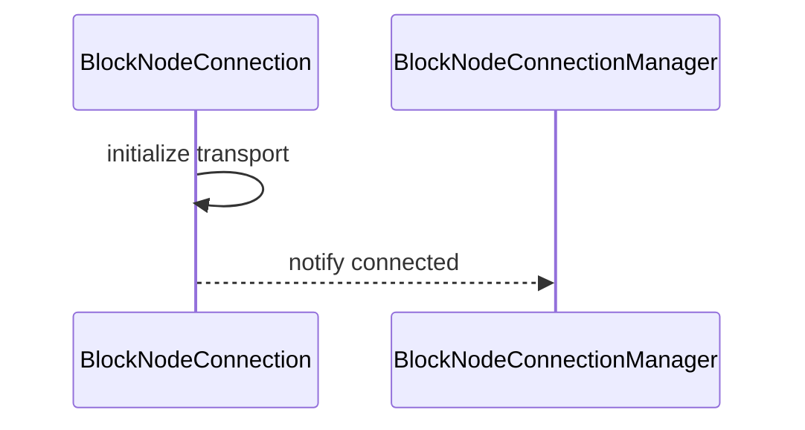
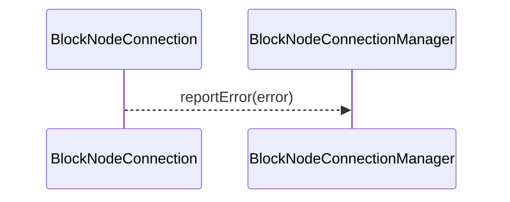

# BlockNodeConnection.md

## Table of Contents

1. [Abstract](#abstract)
2. [Definitions](#definitions)
3. [Component Responsibilities](#component-responsibilities)
4. [Details](#details)
5. [Component Interaction](#component-interaction)
6. [State Management](#state-management)
7. [Sequence Diagrams](#sequence-diagrams)
8. [Error Handling](#error-handling)

## Abstract

`BlockNodeConnection` represents a single connection between two block nodes.
It manages connection state, handles communication, and reports errors to the `BlockNodeConnectionManager`.

## Definitions

<dl>
<dt>BlockNodeConnection</dt>
<dd>A connection instance managing communication and state with a block node.</dd>

<dt>ConnectionState</dt>
<dd>Represents current connection status: UNINITIALIZED, PENDING, ACTIVE.</dd>
</dl>

## Component Responsibilities

- Establish and maintain the connection transport.
- Handle incoming and outgoing message flow.
- Report connection errors promptly.
- Coordinate with `BlockNodeConnectionManager` on lifecycle events.
- Synchronize streaming state with `BlockStreamStateManager`.

## Details
| Variables and Methods                           | Description                                                                                              |
|-------------------------------------------------|----------------------------------------------------------------------------------------------------------|
| `connectionDescriptor`                          | A string identifier for the connection.                                                                  |
| `streamCompletionInProgress`                    | Atomic flag to avoid double-completing or re-processing stream completion events.                        |
| `blockNodeConnectionManager`                    | Reference to the connection manager coordinating this connection.                                        |
| `blockStreamMetrics`                            | Metrics collector for counting messages, errors, and events from this stream.                            |
| `updateConnectionState(ConnectionState state)`  | Internal method to update connection lifecycle state safely.                                             |
| `handleAcknowledgement()`                       | Processes acknowledgement messages to update streaming progress.                                         |
| `handleEndOfStream()`                           | Handles end-of-stream events, triggering retries or connection closure based on status.                  |
| `handleSkipBlock()`                             | Manages skip block events, updating streaming position accordingly.                                      |
| `handleResendBlock()`                           | Manages resend block events, potentially restarting stream from a specific block.                        |
| `sendRequest(PublishStreamRequest request)`     | Sends a request over the stream if the connection is active and observer is set.                         |
| `close()`                                       | Idempotently closes the connection, completes the stream, resets state, and notifies the manager.        |
| `isActive()`                                    | Returns `true` if connection state is `ACTIVE`, otherwise `false`.                                       |
| `getNodeConfig()`                               | Returns the `BlockNodeConfig` associated with this connection.                                           |
| `restartStreamAtBlock(long blockNumber)`        | Requests a new stream to start from the specified block number, scheduling a retry with delay.           |
| `jumpToBlock(long blockNumber)`                 | Interrupts current worker to jump to a specific block without ending the stream (stream remains active). |
| `onNext(PublishStreamResponse response)`        | Handles incoming stream messages, including acknowledgements, EndOfStream, SkipBlock, and ResendBlock.   |
| `onError(Throwable error)`                      | Logs errors from the stream, increments error metrics, and triggers stream failure handling.             |
| `onCompleted()`                                 | Handles stream completion; distinguishes between expected and unexpected completion events.              |
| `getConnectionState()`                          | Returns the current connection state (UNINITIALIZED, PENDING, ACTIVE).                                   |

## Component Interaction

- Communicates bi-directionally with `BlockNodeConnectionManager`.
- Updates stream status via `BlockStreamStateManager`.

## State Management

- Tracks connection lifecycle state.
- Handles status transitions.

## Sequence Diagrams

### Connection Initialization

## Error Handling
- Detects and reports connection errors.
- Cleans up resources on disconnection.

