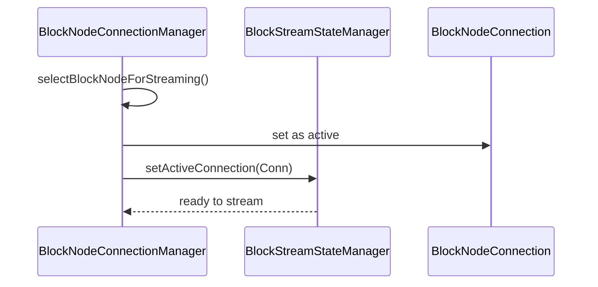
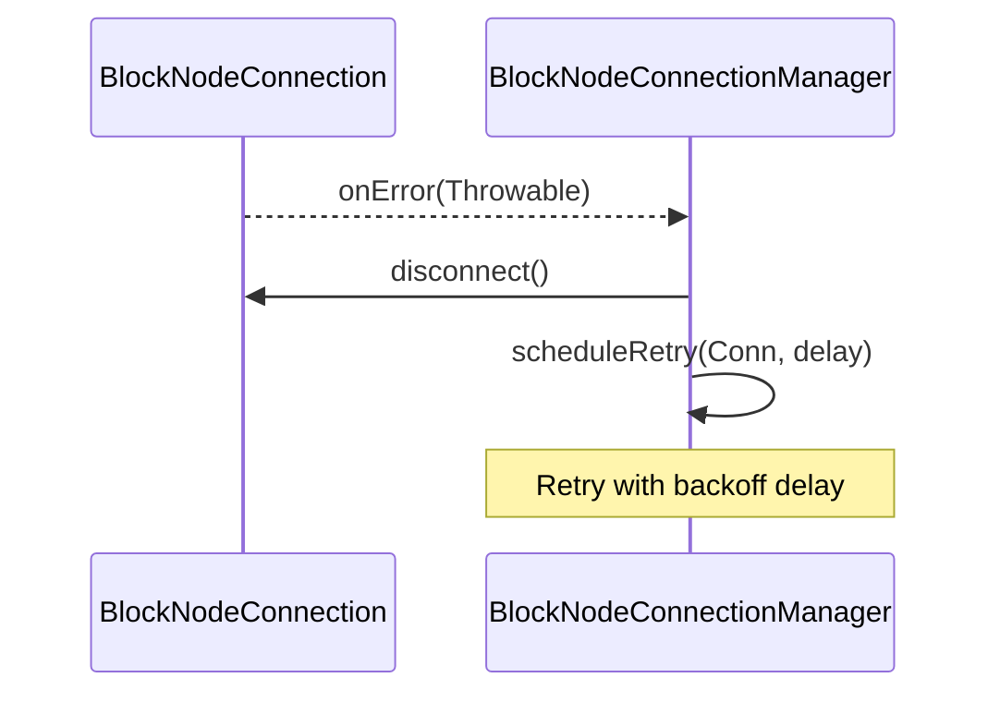
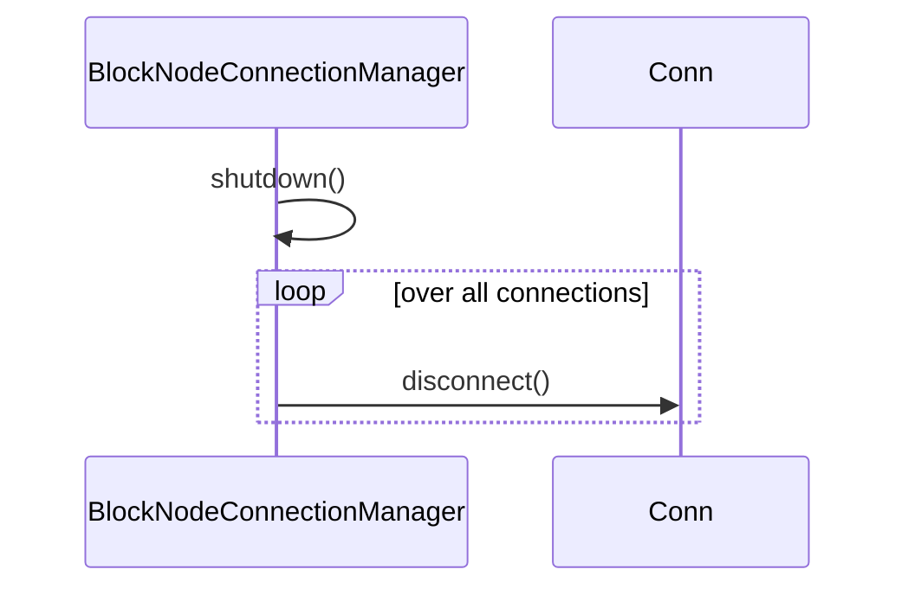

# Internal Design Document for BlockNodeConnectionManager

## Table of Contents

1. [Abstract](#abstract)
2. [Definitions](#definitions)
3. [Component Responsibilities](#component-responsibilities)
4. [Details](#details)
5. [Component Interaction](#component-interaction)
6. [Sequence Diagrams](#sequence-diagrams)
7. [Error Handling](#error-handling)

## Abstract

This document describes the internal design and responsibilities of the `BlockNodeConnectionManager` class.
This component manages active connections, handling connection lifecycle, and coordinating
with individual `BlockNodeConnection` instances. There should be only one active connection at a time. The class also interacts with the `BlockStreamStateManager` to synchronize stream state.

## Definitions

<dl>
<dt>BlockNodeConnectionManager</dt>
<dd>The class responsible for managing and tracking all active block node connections, including creation, teardown, and error recovery.</dd>

<dt>BlockNodeConnection</dt>
<dd>A representation of a single connection to block node, managed by the connection manager.</dd>

<dt>BlockStreamStateManager</dt>
<dd>The component responsible for maintaining the state of block streams received or sent over connections.</dd>

<dt>Connection Lifecycle</dt>
<dd>The phases a connection undergoes.</dd>
</dl>

## Component Responsibilities

- Maintain a registry of active `BlockNodeConnection` instances.
- Track the latest verified block for each connection.
- Select the most appropriate `BlockNodeConnection` for streaming blocks (selectBlockNodeForStreaming).
- Retry failed connections with exponential backoff (handleConnectionError, scheduleRetry).
- Remove or replace failed connections.
- Coordinate with `BlockStreamStateManager` to synchronize active connections and streaming progress.
- Support lifecycle control (shutdown, waitForConnection, openBlock).

## Details
| Variables and Methods                              | Description                                                                |
|----------------------------------------------------|----------------------------------------------------------------------------|
| `connections`                                      | A map of all active `BlockNodeConnection` instances.                       |
| `handleConnectionError(connection, delay)`         | Handles errors on a specific connection and schedules a retry after delay. |
| `scheduleRetry(connection, initialDelay)`          | Schedules the reconnection attempt for a failed connection.                |
| `shutdown()`                                       | Shuts down the manager, disconnecting all active connections.              |
| `waitForConnection(timeout)`                       | Blocks until a valid connection becomes available or timeout elapses.      |
| `openBlock(blockNumber)`                           | Signals connections to start streaming from a specific block.              |
| `updateLastVerifiedBlock(config, blockNumber)`     | Updates the last verified block for a specific block node config.          |
| `getLastVerifiedBlock(config)`                     | Returns the last verified block number for the specified config.           |
| `selectBlockNodeForStreaming()`                    | Chooses the best available connection to use for streaming.                |
| `getNextPriorityBlockNode()`                       | Picks the next best connection when multiple are available.                |

## Component Interaction
- Maintains a bidirectional association with each `BlockNodeConnection`.
- Delegates block-related streaming control to the `BlockStreamStateManager`.
- Updates connection state and retry schedule based on feedback from connections.

## Sequence Diagrams

### Connection Establishment

### Connection Error and Retry

### Shutdown Lifecycle

## Error Handling
- Implements backoff-based retry scheduling when connections fail.
- Detects and cleans up errored or stalled connections.
- If `getLastVerifiedBlock()` or other state is unavailable, logs warnings and may skip the connection.
- Ensures that only one active connection is driving the stream via coordination with `BlockStreamStateManager`.