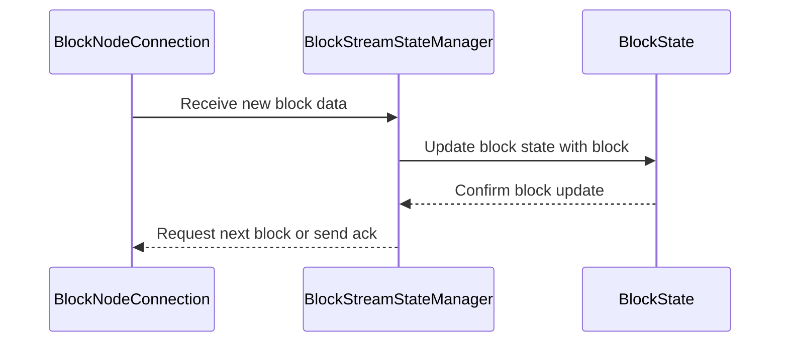
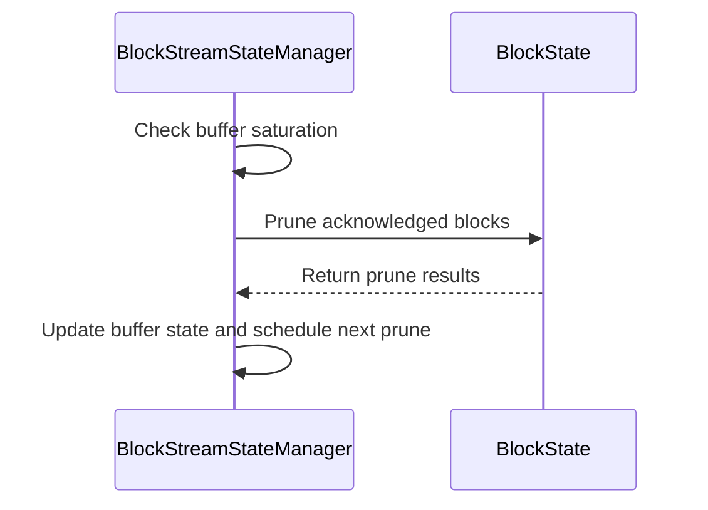
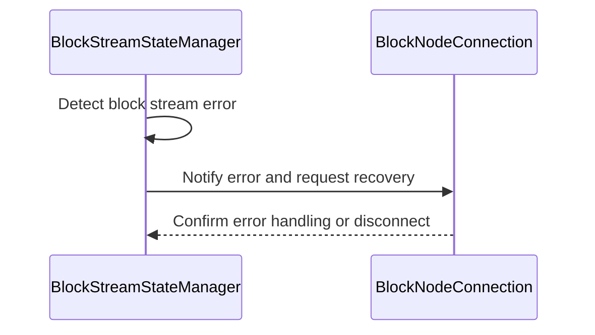

# BlockStreamStateManager.md

## Table of Contents

1. [Abstract](#abstract)
2. [Definitions](#definitions)
3. [Component Responsibilities](#component-responsibilities)
4. [Details](#details)
5. [State Management and Flow](#state-management-and-flow)
6. [Interaction with Other Components](#interaction-with-other-components)
7. [Sequence Diagrams](#sequence-diagrams)
8. [Error Handling](#error-handling)

## Abstract

`BlockStreamStateManager` manages the state and progress of block streaming operations  
within the Block Node system. It coordinates streaming sessions,  
and ensures consistent delivery and recovery during block synchronization.

## Definitions

<dl>
<dt>BlockStreamStateManager</dt>
<dd>Component responsible for maintaining the streaming state and coordinating streaming flows.</dd>

<dt>Streaming Session</dt>
<dd>An active stream of block data being transferred between Consensus Node and a Block Node.</dd>
</dl>

## Component Responsibilities

- Track progress of block streams, including current block number.
- Manage streaming session lifecycle.
- Coordinate retries and recovery on streaming errors.
- Provide interfaces to query streaming status and progress.
- Work with `BlockNodeConnection` and `BlockState` to ensure consistent state across streams.
- Manage the pruning of blocks from the buffer that have been acknowledged and have exceeded the configured TTL.
- Monitor buffer saturation and activate backpressure mechanisms to regulate incoming block streams.

## Details

| Variables and Methods                          | Description                                                                                             |
|------------------------------------------------|---------------------------------------------------------------------------------------------------------|
| `highestAckedBlockNumber`                      | AtomicLong tracking the highest block number acknowledged so far.                                       |
| `blockNumber`                                  | Current block number tracked by the stream manager.                                                     |
| `blockStreamMetrics`                           | Metrics collector for monitoring buffer saturation, acknowledged blocks, and timing info.               |
| `backpressureCompletableFutureRef`             | Atomic reference to a CompletableFuture controlling backpressure blocking state.                        |
| `blockBuffer`                                  | Buffer (e.g., list or queue) holding `BlockState` objects representing blocks in the stream buffer.     |
| `blockStatesById`                              | Map of block numbers to `BlockState` for quick access and updates.                                      |
| `blockBufferTtl()`                             | Configured duration (TTL) that blocks remain in the buffer after acknowledgment before pruning.         |
| `blockPeriod()`                                | Duration representing the expected period between blocks.                                               |
| `blockBufferPruneInterval()`                   | Configured interval for periodic pruning of the block buffer.                                           |
| `isBufferSaturated`                            | AtomicBoolean tracking whether the buffer is currently saturated, triggering backpressure.              |
| `ensureNewBlocksPermitted()`                   | Static method blocking thread if buffer is saturated, waiting until space frees up.                     |
| `setLatestAcknowledgedBlock(long blockNumber)` | Updates highest acknowledged block number and records it in metrics.                                    |
| `getBlockNumber()`                             | Returns the current block number or -1 if none opened.                                                  |
| `pruneBuffer()`                                | Removes acknowledged blocks older than TTL from the buffer; returns stats about pruning results.        |
| `PruneResult`                                  | Record holding stats from pruning: ideal buffer size, checked blocks, pending acknowledgements, pruned. |
| `checkBuffer()`                                | Checks buffer saturation before/after pruning, updates saturation state, enables/disables backpressure. |
| `scheduleNextPruning()`                        | Schedules the next periodic prune task according to configured interval.                                |
| `BufferPruneTask`                              | Runnable task invoked periodically to prune buffer and check saturation state.                          |
| `getActiveConnection()`                        | Returns the current active `BlockNodeConnection`.                                                       |
| `setActiveConnection(BlockNodeConnection)`     | Sets the active block node connection.                                                                  |
| `getConnections()`                             | Returns the map of all `BlockNodeConnection`s being managed.                                            |
| `higherPriorityStarted(BlockNodeConnection)`   | Finds and switches to a higher priority pending connection if available, closing the current one.       |
| `blockNodeName(BlockNodeConfig node)`          | Utility method to return a string describing the node by address and port.                              |
| `getBlockStreamQueue()`                        | Returns the queue holding block stream items for processing.                                            |
| `getLowestUnackedBlockNumber()`                | Returns the lowest unacknowledged block number (highest ack + 1) or 0 if none acknowledged.             |

## State Management and Flow

- Maintains a mapping of active streams to their current block offset.
- Updates stream progress on receipt of new blocks or acknowledgments.
- Triggers events when streams complete, stall, or encounter errors.
- Implements backpressure and flow control logic to handle varying network conditions.
- Maintains an internal buffer of blocks with timestamps for acknowledgment tracking.
- Periodically prunes acknowledged blocks exceeding the TTL to maintain buffer size and resource efficiency.
- Calculates buffer saturation as a percentage of ideal max buffer size derived from TTL and block period.
- Activates or deactivates backpressure based on saturation status, coordinating with blocking futures to manage flow control.

## Interaction with Other Components

- Receives block state updates from `BlockState`.
- Communicates streaming control commands to `BlockNodeConnection`.
- Reports stream progress and errors to `BlockNodeConnectionManager`.

## Sequence Diagrams

### Connection Initialization

### Prune Buffer

## Error Handling

- Detects and reports stream stalls, gaps, or inconsistencies.
- Supports automatic retries with exponential backoff.
- Handles cleanup and reset of streaming sessions on unrecoverable errors.
