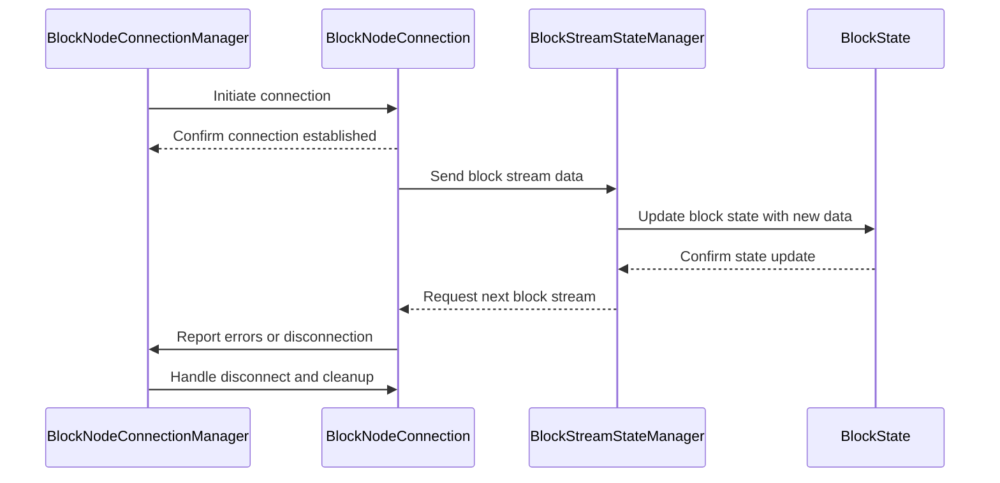
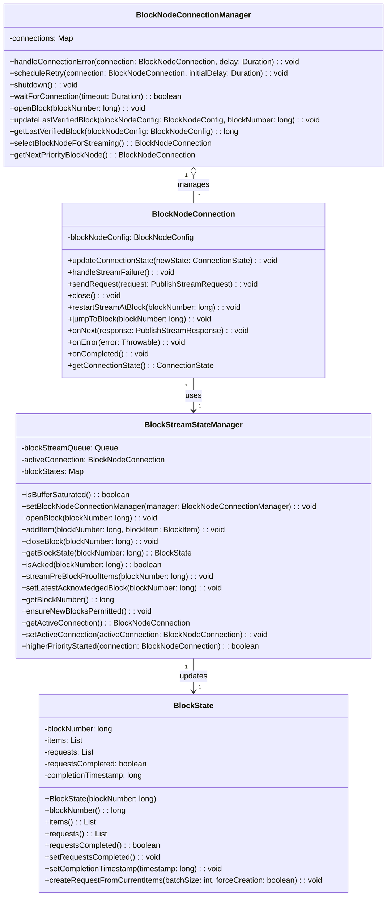
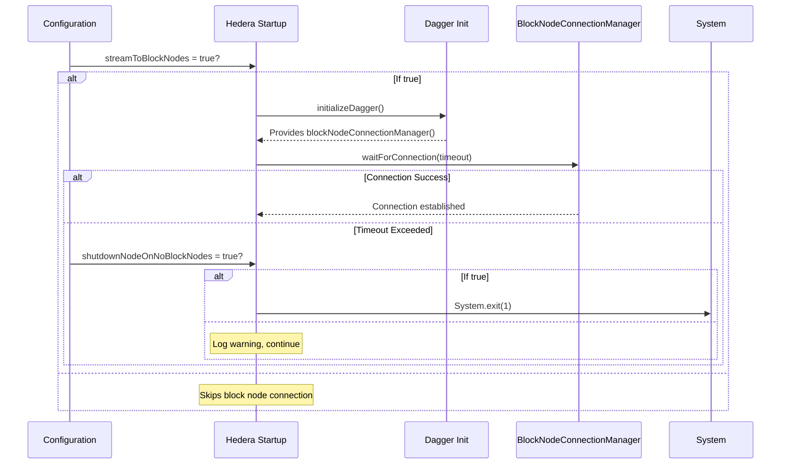

# Block Node Connection Components Design Documents

This folder contains documents describing the internal design and expected behavior
for various components of the Consensus node to Block Node communication. Each document focuses on a single
class or component and its role, including interactions with other components.

## Contents

| Document                                     | Component                  | Description                                                                                  |
|:---------------------------------------------|----------------------------|:---------------------------------------------------------------------------------------------|
| [BlockNodeConnectionManager.md](BlockNodeConnectionManager.md) | BlockNodeConnectionManager | Internal design and behavior of the BlockNodeConnectionManager class, managing node connections. |
| [BlockNodeConnection.md](BlockNodeConnection.md)               | BlockNodeConnection        | Internal design and behavior of the BlockNodeConnection class, representing an individual connection. |
| [BlockState.md](BlockState.md)                                 | BlockState                 | Internal design of the BlockState component, managing state information for blocks.          |
| [BlockStreamStateManager.md](BlockStreamStateManager.md)       | BlockStreamStateManager    | Internal design and responsibilities of BlockStreamStateManager, handling stream state and synchronization. |

## Components Interaction Flow

The following diagram illustrates the main flow and interactions between these components:

### Simplified Class Diagram

## Block Node Connection Initialization During Consensus Node Startup

During a `Consensus Node` startup, it might establish connections to external `Block Nodes` depending on the configurations. 
The connection process is vital to ensure that blocks produced by the `Consensus Node` are streamed to the `Block Nodes` for further processing.

### Initialization Flow

The connection initialization is handled by the `Hedera` class and occurs during the `Consensus Node` startup process.
The initialization flow includes:

1. Configuration Check
   - The following configuration controls whether the Block Node connections should be established:
     `blockStream.streamToBlockNodes = true`
   - If this configuration is set to `false`, the connection process will be skipped.
   - If set to `true`, the connection process will proceed.

2. Dependency Injection Setup
   - The `initializeDagger(...)` method is called during startup to construct and wire dependencies using Dagger. 
   - This includes:
     - BlockStreamManager 
     - BlockNodeConnectionManager 
     - Other block-related and state-related services
   - Dagger provides the `blockNodeConnectionManager()` instance needed to manage connections.

3. Connection Initialization
   - After `Dagger` setup, the following method may be invoked:
    `public void initializeBlockNodeConnections(Duration timeout)`
   - The method will:
     - Log the start of the connection attempt. 
     - Wait up to timeout duration for at least one connection to a `Block Node`. 
     - Use `blockNodeConnectionManager().waitForConnection(timeout)` to determine success.

4. Failure Handling
   - If no connection is established within the given timeout and the configuration is set to `true`, then:
     - `Hedera` class will log an error message indicating the failure to establish a connection
     - The node will shut down immediately.

### Initialization Flow Sequence Diagram

## Block Node Connection Configurations
| Property                        | Description                                                                             | Default Value       |
|---------------------------------|-----------------------------------------------------------------------------------------|---------------------|
| `shutdownNodeOnNoBlockNodes`    | Defines whether to shut down the consensus node if there are no block node connections. | `true`              |
| `blockNodeConnectionFileDir`    | Specifies the directory to get the block node configuration file.                       | `data/config`       |
| `blockNodeConfigFile`           | The file containing the block nodes configurations.                                     | `block-nodes.json`  |
| `waitPeriodForActiveConnection` | The time in minutes to wait for an active connection.                                   | `10`                |
| `maxEndOfStreamsAllowed`        | The limit of EndOfStream responses allowed in a time frame.                             | `5`                 |
| `endOfStreamTimeFrame`          | The time frame in seconds to check for EndOfStream responses.                           | `30s`               |
| `endOfStreamScheduleDelay`      | The delay in seconds to schedule connections after the limit is reached.                | `30s`               |

## Block Stream Configurations
| Property                   | Description                                                                 | Default Value               |
|----------------------------|-----------------------------------------------------------------------------|-----------------------------|
| `streamMode`               | Value of RECORDS disables the block stream; BOTH enables it.                | `BOTH`                      |
| `writerMode`               | Specifies if we are writing to a file or gRPC stream.                       | `FILE`                      |
| `blockFileDir`             | The directory to store block files.                                         | `/opt/hgcapp/blockStreams`  |
| `hashCombineBatchSize`     | The the number of items to hash in a batch.                                 | `32`                        |
| `roundsPerBlock`           | The number of rounds per block.                                             | `1`                         |
| `blockPeriod`              | The block period.                                                           | `2s`                        |
| `blockItemBatchSize`       | The number of items to send in a batch to block nodes.                      | `256`                       |
| `blockBufferTtl`           | The TTL for entries in the block buffer                                     | `5m`                        |
| `blockBufferPruneInterval` | Interval to prune block buffer and check for whether backpressure is needed | `1s`                        |