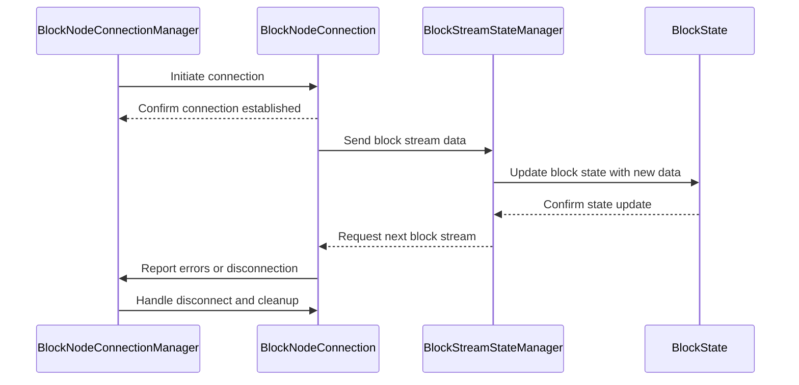
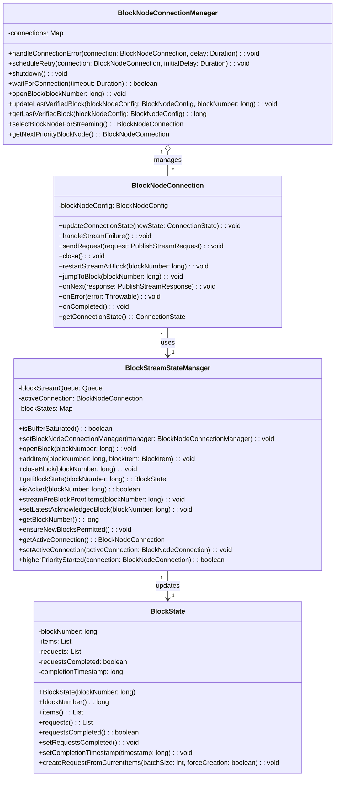

# Block Node Connection Components Design Documents

This folder contains documents describing the internal design and expected behavior
for various components of the Consensus node to Block Node communication. Each document focuses on a single
class or component and its role, including interactions with other components.

## Contents

| Document                                     | Component                  | Description                                                                                  |
|:---------------------------------------------|----------------------------|:---------------------------------------------------------------------------------------------|
| [BlockNodeConnectionManager.md](BlockNodeConnectionManager.md) | BlockNodeConnectionManager | Internal design and behavior of the BlockNodeConnectionManager class, managing node connections. |
| [BlockNodeConnection.md](BlockNodeConnection.md)               | BlockNodeConnection        | Internal design and behavior of the BlockNodeConnection class, representing an individual connection. |
| [BlockState.md](BlockState.md)                                 | BlockState                 | Internal design of the BlockState component, managing state information for blocks.          |
| [BlockStreamStateManager.md](BlockStreamStateManager.md)       | BlockStreamStateManager    | Internal design and responsibilities of BlockStreamStateManager, handling stream state and synchronization. |

## Component Interaction Flow

The following diagram illustrates the main flow and interactions between these components:

### Simplified Class Diagram

