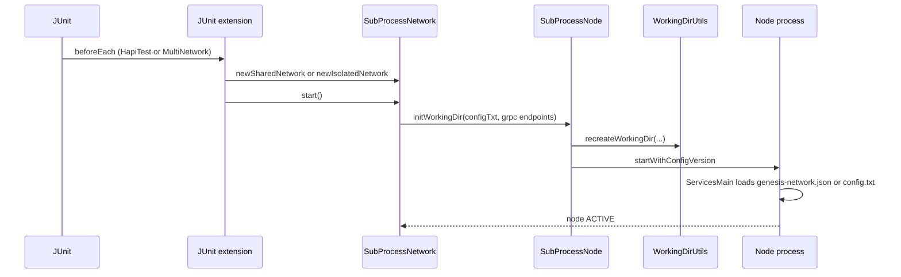
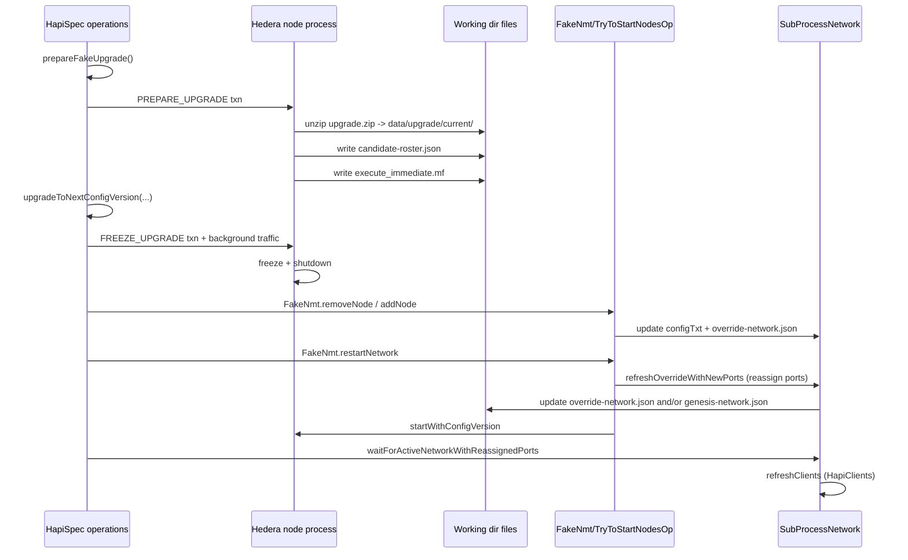

# HapiTest framework notes: DAB + multi-network upgrade flows

## Scope and entry points

This note documents the current HapiTest framework paths exercised by:
- `hedera-node/test-clients/src/main/java/com/hedera/services/bdd/suites/regression/system/DabEnabledUpgradeTest.java`
- `hedera-node/test-clients/src/main/java/com/hedera/services/bdd/suites/multinetwork/MultiNetworkNodeLifecycleSuite.java`

It focuses on subprocess networks, genesis bootstrap, and the upgrade path used to apply address book changes (node add/delete). It also calls out the current gRPC endpoint reassignment behavior on upgrade.

## Key components (code references)

- Test annotations and JUnit wiring
  - `hedera-node/test-clients/src/main/java/com/hedera/services/bdd/junit/HapiTest.java`
  - `hedera-node/test-clients/src/main/java/com/hedera/services/bdd/junit/MultiNetworkHapiTest.java`
  - `hedera-node/test-clients/src/main/java/com/hedera/services/bdd/junit/extensions/NetworkTargetingExtension.java`
  - `hedera-node/test-clients/src/main/java/com/hedera/services/bdd/junit/extensions/MultiNetworkExtension.java`
  - `hedera-node/test-clients/src/main/java/com/hedera/services/bdd/junit/SharedNetworkLauncherSessionListener.java`
- Subprocess network implementation
  - `hedera-node/test-clients/src/main/java/com/hedera/services/bdd/junit/hedera/subprocess/SubProcessNetwork.java`
  - `hedera-node/test-clients/src/main/java/com/hedera/services/bdd/junit/hedera/subprocess/SubProcessNode.java`
  - `hedera-node/test-clients/src/main/java/com/hedera/services/bdd/junit/hedera/subprocess/ProcessUtils.java`
- Working directory and address book helpers
  - `hedera-node/test-clients/src/main/java/com/hedera/services/bdd/junit/hedera/utils/WorkingDirUtils.java`
  - `hedera-node/test-clients/src/main/java/com/hedera/services/bdd/junit/hedera/utils/AddressBookUtils.java`
- Upgrade helpers and fake NMT
  - `hedera-node/test-clients/src/main/java/com/hedera/services/bdd/suites/regression/system/LifecycleTest.java`
  - `hedera-node/test-clients/src/main/java/com/hedera/services/bdd/spec/utilops/FakeNmt.java`
  - `hedera-node/test-clients/src/main/java/com/hedera/services/bdd/spec/utilops/lifecycle/ops/TryToStartNodesOp.java`
  - `hedera-node/test-clients/src/main/java/com/hedera/services/bdd/spec/utilops/lifecycle/ops/PurgeUpgradeArtifactsOp.java`
  - `hedera-node/test-clients/src/main/java/com/hedera/services/bdd/spec/utilops/lifecycle/ops/CandidateRosterValidationOp.java`
  - `hedera-node/test-clients/src/main/java/com/hedera/services/bdd/spec/utilops/upgrade/BuildUpgradeZipOp.java`
- Node-side upgrade handling (inside the node process)
  - `hedera-node/hedera-network-admin-service-impl/src/main/java/com/hedera/node/app/service/networkadmin/impl/handlers/ReadableFreezeUpgradeActions.java`
  - `hedera-node/hedera-app/src/main/java/com/hedera/node/app/workflows/handle/steps/PlatformStateUpdates.java`
  - `hedera-node/hedera-app/src/main/java/com/hedera/node/app/info/DiskStartupNetworks.java`

## Component diagram

```mermaid
flowchart LR
    JUnit[JUnit Jupiter]
    HapiTest[@HapiTest]
    MultiNet[@MultiNetworkHapiTest]
    Shared[SharedNetworkLauncherSessionListener]
    TargetExt[NetworkTargetingExtension]
    MultiExt[MultiNetworkExtension]
    Spec[HapiSpec]
    Clients[HapiClients]
    SPN[SubProcessNetwork]
    Node[SubProcessNode]
    Work[WorkingDirUtils]
    Proc[ProcessUtils]
    Nmt[FakeNmt ops]
    NodeProc[Hedera node process]
    Upgrade[ReadableFreezeUpgradeActions]

    JUnit --> HapiTest --> TargetExt --> Shared --> SPN
    JUnit --> MultiNet --> MultiExt --> SPN
    Spec --> Clients
    SPN --> Clients
    SPN --> Node --> Work
    Node --> Proc --> NodeProc
    Nmt --> SPN
    NodeProc --> Upgrade
```

## Genesis bootstrap (subprocess networks)

### Call flow



### Files created on disk (fresh genesis)

All subprocess network nodes use a working directory created by `WorkingDirUtils.recreateWorkingDir()`.

Working directory root (per node):
- Shared network: `build/hapi-test/node<N>/`
- Multi-network: `build/<networkName>-test/node<N>/`

Key files and directories:
- `config.txt` (root)
- `data/config/genesis-network.json`
- `data/config/application.properties`
- `data/config/genesis.properties`
- `data/config/node-admin-keys.json`
- `log4j2.xml` (root)
- `data/upgrade/current/` (upgrade artifacts dir)
- `data/recordStreams/record<shard.realm.account>`
- `data/blockStreams/block-<shard.realm.account>`
- `data/saved/Hedera/<nodeId>/<swirldName>/` (created later when states are saved)

The genesis network JSON is generated from `config.txt` by `WorkingDirUtils.networkFrom(...)` and placed in `data/config/genesis-network.json`. The node process uses `DiskStartupNetworks` to read `genesis-network.json` (or falls back to legacy `config.txt`).

## MultiNetworkNodeLifecycleSuite call flow (what executes)

### Network provisioning

- `@MultiNetworkHapiTest` is intercepted by `MultiNetworkExtension`.
- `MultiNetworkExtension` starts multiple isolated `SubProcessNetwork` instances, each with its own port window and working dir scope.
- Each network is started before any test operations run, so all networks are alive concurrently.

### Spec execution

- `HapiSpec.multiNetworkHapiTest(...)` returns `HapiSpec.MultiNetworkSpecBuilder` (not the placeholder `MultiNetworkHapiTestBuilder`).
- The builder executes steps sequentially; each step is a standalone `HapiSpec` targeted at one network via thread-local `HapiSpec.TARGET_NETWORK`.

### Suite-specific behavior

- `ensureNetworkReady(...)` and explicit `refreshClients()` calls are used to hydrate `HapiClients` pools for each network.
- For add/remove, the suite aligns node IDs and ports with `SubProcessNetwork` conventions:
  - New node ID chosen as the next available ID (`maxNodeId + 1`).
  - gRPC endpoint from `SubProcessNetwork.grpcEndpointForNextNodeId()`.
  - Gossip endpoints from `SubProcessNetwork.gossipEndpointsForNextNodeId()`.
  - `SubProcessNetwork.updateNodeAccount(...)` maps the created account to the new node ID.

## Upgrade flow used by DabEnabledUpgradeTest and MultiNetworkNodeLifecycleSuite

### Sequence diagram (freeze upgrade + address book change)



### What happens during PREPARE_UPGRADE (node process)

Inside the node process, `ReadableFreezeUpgradeActions.extractSoftwareUpgrade()` does the following:
- Cleans `networkAdmin.upgradeArtifactsPath` (defaults to `data/upgrade/current`).
- Unzips the upgrade file into the artifacts directory.
- If DAB is enabled, generates a `config.txt` and PEM files in the artifacts dir from active node state.
- Writes `execute_immediate.mf` to signal completion.

Separately, `PlatformStateUpdates` exports `candidate-roster.json` (default filename) after PREPARE_UPGRADE if configured.

### What happens during add/remove + restart (test harness)

The HapiTest framework simulates the NMT by:
- Using `FakeNmt.removeNode(...)` and `FakeNmt.addNode(...)` to update the in-memory `SubProcessNetwork` roster.
- Regenerating `configTxt` from the updated `SubProcessNetwork` metadata (not from upgrade artifacts).
- Writing `override-network.json` for non-genesis nodes using `WorkingDirUtils.networkFrom(configTxt, ...)`.

On restart, `FakeNmt.restartNetwork(...)` uses `TryToStartNodesOp` with `ReassignPorts.YES` which forces a port reassignment for all nodes (see next section).

## Focused diagram: add/remove -> override-network.json

```mermaid
flowchart TD
    Spec[Spec ops] --> Nmt[FakeNmt.addNode/removeNode]
    Nmt --> Add[AddNodeOp] --> SPN1[SubProcessNetwork.addNode]
    Nmt --> Rem[RemoveNodeOp] --> SPN2[SubProcessNetwork.removeNode]
    SPN1 --> Cfg1[regenerate configTxt]
    SPN2 --> Cfg2[regenerate configTxt]
    Cfg1 --> Refresh[refreshOverrideNetworks(ReassignPorts.NO)]
    Cfg2 --> Refresh

    Refresh --> Check{genesis-network.json exists?}
    Check -- no --> Write[write data/config/override-network.json]
    Check -- yes --> Skip[skip override-network.json]
```

### Behavior notes for override-network.json

- `FakeNmt.addNode(...)` and `FakeNmt.removeNode(...)` only update the `SubProcessNetwork` in memory and call `refreshOverrideNetworks(ReassignPorts.NO)`.\n- `refreshOverrideNetworks(...)` builds a `Network` from the regenerated `configTxt` and writes `data/config/override-network.json` for each node **only if** `data/config/genesis-network.json` is absent. This is intended to avoid immediate override use when a node is still starting from genesis.\n- For nodes that still have `genesis-network.json` in their working dir, add/remove does **not** write `override-network.json` at this stage.\n- A newly added node always has `genesis-network.json` created by `WorkingDirUtils.recreateWorkingDir(...)`, so it will not receive `override-network.json` during the add/remove step itself.\n- The upgrade restart path (`TryToStartNodesOp` with `ReassignPorts.YES`) is where port reassignment happens, and may also update `genesis-network.json` for nodes still considered genesis. That path is separate from add/remove and is what forces the gRPC endpoint changes.

## File mutations during add/delete upgrade

On prepare upgrade:
- `build/upgrade.zip` and `build/upgrade/` created locally by `BuildUpgradeZipOp`.
- `data/upgrade/current/` cleaned and repopulated by the node process.
- `data/upgrade/current/execute_immediate.mf` created.
- `candidate-roster.json` created in the node working dir.

On add/remove before restart (FakeNmt ops):
- `override-network.json` updated in `data/config/` for non-genesis nodes.
- New node working dir created on add (including `config.txt`, `data/config/genesis-network.json`, bootstrap assets).
- Removed node process is stopped; its working dir remains on disk.

On restart:
- Environment variables are set with new ports in `ProcessUtils.startSubProcessNodeFrom(...)`.
- `genesis-network.json` is updated if ports are reassigned and the node is still considered "genesis".
- `override-network.json` reflects new roster and (reassigned) gossip endpoints.

## Current gRPC endpoint behavior (the critical issue)

The current implementation reassigns gRPC ports on every `FakeNmt.restartNetwork(...)` call. This happens even when the upgrade is only for a node add/delete:

- `LifecycleTest.upgradeToNextConfigVersion(...)` calls `FakeNmt.restartNetwork(...)`.
- `FakeNmt.restartNetwork(...)` creates `TryToStartNodesOp(..., ReassignPorts.YES, ...)`.
- `TryToStartNodesOp.submitOp(...)` calls `SubProcessNetwork.refreshOverrideWithNewPorts()`.
- `refreshOverrideWithNewPorts()`:
  - Reinitializes the static port window (`nextGrpcPort`, etc.).
  - Reassigns gRPC/gossip/prometheus/debug ports for every node.
  - Updates `configTxt` and rewrites override/genesis network JSON.

Result: every upgrade that restarts a subprocess network shifts gRPC endpoints, requiring `refreshClients()` to rebind channels and causing cross-network churn in multi-network tests.

## Notes and observations

- `SubProcessNetwork.latestCandidateWeights()` reads weights from `candidate-roster.json` (node0) to keep `configTxt` weights in sync, but membership and ports still come from in-memory `SubProcessNetwork` metadata.
- `DabEnabledUpgradeTest` mentions copying `config.txt` from upgrade artifacts; in the current test harness, `SubProcessNetwork` regenerates `configTxt` from node metadata and does not explicitly copy the artifact `config.txt` into the working dir. The artifact `config.txt` is still generated by the node process when DAB is enabled, and tests validate it via `candidate-roster.json` and address book exports.
- `HapiClients` uses static channel pools shared across networks; `refreshClients()` rebuilds per-network stubs without clearing global pools, so multi-network suites must avoid mid-test teardown.
