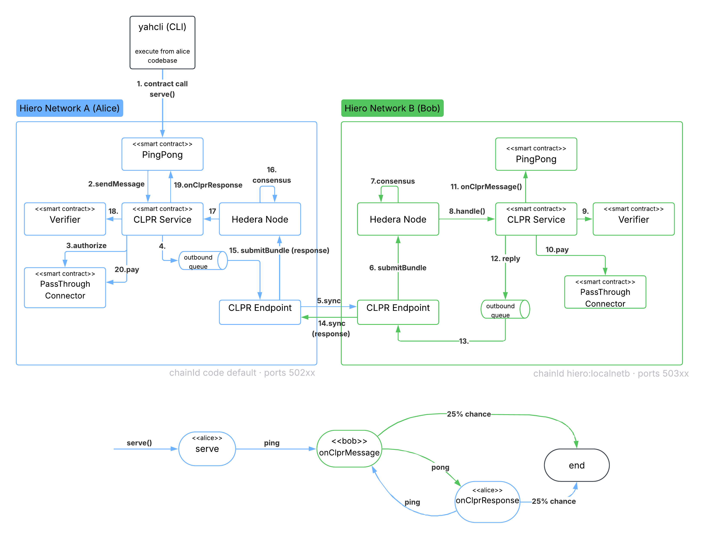

# Hiero-to-Hiero PingPong: A CLPR Tutorial

This tutorial walks through a complete cross-ledger message round-trip between two
local Hiero networks using CLPR. It covers each required step for running a Ping-Pong app (smart contract) between two distinct local ledgers.

By the end, alice's PingPong contract will send a message to bob's PingPong
contract over an authenticated, on-chain-verified cross-ledger channel.

> **In a hurry?** If you want to skip the step-by-step tutorial, jump to the
> [Speedrun](#speedrun) section at the end and run the two packaged scripts there — they
> run the whole channel → connector → PingPong flow end to end
> (assumes both nodes are already up with the WRAPS proof ready).

---

## CLPR concepts in 60 seconds

CLPR (Cross-Ledger Protocol Relay) lets smart contracts on one chain send
authenticated messages to contracts on another chain.

The protocol has three layers:

- **Ledger configuration** — each network publishes a signed description of itself
  (chain ID, trust anchor, throttles). The other side fetches this as a
  *state proof* and uses it to verify incoming data.
- **Channel** — a bilateral agreement between two specific ledger IDs. Uses a
  two-phase commit/reveal so neither side can front-run the other's identity.
- **Connector** — the on-chain contract that authorises bundle relay for a given
  channel. Also registered via commit/reveal, and can be slashed for
  misbehaviour.

---

## Architecture at a glance

CLPR is **symmetric and bilateral**: whatever alice sets up, bob sets up too, and a
channel is an agreement between the two. The diagram below shows the two local
networks side by side. Each network is a stack — the **PingPong app** rides on top of
the **connector** (`PassThroughAuth`), which rides on top of the **CLPR protocol
state**, which is anchored to the node's **consensus/TSS block layer**.

`yahcli` is an external CLI operator (not part of either node); in this tutorial it
drives *both* networks from alice's clone.

When the volley starts from Alice (like in the diagram below), Alice sends the "ping" part, initially from `serve()` call and, after, through `onClprResponse` contract call. On the other side, Bob sends the "pong", through the `onClprMessage` contract call


-------------------------------------------------------------

## Part 1 — Environment setup

### Prerequisites

- JDK 25 (Temurin): `brew install --cask temurin@25`
- `jq`: `brew install jq`
- WRAPS native library (see step 1)

### Step 1 — Download the WRAPS library

The TSS/WRAPS library is a native binary that the Hedera (Hiero) node loads at startup to generate
block proofs. Without it the node starts but never produces state proofs and the
CLPR steps further down will hang or fail.

```bash
curl -L -o /tmp/wraps-v1.0.0.tar.gz \
  https://builds.hedera.com/tss/hiero/wraps/v1.0/wraps-v1.0.0.tar.gz && \
mkdir -p ~/wraps-v1.0.0 && \
tar -xzf /tmp/wraps-v1.0.0.tar.gz -C ~/wraps-v1.0.0
```

### Step 2 — Set up two working directories with git worktrees

Each node needs its own working directory because the two processes write independent
state to `../../../hedera-app/build/node` — node data, signing keys, and logs.
A shared directory would cause the two nodes to stomp on each other's state.
A git worktree gives a second working directory (with its own `../../../../build` tree) without
duplicating the repository objects on disk.

```bash
git clone <repository-url> clpr-hiero-alice
cd clpr-hiero-alice && git checkout clpr && cd ..
git -C clpr-hiero-alice worktree add --detach ../clpr-hiero-bob clpr
```

### Step 3 — Configure network B on different ports with a distinct chain ID

Network A (alice) uses the defaults already baked into the code. Network B (bob)
needs different ports so the two nodes don't collide, and a distinct chain ID so
CLPR can tell them apart. Override these via a properties file — no recompilation
needed.

Edit `clpr-hiero-bob/hedera-node/configuration/dev/application.properties`
and uncomment/add:

```properties
clpr.chainId=hiero:localnetb
grpc.port=50311
grpc.nodeOperatorPort=50313
```

This is the source file the Gradle `copyNodeDataAndConfig` task copies into
`build/node/data/config/` on every `./gradlew :app:run`. It already has these
lines commented out as examples — just uncomment and set the values.

`application.properties` only overrides the gRPC ports. The **gossip port** lives
in a separate file, `genesis-network.json`, and defaults to `31013` on both
networks, so we need to give bob a distinct gossip port.

Edit `clpr-hiero-bob/hedera-node/configuration/dev/genesis-network.json` and
change every `"port": 31013` to `"port": 31014` (there are three — the
`rosterEntry` gossip endpoint, and the node's `gossipEndpoint` and
`serviceEndpoint`):

```bash
sed -i '' 's/"port": 31013/"port": 31014/g' \
  clpr-hiero-bob/hedera-node/configuration/dev/genesis-network.json
```

### Step 4 — Start both networks

Open two terminals and start each network. Both can run in parallel — the genesis
WRAPS proof (~15 min) on each is independent.

**Terminal 1 — alice (ports 50211 / 50212 / 50213):**

```bash
cd clpr-hiero-alice
TSS_LIB_WRAPS_ARTIFACTS_PATH=~/wraps-v1.0.0 ./gradlew :app:run
```

**Terminal 2 — bob (ports 50311 / 50312 / 50313):**

```bash
cd clpr-hiero-bob
TSS_LIB_WRAPS_ARTIFACTS_PATH=~/wraps-v1.0.0 ./gradlew :app:run
```

Confirm each is accepting connections:

```bash
lsof -nP -iTCP:50211 -sTCP:LISTEN   # alice
lsof -nP -iTCP:50311 -sTCP:LISTEN   # bob
```

### Step 5 — Wait for WRAPS readiness (~15–20 minutes per network)

There are three stages. Do **not** proceed to step 9 until all three are complete
on **both** networks.

**Stage 1 — Genesis WRAPS proof (~15 min)**

The node generates a genesis WRAPS proof from scratch the first time it starts.

```bash
# Alice
grep "WrapsHistoryProver" \
  clpr-hiero-alice/hedera-node/hedera-app/build/node/output/hgcaa.log | tail -3

# Bob
grep "WrapsHistoryProver" \
  clpr-hiero-bob/hedera-node/hedera-app/build/node/output/hgcaa.log | tail -3
```

Wait for the **FINISHED** line on each:

```
WrapsHistoryProver - FINISHED constructing genesis WRAPS proof -> WRAPS{...} - took 13m 32s
```

**Stage 2 — WRAPS proof embedded in a block (~a few minutes after stage 1)**

The FINISHED log means the proof was constructed, but it has not yet been embedded
in a block signature. Cross-network TSS verification only works once the proof is
embedded — a peer's node has no local copy of your TSS state and relies entirely on
the self-authenticating WRAPS material carried inside the block signature.

```bash
# Alice
grep "CLPR-SYNC-POINT" \
  clpr-hiero-alice/hedera-node/hedera-app/build/node/output/hgcaa.log

# Bob
grep "CLPR-SYNC-POINT" \
  clpr-hiero-bob/hedera-node/hedera-app/build/node/output/hgcaa.log
```

Wait for this line on each:

```
[CLPR-SYNC-POINT] block #N is the first to embed the WRAPS recursive proof
```

### Step 6 — Build yahcli

`yahcli` is the command line utility used to send requests to hiero nodes. All `../../yahcli` commands in this tutorial run from alice's clone. The
`../../config.yml` in `../..` already defines both `alice` (50211) and
`bob` (50311) as known networks.

In a third terminal, build `yahcli`:

```bash
cd clpr-hiero-alice
./gradlew :yahcli:copyYahCli
```

Verify:

```bash
ls -lh hedera-node/yahcli/yahcli.jar
```

From here on, all commands run from (inside alice's repository):

```bash
cd hedera-node/yahcli
```

### Step 7 — Copy the treasury key into the yahcli key directories

yahcli authenticates transactions using the private key for the payer account. The
key for account `0.0.2` (the treasury) lives in the test-clients directory; the
`../../alice/keys` and `../../bob/keys` directories already have the matching passphrase
(`account2.pass`) but not the PEM file itself.

```bash
cp ../test-clients/yahcli/localhost/keys/account2.pem alice/keys/ && \
cp ../test-clients/yahcli/localhost/keys/account2.pem bob/keys/
```

---

## Part 2 — Protocol walkthrough

Everything from here is about setting up the CLPR relationship between alice and
bob. Work through each step in order; later steps reference values captured here.

### Step 8 — Prime node account 0.0.3 on both networks

Every `ClprSubmitBundle` that the sync pipeline internally submits is paid by
account `0.0.3`. If this account runs out of hbar the connector silently stops
relaying. Seed it now.

The following commands transfer 1,000,000,000 HBAR from account 0.0.2 to account 0.0.3
on both alice and bob networks (resolved by `hedera-node/yahcli/config.yml/config.yml` configuration), with 0.0.2
also paying the transaction fee. The two accounts used are:
- 0.0.2 — treasury, holds all the initial hbars, used as the payer for user-submitted HAPI transactions.
- 0.0.3 — the node's own account, pays for internally-submitted node transactions like ClprSubmitBundle

```bash
./yahcli -n alice -p 2 accounts send --to 0.0.3 1000000000 -d hbar
./yahcli -n bob   -p 2 accounts send --to 0.0.3 1000000000 -d hbar
```

---

### Step 9 — Publish each network's ledger configuration

**What this does:** Every CLPR network publishes a signed *ledger configuration*
that describes itself: its chain ID, a trust anchor (the public key that signs its
state proofs), throttle parameters, and seed endpoints. The other network fetches
this config as a state proof and uses it to verify every bundle it receives.

Push each network's config to itself:

```bash
# Alice tells the network about itself
./yahcli -n alice -p 2 clpr update-ledger-configuration --config-file alice-config.json

# Bob tells the network about itself
./yahcli -n bob   -p 2 clpr update-ledger-configuration --config-file bob-config.json
```

---

### Step 10 — Pull each network's ledger configuration and state proof

**What this does:** Fetches the on-chain ledger configuration along with a
TSS-signed *state proof*. The proof cryptographically binds the config to the
network's block history. You will give bob's proof to alice (and alice's proof to
bob) when completing the channel, so each side can verify the other's identity
on-chain.

```bash
./yahcli -n alice -p 2 clpr get-ledger-configuration \
  --out alice-observed-config.json --proof-path alice-proof.bin

./yahcli -n bob   -p 2 clpr get-ledger-configuration \
  --out bob-observed-config.json   --proof-path bob-proof.bin
```

If `--proof-path` writes 0 bytes the genesis WRAPS proof has not finished yet.
Wait for the FINISHED line from step 5 and retry.

Verify the observed configs have a trust anchor **and** at least one endpoint before
proceeding — if either field is missing, `complete-channel` will fail:

```bash
jq '.configuration.initial_trust_anchor' alice-observed-config.json  # must not be null
jq '.configuration.initial_trust_anchor' bob-observed-config.json    # must not be null
jq '.configuration.endpoints | length' alice-observed-config.json    # must be >= 1
jq '.configuration.endpoints | length' bob-observed-config.json      # must be >= 1
```

---

### Step 11 — Generate a channel security identity

**What this does:** This step is not really part of the protocol itself. It
generates data required to establish a channel between the two ledgers: a
random channel ID and an asymmetric keypair. Both networks will reference this
to secure the channel establishment process. The `ownershipCommitment` is a hash
of the full identity that is submitted first (commit phase), protecting both parties
from front-running — neither side can observe the other's identity before locking
in its own commitment.

```bash
./yahcli -n alice -p 2 clpr generate-channel-identity --out channel.json
```

Inspect the result:

```bash
jq . channel.json
```

Capture the commitment for the next step:

```bash
CHANNEL_COMMIT=$(jq -r .ownershipCommitment channel.json)
echo "Commitment: $CHANNEL_COMMIT"
```

---

### Step 12 — Register the channel on both networks (commit phase)

**What this does:** Submits the commitment hash to each network's CLPR state,
indicating the interest in establishing a channel. Locking in the commitment
prevents front-running: neither side can observe the other's full identity and
craft a conflicting response before its own commit is recorded. For now, no
channel is open yet.

```bash
./yahcli -n alice -p 2 clpr register-channel --commitment "$CHANNEL_COMMIT"
./yahcli -n bob   -p 2 clpr register-channel --commitment "$CHANNEL_COMMIT"
```

---

### Step 13 — Complete the channel on both networks (reveal phase)

**What this does:** Completes the channel on both networks, using the
identity generated previously to identify the channel. Trust anchors are
exchanged between the ledgers, so they can verify each other's messages.
This step verifies that:

1. The commitment hash matches what was registered in step 11.
2. The peer's state proof (pulled in step 9) validates against the peer's
   trust anchor using the CLPR verifier system contract at `0.0.366`.

Completing the channel for Alice network:

```bash
./yahcli -n alice -p 2 clpr complete-channel \
  --identity channel.json \
  --verifier-contract 0.0.366 \
  --config-proof bob-proof.bin
```

Completing the channel for Bob network:

```bash
./yahcli -n bob -p 2 clpr complete-channel \
  --identity channel.json \
  --verifier-contract 0.0.366 \
  --config-proof alice-proof.bin
```

The channel is now ACTIVE on both networks. Capture the channel ID:

```bash
CHANNEL_ID=$(jq -r .channelId channel.json)
echo "Channel ID: $CHANNEL_ID"
```

---

### Step 14 — Deploy the passthrough connector on both networks

**What this does:** Deploys `PassThroughAuth`, the connector contract. The connector
is the CLPR-layer entity responsible for authorising outbound messages and paying for
inbound message execution. `PassThroughAuth` approves all messages unconditionally —
it is the simplest possible connector for a tutorial. It holds the locked stake and
must carry enough hbar to cover inbound execution fees via `payForExecution()`.

```bash
PASSTHROUGH_BIN="../test-clients/src/main/resources/contract/contracts/PassThroughAuth/PassThroughAuth.bin"

./yahcli -n alice -p 2 contracts create \
  --init-code-file "$PASSTHROUGH_BIN" \
  --initial-balance 100000000000000 \
  --gas 1500000 --memo "clpr passthrough connector" --immutable
PASSTHROUGH_A=0.0.$(grep "YahcliContractCreate.*finished" output/yahcli-tc.log \
  | grep -oE 'created=[1-9][0-9]*' | tail -1 | cut -d= -f2)
echo "PassThroughAuth on alice: $PASSTHROUGH_A"

./yahcli -n bob -p 2 contracts create \
  --init-code-file "$PASSTHROUGH_BIN" \
  --initial-balance 100000000000000 \
  --gas 1500000 --memo "clpr passthrough connector" --immutable
PASSTHROUGH_B=0.0.$(grep "YahcliContractCreate.*finished" output/yahcli-tc.log \
  | grep -oE 'created=[1-9][0-9]*' | tail -1 | cut -d= -f2)
echo "PassThroughAuth on bob:   $PASSTHROUGH_B"
```

---

### Step 15 — Generate a connector identity

**What this does:** Creates a cryptographic identity for the connector — the
entity responsible for relaying bundles between the two chains. Like the
channel identity, it uses a commit/reveal cycle. The connector ID is derived
from the channel ID, binding this connector to the specific channel.

```bash
./yahcli clpr generate-connector-identity \
  --channel-id "$CHANNEL_ID" \
  --out connector.json
```

Capture the values you will need:

```bash
CONNECTOR_COMMIT=$(jq -r .commitment connector.json)
CONNECTOR_ID=$(jq -r .connectorId connector.json)
echo "Connector commitment: $CONNECTOR_COMMIT"
echo "Connector ID:         $CONNECTOR_ID"
```

---

### Step 16 — Register the connector on both networks (commit phase)

**What this does:** Submits the connector commitment to each network. Same
principle as the channel's commit phase — locks in the hash before revealing
the identity.

```bash
./yahcli -n alice -p 2 clpr register-connector --commitment "$CONNECTOR_COMMIT"
./yahcli -n bob   -p 2 clpr register-connector --commitment "$CONNECTOR_COMMIT"
```

---

### Step 17 — Complete the connector on both networks (reveal phase)

**What this does:** Associates the connector identity with the PassThroughAuth
contract and locks the stake. From this point, PassThroughAuth is the authorised
connector for this channel. If it submits invalid bundles it can be slashed. The
`--locked-stake` is denominated in tinybars and held by the CLPR staking account
until the connector is deregistered.

```bash
./yahcli -n alice -p 2 clpr complete-connector \
  --identity connector.json \
  --connector-contract "$PASSTHROUGH_A" \
  --locked-stake 100000000

./yahcli -n bob -p 2 clpr complete-connector \
  --identity connector.json \
  --connector-contract "$PASSTHROUGH_B" \
  --locked-stake 100000000
```

The CLPR channel + connector are now fully established on both chains.

---

### Step 18 — Deploy PingPong on both networks

**What this does:** Deploys the [PingPong application contract](../../../test-clients/src/main/resources/contract/contracts/PingPong/PingPong.sol). PingPong is a CLPR
application — it implements `onClprMessage` (receives cross-ledger messages and
echoes them back) and `onClprResponse` (bounces the reply). It is distinct from
the connector: PingPong is the application logic, PassThroughAuth handles auth in the CLPR layer.

```bash
PING_PONG_BIN="../test-clients/src/main/resources/contract/contracts/PingPong/PingPong.bin"

./yahcli -n alice -p 2 contracts create \
  --init-code-file "$PING_PONG_BIN" \
  --gas 1500000 --memo "clpr ping-pong" --immutable
PINGPONG_A=0.0.$(grep "YahcliContractCreate.*finished" output/yahcli-tc.log \
  | grep -oE 'created=[1-9][0-9]*' | tail -1 | cut -d= -f2)
echo "PingPong on alice: $PINGPONG_A"

./yahcli -n bob -p 2 contracts create \
  --init-code-file "$PING_PONG_BIN" \
  --gas 1500000 --memo "clpr ping-pong" --immutable
PINGPONG_B=0.0.$(grep "YahcliContractCreate.*finished" output/yahcli-tc.log \
  | grep -oE 'created=[1-9][0-9]*' | tail -1 | cut -d= -f2)
echo "PingPong on bob:   $PINGPONG_B"
```

---

### Step 19 — Encode the serve() call

**What this does:** Builds the ABI calldata for one `serve()` invocation on alice's
PingPong. The on-chain signature is
`serve(bytes32 channelId, bytes32 connectorId, bytes targetApplication, bytes messageData)`
— note `connectorId` is a **`bytes32`** (a static word), so the selector is
`keccak256("serve(bytes32,bytes32,bytes,bytes)")[:4] = 0x662cc5fb`.
`targetApplication` is bob's PingPong as a 20-byte long-zero EVM address.

> A common mistake is to encode `connectorId` as a dynamic `bytes` value. That
> yields a *different* selector (`0x6ae67f95`) and a shifted argument layout, so the
> call matches no function, silently hits the fallback, and enqueues **nothing** —
> the sync loop then logs `[CLPR-SYNC-MANAGER] skipping empty outbound queue … nextMsgId=1`
> forever. Keep `connectorId` a static `bytes32`.

Capture the ids (from steps 11 & 15), pick bob's PingPong as the target, and set the payload:

```bash
CHANNEL_ID=$(jq -r .channelId channel.json)
CONNECTOR_ID=$(jq -r .connectorId connector.json)

# bob's PingPong (from step 18) as a 20-byte long-zero address, no 0x prefix
TARGET_APP=$(printf '%040x' "${PINGPONG_B##*.}")
# message payload, hex-encoded (no 0x)
MESSAGE_DATA=$(printf '%s' "Hello world" | xxd -p -c 1000000 | tr -d '\n')
```

Helper functions and the encoder:

```bash
u256() { printf '%064x' "$1"; }             # uint as a 32-byte word
pad_right_64() {                            # right-pad hex to a multiple of 64
  local h="$1"; local rem=$(( ${#h} % 64 ))
  (( rem != 0 )) && h+="$(printf '%0*d' $((64 - rem)) 0)"
  printf '%s' "$h"
}

# ABI-encode PingPong.serve(bytes32, bytes32, bytes, bytes). Inputs hex, no 0x.
encode_serve_call() {
  local conn="${1#0x}" cid="${2#0x}" tgt="${3#0x}" msg="${4#0x}"
  [[ ${#conn} -eq 64 && ${#cid} -eq 64 ]] \
    || { echo "channelId/connectorId must be 32 bytes each" >&2; return 1; }
  local len_tgt=$(( ${#tgt} / 2 )) len_msg=$(( ${#msg} / 2 ))
  local off_tgt=128                          # head = 4 words (2 x bytes32 + 2 offsets)
  local off_msg=$(( off_tgt + 32 + ((len_tgt + 31) / 32) * 32 ))
  printf '662cc5fb%s%s%s%s%s%s%s%s' \
    "$conn" "$cid" \
    "$(u256 $off_tgt)" "$(u256 $off_msg)" \
    "$(u256 $len_tgt)" "$(pad_right_64 "$tgt")" \
    "$(u256 $len_msg)" "$(pad_right_64 "$msg")"
}
```

---

## Part 3 — Verifying the PingPong application

`serve()` only kicks off the volley. Proving the *application* works means showing
that both PingPong contracts actually ran their CLPR callbacks and kept bouncing
the message back and forth on top of the protocol.

Recall the app logic (`PingPong.sol`):

- Alice's `serve()` sends the payload to bob. Bob's `onClprMessage` **echoes it
  back** (~75% of the time; ~25% it "drops" and returns empty).
- Bob's echo arrives back at alice's `onClprResponse`, which **re-serves the same
  payload** to bob (again ~75%; ~25% it drops and the volley ends).

So a healthy volley is a *chain*: alice→bob→alice→bob→… where bob's inbound
message id keeps climbing until a random drop terminates it. Each hop is a real
cross-ledger message delivered to an application contract.

> **Why not grep for the Solidity events?** PingPong emits `MessageReceived`,
> `ResponseReceived`, etc., but EVM event logs are captured into the contract-call
> records/sidecars, **not** into `hgcaa.log`. The node *does* log every
> application callback dispatch (and its status) as it drives them, so that is
> what we grep. The logs live in each node's `hgcaa.log`, not in yahcli output.

Each hop is logged on the side that runs the callback: bob's `onClprMessage`
(`step10 DATA ...`) when it receives+echoes a ping, and alice's `onClprResponse`
(`onClprResponse dispatch SUCCESS`) when it receives a pong. The nicest way to see
this is to **tail both logs live in one terminal** and **trigger the volley from
another** — you watch the ping-pong bounce in real time.

### Step 20 — Terminal A: start the live volley watcher

Open a **second terminal**, `cd` into `clpr-hiero-alice/hedera-node/yahcli`, and
start the watcher. It follows both nodes' logs and prints one friendly line per
hop. It blocks until you stop it with Ctrl-C:

```bash
ALICE_LOG=../hedera-app/build/node/output/hgcaa.log
BOB_LOG=../../../clpr-hiero-bob/hedera-node/hedera-app/build/node/output/hgcaa.log

watch_volley() {
  echo "Watching for volley activity — trigger a serve() in the other terminal (Ctrl-C to stop)…"
  tail -n 0 -F "$BOB_LOG" "$ALICE_LOG" 2>/dev/null \
    | grep --line-buffered -E "step10 DATA ABI unwrap OK|onClprResponse dispatch SUCCESS" \
    | while IFS= read -r line; do
        case "$line" in
          *"ABI unwrap OK"*)
            id=$(printf '%s' "$line" | sed -nE 's/.*receivedMsgId=([0-9]+).*/\1/p')
            len=$(printf '%s' "$line" | sed -nE 's/.*responseDataLen=([0-9]+).*/\1/p')
            [ "$len" = "0" ] \
              && echo "bob   received ping #$id  ->  DROPPED (empty reply; this volley ends)" \
              || echo "bob   received ping #$id  ->  echoed $len bytes back to alice" ;;
          *"onClprResponse dispatch SUCCESS"*)
            rid=$(printf '%s' "$line" | sed -nE 's/.*replyTargetId=([0-9]+).*/\1/p')
            echo "alice received pong for #$rid  ->  re-serving to bob" ;;
        esac
      done
}

watch_volley
```

`tail -n 0` means it shows only *new* activity, so start it **before** you serve.

### Step 21 — Terminal B: kick off the volley

Back in your original terminal, run the serve from Step 19 (re-run it any time to
start a fresh volley):

```bash
CALLDATA=$(encode_serve_call "$CHANNEL_ID" "$CONNECTOR_ID" "$TARGET_APP" "$MESSAGE_DATA")
./yahcli -n alice -p 2 contracts call \
  --contract-id "$PINGPONG_A" --call-data "$CALLDATA" --gas 300000
```

Within a few seconds, Terminal A prints the volley bouncing — a real chain of
cross-ledger application calls:

```
bob   received ping #2  ->  echoed 11 bytes back to alice
alice received pong for #2  ->  re-serving to bob
bob   received ping #3  ->  DROPPED (empty reply; this volley ends)
```

Each `bob received ping` is bob's `onClprMessage` running; each `alice received
pong` is alice's `onClprResponse` running and re-serving. The chain grows until a
side hits its random ~25% drop (`responseDataLen=0`), which ends that volley —
serve again in Terminal B to start a new one. Seeing even one full
`bob → alice → bob` sequence proves both PingPong apps are exchanging authenticated
messages on top of CLPR.

---

## Tearing down

```bash
# If started with ./gradlew :app:run: Ctrl-C in each terminal

# If started with start-hiero-local.sh:
cd clpr-hiero-alice/hedera-node/yahcli/scripts/clpre2e && ./start-hiero-local.sh down
cd clpr-hiero-bob/hedera-node/yahcli/scripts/clpre2e  && HAPI_PORT=50311 ./start-hiero-local.sh down
```

---

## Troubleshooting

|                                                                                        Symptom                                                                                         |                                                                           Cause                                                                           |                                                                                         Fix                                                                                          |
|----------------------------------------------------------------------------------------------------------------------------------------------------------------------------------------|-----------------------------------------------------------------------------------------------------------------------------------------------------------|--------------------------------------------------------------------------------------------------------------------------------------------------------------------------------------|
| `proof-path` writes 0 bytes                                                                                                                                                            | Genesis WRAPS proof not finished                                                                                                                          | Wait for "FINISHED" in step 5 and retry step 10                                                                                                                                      |
| `CLPR_VERIFIER_CONFIG_FAILED` at `complete-channel` — "no peer endpoints"                                                                                                              | Config published with the wrong JSON key (`seedEndpoints` instead of `endpoints`); the parser silently ignores unknown fields, storing zero endpoints     | Re-run step 9 using the repo-provided `../../alice-config.json` / `../../bob-config.json` (now fixed); verify `jq '.configuration.endpoints \| length'` ≥ 1 after re-running step 10 |
| `CLPR_VERIFIER_CONFIG_FAILED` at `complete-channel` — trust anchor empty                                                                                                               | Step 9 ran before the `[CLPR-SYNC-POINT]` log appeared — block proofs didn't yet carry the WRAPS recursive material needed for cross-network verification | Wait for `[CLPR-SYNC-POINT]` on both networks, wait 30 s, then re-run steps 9 and 10; verify `jq '.configuration.initial_trust_anchor'` is non-null before retrying                  |
| `INSUFFICIENT_PAYER_BALANCE` in hgcaa.log                                                                                                                                              | Account 0.0.3 ran out of hbar                                                                                                                             | Repeat step 8                                                                                                                                                                        |
| Bob's node never starts / port 50311 not listening                                                                                                                                     | Properties not copied to build dir                                                                                                                        | Verify `clpr-hiero-bob/hedera-node/hedera-app/build/node/data/config/application.properties` contains the port overrides; re-run `./gradlew :app:run`                                |
| `BindException: Address already in use` on port 31013 in `swirlds.log`; bob's node never reaches consensus and CLPR steps fail (e.g. `INVALID_TRANSACTION_BODY` at `complete-channel`) | Both networks ship the same `genesis-network.json` gossip port (31013) and collide on `127.0.0.1`                                                         | Change bob's gossip port in `genesis-network.json` per step 3, then `./gradlew :app:cleanRun`                                                                                        |
| `yahcli exited non-zero` at register-channel                                                                                                                                           | Channel already registered from a prior run                                                                                                               | Clean the node state (`./gradlew :app:cleanRun`) and restart both networks                                                                                                           |

---

## Speedrun

Already understand the flow and just want to watch it run? With **both nodes up and the
WRAPS proof ready** (Part 1 complete — see step 5), `cd` into
`clpr-hiero-alice/hedera-node/yahcli` and run the two packaged scripts — the first
deploys PingPong on both networks, the second runs the whole prime → channel →
connector → `serve()` flow end to end (here the PingPong contract acts as its own
connector, so there's no separate `PassThroughAuth` to deploy):

```bash
./setup-clpr-ping-pong.sh | tee .pp.out
export PINGPONG_A=$(grep 'PingPong on alice' .pp.out | grep -oE '0\.0\.[0-9]+')
export PINGPONG_B=$(grep 'PingPong on bob'   .pp.out | grep -oE '0\.0\.[0-9]+')
./run-hiero-to-hiero.sh
```

`../../run-hiero-to-hiero.sh` fires a single `serve()` at the end; from there the volley
bounces on its own (each pong re-serves until a random ~25% drop). Confirm the bounce:

```bash
grep -hE "step10 DATA ABI unwrap OK|onClprResponse dispatch SUCCESS" \
  ../../../clpr-hiero-bob/hedera-node/hedera-app/build/node/output/hgcaa.log \
  ../hedera-app/build/node/output/hgcaa.log | sort
```

Each `step10 DATA ABI unwrap OK … receivedMsgId=N` is bob's `onClprMessage` receiving a
ping; each `onClprResponse dispatch SUCCESS` is alice re-serving. For the friendly live
view, run `watch_volley` from [Step 20](#step-20--terminal-a-start-the-live-volley-watcher)
in a second terminal *before* you serve.
