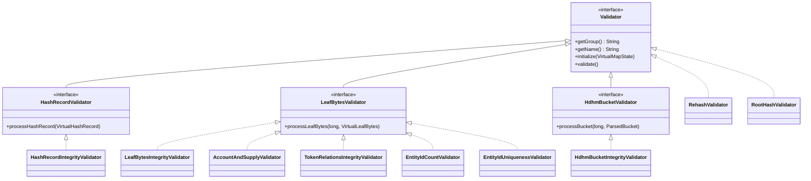

# Hedera State Validator

The **Hedera State Validator** is a comprehensive tool for working with the persisted state of Hedera nodes, providing capabilities to validate state integrity, introspect state contents, export state data,
compact state files, and apply block streams to advance state.

## Validate

[ValidateCommand](src/main/java/com/hedera/statevalidation/ValidateCommand.java) ensures state integrity and validates that Hedera nodes can start from existing state snapshots.
Can also be used for development purposes, such as verifying that the node's state remains intact after refactoring or debugging to investigate the root cause of a corrupted state.

### Usage

1. Download the state files.
2. Run the following command to execute the validation:

```shell
java -jar ./validator-.jar {path-to-state-round} validate {group} [{group}...] [options]
```

### Parameters

- `{path-to-state-round}` - Location of the state files (required).
- `{group}` - Validation group that should be run, multiple groups can be specified, separated by spaces (at least one required). Current supported groups:
  - [`all`](/src/main/java/com/hedera/statevalidation/validator/Validator.java) - Runs all validators.
  - [`internal`](/src/main/java/com/hedera/statevalidation/validator/HashRecordIntegrityValidator.java) - Validates hash record integrity for internal nodes.
  - [`leaf`](/src/main/java/com/hedera/statevalidation/validator/LeafBytesIntegrityValidator.java) - Validates leaf bytes integrity.
  - [`hdhm`](/src/main/java/com/hedera/statevalidation/validator/HdhmBucketIntegrityValidator.java) - Validates HDHM bucket integrity in the half-disk hashmap.
  - [`account`](/src/main/java/com/hedera/statevalidation/validator/AccountAndSupplyValidator.java) - Ensures all accounts have a positive balance and verifies total HBAR supply.
  - [`tokenRelations`](/src/main/java/com/hedera/statevalidation/validator/TokenRelationsIntegrityValidator.java) - Verifies that the accounts and tokens for every token relationship exist.
  - `entityIds` - Verifies entity IDs are valid and unique. Validators:
    - [`entityIdCount`](/src/main/java/com/hedera/statevalidation/validator/EntityIdCountValidator.java) - Validates entity ID counts match expected values.
    - [`entityIdUniqueness`](/src/main/java/com/hedera/statevalidation/validator/EntityIdUniquenessValidator.java) - Verifies entity IDs are unique across entity types.
  - `rehash` - Compare root hashes. Validators:
    - [`rehash`](/src/main/java/com/hedera/statevalidation/validator/RehashValidator.java) - Runs a full rehash of the state and compares against the original hash from the `DeserializedSignedState`.
    - [`rootHash`](/src/main/java/com/hedera/statevalidation/validator/RootHashValidator.java) - Validates the root hash against a `hashInfo.txt`.

### Options

- `--io-threads` (or `-io`) - Number of IO threads for reading data files from disk and memory. Default: `4`.
- `--process-threads` (or `-p`) - Number of CPU threads for processing data chunks. These threads parse and validate data items read by IO threads. Default: `6`.
- `--queue-capacity` (or `-q`) - Maximum number of batches that can be queued between IO and processor threads. Controls memory usage and provides backpressure when processors are slower than readers. Default: `100`.
- `--batch-size` (or `-b`) - Number of data items grouped together before being placed in the queue. Larger batches reduce queue contention but increase memory per batch. Default: `10`.
- `--min-chunk-size-mib` (or `-mcs`) - Minimum size in mebibytes (MiB) for file chunks. Each data file is divided into chunks for parallel reading; this sets the floor for chunk size to avoid excessive overhead from too many small chunks. Default: `128`.
- `--chunk-multiplier` (or `-c`) - Multiplier applied to IO thread count to determine the target number of chunks per file collection. Higher values create more, smaller chunks for better load balancing across threads. Default: `2`.
- `--buffer-size-kib` (or `-bs`) - Buffer size in kibibytes (KiB) for file reading operations and chunk boundary detection. Default: `128`.

### Architecture

The validator employs a **two-phase execution model**. First, **individual validators** (those implementing only the base [Validator](src/main/java/com/hedera/statevalidation/validator/Validator.java) interface) run sequentially — each with its own custom execution logic (e.g., full tree rehash, external file comparison). Then, a **parallel pipeline** performs a single-pass traversal of all MerkleDB data files, dispatching items to multiple pipeline validators concurrently — avoiding redundant full-state scans. The architecture is orchestrated by [ValidatorRegistry](src/main/java/com/hedera/statevalidation/validator/ValidatorRegistry.java) and [ValidationPipelineExecutor](src/main/java/com/hedera/statevalidation/validator/pipeline/ValidationPipelineExecutor.java).


### Validator Type Hierarchy

Validators are categorized by the interface they implement. The [ValidatorRegistry](src/main/java/com/hedera/statevalidation/validator/ValidatorRegistry.java) automatically routes data to the correct validators based on this hierarchy.



### Validator Lifecycle

Every validator follows a three-phase lifecycle:

| Phase | Method | Description                                                                                                    |
|---|---|----------------------------------------------------------------------------------------------------------------|
| **Initialize** | `initialize(VirtualMapState)` | Extract state references, set up atomic counters.                                                              |
| **Process** | `processHashRecord` / `processLeafBytes` / `processBucket` | Receive streamed data items (pipeline validators only).                                                        |
| **Validate** | `validate()` | Assert accumulated results; throw [ValidationException](src/main/java/com/hedera/statevalidation/validator/util/ValidationException.java) on failure. |

Individual validators (those implementing only the base [Validator](src/main/java/com/hedera/statevalidation/validator/Validator.java) interface) skip the process phase and perform their own logic directly in `validate()`.

### Execution Flow

1. **State loading** — [ValidateCommand](src/main/java/com/hedera/statevalidation/ValidateCommand.java) initializes the state directory and obtains the `VirtualMapState`.
2. **Individual validators** — [ValidatorRegistry](src/main/java/com/hedera/statevalidation/validator/ValidatorRegistry.java) filters, initializes, and runs individual validators sequentially (e.g., [RehashValidator](src/main/java/com/hedera/statevalidation/validator/RehashValidator.java) performs a full task-based tree rehash, [RootHashValidator](src/main/java/com/hedera/statevalidation/validator/RootHashValidator.java) compares the root hash against a reference file).
3. **Pipeline execution** — [ValidationPipelineExecutor](src/main/java/com/hedera/statevalidation/validator/pipeline/ValidationPipelineExecutor.java) orchestrates the parallel pipeline:
  - **Task planning** — Data files are divided into chunks; in-memory hash ranges are partitioned.
  - **IO threads** read chunks via [ChunkedFileIterator](src/main/java/com/hedera/statevalidation/validator/pipeline/ChunkedFileIterator.java) (disk) or directly from `HashList` (memory), producing batches into a bounded queue.
  - **Processor threads** ([ProcessorTask](src/main/java/com/hedera/statevalidation/validator/pipeline/ProcessorTask.java)) consume batches, check liveness against location indexes, and dispatch live items to the appropriate validators by data type.
  - After all data is consumed, `validate()` is called on each pipeline validator.
4. **Reporting** — [ValidationExecutionListener](src/main/java/com/hedera/statevalidation/validator/listener/ValidationExecutionListener.java) tracks failures. On failure, [SlackReportBuilder](src/main/java/com/hedera/statevalidation/report/SlackReportBuilder.java) generates a report.

### Pipeline Data Types

| Type | Source | Content        | Dispatched To |
|---|---|----------------|---|
| **P2KV** | Leaf data files | `VirtualLeafBytes` | [LeafBytesValidator](src/main/java/com/hedera/statevalidation/validator/LeafBytesValidator.java) impls |
| **P2H** | Hash data files + in-memory `HashList` | `VirtualHashRecord` | [HashRecordValidator](src/main/java/com/hedera/statevalidation/validator/HashRecordValidator.java) impls |
| **K2P** | HDHM bucket files | `ParsedBucket` | [HdhmBucketValidator](src/main/java/com/hedera/statevalidation/validator/HdhmBucketValidator.java) impls |

### Thread Safety

- State is **read-only** during validation.
- All validator counters must use `AtomicLong` / `AtomicInteger`.
- The bounded queue provides backpressure between IO and processor threads.
- [ValidationListener](src/main/java/com/hedera/statevalidation/validator/listener/ValidationListener.java) implementations must be thread-safe (callbacks arrive from multiple threads).

### Adding a New Validator

1. Create a class implementing [HashRecordValidator](src/main/java/com/hedera/statevalidation/validator/HashRecordValidator.java), [LeafBytesValidator](src/main/java/com/hedera/statevalidation/validator/LeafBytesValidator.java), [HdhmBucketValidator](src/main/java/com/hedera/statevalidation/validator/HdhmBucketValidator.java), or base [Validator](src/main/java/com/hedera/statevalidation/validator/Validator.java).
2. Add an instance to [ValidatorRegistry.ALL_VALIDATORS](src/main/java/com/hedera/statevalidation/validator/ValidatorRegistry.java).
3. *(Optional)* Define a new group constant and add it to [ValidateCommand](src/main/java/com/hedera/statevalidation/ValidateCommand.java)'s parameters.

The registry automatically categorizes validators by their interface type.

### Performance Model

- **Pipeline validators:** Single traversal shared by all validators of the same data type → **O(T)** instead of **O(T × N)**.
- **Individual validators:** Each performs its own traversal → **O(T × M)**.

Where `T` = time for one full traversal, `N` = pipeline validators, `M` = individual validators.


## Introspect

[IntrospectCommand](src/main/java/com/hedera/statevalidation/IntrospectCommand.java) inspects node state structure and provides insights into the contents of state files.

### Usage

1. Download the state files.
2. Run the following command to execute the introspection:

```shell
java -jar ./validator-<version>.jar {path-to-state-round} introspect --service-name=<service-name> \
 --state-key=<state-key> \
 [--key-info=<keyType:keyJson>]
```

### Parameters

- `{path-to-state-round}` - Location of the state files (required).

### Options

- `--service-name` (or `-s`) - Name of the service to introspect (required).
- `--state-key` (or `-k`) - Name of the state to introspect (required).
- `--key-info` (or `-i`) - Key, which used to get information about the values in the virtual map of the service state. If this option is not provided, command introspects a singleton value of the service state.
  Should be specified in a format `keyType:keyJson`, where:
  - `keyType` represents the service key type (`TopicID`, `AccountID`, etc.)
  - `keyJson` represents key value as JSON.

## Analyze

[AnalyzeCommand](src/main/java/com/hedera/statevalidation/AnalyzeCommand.java) analyzes state storage and generates detailed metrics about storage efficiency, including duplicate percentage, item counts,
file counts, wasted space in bytes, and total space usage. These metrics are displayed in the console and also saved to a `state-analysis.log` file.

### Usage

1. Download the state files.
2. Run the following command to execute the introspection:

```shell
java -jar ./validator-<version>.jar {path-to-state-round} analyze [--path-to-kv] [--key-to-path] [--path-to-hash]
```

### Parameters

- `{path-to-state-round}` - Location of the state files (required).

### Options

- `--path-to-kv` (or `-p2kv`) - Analyze path-to-key-value storage.
- `--key-to-path` (or `-k2p`) - Analyze key to path storage.
- `--path-to-hash` (or `-p2h`) - Analyze path-to-hash storage.

If no options are specified, all storage types are analyzed by default.

### Analysis Metrics

The analysis generates comprehensive storage reports that include:

- **Item Count**: Total number of stored items.
- **File Count**: Number of storage files.
- **Storage Size**: Total disk space usage in MB.
- **Waste Percentage**: Percentage of space consumed by duplicate or invalid entries.
- **Duplicate Items**: Number of items that appear multiple times.
- **Path Range**: Minimum and maximum path values in the storage.

The results are displayed in the console and saved to a `state-analysis.log` file.

### Sample Output

```terminaloutput
Report for node: 0

Path-to-Hash Storage:
  Key Range: 0 to 1484
  Size: 0 MB
  Files: 1
  Items: 0
  Waste: 0.00%

Key-to-Path Storage:
  Key Range: 0 to 33554431
  Size: 0 MB
  Files: 1
  Items: 743
  Waste: 0.00%

Path-to-KeyValue Storage:
  Key Range: 742 to 1484
  Size: 0 MB
  Files: 1
  Items: 743
  Waste: 0.00%
```

## Export

[ExportCommand](src/main/java/com/hedera/statevalidation/ExportCommand.java) exports the node state into JSON file(s).

### Usage

1. Download the state files.
2. Run the following command to execute the export:

```shell
java -jar [-DmaxObjPerFile=<number>] [-DprettyPrint=true] ./validator-<version>.jar {path-to-state-round} export \
 --out=<output-directory> \
 [--service-name=<service-name> --state-key=<state-key>] \
 [--first-leaf-path=<first-leaf-path>] [--last-leaf-path=<last-leaf-path>]
```

### System Properties

- `-DmaxObjPerFile` - Maximum number of objects per exported file. Default = `1000000`.
- `-DprettyPrint=true` - Enable human-readable formatting in result files. Set to `true` to enable. Default = `false`.

### Parameters

- `{path-to-state-round}` - Location of the state files (required).

### Options

- `--out` (or `-o`) - Directory where the exported JSON files are written (required). Must exist before invocation.
- `--service-name` (or `-s`) - Name of the service to export. If omitted along with `--state-key`, exports all states.
- `--state-key` (or `-k`) - Name of the state to export. If omitted along with `--service-name`, exports all states.
- `--first-leaf-path` (or `-f`) - First leaf path in the export range (inclusive). If not specified, defaults to the actual first leaf path in the supplied state.
  Must be within the range of actual leaf paths in the supplied state.
- `--last-leaf-path` (or `-l`) - Last leaf path in the export range (inclusive). If not specified, defaults to the actual last leaf path in the supplied state.
  Must be within the range of actual leaf paths in the supplied state.

### Output Format

Example entry:

```
{"p":742, "k":"{
    \"accountNum\": \"503\"
}", "v":"{
    \"accountId\": {
      \"accountNum\": \"503\"
    },
    \"key\": {
      \"ed25519\": \"CqjiEGTGHquG4qnBZFZbTnqaQUYQbgps0DqMOVoRDpI=\"
    },
    \"expirationSecond\": \"1769026993\",
    \"stakePeriodStart\": \"-1\",
    \"stakeAtStartOfLastRewardedPeriod\": \"-1\",
    \"autoRenewSeconds\": \"8000001\"
}"}
```

where `p` is a path in the virtual map, `k` is a key, and `v` is a value.

### Examples

Export all states to the current directory (assuming the JAR file is located in the round directory):

```shell
java -jar ./validator-<version>.jar . export --out=.
```

Export all states to the current directory, limiting the number of objects per file to 100,000:

```shell
java -jar -DmaxObjPerFile=100000 ./validator-<version>.jar /path/to/round export --out=.
```

Export all accounts to `/tmp/accounts`, limiting the number of objects per file to 100,000:

```shell
java -jar -DmaxObjPerFile=100000 ./validator-<version>.jar /path/to/round export --out=/path/to/result \
  --service-name=TokenService --state-key=ACCOUNTS
```

### Notes

- If the service name and state key are omitted, it will export all the states.
- Service name and state key should both be either omitted or specified.
- If service name and state key are specified, the resulting file is `{service_name}_{state_key}_X.json`, where `X` is an ordinal number in the series of such files.
- If service name and state key are not specified, the resulting file is `exportedState_X.json`, where `X` is an ordinal number in the series of such files.
- The exporter limits the number of objects per file to 1 million; to customize the limit, use VM parameter `-DmaxObjPerFile`.
- Keep in mind that the object count per file—though consistent across multiple runs—is likely to be uneven.
- The order of entries is consistent across runs and ordered by path.

## Sorted Export

[SortedExportCommand](src/main/java/com/hedera/statevalidation/SortedExportCommand.java) exports the node state into sorted JSON file(s), which may be helpful during differential testing.

### Usage

1. Download the state files.
2. Run the following command to execute the sorted export:

```shell
java -jar [-DmaxObjPerFile=<number>] [-DprettyPrint=true] ./validator-<version>.jar {path-to-state-round} sorted-export \
  --out=<output-directory> \
  [--service-name=<service-name> --state-key=<state-key>] \
  [--first-leaf-path=<first-leaf-path>] [--last-leaf-path=<last-leaf-path>]
```

### Output Format

Example entry:

```
{"k":"{
    \"accountNum\": \"1\"
}", "v":"{
    \"accountId\": {
        \"accountNum\": \"1\"
    },
    \"key\": {
        \"ed25519\": \"CqjiEGTGHquG4qnBZFZbTnqaQUYQbgps0DqMOVoRDpI=\"
    },
    \"expirationSecond\": \"1769026993\",
    \"stakePeriodStart\": \"-1\",
    \"stakeAtStartOfLastRewardedPeriod\": \"-1\",
    \"autoRenewSeconds\": \"8000001\"
}"}
```

where `k` is a key, and `v` is a value.

### System Properties / Parameters / Options / Examples / Notes

**Same as the export command right above, with these differences:**

- Paths are not included in sorted export files.
- The data is sorted by the **byte representation of the key**, which doesn't always map to natural ordering. For example, varint encoding does not preserve numerical ordering under lexicographical byte comparison,
  particularly when values cross boundaries that affect the number of bytes or the leading byte values. However, it will produce a stable ordering across different versions of the state, which is critically important for differential testing.

## Diff

The [DiffCommand](src/main/java/com/hedera/statevalidation/DiffCommand.java) class compares two states and generates two files that can be used to create a diff.

### Usage

1. Download the state files.
2. Run the following command to execute the diff:

```shell
java -jar ./validator-<version>.jar {path-to-state1} diff {path-to-state2} \
  --out=<output-directory> \
  [--service-name=<service-name> --state-key=<state-key>]
```

### Parameters

- `{path-to-state1}` - Location of the first state files (required).
- `{path-to-state2}` - Location of the second state files (required).

### Options

- `--out` (or `-o`) - Directory where the resulting json files are written (required).
- `--service-name` (or `-s`) - Name of the service to diff. If omitted along with `--state-key`, diffs all states.
- `--state-key` (or `-k`) - Name of the state to diff. If omitted along with `--service-name`, diffs all states.

### Notes

- The command generates two files: `state1-diff.json` and `state2-diff.json` in the specified `--out` directory.
- `state1-diff.json` contains entries that were either deleted in the second state or modified (showing the old value).
- `state2-diff.json` contains entries that were either added in the second state or modified (showing the new value).
- Service name and state key should both be either omitted or specified.

## Compact

[CompactionCommand](src/main/java/com/hedera/statevalidation/CompactionCommand.java) performs compaction of state files.

### Usage

1. Download the state files.
2. Run the following command to execute the compaction:

```shell
java -jar ./validator-<version>.jar {path-to-state-round} compact
```

### Parameters

- `{path-to-state-round}` - Location of the state files (required).

## Updating State with a Block Stream

[ApplyBlocksCommand](src/main/java/com/hedera/statevalidation/ApplyBlocksCommand.java) advances a given state from the current state to the target state using a set of block files.

### Usage:

```shell
java -jar ./validator-<version>.jar {path-to-state-round} apply-blocks --block-stream-dir=<path-to-block-stream-files> \
 --node-id=<self-id> \
 [--out=<path to output directory>] [--expected-hash=<hash of the target state>] [--target-round=<target round>]
```

### Parameters

- `{path-to-state-round}` - Location of the state files (required).

### Options

- `--block-stream-dir` (or `-d`) - Location of the block stream files (required).
- `--out` (or `-o`) - The location where the resulting snapshot is written. Must not exist prior to invocation. Default = `./out`.
- `--node-id` (or `-id`) - The ID of the node that is being used to recover the state. This node's keys should be available locally.
- `--target-round` (or `-t`) - The last round that should be applied to the state, any higher rounds are ignored. If a target round is specified, the command will not apply rounds beyond it, even if additional block files exist.
- `--expected-hash` (or `-h`) - Expected hash of the resulting state. If specified, the command can validate the hash of the resulting state against it.

### Notes:

- The command checks if the block stream contains the next round relative to the initial round to ensure continuity. It fails if the next round is not found.
- The command also verifies that the corresponding blocks are present. It will fail if a block is missing or if the final round in the stream does not match the target round.
