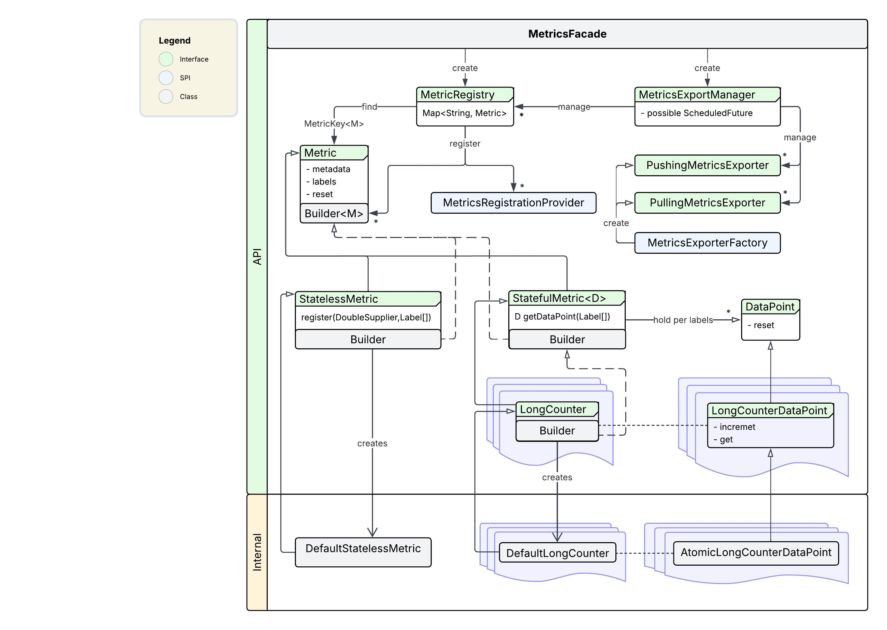

## Metrics Overview

Metrics are one of the three pillars of observability, alongside logging and tracing.<br/>
Metrics provide quantitative, numerical data about a system’s state and performance, typically sampled at regular intervals.
They help track trends, resource usage, and system health over time.

### Goals

1. Compatibility with [OpenMetrics1.1](https://github.com/prometheus/OpenMetrics/blob/main/specification/OpenMetrics.md).
2. Minimum dependencies.
3. High performance with low memory footprint.
4. Support for multiple exporters (e.g., Prometheus, JMX, CSV, etc.).
5. Support client aggregations and resetting on export.
6. Support plugging any external code into metrics.
7. Provide SPI for easy configuration.

### Architecture



### Key Concepts

In many standards like **OpenMetrics** and **OpenTelemetry** metric has these key attributes:
- Metadata (name, description, unit, type)
- Labels (key-value string pairs)
- Value(s) (numeric value)

Metric labels provide dimensionality to metrics, allowing for more granular analysis.
Each unique combination of labels (even empty) represents a distinct time series within the metric over time with exporting.
Metric value(s), uniquely identified by the combination of metric metadata and labels.
**Data Point** serve as a container for the actual metric value(s) and provide methods
to update them on observation and retrieve value(s) during exporting.

See more about metrics here: [📘Metrics Details](metrics_details.md).

---

Metric API doesn't provide explicit methods to export metrics.
Instead, it provides interfaces to implement exporters and a manager to configure and run them.
Some metrics support client aggregations (tracking min, max, etc.) and allow to reset aggregated value on export.

See more about metrics exporting here: [📘Metrics Exporting](metrics_exporting.md).

---

The Metrics Core module is split into two root packages:
- `org.hiero.metrics.api` - contains public API for recording and exporting metrics.
- `org.hiero.metrics.internal` - contains internal implementation of the API.

Entry points for clients are:
- All metrics defined in `org.hiero.metrics.api` package, that can be used to create and update metrics.
- [MetricsRegistry](../src/main/java/org/hiero/metrics/api/core/MetricRegistry.java) and its builder, to create registry for metrics.
- [MetricsExportManager](../src/main/java/org/hiero/metrics/api/export/MetricsExportManager.java) and its builder, to create export manager, managing exports of a single metrics registry using one or more exporters.

### Typical production example

```java
public class Application {
    public static void main(String[] args) {
        Configuration configuration = ConfigurationBuilder.create()
                // init configuration
                .build();

        // create metrics registry named "my-app-registry" without global labels and register all metrics found
        // by any implementation of MetricsRegistrationProvider SPI
        MetricRegistry metricRegistry = MetricRegistry.builder("my-app-registry")
                .withDiscoverMetricProviders()
                .build();

        // create export manager managing registry created above, that will discover all implementations
        // of MetricsExporterFactory SPI and create exporters using the provided configuration.
        MetricsExportManager exportManager = MetricsExportManager.builder()
                .withDiscoverExporters(configuration)
                .build(metricRegistry);

        // pass metrics registry to required classes to retrieve or register metrics
        // Use IdempotentMetricsBinder to bind metrics registry in a thread-safe and idempotent way
        MyModuleService service = new MyModuleService();
        service.bindMetrics(metricRegistry);

        // Application logic...
    }
}

// Each module can register some metrics by implementing MetricsRegistrationProvider SPI
class MyModuleMetrics implements MetricsRegistrationProvider {

    public static final MetricKey<LongCounter> REQUESTS_COUNTER_KEY = MetricKey.of("requests", LongCounter.class);

    @Override
    public Collection<Metric.Builder<?, ?>> getMetricsToRegister(MetricRegistry registry) {
        // provide metrics to register
        return List.of(
                LongCounter.builder(REQUESTS_COUNTER_KEY)
                .withDescription("Total number of requests")
                .withDynamicLabelNames("method", "path")
                .build()
        );
    }
}

// service class that uses the metric registered above
class MyModuleService implements MetricsBinder {

    private LongCounter requestsCounter;

    @Override
    public void bindMetrics(MetricRegistry registry) {
        // retrieve existing metric by its key
        this.requestsCounter = registry.getMetric(MyModuleMetrics.REQUESTS_COUNTER_KEY);
    }

    public void handleRequest(HttpMethod method, String path) {
        // observe metric
        requestsCounter.getOrCreateLabeled("method", method.toString(), "path", path).increment();
    }
}
```

```java
// module-info.java
module my.module {
    requires org.hiero.metrics.core;

    provides org.hiero.metrics.api.core.MetricsRegistrationProvider with
            org.hiero.metrics.MyModuleMetrics;
}
```

```gradle
// gradle build.gradle of the application
mainModuleInfo {
    // add open metrics http endpoint exporter so it can be discovered via SPI
    runtimeOnly("org.hiero.metrics.openmetrics.http")
}
```

### Key classes

- [Metric](../src/main/java/org/hiero/metrics/api/core/Metric.java)
- [DataPoint](../src/main/java/org/hiero/metrics/api/datapoint/DataPoint.java)
- [MetricRegistry](../src/main/java/org/hiero/metrics/api/core/MetricRegistry.java)
- [MetricsRegistrationProvider](../src/main/java/org/hiero/metrics/api/core/MetricsRegistrationProvider.java)
- [MetricsExporter](../src/main/java/org/hiero/metrics/api/export/MetricsExporter.java)
- [MetricsExporterFactory](../src/main/java/org/hiero/metrics/api/export/MetricsExporterFactory.java)
- [MetricsExportManager](../src/main/java/org/hiero/metrics/api/export/MetricsExportManager.java)
