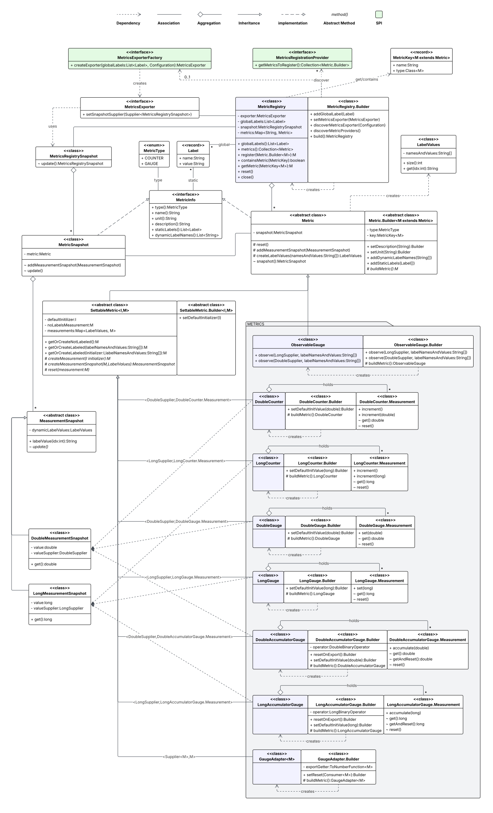

## Metrics Details

[📘Back to Overview](metrics_overview.md)

### Class Diagram

### Metric API

All metrics available to use are defined in `org.hiero.metrics` package. 
Each class has a builder class to configure and create an instance of the metric.
Any builder requires a [MetricKey](../src/main/java/org/hiero/metrics/core/MetricKey.java) to be provided, that identifies metric by name and class of metric interface.

Core metric class is [Metric](../src/main/java/org/hiero/metrics/core/Metric.java) which provides methods to access metric metadata, defined during metric creation.
Metric may have zero or more _static_ labels that already have a value and will be attached to all measurements of the metric.
Metric may also have zero or more _dynamic_ labels, names of which are defined during metric creation and values are defined when accessing a specific measurement of the metric for observation/update.

There are two main extensions of the abstract `Metric` class:
- [ObservableGauge](../src/main/java/org/hiero/metrics/ObservableGauge.java) 
A metric which doesn't hold measurements providing methods to update the values, but instead holds observable value suppliers per unique combination of dynamic labels.
Updates to such metrics are done via external code. Examples are JVM memory usage metric, CPU usage metric, etc.
- [SettableMetric](../src/main/java/org/hiero/metrics/core/SettableMetric.java) 
Base abstract class for a metric, which holds measurements per unique combination of dynamic label values, providing methods to update them.
Metric knows how to instantiate a measurement and snapshot it. When new dynamic label values are provided,
it will create a new measurement and return it to the client for observation, otherwise return existing measurement.
Such metric also knows measurement default initializer - an object used to initialize newly created measurements (like initial value),
but API also allows to provide custom initializer when accessing measurement by specific dynamic label values.
If no dynamic labels are defined for the metric, then it will have a single measurement, which also will be created lazily on first access.

### Metric Types

Supported metric types are defined by enum [MetricType](../src/main/java/org/hiero/metrics/core/MetricType.java)
Here is the table of all metrics available to use:

|                                          Metric                                          |  Type   |                                                             Description                                                              |
|------------------------------------------------------------------------------------------|---------|--------------------------------------------------------------------------------------------------------------------------------------|
| [LongCounter](../src/main/java/org/hiero/metrics/LongCounter.java)                       | Counter | Allows to increment `long` (only increasing).                                                                                        |
| [DoubleCounter](../src/main/java/org/hiero/metrics/DoubleCounter.java)                   | Counter | Allows to increment `double` (only increasing).                                                                                      |
| [ObservableGauge](../src/main/java/org/hiero/metrics/ObservableGauge.java)               | Gauge   | Requires zero ore more `DoubleSupplier`/`LongSupplier` (with optional labels), which will be called on export.                       |
| [LongGauge](../src/main/java/org/hiero/metrics/LongGauge.java)                           | Gauge   | Gauge to store latest `long` value.                                                                                                  |
| [LongAccumulatorGauge](../src/main/java/org/hiero/metrics/LongAccumulatorGauge.java)     | Gauge   | Gauge to accumulate `long` value. Requires `LongAccumulator`.                                                                        |
| [DoubleGauge](../src/main/java/org/hiero/metrics/DoubleGauge.java)                       | Gauge   | Gauge to store latest `double` value.                                                                                                |
| [DoubleAccumulatorGauge](../src/main/java/org/hiero/metrics/DoubleAccumulatorGauge.java) | Gauge   | Gauge to accumulate `double` value. Requires `DoubleAccumulator`.                                                                    |
| [GaugeAdapter](../src/main/java/org/hiero/metrics/GaugeAdapter.java)                     | Gauge   | A gauge to adapt to any external class that is used to store and update a single value. Parametrized with external measurement type. |

### Metric Registry

[MetricRegistry](../src/main/java/org/hiero/metrics/core/MetricRegistry.java) can be used to register new metrics and retrieve existing ones.
Metric registry may have exporter assigned to it, which will be used to export all registered metrics.
Metric registry may have immutable list of global labels, which will be applied to all registered metrics.

There are two ways to register metrics in the registry:
- Programmatically - by using metric builders and calling `register` method of the registry.
This way is usually used when metrics are created and used only in specific limited scope of the application.
- Declaratively - by implementing [MetricsRegistrationProvider](../src/main/java/org/hiero/metrics/core/MetricsRegistrationProvider.java)
interface (providing implementation via SPI) and calling `discoverMetricProviders` method of the registry builder.

Metric registry cannot have two metrics with the same name.
To identify a metric in the registry a [MetricKey](../src/main/java/org/hiero/metrics/core/MetricKey.java) should be used,
which contains metric name and class of the metric interface, used to validate metric type and cast to required metric interface when retrieving by key.

`MetricsRegistry.Builder` is used to create instances of Metric Registry.
Its `discoverMetricProviders` method allows to discover all available `MetricsRegistrationProvider` implementations via Service Loader and register provided metrics.
To be discovered by SPI mechanism implementations of this interface should be registered either in
`META-INF/services/org.hiero.metrics.api.core.MetricsRegistrationProvider` or `module-info.java` file of the module.

[MetricsBinder](../src/main/java/org/hiero/metrics/core/MetricsBinder.java) can be used to bind/propagate metrics registry to any application class.
Application classes can implement this interface to register metrics in the registry or retrieve metrics by `MetricKey`s for observations.
Metric registry should be explicitly provided to the binder.

### Exporting

Metrics exporting is done via exporter that implements [MetricsExporter](../src/main/java/org/hiero/metrics/core/MetricsExporter.java) interface.
It can be set programmatically in `MetricsRegistry.Builder` or discovered via SPI using [MetricsExporterFactory](../src/main/java/org/hiero/metrics/core/MetricsExporterFactory.java) when `discoverMetricsExporter` method is called on `MetricsRegistry.Builder`.

To be discovered by SPI mechanism implementations of `MetricsExporterFactory` should be registered either in
`META-INF/services/org.hiero.metrics.api.export.MetricsExporterFactory` or `module-info.java` file of the module.

Snapshots provided to exporter contain all registered metrics in the registry with their measurements and values at the moment of snapshot.
Snapshots internally are reusable objects and values are added/updates during each registry snapshot, which is **synchronous** operation.

### Tips and Tricks

1. Use global labels in Metric Registry only if they cannot be added during metrics ingestion.
   Usually ingesters like OTEL Collector are able to attach environment or instance labels to all metrics, when collecting them.
2. **DO NOT** use high-cardinality objects (like IDs, hashes, timestamps, etc.) as dynamic label values of the metric.
3. Metric must be registered once in a registry and may be use in different places in the code.
   Use [MetricsRegistrationProvider](../src/main/java/org/hiero/metrics/core/MetricsRegistrationProvider.java) for metrics registration
   and [MetricsBinder](../src/main/java/org/hiero/metrics/core/MetricsBinder.java) to propagate registry and access metrics and their measurements in application classes.
4. When metric has dynamic labels, it is recommended to pass `String` label names and values in **alphabetical** label name order to access labeled measurements. This may slightly improve performance of map lookups internally, because framework will not need to reorder label names and values on each access.
5. If label values are known in advance (not provided from outside), it is recommended to access labeled measurement once and keep in some class field. This will avoid map lookups on each access labeled measurement update.

[📘Back to Overview](metrics_overview.md)
