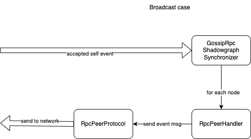

# Simple broadcast

As a proof-of-concept, a simple broadcast mechanism was implemented on top of rpc sync protocol.

It follows a very simple rule - each time a node creates an event, it pushes this event to all connected nodes. There is
no special handling for spanning trees, shunning nodes, etc - just very simple broadcast to all.

This works well only with a fully connected network, but this is what we have right now, and it gives a testing platform
for more complex implementations and a baseline to compare them against.

The system is still using a full sync implementation as a fallback, but with a lower frequency, to allow catching up
with broken nodes, work around dead connections, and provide some resiliency.

To avoid a high duplicate ratio (where every sync resyncs all events coming from the broadcast anyway), the default
frequency of sync was decreased to occur at most a few times per second. This provides a reasonable window for the
broadcast to push enough events, which will be processed to reduce duplications. In the future, we might want to revisit
more sophisticated sync algorithms, which will skip asking for items already received from the broadcast but not yet seen
in the shadow graph.

At the moment, a simple system for managing backpressure for broadcast is implemented. If the number of items in the output
queue is too big, or the amount of time needed to do full there-and-back processing of messages is too large, broadcast
gets disabled for some time, to let sync handle the situation. This might as well cause certain lines to be never
using broadcast, which is not bad, as they are so delayed that all the events would be obsolete anyway.

## Diagram of new classes for RPC communication and broadcast interaction

