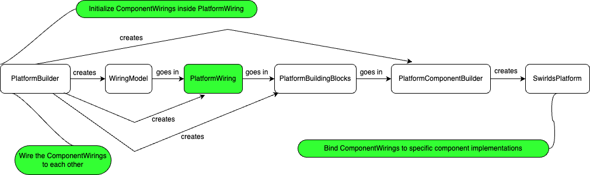

# Platform Building

In order for the platform to be created and started, so that it can start emitting or receiving events, it must be built.
The main component that holds the platform together is the `SwirldsPlatform`.

To be able to create it, we use several helper classes, builders and a wiring platform that describes the communication between
all the needed components. Basically the platform can be summarized as a set of components that are connected to each other
and perform different actions and operations, where the main workflow is accepting events and producing rounds
ordered by consensus. The logic in-between is conducted by these components.

Let's describe the different helper classes and builders used to create the `SwirldsPlatform`.

## Helper Classes

### PlatformComponentBuilder

Since the platform consists of various components, we need a way to construct them and set specific implementation for
each of them, if needed. Each component is described as an interface with the methods that are exposed in the
wiring engine for communication between these components.

The `PlatformComponentBuilder` serves as a builder for using the default component implementation or overriding
them with a custom one. In this way, we can build the platform and tailor it, the way we want.

It consists of all the components that are going to be later wired and a special helper record that keeps important
metadata and piece of data that the components need to be constructed and is called `PlatformBuildingBlocks`.

The current components needed to build the platform are:

- EventHasher
- InternalEventValidator
- EventDeduplicator
- EventSignatureValidator
- SelfEventSigner
- StateGarbageCollector
- OrphanBuffer
- EventCreationManager
- ConsensusEngine
- ConsensusEventStream
- SignedStateSentinel
- PcesSequencer
- RoundDurabilityBuffer
- StatusStateMachine
- TransactionPrehandler
- PcesWriter
- InlinePcesWriter
- IssDetector
- IssHandler
- Gossip
- StaleEventDetector
- TransactionResubmitter
- TransactionPool
- StateHasher
- StateSnapshotManager
- HashLogger
- BranchDetector
- BranchReporter
- StateSigner
- TransactionHandler
- LatestCompleteStateNotifier

Another super important task of the `PlatformComponentBuilder` is to initialize the main platform class - `SwirldsPlatform`.
It's a bit confusing since `PlatformBuilder` creates the `PlatformComponentBuilder` and then `PlatformComponentBuilder`
creates the `SwirldsPlatform`. The construction of the `SwirldsPlatform` might be moved to the `PlatformBuilder` itself.

### PlatformBuildingBlocks

This record keeps utility classes, suppliers, callbacks and metadata that are used to construct the platform components.

For example such data is roster history, NodeId, RandomBuilder, WiringModel

### PlatformWiring

A key component in the platform that can be interpreted as the "engine" of the whole module is the `PlatformWiring`.
It defines all of the communication channels between the components and the way they are connected to each other.

In order to construct the wiring itself, several initialization phases are performed.

#### Initialize ComponentWirings

The first one is to invoke the constructor of the class where all of the needed `ComponentWiring` fields are initialized, using
a WiringModel, default implementation of the component interfaces needed and a specific configuration.

#### Wiring of the components

After the wirings are declared, the next phase is to call the `wire()` method, which performs the actual wiring of
the components and their specific communication by linking output and input wires. For some of the
output wires special transformers are used to adapt the streamed data to the needed format for the linked input wire.

These 2 stages are performed in the `PlatformBuilder`, which is described in the next section.

#### Binding

Each of the defined ComponentWiring should be bound to a specific component implementation. This step is performed after the
first 2. All of the wirings are bound or linked to the components. Some of them are passed directly in the bind() method,
others are constructed and fetched from the `PlatformComponentBuilder`. The binding itself happens in the constructor
of the main class - `SwirldsPlatform`. The components which are not part of the `PlatformComponentBuilder` are defined in this
constructor and then passed to the `bind()` method of the `PlatformWiring`.

A good clean up will be these components, which are constructed in the `SwirldsPlatform` constructor to be moved to the
`PlatformComponentBuilder` and fetched from there as well. To do so, the `PlatformComponentBuilder` should also hold
the `PlatformContext` and `SignedStateNexus` in order to build these components. Most of the other needed fields are hold
into the `PlatformBuildingBlocks` record, which is already part of the `PlatformComponentBuilder`.

### PlatformBuilder

That's the last helper class which is responsible for building the `PlatformComponentBuilder`, where to do so, it
also builds the `PlatformWiring` and the `PlatformBuildingBlocks`, which are contained in the `PlatformComponentBuilder`.

The main benefits of this builder is setting specific Configuration, callbacks, KeysAndCerts, WiringModel, RandomBuilder,
PlatformContext, all of which become part of the `PlatformBuildingBlocks` record.

The use of the `PlatformBuilder` ends with the construction of the `PlatformComponentBuilder`. It might be more clear to
move the `SwirldsPlatform` creation logic inside the `PlatformBuilder` itself. And/or even merging the 2 builders
and have a common one.

### Overview

Here is a diagram illustrating the connection and sequence between all of the builders and key components used to
construct the `SwirldsPlatform`

