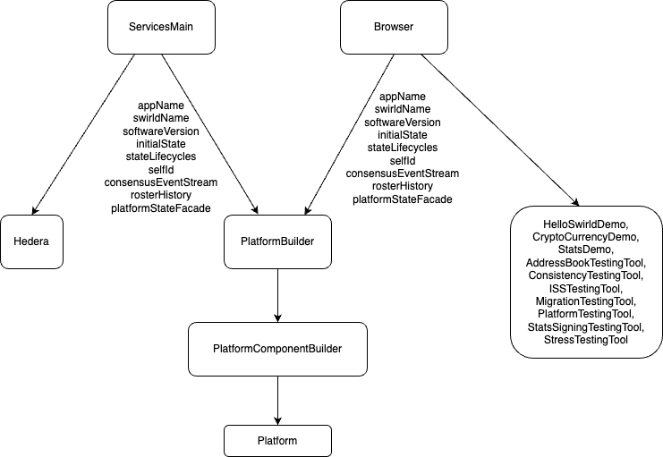
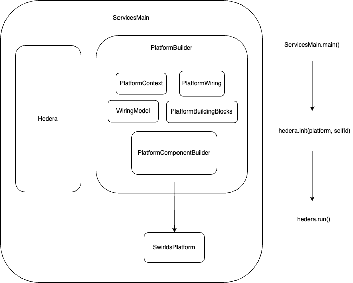

# Platform Building

In order for the platform to be created and started, so that it can start emitting or receiving events, it must be built.
The main component that holds the platform together is the `SwirldsPlatform`.

To be able to create it, we use several helper classes, builders and a wiring platform that describes the communication between
all the needed components. Basically the platform can be summarized as a set of components that are connected to each other
and perform different actions and operations, where the main workflow is accepting events and producing rounds
ordered by consensus. The logic in-between is conducted by these components.

Let's describe the different helper classes and builders used to create the `SwirldsPlatform`.

## Helper Classes

### PlatformBuildingBlocks

Before we create the actual platform, we need some pieces of data as prerequisites. These are called building blocks.
They can vary based on the specific application that the platform is built for. These blocks are passed from the outside
using the constructor and the builder methods of the `PlatformBuilder`. In this way we can tailor the platform structure
based on our use case. The building blocks we currently have are:

- appName - the name of the application, currently used for deciding where to store states on disk
- swirldName - the name of the swirld, currently used for deciding where to store states on disk
- softwareVersion - the software version of the application
- initialState - the genesis state supplied by application
- stateLifecycles - the state lifecycle events handler defined in the specific application
- selfId - the ID of the node that constructs the platform
- consensusEventStreamName - a part of the name of the directory where the consensus event stream is written
- platformStateFacade - the facade to access the platform state using specific provider of SoftwareVersion by the app
- configuration - specific configuration to use to build the platform
- preconsensusEventConsumer - registers a callback that is called for each valid non-ancient preconsensus event in topological order
- snapshotOverrideConsumer - registers a callback that is called when the consensus snapshot is specified by an out of band operation
- staleEventConsumer - register a callback that is called when a stale self event is detected
- systemTransactionEncoder - register a callback that is called when the platform needs to encode a system transaction
  using app specific encoding logic
- keysAndCerts - provide the cryptographic keys to use for this node
- model - specific WiringModel to use for linking the different components
- randomBuilder - provide the source of non-cryptographic randomness for this platform
- platformContext - provide the  platform context for this platform

As we can see all of these building blocks are app specific and need to be provided externally.

### PlatformComponentBuilder

Since the platform consists of various components, we need a way to construct them and set specific implementation for
each of them, if needed. Each component is described as an interface, having methods that are exposed in the
wiring engine.

The `PlatformComponentBuilder` serves as a builder for using the default component implementation or overriding
them with a custom one. In this way, we can build the platform and tailor it, the way we want.

It consists of all the components that are going to be later wired and the `PlatformBuildingBlocks` described in the
previous section.

An example for building a component using the `PlatformBuildingBlocks` is the following:

```java
final PcesFileManager preconsensusEventFileManager = new PcesFileManager(
        blocks.platformContext(),
        blocks.initialPcesFiles(),
        blocks.selfId(),
        blocks.initialState().get().getRound());
        inlinePcesWriter = new DefaultInlinePcesWriter(blocks.platformContext(),
        preconsensusEventFileManager, blocks.selfId());
```

The `PlatformComponentBuilder` sometimes also creates additional components used to initialize the main components. In this
case it's the `PcesFileManager`.

Another examples are:

```java
1. transactionResubmitter = new DefaultTransactionResubmitter(blocks.platformContext());

2. transactionPool = new DefaultTransactionPool(blocks.transactionPoolNexus());

3. gossip = new SyncGossip(
        blocks.platformContext(),
                        AdHocThreadManager.getStaticThreadManager(),
                        blocks.keysAndCerts(),
                        blocks.rosterHistory().getCurrentRoster(),
                        blocks.selfId(),
                        blocks.appVersion(),
                        blocks.swirldStateManager(),
                        () -> blocks.getLatestCompleteStateReference().get().get(),
x -> blocks.statusActionSubmitterReference().get().submitStatusAction(x),
state -> blocks.loadReconnectStateReference().get().accept(state),
                        () -> blocks.clearAllPipelinesForReconnectReference()
                                .get()
                                .run(),
                        blocks.intakeEventCounter(),
                        blocks.platformStateFacade());
```

It's obvious how the components use these building blocks to be initialized.

Another important task of the `PlatformComponentBuilder` is to initialize the main platform class - `SwirldsPlatform`.
It's passed in the constructor of the `SwirldsPlatform` and is used to feed it with the building blocks, so that
other helper classes can be constructed. They are used with combination of the `PlatformComponentBuilder` to bind the
platform wiring, matching specific wiring definition with specific component implementation.

### PlatformWiring

A key component in the platform that can be interpreted as the "engine" of the whole module is the `PlatformWiring`.
It defines all of the communication channels between the components and the way they are connected to each other. The way
it works is by defining different output and input wires, where the output wire of one component is streaming data
to the input wire of another component.

In order to construct the wiring itself, several initialization phases are performed.

#### Initialize ComponentWirings

The first one is to invoke the constructor of the class where all of the needed `ComponentWiring` fields are initialized, using
a WiringModel, default implementation of the component interfaces needed and a specific configuration.

#### Wiring of the components

After the wirings are declared, the next phase is to call the `wire()` method, which performs the actual wiring of
the components and their specific communication by linking output and input wires. For some of the
output wires special transformers are used to adapt the streamed data to the needed format for the linked input wire.

These 2 stages are performed in the `PlatformBuilder`, which is described in the next section.

#### Binding

Each of the defined ComponentWiring should be bound to a specific component implementation. This step is performed after the
first 2. All of the wirings are bound or linked to the components. Some of them are passed directly in the bind() method,
others are constructed and fetched from the `PlatformComponentBuilder`. The binding itself happens in the constructor
of the main class - `SwirldsPlatform`. The components which are not part of the `PlatformComponentBuilder` are defined in this
constructor using the `PlatformBuildingBlocks` and then passed to the `bind()` method of the `PlatformWiring`.

A good clean up will be these components, which are constructed in the `SwirldsPlatform` constructor to be moved to the
`PlatformComponentBuilder` and fetched from there as well. To do so, the `PlatformComponentBuilder` should also hold
the `PlatformContext` and `SignedStateNexus` in order to build these components. Most of the other needed fields are hold
into the `PlatformBuildingBlocks` record, which is already part of the `PlatformComponentBuilder`.

### PlatformBuilder

That's the last helper class which is responsible for building the `PlatformComponentBuilder`, where to do so, it
also builds the `PlatformWiring` and the `PlatformBuildingBlocks`, which are contained in the `PlatformComponentBuilder`.

The main benefits of this builder is setting specific app details all of which become part of the `PlatformBuildingBlocks` record.

The use of the `PlatformBuilder` ends with the construction of the `PlatformComponentBuilder`. It might be clearer to
move the `SwirldsPlatform` creation logic inside the `PlatformBuilder` itself. And/or even merging the 2 builders
and have a common one.

The reason why we have a separate PlatformBuilder is due to the need of a given application to construct their own specific
Platform instance. The main production one is built inside `ServicesMain`, where the main consensus node class called Hedera
is created with production specific configs, state instance, etc. Currently, however, we support multiple demo and test related
Hedera apps, which are constructed by the `Browser` class, which is deprecated. It needs to construct a specific
`Platform` instance based on the various apps. That's why we have a separate `PlatformBuilder` that accepts
these unique app configurations and properties and create the needed `Platform` instance. It was initially created by
extracting common logic from the `Browser`.

Here we can see the specific fields that are passed to build the platform and the main classes, which initialize the
different applications with the customized platform.



### Overview

Here is a diagram illustrating the connection and sequence between all of the builders and key components used to
construct the `SwirldsPlatform` and their dependencies with the different applications and main classes that start the
consensus node.


