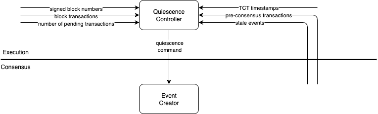

# Quiescence implementation details

## Summary

Quiescence is a feature that stops event creation when it is unnecessary. Please refer to
the [Quiescence HIP](https://github.com/hiero-ledger/hiero-improvement-proposals/blob/main/HIP/hip-1238.md) for the high
level information about this feature.

---

## Quiescence controller

A quiescence controller resides in the execution layer. It needs to track all the quiescence conditions to determine if
the system can quiesce. The consensus engine provides a guarantee that all pre-consensus events will either reach
consensus or become stale. This means that the quiescence controller can simply count the transactions without needing
to track them individually.

The inputs to the quiescence controller are:

- Pre-consensus transactions
    - These are sent to the controller once execution is done parsing them, so that the controller does not need to
      parse them again
- Stale transactions
    - Sent to execution once consensus determines an event is stale
    - These are parsed when being pre-handled, so the controller does not need to parse them again
- Block transactions
    - These are counted as they are being handled by the block tracker
    - Once the handling of transactions in a block is done, the controller gets the block tracker
    - The controller is kept until the block is fully signed
- Fully signed block numbers
    - Once enough signatures are aggregated for a block, the controller is notified with the block number
    - It would have been easier to count the transactions at this point, but this was not possible with the
      implementation of the block manager. Once a block is fully signed, the block manager does not have information
      about the transactions in the block. This is why the block tracking is broken up into two stages.
- TCTs
    - TBD
- Transaction pool counts
    - The controller can ask the transaction pool for the number of transactions it buffered up, for the purposes of
      breaking quiescence

The quiescence controller should take all of this input and determine the quiescence command.

## Restart/Reconnect behavior

The aforementioned guarantees by the consensus engine are reset at the restart/reconnect boundary. This means that after
a reconnect, the controller should just start counting transactions from scratch.

## Quiescence and platform status

## Quiescence command interface

- push status from execution to consensus
- could not find a way of avoiding 3 different states, so using an enum
- bundling status with `getTransactions` was considered, but it had a flaw. the event creator would not call this method
  if it didnt have viable parents, which would mean it would not learn about breaking quiescence. and if it did call it
  without viable parents, it would not know what to do with the transactions it received when not being able to create
  an event

## Metrics

TODO: Add a list of metrics once they are added 

