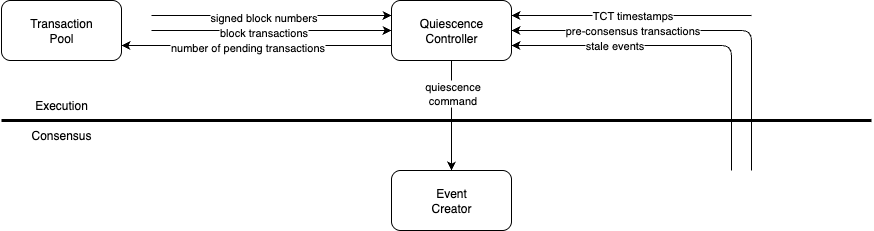

# Quiescence implementation details

## Summary

Quiescence is a feature that stops event creation when it is unnecessary. Please refer to
the [Quiescence HIP](https://github.com/hiero-ledger/hiero-improvement-proposals/blob/main/HIP/hip-1238.md) for the high
level information about this feature.

---

## Quiescence controller

A quiescence controller resides in the execution layer. It needs to track all the quiescence conditions and receives the
following data:

- Pre-consensus events
- Stale events
- Fully signed blocks
- TCTs
- Transaction pool counts

The quiescence controller should take all of this input and determine the quiescence status.

## Quiescence status interface

- push status from execution to consensus
- could not find a way of avoiding 3 different states, so using an enum
- bundling status with `getTransactions` was considered, but it had a flaw. the event creator would not call this method
  if it didnt have viable parents, which would mean it would not learn about breaking quiescence. and if it did call it
  without viable parents, it would not know what to do with the transactions it received when not being able to create
  an event

## Restart/Reconnect behavior

## Quiescence and platform status

## Metrics

TODO: Add a list of metrics once they are added 

