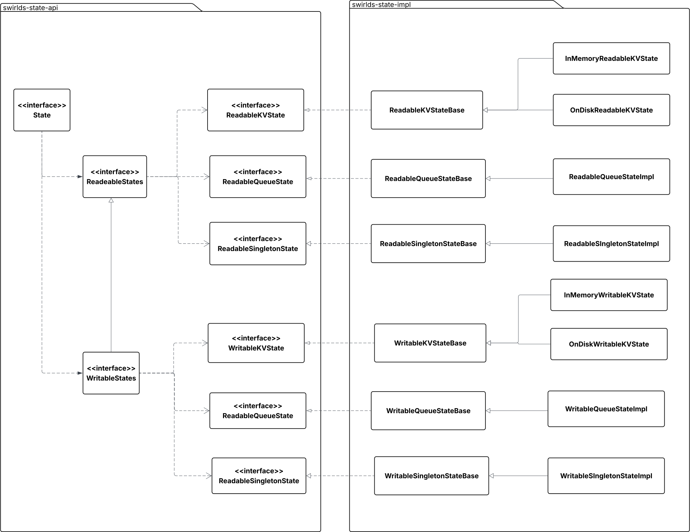
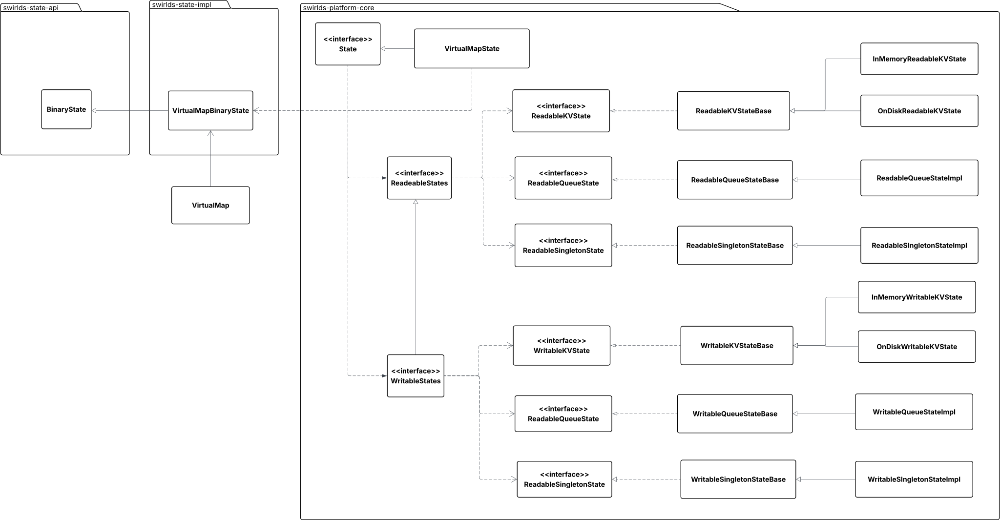

# Design Proposal: Introducing a Low-Level State API and Refactoring the Existing State API

---

## Summary

This proposal outlines the introduction of a new low-level State API and the refactoring of the current State API. The primary goal is to establish a clean separation between the State API and application logic, facilitating seamless integration with the Block Node.

## Purpose and Context

The current State API has several critical design flaws:

* It depends on the HAPI module, which impedes integration with the Block Node due to differences in protobuf protocol definitions.
* It includes interfaces and logic that are tightly coupled to the application layer but do not belong in the state management layer.

Previously, before the [typeless Virtual Map](https://github.com/hiero-ledger/hiero-consensus-node/issues/16785) implementation, we had to rely on service schemas to obtain codecs for key and value types. With that limitation removed, we now have the opportunity to introduce a clearer separation of concerns and eliminate unnecessary dependencies—such as the dependency on HAPI.

## Architecture

### Current class diagram



### Proposed class diagram



### Java classes

New `State` interface will be defined as follows:

```java
public interface BinaryState extends FastCopyable {
    /**
     * Puts serialized singleton value.
     *
     * @param id an id of the singleton type
     */
    void putSingleton(int id, Bytes value);

    /**
     * Gets serialized singleton value.
     *
     * @param id an id of the singleton type
     * @return The value, or null if there is no value.
    */
    Bytes getSingleton(int id);

    /**
     * Adds a new value to the store, or updates an existing value.
     * Puts a key/value pair represented as {@code Bytes} objects
     * @param id an id of the key/value type
     * @param key key bytes
     * @param value value bytes
     */
    void putKv(int id, Bytes key, Bytes value);

    /**
     * Removes a value by a key represented as {@code Bytes} object
     * @param id an id of the key/value type
     * @param key key bytes
     */
    void removeKv(int id, Bytes key);

    /**
     ** Gets the value associated with the given key represented as {@code Bytes} object. The
     * returned value will be null if the key does not exist in the state.
     *
     * @param id an id of the key/value type
     * @param key key bytes
     */
    Bytes getKv(int id, Bytes key);

    /**
     * Adds a value represented as {@code Bytes} object to the queue
     * @param id id of the queue
     * @param value value bytes to add
     */
    void queueAdd(int id, Bytes value);

    /**
     * Retrieves and removes the element at the head of the queue,
     * or returns null if the queue is empty.
     * @param id id of the queue
     * @return value retrieved value represented as {@code Bytes} object
     */
    Bytes queuePoll(int id);

    /**
     * Retrieves but does not remove the element at the head of the queue,
     * or returns null if the queue is empty.
     * @param id of the queue
     * @return The element at the head of the queue, or null if the queue is empty.
     */
    Bytes queuePeek(int id);

    /**
     * Puts a singleton value
     *
     * @param id an id of the singleton type
     * @param codec a codec to convert the object into bytes
     * @param value value to put

     */
    <T> void putSingleton(int id, Codec<T> codec, T value);

    /**
     * Gets serialized singleton value.
     *
     * @param id an id of the singleton type
     * @return The value, or null if there is no value.
     */
    <T> T getSingleton(int id, Codec<T> codec);

    /**
     * Adds a new value to the store, or updates an existing value.
     * @param id an id of the key/value type
     * @param keyCodec a codec to serialize the key object
     * @param key key object
     * @param valueCodec a codec to serialize the value object
     * @param value value object
     *
     */
    <K, V> void putKv(int id, Codec<K> keyCodec, K key, Codec<V> valueCodec, V value);

    /**
     * Removes the given key and its associated value from the map. Subsequent calls to {@link
     * #getKv} will return {@code null}.

     * @param id an id of the key/value type
     * @param key key bytes
     */
    <K> void removeKv(int id, Codec<K> keyCodec, K key);

    /**
     ** Gets the value associated with the given key. The
     * returned value will be null if the key does not exist in the state.
     *
     * @param id an id of the key/value type
     * @param keyCodec a codec to convert keys into bytes
     * @param key key bytes
     * @param valueCodec a codec to convert value bytes into an object
     */
    <K,V> V getKv(int id, Codec<K> keyCodec, K key, Codec<V> valueCodec);

    /**
     * Adds a value to the queue
     * @param id id of the queue
     * @param codec a codec to turn value bytes into an object
     * @param value value bytes to add
     */
    <T> void queueAdd(int id, Codec<T> codec, T value);

    /**
     * Retrieves and removes the element at the head of the queue,
     * or returns null if the queue is empty.
     * @param id id of the queue
     * @param codec a codec to turn value bytes into an object
     * @return value retrieved value represented as {@code Bytes} object
     */
    <T> T queuePoll(int id, Codec<T> codec);


    /**
     * Retrieves but does not remove the element at the head of the queue,
     * or returns null if the queue is empty.
     * @param id of the queue
     * @param codec a codec to turn value bytes into an object
     * @return The element at the head of the queue, or null if the queue is empty.
     */
    <T> T queuePeek(int id, Codec<T> codec);


    /**
     * Returns a calculated hash of the state or calculates in a blocking manner
     *
     * @return calculated hash for the state
     */
    Hash getHash();

    /**
     * Answers the question if the state is already hashed.
     *
     * @return true if the state is already hashed, false otherwise.
     */
    boolean isHashed();

    /**
     * Creates a snapshot for the state. The state has to be hashed and immutable before calling this method.
     * @param targetPath The path to save the snapshot.
     */
    void createSnapshot(final @NonNull Path targetPath);

    /**
     * Loads a snapshot of a state.
     * @param targetPath The path to load the snapshot from.
     */
    BinaryState loadSnapshot(final @NonNull Path targetPath) throws IOException;
}
```

## Migration Strategy

The goal of this refactoring is to provide a clean, low-level interface for interacting with state.
The implementation of this interface should have minimal dependencies and **must not** depend on the HAPI module.

The existing `State` interface, along with its related interfaces and implementations, should be moved to the `swirlds-platform-core` module. To reduce the changeset,
target package should be exactly the same - `com.swirlds.state`.

Ideally, these classes would be relocated to `hedera-app-api` and `hedera-app`, but that would result in a much larger refactor beyond the scope of this proposal.

For instance, `PlatformStateFacade` is currently used in 78 classes. Eliminating the dependency on `State` would require
migrating this class to use `BinaryState`, which would involve significant effort.

Instead, this proposal recommends that the current `State` implementation should be refactored to **delegate to** the new `BinaryState` interface.
This approach provides two key benefits:
- It limits the scope of changes required.
- It enables the Block Node to use the `swirlds-state-api` and `swirlds-state-impl` modules directly.

After this refactoring, the State implementation will still be responsible for maintaining state change listeners and the registry of readable and writable states.
However, the responsibility for snapshot creation and hash calculation will be delegated to `BinaryState`.

## Testing

This refactoring doesn't add any new functionality.  All existing Hedera unit tests should pass with
the new binary state implementation. `BinaryState` should be covered by a set of unit tests.

## Performance impact

This refactoring introduces a thin abstraction layer between `VirtualMap` and `State` implementation. It should not have any
significant impact on performance.
