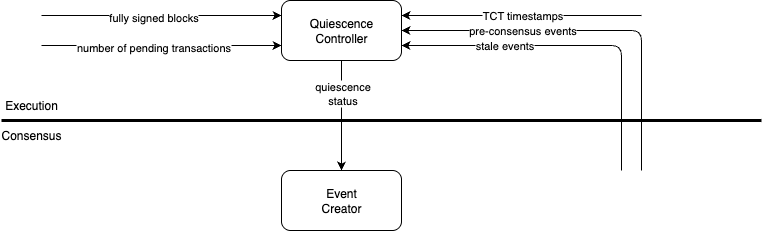

# Quiescence implementation details

## Summary

Quiescence is a feature that stops event creation when it is unnecessary.
Please refer to
the [Quiescence HIP](https://github.com/hiero-ledger/hiero-improvement-proposals/blob/main/HIP/hip-1238.md)
for the high level information about this feature.

| Metadata           | Entities             |
|--------------------|----------------------|
| Designers          | Lazar Petrović       |
| Functional Impacts | Consensus, Execution |
| Related Proposals  | N/A                  |
| HIPS               | TODO                 |

---

## Unknowns

- How will we know which events are consensus after a reconnect or restart?
- Figure out what to do about [metric modification](#metrics). The consensus module will not be tracking what needs to
  reach consensus, so it cannot modify the metrics. Should these metrics move to execution?
- Various parts of the system assume that events are constantly being created and consensus is
  always advancing. With quiescence, this is not the case. This means that various parts of the system need to be
  modified to account for this. NOTE FOR REVIEWERS: Please try to think of any possible issues that may arise from
  this change.

## Quiescence controller

A quiescence controller resides in the execution layer. It needs to track all the quiescence conditions and receives the
following data:

- Pre-consensus events
- Stale events
- Fully signed blocks
- TCTs
- Transaction pool counts

The quiescence controller should take all of this input and determine the quiescence status.

## Quiescence status interface

- push status from execution to consensus
- could not find a way of avoiding 3 different states, so using an enum
- bundling status with `getTransactions` was considered, but it had a flaw. the event creator would not call this method
  if it didnt have viable parents, which would mean it would not learn about breaking quiescence. and if it did call it
  without viable parents, it would not know what to do with the transactions it received when not being able to create
  an event

## Restart/Reconnect behavior

## Metrics

Metrics can produce misleading information due to the pause in event creation. Example: `secC2C` tracks the amount of
time that passes from an event being created to it reaching consensus. Ordinarily, this is a few seconds. If this
value spikes, it is usually an indicator of a performance issue in the network. If quiescence is not taken into
account, this value will spike to the amount of time the network was quiesced, which would look like an issue, but is
expected behavior.

The following metrics should be added:

- `numTransNeedCons` the number of non-ancient transactions that need to reach consensus.
- `lastSignedBlock` the latest block number that is fully signed

The following metrics should be modified:

- `secC2C`, `secC2RC` & `secR2C` should be modified to only track events that have transactions that need to reach
  consensus. If this is not done, these metrics will have huge spikes when quiescence is broken.

The following metrics should be removed since they would need to be modified, but are not used:

- `secSC2T`
- `secOR2T`
- `secR2F`
- `secR2nR`

## Quiescence configuration

The following configuration values should be used to configure quiescence:

- `quiescence.enabled` (default: `true`) - indicates if quiescence is enabled
- `quiescence.tctDuration` (default: `5s`) - the amount of time before the target consensus timestamp (TCT) when
  quiescence should not be active

