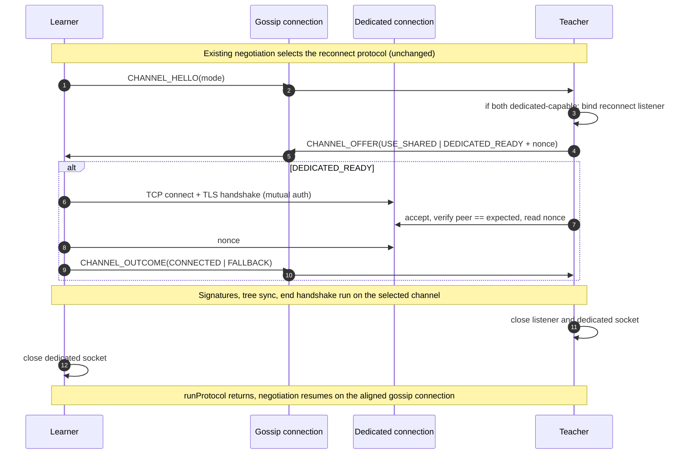

# Dedicated Reconnect Connection

## 1. Summary

Reconnect state transfer currently runs over the same TCP/TLS connection that gossip uses.
This proposal moves it to a dedicated, short-lived TLS connection on a separate port.
Reconnect can then use socket settings suited to multi-gigabyte, long-running transfers,
without changing any setting on the gossip path.

The control plane does not change: protocol negotiation, teacher selection, the teacher throttle,
and learner/teacher permits all stay on the gossip connection. Only the data plane moves.
The two peers agree on the channel through a short in-band exchange on the gossip connection.
If the dedicated channel cannot be established for any reason, both sides fall back to today's behavior automatically.

## 2. Background

### 2.1 How reconnect uses the gossip connection today

Each neighbor pair has exactly one connection. It is owned by a `ProtocolNegotiatorThread` created in
`PeerCommunication.buildProtocolThreads`. After a one-time `VersionCompareHandshake`, the `Negotiator` state
machine repeatedly selects one of three protocols in priority order: Heartbeat, Reconnect, RPC (`SyncGossipModular`).
The selected protocol owns the socket until its `runProtocol` returns. RPC gives up the connection by
writing `END_OF_CONVERSATION` once `gossipHalted` is set.

The reconnect protocol reaches gossip through `ReconnectProtocolFactory`. That interface lives in
`consensus-gossip-impl`, is implemented by `ReconnectProtocolFactoryImpl`, and is loaded via `ServiceLoader`
in `DefaultGossipModule`. `ReconnectStatePeerProtocol.runProtocol` runs the teacher or learner inline
on the negotiator thread. Both sides operate directly on the gossip `Connection`:

- they temporarily raise the shared socket's `SO_TIMEOUT` to `ReconnectConfig.socketTimeout`, then restore it;
- they send and receive the `SigSet`;
- they run `TeachingSynchronizer`/`LearningSynchronizer` over `connection.getDis()/getDos()`,
  with `connection::disconnect` as the break action;
- they finish with `endReconnectHandshake`, whose job is to leave the stream aligned for the next negotiation.

On a non-socket learner failure, and on any exception escaping the teacher (through `NetworkUtils.handleNetworkException`), the gossip connection itself is torn down, because its stream state is unknown.

### 2.2 Socket configuration today

`SocketFactory.configureAndBind` and `configureAndConnect` deliberately never set `SO_SNDBUF`/`SO_RCVBUF`. Both carry the comment "do NOT do setSendBufferSize or setReceiveBufferSize because it causes a major bug in certain situations." The history behind that comment was lost when the code moved repositories. Load tests on a branch with explicit buffer sizes showed no issues for either reconnect or gossip. Even so, changing socket settings on the mission-critical gossip path carries a risk of subtle regressions that we cannot justify for a reconnect-only benefit.

## 3. Motivation

The end goal of the ongoing reconnect performance work is to make reconnect converge for a state of 1 billion
accounts, roughly 6 billion entities in total. Reconnect is only useful if it finishes fast enough for the learner
to catch up with the network through gossip afterwards. In load tests that threshold is about 180 seconds. A
transfer that takes longer leaves the learner fallen behind again by the time it completes, so it re-enters
reconnect indefinitely. At the start of this work, reconnect at this scale took 350–410 seconds and never converged.

Load tests exposed several bottlenecks, which were resolved one at a time:
- learner receive backpressure, caused by the ordered leaf drain running on socket receiver threads;
- per-leaf storage serialized behind that ordered drain;
- sender threads stalling while waiting for paths to request;
- socket buffers left at OS defaults: the learner's receive buffer stayed at 64 KB while the teacher's send buffer
  autotuned to 2.5–10 MB.

None of these fixes gave much on its own, because removing one constraint mostly exposed the next. The clearest
example is the first fix. It eliminated the receive-side throttling, yet total reconnect time did not change,
because the cost moved into the tail of the ordered drain. Only with all of them in place did reconnect time
drop by about 50%, which is enough to clear the gossip catch-up threshold.

The socket buffer change is where the shared connection becomes a problem. It was validated on a test branch
where the explicit buffer sizes applied to every socket, gossip included. Load tests showed no regression for
gossip. Even so, shipping a change to gossip socket settings for a reconnect-only benefit is not a risk worth
taking, given the unexplained warning in the code (Section 2.2) and gossip's role in the system. The gain does not
come from bandwidth-delay product, which is small at sub-millisecond RTT. The most likely explanation is that a
larger receive buffer lets the kernel absorb the periods when receiver threads are briefly away from the socket,
instead of throttling the teacher.

This makes the dedicated connection a prerequisite for shipping reconnect at the 1-billion-account scale, not an
optional refinement. It lets the confirmed buffer settings apply to reconnect alone, and it isolates reconnect
failures from gossip. Other transport-level tuning, and the largest remaining application-level bottleneck (sender
path starvation), are separate work.

The shared connection prevents shipping that change on its own, for three reasons.

First, any socket option set on the gossip connection affects gossip for the connection's whole lifetime, not just
during a reconnect.

Second, on the accepting side, a meaningful `SO_RCVBUF` has to be set on the listening socket before `bind()`,
because window scaling is negotiated in the SYN and accepted sockets inherit the listener's value. A shared
listener therefore cannot give reconnect sockets different receive buffers from gossip sockets.

Third, a second socket on the gossip port is not an option either. `InboundConnectionManager.newConnection` treats
any new inbound socket from a peer as a replacement for the existing one and disconnects the old gossip connection.

A dedicated port solves all three. It also decouples failure handling: a broken transfer no longer takes the gossip
connection with it, and the per-attempt mutation of the shared socket's timeout goes away.

## 4. Goals and non-goals

**Goals.**
- Carry the entire reconnect data exchange (signatures, tree synchronization, end handshake) over a dedicated TLS connection on a separate port.
- Give that connection its own socket configuration, with no change to gossip sockets.
- Degrade automatically to the current shared-connection path whenever the dedicated channel is unavailable, so the system stays fully functional in every environment.
- Bring the Otter container environment along, so reconnect tests exercise the new path.
- Keep the change surface minimal and away from classes under concurrent rework.

**Non-goals.**
- Changing teacher selection, the throttle, or the permit model.
- Changing the synchronizer wire format.
- Changing any gossip socket setting.
- Choosing tuned buffer values. This change ships behavior-neutral defaults; tuning follows as a separate, measured step.
- Addressing application-level reconnect bottlenecks such as sender path starvation.
- Moving reconnect to the Execution layer.
- Supporting reconnect in the Turtle environment, which does not run real gossip or reconnect today.
- Striping the transfer across several dedicated connections. Nothing measured shows a single TLS stream to be a limit today. If one ever becomes a limit, the channel-selection exchange could establish several sockets under one nonce; nothing in this design rules that out.

## 5. Design overview

The reconnect protocol keeps its place in the negotiated protocol stack. Once both peers have agreed to run it, `runProtocol` stays blocking as it is today. Reconnect runs at startup, or when the node has fallen too far behind, and the node is not functional until it finishes, so there is nothing to gain from handing off asynchronously.

Inside `runProtocol`, the peers first perform a channel-selection exchange of a few bytes on the gossip connection. If both support the dedicated channel, the teacher binds a listener on its reconnect port and sends the learner a session nonce. The learner dials, authenticates over mutual TLS, and echoes the nonce. The existing teacher and learner code then runs unchanged over a `Connection` wrapping the dedicated socket. That socket is closed when the transfer ends, and `runProtocol` returns with the gossip stream aligned.

## 6. Detailed design

### 6.1 Channel-selection exchange

The exchange runs at the start of `ReconnectStatePeerProtocol.runProtocol`, after the existing negotiation has already fixed the roles (`InitiatedBy.SELF` for the learner, `PEER` for the teacher).

| Step | Direction | Channel   | Content |
|------|-----------|-----------|---------|
| C1   | L → T     | gossip    | `CHANNEL_HELLO`: one byte, `SHARED_ONLY` or `DEDICATED_CAPABLE`, taken from the learner's `enabled` setting. |
| C2   | T → L     | gossip    | `CHANNEL_OFFER`: one byte. `USE_SHARED` if either side is not capable or the teacher's bind failed. Otherwise `DEDICATED_READY` followed by a 64-bit nonce from `SecureRandom`. |
| D1   | L → T     | dedicated | After the TLS handshake completes: the nonce. |
| C3   | L → T     | gossip    | `CHANNEL_OUTCOME`: one byte. `CONNECTED` if connect, handshake and nonce write all succeeded, otherwise `FALLBACK`. Sent only after `DEDICATED_READY`. |

The dedicated channel is used **only if** the teacher has accepted a socket from the expected peer and read a matching nonce, **and** it has received `CONNECTED`. In every other outcome both sides continue on the gossip connection exactly as today.

The rules below guarantee that the gossip stream never misaligns.
- The learner writes `CONNECTED` only after its nonce write succeeds. A failed nonce write means the socket is broken, so the teacher cannot have read a full nonce either.
- The teacher reads C3 only after its accept loop has finished, successfully or by deadline. By then the learner's outcome byte is already in flight or buffered.
- If the teacher's accept deadline expires while the learner is still connecting, the learner's TLS handshake fails against the closed listener. The learner then writes `FALLBACK`, which matches what the teacher observed.

The nonce doubles as the `reconnectId` correlation ID proposed in the reconnect refactor proposal's "Future ideas". Both sides log it at the start and end of the session.

### 6.2 Fallback semantics

Fallback is deliberate, and it is visible. Every fallback is logged at WARN with its reason (learner not capable, teacher not capable, bind failed, connect failed, TLS failed, wrong peer, nonce mismatch, accept timeout) and counted in a metric (Section 6.9). A blocked port, a missing container mapping, or a mis-set offset therefore degrades to today's behavior, not to repeated failed attempts that would eventually trip `maximumReconnectFailuresBeforeShutdown`.

Because the mode is negotiated per session, config does not have to be uniform across the network. That matters during rollout and when individual operators disable the feature.

### 6.3 Addressing

The roster carries a single gossip endpoint per node, so the reconnect endpoint is derived at config level. Resolution follows the *effective* gossip endpoint, so existing container and NAT deployments work without new entries as long as their port mapping is offset-regular.

On the dialing side (learner → teacher), the reconnect endpoint override for the teacher's node ID is used if one exists. Otherwise the effective gossip endpoint for the teacher is taken (`GossipConfig.getEndpointOverride`, else `PeerInfo.hostname`/`PeerInfo.port`) and `portOffset` is added to its port.

On the binding side (teacher), the reconnect interface binding for the self node ID is used if one exists. Otherwise the gossip interface binding's host is used with its port plus `portOffset`. If neither exists, the listener binds all interfaces on the self roster port plus `portOffset`.

The existing `SocketFactory.configureAndBind` is intentionally **not** reused. It ignores its `port` argument whenever a gossip interface binding exists, so it would try to bind the gossip port.

### 6.4 Configuration

A new record, `ReconnectChannelConfig`, lives in `consensus-gossip` next to `GossipConfig`, because `consensus-gossip-impl` owns the socket plumbing. It uses its own prefix (`reconnectChannel`) rather than nesting under `reconnect.`, since `ReconnectConfig` already owns that prefix in `consensus-reconnect`. It is registered through the gossip module's configuration extension.

| Property | Type | Default | Notes |
|---|---|---|---|
| `enabled` | boolean | `true` | Advertised in `CHANNEL_HELLO`, and gates whether the teacher offers the dedicated channel. |
| `portOffset` | int | TBD (Section 10) | Added to the effective gossip port on both the bind and dial sides. |
| `interfaceBindings` | `List<NetworkEndpoint>` | empty | Same shape and semantics as `GossipConfig.interfaceBindings`. |
| `endpointOverrides` | `List<NetworkEndpoint>` | empty | Same shape and semantics as `GossipConfig.endpointOverrides`. |
| `sendBufferSize` | int | `-1` | `SO_SNDBUF`. `-1` leaves the OS default and kernel autotuning in place. Not a tuning candidate; see below. |
| `receiveBufferSize` | int | `-1` | `SO_RCVBUF`, applied before `bind()` / `connect()`. `-1` leaves the OS default and kernel autotuning in place. The tuning candidate. |
| `connectTimeout` | Duration | `5s` | Learner connect plus TLS handshake. Matches `socket.timeoutSyncClientConnect` today. |
| `acceptTimeout` | Duration | `10s` | Teacher accept deadline. Must exceed `connectTimeout` so a slow but successful learner handshake is not cut off. |

With these defaults, a dedicated session behaves exactly like today's transfer, apart from running on its own socket. That is intentional: the refactoring can be validated on its own, and buffer tuning then follows as a separate change driven by measurement.

Only the two buffer sizes are exposed, and only `receiveBufferSize` is expected to be tuned. On Linux, setting either option explicitly disables kernel autotuning for that direction of the socket. The teacher's send buffer already autotunes to 2.5–10 MB during transfer, so an explicit `sendBufferSize` could only match or undercut it. It stays configurable for experiments but should normally remain unset. The learner's receive buffer, by contrast, stays at 64 KB. Because the learner dials, it can set `SO_RCVBUF` before `connect()`, which is what makes the value effective. The first experiment is the 4–8 MB range from the existing reconnect ticket.

Every other socket and stream setting keeps following `SocketConfig`: `tcpNoDelay`, `bufferSize` for the buffered stream wrappers, `ipTos` and `gzipCompression`. Earlier investigation already ruled out Nagle and userspace stream buffering as reconnect bottlenecks, so there is no reason to make them separately configurable. Gzip is read inside `SyncInputStream`/`SyncOutputStream`, so the payload framing is identical on both channels. The data-socket read timeout remains `ReconnectConfig.socketTimeout`, now set once when the dedicated socket is created.

### 6.5 Security

The dedicated connection uses the same mutual-TLS setup as gossip: the same cipher suite, `needClientAuth`, and the node's agreement key and certificate. Per session, the trust store holds only the one expected peer, the same pattern `OutboundConnectionManager` uses. The teacher additionally checks the accepted socket's certificate chain against the expected node ID using `NetworkPeerIdentifier`, then checks the nonce.

The listener exists only while a teacher session is being established. The teacher throttle already limits a node to one learner at a time, so at most one listener exists at a time. Sockets from the wrong peer, or with a stalled handshake, are closed, and accepting continues until the deadline. A handshake read timeout is set before `startHandshake` so a stalled client cannot hold the loop. As a result, the new port adds no standing attack surface: it is closed outside sessions, and during a session it accepts only the one authorized peer.

### 6.6 Listener lifecycle

The teacher binds on demand inside `runProtocol` and closes the listener as soon as the accept phase ends. The dedicated connection exists only for the duration of a single reconnect session, and there is no reason to keep the port open between sessions. On the learner, gossip is halted for the whole reconnect anyway, so nothing is lost by establishing the channel per session instead of keeping it warm.

An always-on listener created at startup was considered and rejected. It would surface bind conflicts earlier, but it needs its own accept thread, logic to reject sockets arriving outside a session, and reconciliation with peer-set updates. On-demand binding needs none of these. A bind failure is handled by the normal fallback (`USE_SHARED`), so it cannot block reconnect. A misconfigured port shows up at reconnect time, as a WARN plus metric, not at startup.

### 6.7 Failure handling

Failures fall into two phases, and each phase gets a different action.

| Phase | Failure | Gossip connection | Dedicated connection | Attempt |
|---|---|---|---|---|
| Channel selection (C1–C3) | I/O error or timeout on the gossip connection | Disconnected (stream state unknown); behavior as today | Closed | Fails; controller retries |
| Channel selection | Bind, connect, TLS, peer identity, nonce, or accept-deadline failure | Kept, stream aligned | Closed | Continues in shared mode |
| Transfer, dedicated mode | Any exception from the teacher, learner, or synchronizer | **Kept, stream aligned** | Closed through the break action | Fails; controller retries |
| Transfer, shared mode | Any exception | Behavior unchanged from today | n/a | Behavior unchanged from today |

The one behavioral change is in dedicated mode: `runProtocol` catches transfer failures, closes only the dedicated socket, logs using the same marker rules as `NetworkUtils.determineExceptionMarker`, and returns normally. The learner still reports the error through `ReservedSignedStateResultProvider`. The teacher still releases its throttle slot and permit in `finally`. Nothing else about permit or throttle accounting changes.

### 6.8 Threading

Nothing new is introduced. Both negotiator threads for the peer pair stay parked in `runProtocol` for the whole session, as they are today. The gossip connection sits idle during the transfer. Nothing reads it, so its `SO_TIMEOUT` never fires, and heartbeat and RPC resume on it once `runProtocol` returns. The synchronizers' worker threads (the async stream reader and writer, sender and receive tasks, and the learner's applier thread) are unaffected; they just see different streams.

### 6.9 Metrics and logging

Dedicated sockets do **not** go through `ConnectionTracker`, whose only implementation, `PeerCommunication`, feeds gossip `NetworkMetrics`. Counting them there would pollute gossip connect and disconnect statistics.

New counters under the reconnect metrics:
- sessions in dedicated mode;
- sessions in shared mode;
- fallbacks, broken down by reason;
- channel setup time.

Data usage reporting keeps working as-is, because the dedicated `Connection` is built on `SyncInputStream`, which carries the byte counter the learner already reads. Each session logs its `reconnectId`, selected mode, resolved endpoint, and effective socket buffer sizes read back from the socket. Reading them back is essential for later tuning, since the kernel may clamp the requested values.

The dedicated port also makes kernel-level diagnostics simpler. Today, inspecting the reconnect transfer with `ss -tmi` means picking out the gossip connection to one specific peer, a socket that heartbeat and RPC also use. With a dedicated port, the reconnect socket is selected with a plain port filter, and its `rwnd_limited`, `snd_wnd` and buffer figures describe reconnect traffic only.

### 6.10 Code structure

The new code sits next to the classes under concurrent rework (`PeerCommunication`, `DynamicConnectionManagers`, `TlsFactory`, `SocketFactory`) and does not modify any of them.

| Location | Change |
|---|---|
| `consensus-gossip` | New `ReconnectChannelConfig`, registered in the gossip configuration extension. |
| `consensus-gossip-impl`, new package `...impl.reconnect.channel` | `ReconnectChannelProvider` interface with two operations, `open(NodeId peer)` → teacher-side session (bind, nonce, accept) and `dial(NodeId peer, long nonce)` → learner-side `Connection`. A TLS implementation that builds a per-session `SSLContext` from the node's keys and the single expected peer (reusing `CryptoUtils.createKeyManagerFactory` and `Utilities.createPublicKeyStore`). An endpoint resolver implementing Section 6.3. A peer snapshot initialized from the roster, with the same self-certificate check as `SyncGossipModular`. |
| `ReconnectProtocolFactory` | Gains one parameter: the `ReconnectChannelProvider`. |
| `DefaultGossipModule` | Builds the provider from the keys, roster and config it already has, and passes it to `createProtocol`. |
| `SyncGossipModular.addRemovePeers` | One added line forwarding peer changes to the provider. |
| `ReconnectStatePeerProtocol` | Performs the channel-selection exchange (Section 6.1), selects the `Connection` to hand to the teacher or learner, and applies the phase-aware failure handling (Section 6.7). |
| `ReconnectStateTeacher` / `ReconnectStateLearner` | No functional change; they operate on whichever `Connection` they receive. The timeout raise and restore is harmless on the dedicated socket, and still needed in shared mode. |
| `ReconnectProtocolFactoryImpl` | Passes the provider through to `ReconnectStateSyncProtocol` and on to each per-peer instance. |

The dedicated `Connection` reuses `SocketConnection`, with a no-op `ConnectionTracker`. The reconnect code therefore keeps its current type dependency on `consensus-gossip-impl`, and the module's documented dependency exceptions stay as they are.

## 7. Compatibility and rollout

The channel-selection bytes are new data written on the gossip connection once the reconnect protocol has been negotiated. No compatibility guard is needed, because reconnect between nodes on different versions is not supported. `VersionCompareHandshake` normally refuses such connections. Even where `ProtocolConfig.tolerateMismatchedVersion` would let them through, the software version is part of the state. The learner's received state would therefore never match the expected root hash, and the reconnect could not succeed regardless of the channel used. Mixed-version reconnect is out of scope by construction, so old and new nodes never need to interpret each other's channel-selection bytes.

Operationally, each node needs its reconnect port reachable from its peers. Wherever it isn't, the automatic fallback preserves today's behavior, and the fallback metric makes the gap visible. The feature therefore ships enabled by default. Release notes must state the new port and the resolution rules.

## 8. Test environments

**Turtle.** Not affected. `TurtleGossipModule` replaces the gossip module with `SimulatedGossip`, and reconnect is not wired into it; fallen-behind routing is explicitly not yet connected. Reconnect tests are gated on `Capability.RECONNECT` and run in the Container environment.

**Container (Otter).** In scope. Each node runs in its own container on a shared Docker network, so the offset port cannot collide across nodes. Two changes are needed:
- The reconnect port must be reachable between containers, exposed if the setup requires it.
- **Every network-fault operation (partitions, isolation, latency, bandwidth) must be applied to the reconnect port exactly as it is to the gossip port.** Otherwise a "partitioned" node could still reconnect through the side channel, and partition and isolation tests would stop testing what they claim to.

The concrete changes depend on the container fixture implementation (`ContainerNode`, `ContainerNetwork`, the network-fault implementation), which is not yet part of this review's context and is listed as an open item.

**Production and Solo/Kubernetes.** Firewall rules and service definitions must expose the reconnect port. Until they do, nodes fall back to shared mode. Ownership of these artifacts is an open item.

## 9. Testing plan

**Unit tests.**
- Endpoint resolution across every override and binding combination, including the case where a gossip interface binding exists and the resolver must not bind the gossip port.
- Config validation (offset range, `acceptTimeout > connectTimeout`).
- Channel-selection state handling on both sides.

**Integration tests with real sockets and TLS,** following the existing `SocketFactoryTest` / `InboundConnectionHandlerTest` patterns (real key material from `CryptoArgsProvider`, `@FreePort`):
- successful dedicated session;
- each fallback reason: bind conflict, connect refused, wrong peer certificate, nonce mismatch, accept deadline;
- the capability matrix, confirming the gossip stream stays aligned after every outcome by running a subsequent negotiation round on the same gossip connection;
- a mid-transfer failure in dedicated mode that closes only the dedicated socket.

**`ReconnectTest`.** Extended to run the full teacher and learner exchange over the dedicated channel as well as the shared path, using the real `RandomSignedStateGenerator` and MerkleDB setup it already uses.

**Otter container tests.** The existing reconnect tests pass in dedicated mode. The partition and isolation tests keep their current assertions (for example, `doNotAttemptToReconnect` in `PartitionTest`) once fault injection covers the new port. A new test with the reconnect port blocked verifies fallback and a successful reconnect.

**Performance.** A large-state reconnect load test is run on the shared path and on the dedicated path with default buffer settings, to confirm the change is behavior-neutral. The reconnect benchmark is run the same way. Runs are compared only when they move a comparable number of dirty leaves, because total reconnect time scales with payload and a smaller payload can masquerade as a speedup. The comparison uses the same evidence as the earlier reconnect investigation:
- total reconnect time and the gap between the end of transfer and learner finalization;
- `ss -tmi` on the teacher for the reconnect socket: `rwnd_limited`, `snd_wnd`, and unsent bytes;
- the effective socket buffer sizes logged at session start.

Buffer tuning follows as a separate change, starting with `receiveBufferSize` in the 4–8 MB range and measured with the same method.

## 10. Open questions

1. **Offset default.** A default must be chosen that avoids every port already in use across deployment types. In multi-node-per-host setups where nodes use consecutive gossip ports, a small offset collides with a neighbor's gossip port. This needs a port inventory (production, Solo, local runs, CI) before a value is fixed.
2. **`addRemovePeers`.** Is it called in production today? If not, the one-line forwarding hook can be deferred.

## 11. Alternatives considered

**Same port with a post-TLS channel discriminator.** Rejected. Inbound sockets would have to be classified inside `InboundConnectionHandler` before they reach `DynamicConnectionManagers.newConnection`; otherwise `InboundConnectionManager` would treat the reconnect socket as a replacement and drop the live gossip connection. That puts a routing change into the inbound gossip path. Buffer control is also limited: accepted sockets inherit the gossip listener's pre-bind receive buffer, so only the dialing side's receive buffer can be tuned independently.

**Tuning the shared gossip connection during reconnect.** Rejected. Receive-window scaling is fixed at connection setup, so changing buffers mid-connection is partly ineffective. Whatever does change also persists into gossip traffic afterwards, which is exactly the risk this proposal exists to avoid.

**Fully independent reconnect transport, including teacher selection outside gossip.** Rejected for now. It would duplicate the negotiation, throttle and permit logic and collide with the ongoing connection-management refactoring. The control plane can move later without affecting the data channel introduced here.

**No automatic fallback.** Rejected. Any environment where the port is not yet reachable would convert every reconnect into a failure, and eventually into a node shutdown.

**Close the gossip connection, reconnect on the gossip port with reconnect socket settings, then re-establish gossip.** Rejected. It is technically viable and avoids every operational cost of a new port, but it moves the complexity into the gossip connection lifecycle, which is the area this proposal is meant to leave alone.

Its real advantages are significant:
- no new port, so no port offset, no duplicated bindings and overrides, and no firewall, Solo or container exposure changes;
- network-fault injection in the Otter container environment covers the reconnect connection automatically, because it uses the same port.

It depends on four changes to the gossip connection machinery, each of which is needed for correctness:

1. **Suppressing automatic re-dial.** `OutboundConnectionManager.waitForConnection` loops until it holds a connected socket. As soon as the gossip connection closes, the dialing side's negotiator thread creates a new connection with gossip settings, racing the reconnect dial. Connection managers on both sides would need a "reconnect mode" that suppresses this, then a way to end it on success, failure, and every timeout.

2. **Binding the new connection to the session.** A new socket on the gossip port passes through `InboundConnectionHandler` into `InboundConnectionManager` and becomes the peer's next gossip connection, running the version handshake and protocol negotiation again. Renegotiating reconnect on it does not work: `ReconnectStateTeacherThrottle.initiateReconnect` records the learner at the first negotiation and rejects the same learner for `minimumTimeBetweenReconnects` (10 minutes by default). So the new connection must carry an in-band marker and session token telling both sides to skip negotiation and go straight to transfer — the discriminator approach above, plus the teardown.

3. **Choosing who dials.** `StaticTopology` has the lower-ID node dial the higher-ID node. When the learner has the higher ID, it is the accepting side, so its receive buffer, which is the tuning candidate, is inherited from the gossip listener and cannot be tuned. Tuning it anyway would mean either changing the gossip listener's pre-bind buffer (a change to gossip) or letting the learner dial against the topology. The latter means a peer that normally only has an `OutboundConnectionManager` accepting an inbound socket, which `DynamicConnectionManagers` currently rejects as unexpected.

4. **Carrying state across connections.** The throttle slot, the teacher's permit, the learner's fallen-behind context and the session identity must survive the gossip teardown, the reconnect connection's lifetime, and the re-establishment of gossip. Today they are all scoped to one `runProtocol` call on one connection, which is exactly what keeps their release logic simple.

**Complexity comparison.**

| Aspect | Dedicated port (proposed) | Close and reopen on the gossip port |
|---|---|---|
| New code | Isolated package: channel provider, endpoint resolver, config | Moderate, but spread across existing classes |
| Existing gossip classes touched | `DefaultGossipModule` (wiring), one line in `SyncGossipModular` | `OutboundConnectionManager`, `InboundConnectionManager`, `InboundConnectionHandler`, `DynamicConnectionManagers`, likely `ProtocolNegotiatorThread` and `StaticTopology` |
| Overlap with the connection-management refactoring | None | High: the same classes |
| Risk to gossip | None; gossip sockets and lifecycle unchanged | New connection-lifecycle states on the gossip path, with races between re-dial and reconnect dial |
| Buffer control | Both sides, both directions | Dialing side only, unless the topology or the gossip listener changes |
| Failure isolation | A transfer failure closes only the dedicated socket | A failure leaves gossip down until a separate re-establishment path runs |
| Operational cost | New port: offset, bindings/overrides, firewall, containers, fault injection | None |
| Fallback | Built in; shared mode is today's path | Needs its own fallback when the reopened connection cannot be established |

The dedicated-port approach pays its cost in configuration and deployment, which is visible, testable and reversible through fallback. The close-and-reopen approach pays its cost inside mission-critical connection management, which cannot be isolated behind a fallback. This approach may be worth revisiting once the connection-management refactoring lands, if that work produces an explicit connection lifecycle API that makes session-scoped connection modes cheap. It may also be worth revisiting if a new port proves operationally unacceptable.