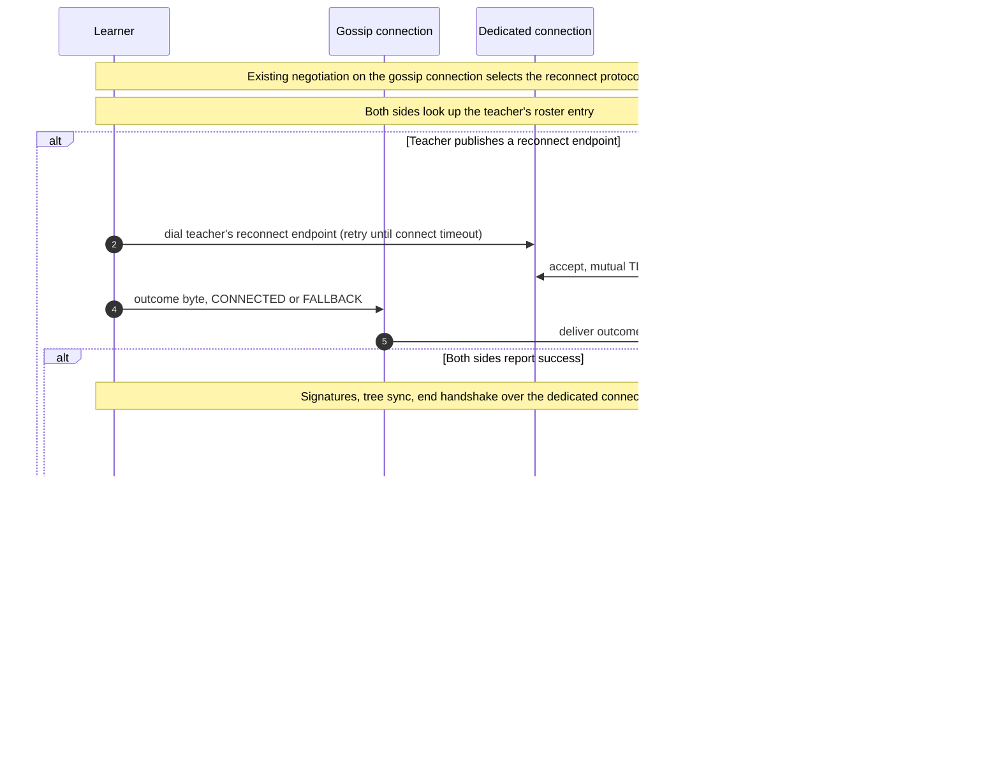

# Dedicated Reconnect Connection

## 1. Summary

Reconnect state transfer currently runs over the same TCP/TLS connection that gossip uses.
This proposal moves it to a dedicated, short-lived TLS connection, separate from gossip. The connection can then use
socket settings suited to multi-gigabyte, long-running transfers, without changing any setting on the gossip path.

In this step the dedicated connection is created and managed on the reconnect side. In the target architecture it is
owned by the application, like every other connection, with the adapter managing it in the interim (Section 5.1).

The control plane does not change in this step: protocol negotiation, teacher selection, the teacher throttle,
and learner/teacher permits all stay on the gossip connection. Once both peers have agreed to reconnect, the
teacher's roster entry decides how the reconnect runs. If the teacher publishes a reconnect endpoint, the teacher
listens on it, the learner dials it, and the whole reconnect exchange runs over the new connection. If it does not,
the reconnect runs over the gossip connection as it does today. If the entry is present but the dedicated connection
cannot be established, for example because the port is closed, both peers fall back to the gossip connection with a
warning. The design is therefore never worse than today, and better wherever it is properly configured. The gossip
connection simply blocks until the reconnect finishes, in every case.

## 2. Background

### 2.1 How reconnect uses the gossip connection today

Each pair of neighboring nodes shares a single gossip connection. Several protocols take turns on it: after a
one-time handshake, the peers repeatedly negotiate which protocol runs next, and the selected protocol owns the
connection until it finishes.

Reconnect is one of these protocols. When a node has fallen behind and a peer agrees to act as its teacher, the
reconnect protocol takes over the gossip connection for the whole state transfer. For that duration it adjusts the
connection's read timeout and exchanges signatures, the state tree, and a closing handshake over the same streams
that gossip uses. It then hands the connection back to protocol negotiation.

Because the reconnect data shares a stream with gossip, a reconnect failure leaves that stream in an unknown state.
The gossip connection is therefore torn down whenever a reconnect fails.

### 2.2 Socket configuration today

Gossip sockets are created without explicit `SO_SNDBUF`/`SO_RCVBUF` settings, deliberately: the socket factory
carries the comment "do NOT do setSendBufferSize or setReceiveBufferSize because it causes a major bug in certain
situations." The history behind that comment was lost when the code moved repositories. Load tests on a branch with
explicit buffer sizes showed no issues for either reconnect or gossip. Even so, changing socket settings on the
mission-critical gossip path carries a risk of subtle regressions that we cannot justify for a reconnect-only
benefit.

## 3. Motivation

Reconnect has to work for very large states, with billions of entities and more. Reconnect has to make progress:
each attempt must leave the learner closer to the network than it was before. A reconnect transfers the teacher's
state as of the start of the attempt, and the network keeps advancing in the meantime. If the learner is still
behind afterwards but within the range of events its peers still hold, it catches up through gossip. If not, it
reconnects again from a newer state. As long as each attempt closes the gap, repeated reconnects still converge. At
large enough state sizes, load tests showed reconnect not closing the gap, so the learner never converged.

Several bottlenecks contributed, and most of them were in the reconnect implementation itself; those are outside
the scope of this proposal. One was not: the gossip connection's socket configuration. Explicit, larger socket
buffers were part of the combination of changes that made reconnect converge in load tests.

Those tests applied the new buffer sizes to every socket, gossip included, and showed no regression for gossip.
Shipping the change that way is nonetheless a risk not worth taking for a reconnect-only benefit, given the
unexplained warning in the code (Section 2.2) and gossip's role in the system. A dedicated connection lets the
validated buffer settings apply to reconnect alone. The alternative of applying them to all gossip sockets remains
possible, and is discussed in Section 11.

Keeping reconnect on the gossip connection makes it hard to change reconnect's socket settings on their own, for
three reasons.

First, any socket option set on the gossip connection affects gossip for the connection's whole lifetime, not just
during a reconnect.

Second, on the accepting side, a meaningful `SO_RCVBUF` has to be set on the listening socket before `bind()`,
because window scaling is negotiated in the SYN and accepted sockets inherit the listener's value. A shared
listener therefore cannot give reconnect sockets different receive buffers from gossip sockets.

Third, a second socket on the gossip port would need changes to inbound connection handling. Today a new inbound
socket from a peer is treated as a replacement for the existing gossip connection. That could be changed, for
example by deferring the replacement until the handshake reveals what kind of connection it is, but it means
reworking inbound routing in the gossip connection-management code, which is under concurrent rework.

A dedicated connection avoids all three. It also decouples failure handling: a broken transfer no longer takes the
gossip connection with it, and the per-attempt mutation of the shared socket's timeout goes away.

Finally, it moves the node toward the target architecture in the
[Consensus Layer proposal](https://github.com/hiero-ledger/hiero-consensus-node/blob/main/platform-sdk/docs/proposals/consensus-layer/Consensus-Layer.md).
There, reconnect is the Execution layer's responsibility: the Consensus layer reports that it has fallen behind
(`onBehind`) and stops, and Gossip is the only part of the Consensus layer that communicates over the network.
A reconnect that already runs over its own connection can later be moved out of the Consensus layer without any
connection handover (Section 5.1).

## 4. Goals and non-goals

**Goals.**
- Carry the entire reconnect data exchange (signatures, tree synchronization, end handshake) over a dedicated TLS connection, separate from gossip.
- Give that connection its own socket configuration, with no change to gossip sockets.
- Roll out node by node through the roster, with no flag day: nodes that do not publish a reconnect endpoint keep reconnecting over the gossip connection.
- Never be worse than today: if a published reconnect endpoint cannot be used, fall back to the gossip connection with a warning.
- Keep the changes mainly in the reconnect module (`consensus-reconnect`, `consensus-reconnect-impl`), with a minimal wiring change in gossip and nothing in the gossip classes under concurrent rework.

**Non-goals.**
- Changing teacher selection, the throttle, or the permit model. Moving them out of the Consensus layer is the scope of the separate adapter work (Section 5.1).
- Changing the synchronizer wire format.
- Changing any gossip socket setting.
- Transport tuning beyond the buffer values already validated in load tests.
- Addressing application-level reconnect bottlenecks.
- Supporting the dedicated connection in the Otter or Turtle environments (Section 8).
- Striping the transfer across several dedicated connections. Nothing measured shows a single TLS stream to be a limit today, and nothing in this design rules it out later.

## 5. Design overview

The reconnect protocol keeps its place in the negotiated protocol stack, and `runProtocol` stays blocking as it is
today. Reconnect runs at startup, or when the node has fallen too far behind, and the node is not functional until
it finishes, so there is nothing to gain from handing off asynchronously.

Once negotiation has fixed the roles, both peers look up the teacher's entry in the roster. If it contains a
reconnect endpoint, they attempt a dedicated connection. The teacher binds a listener on that endpoint and waits for
the learner, and the learner dials it. After mutual TLS, and after the teacher has verified that the connection
comes from the expected learner, the learner reports the outcome with a single byte on the gossip connection. If the
dedicated connection was established, both sides go straight into the existing reconnect exchange over it. The
dedicated connection carries no gossip handshake and no protocol negotiation. When the exchange ends, the dedicated
connection is closed and `runProtocol` returns.

If the attempt fails, both sides log a warning and run the reconnect over the gossip connection, exactly as today.
If the teacher's entry has no reconnect endpoint, they do the same without a warning: the feature is simply not
enabled for that node. Apart from the learner's one outcome byte, nothing is written to the gossip connection, so
gossip resumes on it exactly where it left off.

```mermaid
sequenceDiagram
    autonumber
    participant L as Learner
    participant G as Gossip connection
    participant D as Dedicated connection
    participant T as Teacher

    Note over L,T: Existing negotiation on the gossip connection selects the reconnect protocol (unchanged)
    Note over L,T: Both sides look up the teacher's roster entry
    alt Teacher publishes a reconnect endpoint
        T->>T: bind listener on own reconnect endpoint
        L->>D: dial teacher's reconnect endpoint (retry until connect timeout)
        T->>D: accept, mutual TLS, verify peer is the expected learner
        L->>G: outcome byte, CONNECTED or FALLBACK
        G->>T: deliver outcome byte
        alt Both sides report success
            Note over L,T: Signatures, tree sync, end handshake over the dedicated connection
            T->>T: close listener and dedicated connection
            L->>L: close dedicated connection
        else Establishment failed
            Note over L,T: Warning logged, reconnect over the gossip connection as today
        end
    else No reconnect endpoint
        Note over L,T: Reconnect over the gossip connection as today, no warning
    end
    Note over L,T: runProtocol returns, negotiation resumes on the gossip connection
```

### 5.1 Relationship to the target architecture

This proposal deliberately leaves the control plane (negotiation, teacher selection, throttle, permits, waiting for
gossip to pause) where it is. In this step, those remain in the Consensus layer, with the complexity that comes with
them.

That is intended as the first of several steps. The separate adapter work moves reconnect initiation out of the
Consensus layer: the Consensus layer informs the adapter that the node is behind, and stops. In the interim, the
adapter manages the dedicated connection. In the target architecture, the application owns it, as it owns all
other connections. Because the reconnect data already travels over its own connection, neither step needs to hand
over a gossip connection, and the data plane introduced here can move as a unit.

The alternative, having the dedicated connection carry the whole reconnect (including teacher selection and
coordination) now, is discussed in Section 11. It would give the full architectural benefit sooner, but it would
largely duplicate the adapter work. The exact division of responsibilities between this change and the adapter is
an open item (Section 10).

## 6. Detailed design

### 6.1 Connection selection

The choice between the dedicated connection and the gossip connection is made independently by both peers, from the
same input: the teacher's roster entry. If that entry contains a reconnect endpoint (Section 6.3), both use the
dedicated connection; otherwise both use the gossip connection. No bytes are exchanged to make this choice; only the outcome of an attempt is agreed at runtime (Section 6.2).

This works because both peers resolve the teacher's entry from the same active roster. Reconnect only runs between
nodes on the same software version, and the active roster only changes through the roster lifecycle (Section 7), so
the two peers cannot disagree on whether the entry is present. This assumption needs to be confirmed with the owners
of the roster lifecycle (Section 10).

A missing reconnect endpoint means the feature is not enabled for that node, much like a feature flag, and the
gossip connection is used without a warning. A reconnect endpoint that is present but unusable is an
infrastructure or configuration problem. The gossip connection is used then as well, but with a warning
(Section 6.2).

### 6.2 Connection establishment and fallback

Establishment starts inside `execute()`, after the existing negotiation has fixed the roles (`InitiatedBy.SELF` for
the learner, `PEER` for the teacher), and only when the teacher's entry has a reconnect endpoint.

The **teacher** binds a server socket on its reconnect endpoint (Section 6.3), with the configured buffer sizes
applied before `bind()`. It accepts until `acceptTimeout`. For each accepted socket it completes the TLS handshake
under a handshake read timeout, then checks that the certificate chain belongs to the expected learner. A socket
from any other peer is closed, and accepting continues until the deadline. As soon as the expected learner is
connected, the listener is closed. If the bind fails, the teacher does not listen at all.

The **learner** dials the teacher's reconnect endpoint, with the configured buffer sizes applied before
`connect()`. The teacher binds its listener concurrently with the learner's first dial, so a refused connection is
expected at first. The learner retries until `connectTimeout` elapses.

**Agreeing on the outcome.** Both peers must reach the same conclusion about whether the dedicated connection is
usable, and neither can see the other's view. The learner therefore reports its outcome with one byte on the gossip
connection, written and flushed as soon as its attempt ends:
- `CONNECTED` once the TLS handshake with the teacher has completed;
- `FALLBACK` if the attempt failed for any reason: connect refused after retries, timeout, or TLS failure.

The teacher reads that byte and decides:

| Teacher holds a verified socket | Learner's byte | Result |
|---|---|---|
| Yes | `CONNECTED` | Reconnect over the dedicated connection. |
| No | `FALLBACK` | Warning; reconnect over the gossip connection. |
| Yes | `FALLBACK` | The teacher closes the socket. Warning; reconnect over the gossip connection. |
| No | `CONNECTED` | The attempt fails and is counted (see the race below). |

The byte is only exchanged when the teacher's entry has a reconnect endpoint, which both peers know from the roster,
so no byte is ever expected that is not sent. The teacher never writes to the gossip connection during this step,
and the learner writes exactly one byte, so the gossip stream stays aligned in every outcome.

**Waiting for the byte.** The teacher waits for the outcome byte against an explicit deadline, independent of the
gossip connection's normal read timeout. That deadline is `acceptTimeout`, which exceeds `connectTimeout`. This
matters most when the teacher's bind has failed: the learner only writes `FALLBACK` once its connect retries run
out, and a plain read with the gossip default timeout could expire first, turning a clean fallback into a
torn-down gossip connection. While accepting, the teacher also checks the gossip connection for an early byte, so
that a learner that has already given up does not cost the teacher the full accept deadline.

**The race.** If the learner completes its TLS handshake just as the teacher's accept deadline expires, the learner
reports `CONNECTED` while the teacher holds no socket. The teacher detects that combination and fails the attempt,
and the learner fails on its closed dedicated socket. The window is narrow, and the result is one counted failure,
never a hang or a misaligned stream.

When the dedicated connection is established, the socket is handed to the existing teacher and learner logic, which
then runs unchanged: signatures, tree synchronization, and the end handshake, which is now a clean-completion check
on the dedicated connection. The data-socket read timeout is `ReconnectConfig.socketTimeout`, set once when the
socket is created. When the peers fall back, the existing gossip-connection path runs, exactly as today.

**Visibility.** A fallback must not go unnoticed. Each side logs a warning with the reason it observed: the teacher
knows about bind and accept failures, the learner about connect and TLS failures. Fallbacks are counted per reason
in a metric (Section 6.9), and operators should alert on it. A node that keeps falling back is running with a
reconnect endpoint published but unusable.

Fallback applies only to establishing the connection. Once the dedicated connection is in use, a failure during the
transfer is a failed reconnect attempt, counted toward `maximumReconnectFailuresBeforeShutdown`. The transfer state
cannot move between connections.

**Cost.** A fallback delays the start of the transfer by up to `acceptTimeout`, which is seconds against a
reconnect that takes minutes. It is paid on every attempt with a teacher whose endpoint is unusable. That, and the
race above, are the only ways the design can be worse than today.

### 6.3 Addressing

**Every node that uses the dedicated connection adds one endpoint to its roster entry: its reconnect endpoint.**
The roster entry's endpoint list already allows multiple entries, so the roster format does not change, but its
content does.

Rosters in use today carry exactly two endpoints per node, both on the gossip port. They follow the legacy
external/internal order inherited from the address book. Entry 0 is the externally reachable address. Entry 1 is
either the same address or a private one. Gossip only ever uses entry 0: peers dial it, and each node listens on its
port on all interfaces, assuming every entry shares that port.

The reconnect endpoint is appended as entry 2. It carries the node's externally reachable address, the same one as
entry 0, together with the reconnect port. A single entry is enough, because peers only ever dial the external
address, exactly as gossip does. An example, using documentation addresses:

| Index | Role | Before | After |
|---|---|---|---|
| 0 | Gossip, external (dialed by peers) | `203.0.113.10:50111` | `203.0.113.10:50111` |
| 1 | Gossip, internal (legacy, unused by current code) | `10.0.0.5:50111` | `10.0.0.5:50111` |
| 2 | Reconnect | — | `203.0.113.10:<reconnect port>` |

On the dialing side, the learner uses entry 2 of the teacher's roster entry. On the binding side, the teacher binds
all interfaces on the port of its own entry 2, the same way gossip binds the port of entry 0. Where the external
address is translated to a private one (NAT, containers), the translation must map the reconnect port the same way
it maps the gossip port. If an environment's published address or port does not match what is reachable, gossip
relies on endpoint overrides and interface bindings in its configuration. Reconnect gets equivalents in
`ReconnectConfig` only if an environment actually needs them (Section 10).

This makes the entry position part of the contract, and it has to be documented and respected on both sides:
- Entries 0 and 1 remain gossip endpoints. Gossip must never select entry 2, including if round-robin selection
  across endpoints is ever implemented.
- A roster entry with fewer than three endpoints has no reconnect endpoint, and reconnects with that node as teacher
  run over the gossip connection without a warning (Section 6.1).

No deployment gets the new endpoint for free. For the dedicated connection to be used, the reconnect port must be
exposed, mapped and permitted by the node's container, Kubernetes, NAT or firewall configuration, just like the
gossip port. Until it is, reconnects with that node as teacher fall back to the gossip connection with a warning.

### 6.4 Configuration

No new configuration class is introduced. `ReconnectConfig` gains the settings the dedicated connection needs.

| Property | Type | Default | Notes |
|---|---|---|---|
| `sendBufferSize` | int | TBD (Section 10) | `SO_SNDBUF`. `-1` leaves the OS default and kernel autotuning in place. |
| `receiveBufferSize` | int | TBD (Section 10) | `SO_RCVBUF`, applied before `bind()` / `connect()`. `-1` leaves the OS default and kernel autotuning in place. |
| `connectTimeout` | Duration | `5s` | Learner connect, including retries while the teacher binds, plus the TLS handshake. |
| `acceptTimeout` | Duration | `10s` | Teacher accept deadline. Must exceed `connectTimeout` so a slow but successful learner handshake is not cut off. |

On Linux, setting either buffer option explicitly disables kernel autotuning for that direction of the socket. In
load tests the teacher's send buffer autotuned well above its default, while the learner's receive buffer did not
grow. The defaults must therefore be the values validated in the load tests, not estimates.

Every other socket and stream setting keeps following the gossip socket configuration: `TCP_NODELAY`, the buffered
stream size, `IP_TOS` and gzip compression. Earlier investigation ruled out Nagle and userspace stream buffering as
reconnect bottlenecks, so there is no reason to make them separately configurable. The payload framing is unchanged.

### 6.5 Security

The dedicated connection uses the same mutual-TLS setup as gossip: the same cipher suite, required client
authentication, and the node's agreement key and certificate. Per session, the trust store holds only the one
expected peer, so a TLS handshake from any other node fails. The teacher additionally checks that the accepted
socket's certificate chain belongs to the expected learner.

Accepting any node from the roster would be simpler, but checking for the one expected learner is both stricter and
what binds the connection to the session without any token. The listener exists only while a teacher session is
being established. The teacher throttle limits a node to one learner at a time. Only the expected learner can
complete the handshake. A handshake read timeout prevents a stalled client from holding the accept loop. The new
port therefore adds no standing attack surface: it is closed outside sessions, and during a session it accepts only
the one authorized peer.

### 6.6 Listener lifecycle

The teacher binds on demand inside `execute()` and closes the listener as soon as the accept phase ends. The
dedicated connection exists only for a single reconnect session, and there is no reason to keep the port open
between sessions. On the learner, gossip is halted for the whole reconnect anyway, so nothing is lost by
establishing the connection per session.

An always-on listener created at startup was considered and rejected. It would surface bind conflicts earlier, but
it needs its own accept thread, logic to reject sockets arriving outside a session, and reconciliation with
peer-set updates. With on-demand binding, a bind failure simply leads to a fallback to the gossip connection (Section 6.2).

### 6.7 Failure handling

| Case | Gossip connection | Dedicated connection | Attempt |
|---|---|---|---|
| Teacher has no reconnect endpoint | Used for the reconnect, as today | n/a | Continues, no warning |
| Establishment failure (bind, connect after retries, TLS, wrong peer, accept deadline) | Used for the reconnect, as today | Closed | Continues with a warning |
| Race: learner reports `CONNECTED`, teacher holds no socket | Untouched, stream aligned | Closed | Fails; counted |
| Transfer failure over the dedicated connection | Untouched, stream aligned | Closed through the break action | Fails; counted |
| Transfer failure over the gossip connection | Behavior unchanged from today | n/a | As today |

When the dedicated connection is used for the transfer, only the learner's outcome byte has been written to the
gossip connection, so a transfer failure no longer leaves its stream in an unknown state. In that case the reconnect
protocol catches the failure, closes only the dedicated connection, logs it, and returns normally instead of
disconnecting the gossip connection. The learner still reports the error through the existing result channel. The
teacher still releases its throttle slot and permit. Nothing else about permit or throttle accounting changes.

### 6.8 Threading

Nothing new is introduced. Both negotiator threads for the peer pair stay parked in `runProtocol` for the whole
session, as they are today. When the dedicated connection is used, the gossip connection sits idle during the
transfer, apart from the learner's single outcome byte beforehand. Nothing reads it during the transfer, so its read
timeout never fires, and gossip resumes on it once `runProtocol` returns.

The dedicated connection does not go through the gossip handshake or the protocol negotiator. Once TLS completes and
the peer is verified, it goes straight into the reconnect exchange. The synchronizers' worker threads are unaffected;
they just see different streams.

### 6.9 Metrics and logging

Dedicated connections are not counted in gossip's connection metrics, since that would pollute gossip connect and
disconnect statistics.

New counters under the reconnect metrics: reconnects over the dedicated connection, reconnects over the gossip
connection because the teacher has no reconnect endpoint, fallbacks to the gossip connection broken down by reason,
and connection establishment time. The fallback counter is the one to alert on. Data usage
reporting keeps working as-is. Each session logs the peer, the selected connection, the resolved endpoint, and the
effective socket buffer sizes read back from the socket. Reading them back matters, because the kernel may clamp the
requested values.

The dedicated port also makes kernel-level diagnostics simpler. Today, inspecting the reconnect transfer with
`ss -tmi` means picking out the gossip connection to one specific peer, a socket that other protocols also use.
With a dedicated port, the reconnect socket is selected with a plain port filter, and its `rwnd_limited`,
`snd_wnd` and buffer figures describe reconnect traffic only.

### 6.10 Code structure

The table reflects the code at the time of writing; it is a starting point, not a fixed map.

| Location | Change |
|---|---|
| `consensus-reconnect` | `ReconnectConfig` gains the settings in Section 6.4. |
| `consensus-reconnect-impl`, new connection factory | Teacher side: bind, accept, verify peer. Learner side: dial with retry. Builds a per-session TLS context from the node's keys and the single expected peer, reusing the existing TLS helpers. Resolves reconnect endpoints from the roster (Section 6.3). |
| Teacher and learner `execute()` | Select the connection from the teacher's roster entry (Section 6.1). With a reconnect endpoint, attempt the dedicated connection and exchange the outcome byte (Section 6.2); on success run the existing exchange over it and close it, otherwise fall back. Without a reconnect endpoint, or after a fallback, run over the gossip connection as today. |
| Reconnect peer protocol | Passes the connection factory to the teacher and learner, and applies the failure handling in Section 6.7. |
| Reconnect protocol factory implementation | Builds the connection factory and passes it to each per-peer protocol instance. |
| `consensus-gossip-impl` | The reconnect protocol factory interface gains the node's keys and certificates, the roster and the self node ID, which the reconnect side does not receive today. The gossip module passes the values it already holds. This is the only gossip-side change. |

None of the gossip connection-management code is modified.

## 7. Rollout and roster lifecycle

All nodes in a network run the same software version, and reconnect between different versions is not supported, so
no capability negotiation or compatibility guard is needed. The only thing that can differ between nodes is whether
their roster entries carry a reconnect endpoint, and that is exactly what selects the connection (Section 6.1).

Adding a reconnect endpoint is a roster change, and it goes through the network's standard roster lifecycle. This
proposal does not change that lifecycle, including how roster changes are signed and when a new roster is adopted.
It only requires that both peers of a reconnect see the same active roster.

This lets the rollout proceed in independent stages:
1. **Ship the code.** No node has a reconnect endpoint yet, so every reconnect runs over the gossip connection and
   behavior is unchanged. The outcome byte is only exchanged when an endpoint exists, so not even that is added.
2. **Prepare each node's infrastructure.** Expose, map and permit the reconnect port for that node.
3. **Add each node's reconnect endpoint to the roster.** From the moment a roster carrying it becomes active, that
   node serves as a teacher over the dedicated connection. Nodes switch individually, at whatever pace the roster
   lifecycle allows.

Stages 2 and 3 can happen in either order. An endpoint published before its port is open only produces fallbacks
with warnings until the infrastructure catches up. Current gossip code reads only entry 0, so the endpoint could also
be added before the code ships, as long as the process that sets node endpoints accepts the additional entry
(Section 10).

Reverting a node to the gossip connection does not require a roster change. Closing its reconnect port is enough:
reconnects with that node as teacher then fall back immediately, with warnings. Removing the endpoint from the
roster is the clean, permanent way to turn the feature off for a node. Release notes must state the new endpoint,
the roster convention, and the fallback metric.

## 8. Test environments

**Turtle.** Not affected. Turtle does not run real gossip or reconnect today. Reconnect support in Turtle is under
discussion, but it is not expected to use `consensus-reconnect-impl`, so it should not interact with this proposal.

**Otter (Container).** The dedicated connection is not supported in Otter. The framework was not designed for
multiple connections between nodes, and adding that would take significant effort. Otter rosters carry no
reconnect endpoint, so reconnects in Otter keep running over the gossip connection, and every existing reconnect,
partition and isolation test keeps its current meaning with no framework change.

**Coverage of the dedicated connection** therefore comes from integration tests with real sockets (Section 9) and
from load tests in environments whose rosters carry reconnect endpoints. Whether another automated multi-node
environment should cover it is an open item (Section 10).

**Production and Solo/Kubernetes.** Adopted through the roster, node by node (Section 7). A node whose port is not
yet open falls back to the gossip connection with a warning. Ownership of the infrastructure changes is an open item.

## 9. Testing plan

**Unit tests.**
- Connection selection from the roster: an entry with and without a reconnect endpoint.
- Reconnect endpoint resolution from the roster.
- Config validation (`acceptTimeout > connectTimeout`).

**Integration tests with real sockets and TLS,** following the existing socket and connection-handler test patterns (real key material, free ports):
- successful establishment, including a learner dial that starts before the teacher has bound;
- each establishment failure (bind conflict, connect refused past the deadline, wrong peer certificate, accept deadline), resulting in a fallback with a warning and a completed reconnect over the gossip connection;
- every row of the outcome table in Section 6.2, including the race, which must end in one counted failure;
- a teacher whose bind fails, confirming that it waits for the learner's `FALLBACK` beyond the gossip connection's default read timeout without tearing the gossip connection down;
- a learner that gives up early, confirming that the teacher stops accepting on the early byte instead of waiting out the full deadline;
- a mid-transfer failure that closes only the dedicated connection and leaves the gossip connection usable for a subsequent negotiation round;
- a teacher without a reconnect endpoint, where the reconnect runs over the gossip connection as today, with no outcome byte and no warning.

**Reconnect tests.** The existing full teacher and learner exchange test runs over both the dedicated connection and the gossip connection, using the real state generator and MerkleDB setup it already uses.

**Otter.** Unchanged. It continues to exercise reconnect over the gossip connection.

**Performance.** A large-state reconnect load test confirms that the dedicated connection, with the validated buffer defaults, reproduces the result obtained on the test branch. Runs are compared only when they move a comparable number of dirty leaves, because total reconnect time scales with payload and a smaller payload can masquerade as a speedup. The comparison uses the same evidence as the earlier reconnect investigation:
- total reconnect time and the gap between the end of transfer and learner finalization;
- `ss -tmi` on the teacher for the reconnect socket: `rwnd_limited`, `snd_wnd`, and unsent bytes;
- the effective socket buffer sizes logged at session start.

## 10. Open questions

1. **Roster population.** The proposed convention places the reconnect endpoint at entry 2 (Section 6.3). How is that entry populated in each environment (production, Solo, local runs)? Does the process that sets node endpoints impose validation on endpoint count or ports? Do any environments need reconnect equivalents of gossip's endpoint overrides or interface bindings?
2. **Fallback alerting.** Agree on how the fallback metric is surfaced to operators, so that a node with a published but unusable endpoint is noticed rather than silently running on the gossip connection.
3. **Peer-set changes.** Is the runtime peer add/remove path used in production today? If so, the reconnect side must follow roster changes, not just the roster supplied at creation.
4. **Control plane end state.** Agree on the division of responsibilities between this change and the adapter work (Section 5.1), and on when negotiation, throttle and permits leave the Consensus layer.

