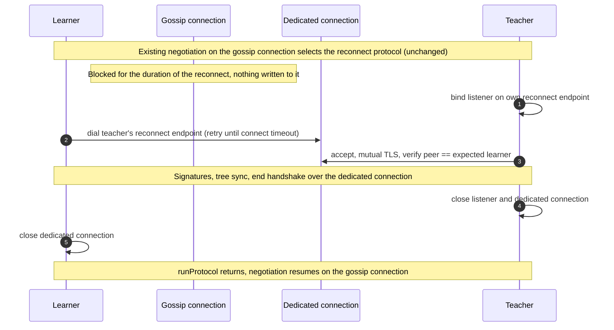

# Dedicated Reconnect Connection

## 1. Summary

Reconnect state transfer currently runs over the same TCP/TLS connection that gossip uses.
This proposal moves it to a dedicated, short-lived TLS connection that the reconnect module creates and owns.
Reconnect can then use socket settings suited to multi-gigabyte, long-running transfers,
without changing any setting on the gossip path.

The control plane does not change in this step: protocol negotiation, teacher selection, the teacher throttle,
and learner/teacher permits all stay on the gossip connection. Once both peers have agreed to reconnect,
the teacher opens a listener on its reconnect endpoint, the learner dials it, and the whole reconnect exchange
runs over the new connection. The gossip connection simply blocks until the reconnect finishes, as it does today.

## 2. Background

### 2.1 How reconnect uses the gossip connection today

Each neighbor pair has exactly one connection. It is owned by a `ProtocolNegotiatorThread` created in
`PeerCommunication.buildProtocolThreads`. After a one-time `VersionCompareHandshake`, the `Negotiator` state
machine repeatedly selects one of three protocols in priority order: Heartbeat, Reconnect, RPC (`SyncGossipModular`).
The selected protocol owns the socket until its `runProtocol` returns. RPC gives up the connection by
writing `END_OF_CONVERSATION` once `gossipHalted` is set.

The reconnect protocol reaches gossip through `ReconnectProtocolFactory`. That interface lives in
`consensus-gossip-impl`, is implemented by `ReconnectProtocolFactoryImpl`, and is loaded via `ServiceLoader`
in `DefaultGossipModule`. `ReconnectStatePeerProtocol.runProtocol` runs the teacher or learner inline
on the negotiator thread. Both sides operate directly on the gossip `Connection`:

- they temporarily raise the shared socket's `SO_TIMEOUT` to `ReconnectConfig.socketTimeout`, then restore it;
- they send and receive the `SigSet`;
- they run `TeachingSynchronizer`/`LearningSynchronizer` over `connection.getDis()/getDos()`,
  with `connection::disconnect` as the break action;
- they finish with `endReconnectHandshake`, whose job is to leave the stream aligned for the next negotiation.

On a non-socket learner failure, and on any exception escaping the teacher (through `NetworkUtils.handleNetworkException`), the gossip connection itself is torn down, because its stream state is unknown.

### 2.2 Socket configuration today

`SocketFactory.configureAndBind` and `configureAndConnect` deliberately never set `SO_SNDBUF`/`SO_RCVBUF`. Both carry the comment "do NOT do setSendBufferSize or setReceiveBufferSize because it causes a major bug in certain situations." The history behind that comment was lost when the code moved repositories. Load tests on a branch with explicit buffer sizes showed no issues for either reconnect or gossip. Even so, changing socket settings on the mission-critical gossip path carries a risk of subtle regressions that we cannot justify for a reconnect-only benefit.

## 3. Motivation

The end goal of the ongoing reconnect performance work is to make reconnect converge for a state of 1 billion
accounts, roughly 6 billion entities in total. Reconnect has to make progress: each attempt must leave the learner
closer to the network than it was before. A reconnect transfers the teacher's state as of the start of the
attempt, and the network keeps advancing in the meantime. If the learner is still behind afterwards but within
the range of events its peers still hold, it catches up through gossip. If not, it reconnects again from a newer
state; as long as each attempt closes the gap, repeated reconnects still converge. At the start of this work,
reconnect at this scale took at least 350–410 seconds under load-test traffic, and it did not close the gap: the learner
never came within reach of gossip and re-entered reconnect indefinitely. In those load tests the break-even point
was about 180 seconds.

Load tests exposed several bottlenecks, which were resolved one at a time:
- learner receive backpressure, caused by the ordered leaf drain running on socket receiver threads;
- per-leaf storage serialized behind that ordered drain;
- sender threads stalling while waiting for paths to request;
- socket buffers left at OS defaults: the learner's receive buffer stayed at 64 KB while the teacher's send buffer
  autotuned to 2.5–10 MB.

None of these fixes gave much on its own, because removing one constraint mostly exposed the next. The clearest
example is the first fix. It eliminated the receive-side throttling, yet total reconnect time did not change,
because the cost moved into the tail of the ordered drain. Only with all of them in place did reconnect time
drop by about 50%, which is enough to clear the gossip catch-up threshold.

The socket buffer change is where the shared connection becomes a problem. It was validated on a test branch
where the explicit buffer sizes applied to every socket, gossip included. Load tests showed no regression for
gossip. Even so, shipping a change to gossip socket settings for a reconnect-only benefit is not a risk worth
taking, given the unexplained warning in the code (Section 2.2) and gossip's role in the system. The gain does not
come from bandwidth-delay product, which is small at sub-millisecond RTT. The most likely explanation is that a
larger receive buffer lets the kernel absorb the periods when receiver threads are briefly away from the socket,
instead of throttling the teacher.

This makes the dedicated connection a prerequisite for shipping reconnect at the 1-billion-account scale, not an
optional refinement. It lets the validated buffer settings apply to reconnect alone. Other transport-level tuning,
and the largest remaining application-level bottleneck (sender path starvation), are separate work.

Keeping reconnect on the gossip connection makes it hard to ship that change on its own, for three reasons.

First, any socket option set on the gossip connection affects gossip for the connection's whole lifetime, not just
during a reconnect.

Second, on the accepting side, a meaningful `SO_RCVBUF` has to be set on the listening socket before `bind()`,
because window scaling is negotiated in the SYN and accepted sockets inherit the listener's value. A shared
listener therefore cannot give reconnect sockets different receive buffers from gossip sockets.

Third, a second socket on the gossip port would need changes to inbound connection handling. Today
`InboundConnectionManager.newConnection` treats any new inbound socket from a peer as a replacement for the existing
one and disconnects the old gossip connection. That could be changed, for example by deferring the replacement until
the handshake reveals what kind of connection it is. But it means reworking inbound routing in the gossip
connection-management classes, which are under concurrent rework (Section 11).

A dedicated connection avoids all three. It also decouples failure handling: a broken transfer no longer takes the
gossip connection with it, and the per-attempt mutation of the shared socket's timeout goes away.

Finally, it moves the node toward the target architecture in the
[Consensus Layer proposal](https://github.com/hiero-ledger/hiero-consensus-node/blob/main/platform-sdk/docs/proposals/consensus-layer/Consensus-Layer.md).
There, reconnect is the Execution layer's responsibility: the Consensus layer reports that it has fallen behind
(`onBehind`) and stops, and Gossip is the only part of the Consensus layer that communicates over the network.
A reconnect that already creates and manages its own connection can later be moved out of the Consensus layer
without any connection handover (Section 5.1).

## 4. Goals and non-goals

**Goals.**
- Carry the entire reconnect data exchange (signatures, tree synchronization, end handshake) over a dedicated TLS connection created and owned by the reconnect module.
- Give that connection its own socket configuration, with no change to gossip sockets.
- Keep the changes mainly in the reconnect module (`consensus-reconnect`, `consensus-reconnect-impl`), with a minimal wiring change in gossip and nothing in the gossip classes under concurrent rework.
- Bring every environment along, including the Otter container environment, so the system is fully functional once the change lands.

**Non-goals.**
- Changing teacher selection, the throttle, or the permit model. Moving them out of the Consensus layer is the scope of the separate adapter work (Section 5.1).
- Changing the synchronizer wire format.
- Changing any gossip socket setting.
- Transport tuning beyond the buffer values already validated in load tests.
- Addressing application-level reconnect bottlenecks such as sender path starvation.
- Supporting reconnect in the Turtle environment, which does not run real gossip or reconnect today.
- Striping the transfer across several dedicated connections. Nothing measured shows a single TLS stream to be a limit today, and nothing in this design rules it out later.

## 5. Design overview

The reconnect protocol keeps its place in the negotiated protocol stack, and `runProtocol` stays blocking as it is
today. Reconnect runs at startup, or when the node has fallen too far behind, and the node is not functional until
it finishes, so there is nothing to gain from handing off asynchronously.

Once negotiation has fixed the roles, `ReconnectStateTeacher.execute()` and `ReconnectStateLearner.execute()` no
longer use the gossip connection. The teacher binds a listener on its reconnect endpoint and waits for the learner.
The learner resolves the teacher's reconnect endpoint from the roster and dials it. After mutual TLS, and after the
teacher has verified that the connection comes from the expected learner, both sides go straight into the existing
reconnect exchange. The dedicated connection carries no gossip handshake and no protocol negotiation. When the
exchange ends, the dedicated connection is closed and `runProtocol` returns. Nothing is written to the gossip
connection during the reconnect, so gossip resumes on it exactly where it left off.

```mermaid
sequenceDiagram
    autonumber
    participant L as Learner
    participant G as Gossip connection
    participant D as Dedicated connection
    participant T as Teacher

    Note over L,T: Existing negotiation on the gossip connection selects the reconnect protocol (unchanged)
    Note over G: Blocked for the duration of the reconnect, nothing written to it
    T->>T: bind listener on own reconnect endpoint
    L->>D: dial teacher's reconnect endpoint (retry until connect timeout)
    T->>D: accept, mutual TLS, verify peer == expected learner
    Note over L,T: Signatures, tree sync, end handshake over the dedicated connection
    T->>T: close listener and dedicated connection
    L->>L: close dedicated connection
    Note over L,T: runProtocol returns, negotiation resumes on the gossip connection
```

### 5.1 Relationship to the target architecture

This proposal deliberately leaves the control plane (negotiation, teacher selection, throttle, permits, waiting for
gossip to pause) where it is. In this step, those remain in the Consensus layer, with the complexity that comes with
them.

That is intended as the first of two steps. The separate adapter work moves reconnect initiation out of the
Consensus layer: the Consensus layer informs the adapter that the node is behind, and stops. Because the reconnect
module will already create and manage its own connection, the adapter can move the control plane out without having
to hand over a gossip connection. The data plane introduced here stays as it is.

## 6. Detailed design

### 6.1 Connection establishment

Establishment starts inside `execute()`, after the existing negotiation has fixed the roles (`InitiatedBy.SELF` for
the learner, `PEER` for the teacher). No bytes are exchanged on the gossip connection.

The **teacher** binds a server socket on its reconnect endpoint (Section 6.3), with the configured buffer sizes
applied before `bind()`. It accepts until `acceptTimeout`. For each accepted socket it completes the TLS handshake
under a handshake read timeout, then checks the certificate chain against the expected learner's node ID with
`NetworkPeerIdentifier`. A socket from any other peer is closed, and accepting continues until the deadline. As soon
as the expected learner is connected, the listener is closed.

The **learner** resolves the teacher's reconnect endpoint and dials it, with the configured buffer sizes applied
before `connect()`. The teacher binds its listener concurrently with the learner's first dial, so a refused
connection is expected at first. The learner retries until `connectTimeout` elapses.

The resulting socket is wrapped in a `SocketConnection` and handed to the existing teacher and learner logic, which
then runs unchanged: signatures, tree synchronization, and `endReconnectHandshake`, which is now a clean-completion
check on the dedicated connection. The data-socket read timeout is `ReconnectConfig.socketTimeout`, set once when the
socket is created.

### 6.2 Failure semantics

Every failure to establish the dedicated connection is a failed reconnect attempt, exactly like a failure during
the transfer. That covers bind failure, connect failure after retries, TLS failure, a wrong peer, and the accept
deadline. Each is logged with its reason, counted in a metric (Section 6.9), and counted by the reconnect controller
toward `maximumReconnectFailuresBeforeShutdown`.

There is no fallback to the gossip connection. A blocked port or a missing roster entry therefore shows up loudly,
as repeated reconnect failures and eventually a node shutdown, instead of being hidden. Fallback would also buy
little: at the target scale, reconnect over the gossip connection's default socket settings does not converge
anyway.

### 6.3 Addressing

**Every node's roster entry gains one additional endpoint: its reconnect endpoint.** `RosterEntry.gossipEndpoint` is
already a list, so the roster format does not change, but its content does, in every environment.

Rosters in use today carry exactly two endpoints per node, both on the gossip port. They follow the legacy
external/internal order that `RosterRetriever.buildRoster(AddressBook)` produced. Entry 0 is the externally
reachable address. Entry 1 is either the same address or a private one (10.x or 172.16.x in the sampled rosters).
Gossip only ever uses entry 0: `OutboundConnectionManager` dials it, and `PeerCommunication` listens on its port on
all interfaces, assuming every entry shares that port.

The reconnect endpoint is appended as entry 2. It carries the node's externally reachable address, the same one as
entry 0, together with the reconnect port. A single entry is enough, because peers only ever dial the external
address, exactly as gossip does. An example, using documentation addresses:

| Index | Role | Before | After |
|---|---|---|---|
| 0 | Gossip, external (dialed by peers) | `203.0.113.10:50111` | `203.0.113.10:50111` |
| 1 | Gossip, internal (legacy, unused by current code) | `10.0.0.5:50111` | `10.0.0.5:50111` |
| 2 | Reconnect | — | `203.0.113.10:<reconnect port>` |

On the dialing side, the learner uses entry 2 of the teacher's roster entry. On the binding side, the teacher binds
all interfaces on the port of its own entry 2, the same way gossip binds the port of entry 0. Where the external
address is translated to a private one (NAT, containers), the translation must map the reconnect port the same way
it maps the gossip port. If an environment's published address or port does not match what is reachable, gossip
relies on `GossipConfig.endpointOverrides` and `interfaceBindings`. Reconnect gets equivalents in `ReconnectConfig`
only if an environment actually needs them.

This makes the entry position part of the contract, and it has to be documented and respected on both sides:
- Entries 0 and 1 remain gossip endpoints. Gossip must never select entry 2, including if the round-robin selection
  anticipated in the `OutboundConnectionManager` comments is ever implemented.
- A roster entry with fewer than three endpoints has no reconnect endpoint. A reconnect attempt with that node as
  teacher fails with a clear error and is counted like any other failure (Section 6.2).

Current gossip code reads only entry 0, so entry 2 can be added to existing rosters ahead of the release without
affecting gossip.

No deployment gets the new endpoint for free. Whichever environment a node runs in, the reconnect port must be
exposed, mapped and permitted by its container, Kubernetes, NAT or firewall configuration, just like the gossip port.

### 6.4 Configuration

No new configuration class is introduced. `ReconnectConfig` gains the settings the dedicated connection needs.

| Property | Type | Default | Notes |
|---|---|---|---|
| `sendBufferSize` | int | TBD | `SO_SNDBUF`. `-1` leaves the OS default and kernel autotuning in place. |
| `receiveBufferSize` | int | TBD | `SO_RCVBUF`, applied before `bind()` / `connect()`. `-1` leaves the OS default and kernel autotuning in place. |
| `connectTimeout` | Duration | `5s` | Learner connect, including retries while the teacher binds, plus the TLS handshake. |
| `acceptTimeout` | Duration | `10s` | Teacher accept deadline. Must exceed `connectTimeout` so a slow but successful learner handshake is not cut off. |

On Linux, setting either buffer option explicitly disables kernel autotuning for that direction of the socket. The
teacher's send buffer autotunes to 2.5–10 MB during transfer, while the learner's receive buffer stays at 64 KB. The
defaults must therefore be the values validated in the load tests, not estimates.

Every other socket and stream setting keeps following `SocketConfig`: `tcpNoDelay`, `bufferSize` for the buffered
stream wrappers, `ipTos` and `gzipCompression`. Earlier investigation ruled out Nagle and userspace stream buffering
as reconnect bottlenecks, so there is no reason to make them separately configurable. Gzip is read inside
`SyncInputStream`/`SyncOutputStream`, so the payload framing is unchanged.

### 6.5 Security

The dedicated connection uses the same mutual-TLS setup as gossip: the same cipher suite, `needClientAuth`, and the
node's agreement key and certificate. Per session, the trust store holds only the one expected peer, the same
pattern `OutboundConnectionManager` uses, so a TLS handshake from any other node fails. The teacher additionally
checks the accepted socket's certificate chain against the expected learner using `NetworkPeerIdentifier`.

This binds the connection to the session without any token. The listener exists only while a teacher session is
being established. The teacher throttle limits a node to one learner at a time. Only the expected learner can
complete the handshake. A handshake read timeout prevents a stalled client from holding the accept loop. The new
port therefore adds no standing attack surface: it is closed outside sessions, and during a session it accepts only
the one authorized peer.

### 6.6 Listener lifecycle

The teacher binds on demand inside `execute()` and closes the listener as soon as the accept phase ends. The
dedicated connection exists only for a single reconnect session, and there is no reason to keep the port open
between sessions. On the learner, gossip is halted for the whole reconnect anyway, so nothing is lost by
establishing the connection per session.

An always-on listener created at startup was considered and rejected. It would surface bind conflicts earlier, but
it needs its own accept thread, logic to reject sockets arriving outside a session, and reconciliation with
peer-set updates. A bind failure with on-demand binding is simply a failed reconnect attempt (Section 6.2).

### 6.7 Failure handling

| Phase | Failure | Gossip connection | Dedicated connection | Attempt |
|---|---|---|---|---|
| Establishment | Bind, connect after retries, TLS, wrong peer, accept deadline | Untouched | Closed | Fails; counted |
| Transfer | Any exception from the teacher, learner, or synchronizer | Untouched | Closed through the break action | Fails; counted |

Nothing is written to the gossip connection during a reconnect, so a reconnect failure no longer leaves its stream
in an unknown state. `ReconnectStatePeerProtocol.runProtocol` therefore catches reconnect failures, closes only the
dedicated connection, logs using the same marker rules as `NetworkUtils.determineExceptionMarker`, and returns
normally. Before this change, such failures reached `NetworkUtils.handleNetworkException` and disconnected the gossip
connection. The learner still reports the error through `ReservedSignedStateResultProvider`. The teacher still
releases its throttle slot and permit in `finally`. Nothing else about permit or throttle accounting changes.

### 6.8 Threading

Nothing new is introduced. Both negotiator threads for the peer pair stay parked in `runProtocol` for the whole
session, as they are today. The gossip connection sits idle during the transfer. Nothing reads it, so its
`SO_TIMEOUT` never fires, and heartbeat and RPC resume on it once `runProtocol` returns.

The dedicated connection does not go through the gossip handshake or the protocol negotiator. Once TLS completes and
the peer is verified, it goes straight into the reconnect exchange. The synchronizers' worker threads (the async
stream reader and writer, sender and receive tasks, and the learner's applier thread) are unaffected; they just see
different streams.

### 6.9 Metrics and logging

Dedicated sockets do **not** go through `ConnectionTracker`, whose only implementation, `PeerCommunication`, feeds
gossip `NetworkMetrics`. Counting them there would pollute gossip connect and disconnect statistics.

New counters under the reconnect metrics: connection establishment failures, broken down by reason, and connection
establishment time. Data usage reporting keeps working as-is, because the dedicated `Connection` is built on
`SyncInputStream`, which carries the byte counter the learner already reads. Each session logs the peer, the
resolved endpoint, and the effective socket buffer sizes read back from the socket. Reading them back matters,
because the kernel may clamp the requested values.

The dedicated port also makes kernel-level diagnostics simpler. Today, inspecting the reconnect transfer with
`ss -tmi` means picking out the gossip connection to one specific peer, a socket that heartbeat and RPC also use.
With a dedicated port, the reconnect socket is selected with a plain port filter, and its `rwnd_limited`,
`snd_wnd` and buffer figures describe reconnect traffic only.

### 6.10 Code structure

| Location | Change |
|---|---|
| `consensus-reconnect` | `ReconnectConfig` gains the settings in Section 6.4. |
| `consensus-reconnect-impl`, new connection factory | Teacher side: bind, accept, verify peer. Learner side: resolve endpoint, dial with retry. Builds a per-session `SSLContext` from the node's keys and the single expected peer, reusing `CryptoUtils.createKeyManagerFactory` and `Utilities.createPublicKeyStore`. Resolves reconnect endpoints from the roster (Section 6.3). Reuses `SocketConnection` (with a no-op `ConnectionTracker`) and `NetworkPeerIdentifier` from `consensus-gossip-impl`, which the module already depends on. |
| `ReconnectStateTeacher.execute()` / `ReconnectStateLearner.execute()` | Replaced. They establish the dedicated connection, run the existing exchange over it, and close it. They no longer touch the gossip connection, including its timeout. |
| `ReconnectStatePeerProtocol` | Passes the connection factory to the teacher and learner, and applies the failure handling in Section 6.7. |
| `ReconnectProtocolFactoryImpl` | Builds the connection factory and passes it through `ReconnectStateSyncProtocol` to each per-peer instance. |
| `consensus-gossip-impl` | `ReconnectProtocolFactory.createProtocol` gains the node's `KeysAndCerts`, the roster and the self node ID, which the reconnect side does not receive today. `DefaultGossipModule` passes the values it already holds. This is the only gossip-side change. |

None of the gossip connection-management classes (`PeerCommunication`, `DynamicConnectionManagers`, the connection
managers, `TlsFactory`, `SocketFactory`) are modified.

## 7. Compatibility and rollout

All nodes in a network run the same software version, and reconnect between different versions is not supported:
`VersionCompareHandshake` normally refuses such connections, and even where `ProtocolConfig.tolerateMismatchedVersion`
would let them through, the software version is part of the state, so the learner's received state could never match
the expected root hash. No capability negotiation or compatibility guard is therefore needed.

The change has a hard rollout prerequisite: before a release containing it is deployed to an environment, every node
in that environment must have its reconnect endpoint in the roster, and that endpoint must be reachable from its
peers. Since current gossip code reads only the first roster endpoint, the entries can be added ahead of the release.
If the prerequisite is not met, reconnects fail and are counted, which is loud by design (Section 6.2). Release notes
must state the new endpoint and the roster convention.

## 8. Test environments

**Turtle.** Not affected. `TurtleGossipModule` replaces the gossip module with `SimulatedGossip`, and reconnect is not
wired into it; fallen-behind routing is explicitly not yet connected. Reconnect tests are gated on
`Capability.RECONNECT` and run in the Container environment.

**Container (Otter).** In scope. Rosters generated for container networks must include each node's reconnect
endpoint, and the reconnect port must be reachable between containers.

For network-fault injection, the gossip connection already covers the common case. If two nodes cannot reach each
other over gossip, they cannot negotiate a reconnect, so a fault in place before a reconnect prevents it without any
change. Two cases still need checking against the container fixture implementation:
- a partition or isolation applied while a reconnect transfer is already in progress;
- bandwidth or latency shaping meant to slow reconnect down.

If faults are applied per port, those cases would miss the dedicated connection; if they are applied per host or per
container, nothing changes. This depends on the container fixture implementation (`ContainerNode`,
`ContainerNetwork`, the network-fault implementation), which is not yet part of this review's context.

**Production and Solo/Kubernetes.** Rosters must carry the reconnect endpoint, and firewall rules and service
definitions must expose the reconnect port, before the release lands (Section 7). Ownership of these artifacts is an
open item.

## 9. Testing plan

**Unit tests.**
- Reconnect endpoint resolution from the roster, including a roster entry with no reconnect endpoint.
- Config validation (`acceptTimeout > connectTimeout`).

**Integration tests with real sockets and TLS,** following the existing `SocketFactoryTest` / `InboundConnectionHandlerTest` patterns (real key material from `CryptoArgsProvider`, `@FreePort`):
- successful establishment, including a learner dial that starts before the teacher has bound;
- each establishment failure (bind conflict, connect refused past the deadline, wrong peer certificate, accept deadline), surfacing as a failed attempt;
- a mid-transfer failure that closes only the dedicated connection and leaves the gossip connection usable for a subsequent negotiation round.

**`ReconnectTest`.** Updated to run the full teacher and learner exchange over the dedicated connection, using the real `RandomSignedStateGenerator` and MerkleDB setup it already uses.

**Otter container tests.** The existing reconnect tests pass over the dedicated connection. The partition and isolation tests keep their current assertions (for example, `doNotAttemptToReconnect` in `PartitionTest`). A new test with the reconnect port blocked verifies that the failure is reported and counted.

**Performance.** A large-state reconnect load test confirms that the dedicated connection, with the validated buffer defaults, reproduces the result obtained on the test branch. Runs are compared only when they move a comparable number of dirty leaves, because total reconnect time scales with payload and a smaller payload can masquerade as a speedup. The comparison uses the same evidence as the earlier reconnect investigation:
- total reconnect time and the gap between the end of transfer and learner finalization;
- `ss -tmi` on the teacher for the reconnect socket: `rwnd_limited`, `snd_wnd`, and unsent bytes;
- the effective socket buffer sizes logged at session start.

Buffer tuning follows as a separate change, starting with `receiveBufferSize` in the 4–8 MB range and measured with the same method.
