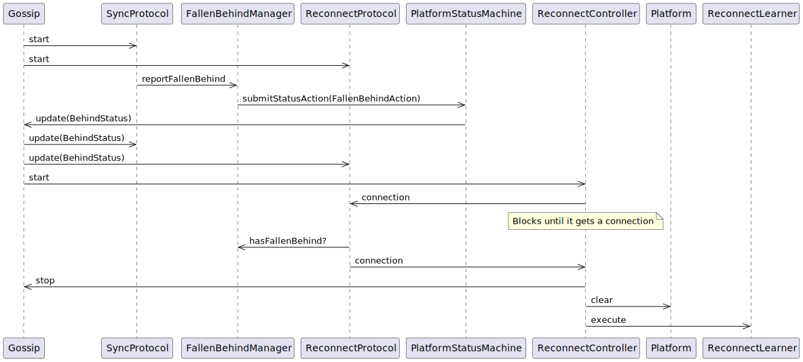

# Reconnect Refactor

## Motivation

This proposal covers a major refactoring of the platform's state synchronization and reconnect mechanism.

- "Gossip" component is tightly coupled to reconnect logic.
- We aim to have separated abstractions for network communication / gossip and reconnect logic in the future.
- Reconnect behavior (specifically the learning logic) is spread across multiple helpers with overlapping responsibilities (network, platform, sync helpers).
- Protocols couple directly to gossip-internal "fallen behind" management, blurring boundaries with platform status.

The goal is to make reconnect logic easier to maintain by moving it outside of gossip scope, and making it central in the platform.
We'll do this by consolidating orchestration in a single controller directed by a centralized monitor, make protocol decisions to rely on `PlatformStatus`
and remove the need of connections handoff.

## Current Approach (Before)

In a very simplistic explanation, the current reconnect logic is implemented in the following way:

Gossip component initiates protocols, which are running continuously, interleaved, and are executed only when certain conditions apply. Protocols owns the lifecycle of the connections to other peers.
One of those two protocols is SyncProtocol, which is one of our gossip implementations. Syncing nodes compare their current hashgraph status against the peer's, determines if the local node has fallen behind and registers that in a mutable shared class (`FallenBehindManager`)

ReconnectProtocol is another protocol executing internally in gossip, the condition for start executing is whether `FallenBehindManager` tells that the node has fallen behind.
Depending on which of the nodes has fallen behind, the code will follow the teacher logic or the learner logic.
There is a part of the logic of each of those protocols that execute for each peer in the system. So, if it is time to execute the part of the logic corresponding to the peer that told the current node that it was falling behind, then the logic is executed.
When acting as learner, the logic consist on sharing the connection using a blocking queue to an external class that will handle the reconnect logic.

When Gossip receives the BEHIND status change, starts the `ReconnectController` logic in on a dedicated thread, which blocks until a connection can be acquired from the previously mentioned blocked queue.
When a connection is received, the platform is prepared for starting the reconnect process, and using endless number of helper classes and method references to multiple pieces of the system, retrieves the ReservedSignedState from the other peer.
Platform controller will stop all platform activity in preparation for gossip, and the helpers will validate the state acquired from a peer. If anything on the process goes wrong the code will retry until a configured maximum attempts threshold.

### Simplified interaction sequence:

> [!NOTE]
> Many classes have been removed in order to be able to show the interaction sequence.
> The number of classes in the class diagram and their relationship can hint how complex the real sequence is.

### Classes relationships and responsibilities:

* ReconnectController: The main control loop for retrying reconnects. Executes in an independent thread started by gossip.
* ReconnectStateLoader: Loading the received state into the platform.
* ReconnectPlatformHelper/ReconnectPlatformHelperImpl: Preparing the platform for reconnect (pausing gossip, clearing pipelines).
* ReconnectLearnerThrottle: Logic for throttling reconnect attempts and shutting down the node after too many failures.
* FallenBehindManager / FallenBehindManagerImpl: keeps the information about which nodes are behind. Can be queried.
* SyncManagerImpl: a wrapper around FallenBehindManager that adds metrics.
* ReconnectSyncHelper: Logic for obtaining a state via the network. ReconnectPeerProtocol provides this class with a connection using a shared blocking queue
* ReconnectLearner: Used by ReconnectController to perform the actual sync of the state.
* ReconnectLearnerFactory: creates instances of reconnectLearners. Used by ReconnectController
* ReconnectTeacher: Performs the sync of the state when acting as teachers. Is created and used by ReconnectPeerProtocol
* ReconnectUtils: Utility functions for handling the state

## Proposed Design (After)

1. Refactoring Gossip:
   The gossip implementation (SyncGossipModular) and protocols will be simplified and decoupled from the reconnect orchestration.
   Its constructor is much simpler. It no longer takes dependencies like swirldStateManager, statusActionSubmitter, or callbacks for loading state and clearing pipelines. It now receives the FallenBehindMonitor directly.
   The Gossip interface now extends a new GossipController interface and includes pause(), resume(), and receiveSignedState() methods. The PlatformReconnecter uses these methods to control gossip flow and retrieve the state.

2. Introduction of PlatformReconnecter:
   PlatformReconnecter will be the central authority for handling the entire reconnect process. It will live outside the Gossip component and will be a first class citizen for the platform.
   Centralize the reconnect lifecycle: pause platform activity → wait to receive a state → validate → load → resume → retry with policy or error handling.
   It will directly coordinate with other components. For example, it calls gossip.pause(), clears wiring pipelines, and loads the new state via its own methods,
   instead of using complex callbacks and atomic references passed through the PlatformBuilder.
   It absorbs the responsibilities of several now-deleted classes, making responsibility is not scattered all over

   * ReconnectController
   * ReconnectStateLoader
   * ReconnectPlatformHelper/ReconnectPlatformHelperImpl
   * ReconnectLearnerThrottle
   
   This makes PlatformBuilder / PlatformBuildingBlocks / Platform code simpler, lighter and easier to understand and the relationship between classes easier to follow.
3. Introduction of `FallenBehindMonitor`:
   FallenBehindManager becomes a direct monitor and renamed accordingly.
   classes like AbstractShadowgraphSynchronizer now use FallenBehindMonitor directly to report fallen-behind status.
   The class is not used to check if the node is behind anymore, that check is done through the platform status.
   As soon as it detects the node is behind, it updates the platform status and starts the reconnect process invoking `PlatformReconnecter`
4. `ReconnectProtocol` Renaming:
   Given that the actual logic of a reconnect now happens outside the scope of gossip and the protocols, the new responsibility of the protocol becomes to retrieve a valid state from a peer.
   StateSyncProtocol better reflects this change of scope. It now operates when requested by `PlatformReconnecter` through Gossip's new interface.

### Benefits

* Simplified Gossip component instantiation:  It no longer requires dependencies for loading state, submitting status actions, or clearing pipelines.
* Clear dependencies: moving away from indirect references (through lambdas, callbacks and atomic references) to direct object dependencies makes relationship between classes easier to follow.
* Simplify Lerner logic by removing helper classes and reorganizing code: Responsibility is not scattered all over, the steps of the process becomes more clear.
* Provide better refactor capabilities: This change enables the future plan of making the gossip component our network layer.

### New classes relationships after modification

## Impact

- **JRS:** Tests that depends on finding logs will be affected as they will be modified/ shifted.
- **Junit Tests:** Mayor rewrite of over 50 tests.
- **Otter Tests:** Some capabilities depending on deleted pieces will have to be refactored.
- **Browser and Test applications:** All remaining testing application need to instance the new pieces.

## Future ideas

- Add phase timers and structured log fields (`phase`, `peerId`, `round`, `hash`, `attempt`, `durationMs`).
- Introduce a `ReconnectPolicy` for backoff, retries, and deadlines.
- Add a `reconnectId` correlation ID propagated across logs and over the wire for teacher/learner correlation.
