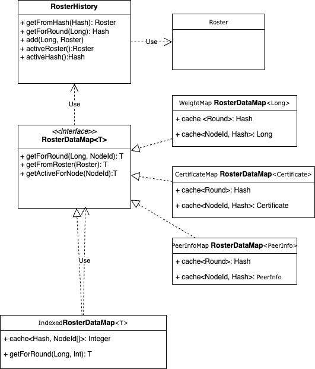

# Current Usage of Roster States in the Platform

## Roster Data Structure in State

The platform's state contains two core components for handling rosters:

* "ROSTER_STATES": A singleton object.

* "ROSTERS": A key-value state (map-like structure).

### RosterStates (Singleton)

The RosterStates object is composed of:

* Candidate Roster Hash (currently unused).

* List of Round-to-Roster-Hash Pairs:

  * Behaves like a stack, always containing two elements during runtime:
    * The first (newest) element: Represents the active roster.

    * The second (older) element: Represents the previous roster.

### Rosters (Key-Value State)

The Rosters object is a map from a roster hash to a roster object.

Each `Roster` object is a pbj object containing:

* A list of RosterEntries. Each roster entry includes:
  * A node ID (long).
  * A certificate (as a byte[]).
  * A list of addresses, each consisting of:
    - An address (byte[] representing an ipv4 address).
    - A port (int).
    - A domain name (String).

### Diagram

### Accessing State – Readable and Writable Stores

* Readable Store: - Allows querying-
  * Active Roster
  * Previous Roster
  * Candidate Roster
  * History (list of round-to-roster-hash pairs)

* Writable Store: - supports -
  * Setting the Active Roster (thus setting the previous roster too and updating the history)
  * Setting the Candidate Roster

## Platform

The platform receives both `Roster` pbj objects and `RosterHistory` from the application in the start-up phase, or from the state
in the restart.
Consumes Roster via different utility classes:

* `RosterUtils`: A collection of static methods. Provides navigation of roster elements by node and updates the state.
  

* `RosterHistory`: A POJO. returns the roster applicable to a given round. also returns previous and active roster.

* `RosterRetriever`: Provides access to active, previous, and candidate rosters, also allows to modify the state. It's mostly used by services but is owned by platform.
  

## Where rosters are used in platform code

- ReconnectStateLoader: Converts a roster (current roster) to json and logs it
- SignedStateFileWriter: Converts a roster to json and writes it in a file, The roster used is read directly from the state
- IssMetrics: Requires iterating over the list of nodes in the roster. Requires each node's weight. Requires the roster total weight.
- DefaultEventSignatureValidator: Needs a Certificate from a round and Roster
- ReconnectStateLoader, ReconnectLearner, ReconnectLearnerFactory: use the current roster to send it to the DefaultSignedStateValidator
- DefaultSignedStateValidator: Requires each node's gossip certificate
- ConsensusRound/StreamedRound: holds the roster of that particular consensus round
  - used by UptimeTracker to iterates over all entries and adds their weight and the total weight of the roster to update metrics
  - used by ISSTestingToolConsensusStateEventHandler to iterates over all entries and adds their weight and the total weight of the roster
- SyncGossipModular: creates a PeerInfo object out of each RosterEntry. The used roster is the current roster.
- IssDetector: Requires the node's weight. Requires the roster's total weight. receives the current roster
- DefaultBranchReporter: Requires the node's weight. Requires iterating over the list of nodes in the roster. The used roster is the current roster.
- ConsensusImpl: Number of participants and each participant's weight. stronglySeeP uses an index instead of nodeId's to retrieve the paticipant's weight. The used roster is the current roster.
- Platform#getCurrentRoster() a method that is only used in tests and test applications and should be removed
  - SwirldsStateManagerTests: number of entries in the roster
  - WinTabAddresses: iterate over the roster entries, needs id, host, name, port.
  - SwirldsGui: number of entries in the roster
  - StressTestingToolMain: number of entries in the roster
  - StatsSigningTestingToolMain: number of entries in the roster
  - StatsDemoMain: number of entries in the roster
  - PlatformTestingToolMain: number of entries in the roster
  - PlatformTestingToolConsensusStateEventHandler: Heavily uses the roster to index transformation
  - MigrationTestingToolMain: number of entries in the roster.
  - CryptocurrencyDemoState: iterate over the entries in the roster, retrieve node id, number of entries in the roster.
  - TransactionGenerator: number of entries in the roster.

## Identified Problems

* Too many abstractions and entry points with repeated operations
* Navigation Cost: Current implementation requires O(n) operations to retrieve a node information from a roster.
* Lacks support for more expressive or directly usable types (e.g., returning `Certificate` or `Address` instead of raw bytes).
* No memoization or internal caching to avoid repeated parsing or conversion costs.

## Proposed changes

- unify naming: activeRoster and currentRoster are used interchangeably.
- unify nullability criteria in all methods (some return null other exception)
- Remove RosterRetriever
- `RosterHistory` becomes a mutable class. Its responsibility is to hold all the roster history provided to us by updates from the app, tracks which roster applies to each round.
  It offers a new operation to add a roster round relationship to the tracked elements.
- Platform code does not use `Roster` or `RosterHistory` directly, all components and code will use a specific instance of an object implementing `RosterDataMap`
- `RosterDataMap` is a generic interface. Exposes an operation that returns the specific data types translations (e.g.: Certificates or PeerInfo) from a Roster object given a round and a nodeId.
- Implement 3 subtypes of `RosterDataMap`:
  - PeerInfoMap: return all the information related to gossip endpoints
  - CertificateMap: return the certificate associated to the public gossip key
  - WeightInfoMap: return the weight of each node in the roster
  - IndexMap: return the index of a particular node in the roster. The index is
- `RosterDataMap` Implementation details:
  - it doesn't need to hold every roster for every round, it can register the first round and assume that every round after that until the next element applies the same roster.
  - Every instance will hold a reference to a `RosterHistory` to retrieve the right roster for a round.
  - Roster data map wraps `RosterHistory`'s operation that allows to add a roster-round relationship.
- `RosterUtils` become deprecated
- Platform does not receive a `currentRoster` or a `previousRoster` anymore, it receives a list of Round Roster pairs that every component will apply to its own reference of a `RosterDataMap` by injecting a value through the wiring framework.
- Platform does not use `ReadableRosterStore` anymore.
- neither `RosterHistory` nor any of the `RosterDataMap` instances are thread safe.
- IssMetrics: use the weightMap
- DefaultEventSignatureValidator: use the certificate map
- DefaultSignedStateValidator: use the peerInfoMap
- ConsensusRound/StreamedRound: Don't expose the roster anymore.
- UptimeTracker / ISSTestingToolConsensusStateEventHandler use the weight map
- SyncGossipModular: use the peerInfoMap
- IssDetector: use the weight map
- DefaultBranchReporter: use the weight map
- ConsensusImpl: the most challenging component. requires the index map, do we need to have a map per round?
- About replacing the current roster, Ideally all the usages of rosters provide the round that applies, but some parts of the code don't have access to the current round.
  - we can achieve this by injecting the event-window in each component, and include additional logic in the RosterHistory to determine which roster should be the current roster.
  - as it's done currently: assume that the current roster is the newest recorded roster in the history.

#### Pros & Cons

+ (+) Solves all the mentioned problems at minimum runtime execution cost.
+ (+) Respects platform/state boundaries
+ (+) Eliminate intermediate classes and clutter code by making each component cache only the instance they will be working with.
+ (-) Include an event window injection in components that use the roster-history could create a link from consensus to other components that would violate our future module relationships
- (-) High Memory footprint as `RosterHistory` and `RosterDataMap` are holding caches and every component will need their own instance of them.
- (-) The logic of the `ReadableRosterStore` is duplicated in `RosterHistory`
- (-) potential need to include more wires to inject the event-window.
