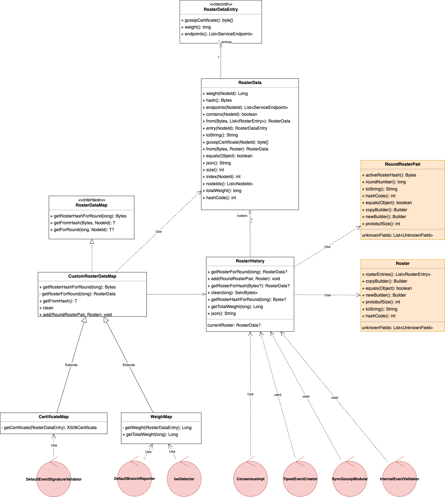

# Current Usage of Roster States in the Platform

## Roster Data Structure in State

The platform's state contains two core components for handling rosters:

* "ROSTER_STATES": A singleton object.

* "ROSTERS": A key-value state (map-like structure).

### RosterStates (Singleton)

The RosterStates object is composed of:

* Candidate Roster Hash (currently unused).

* List of Round-to-Roster-Hash Pairs:

  * Behaves like a stack, always containing two elements during runtime:
    * The first (newest) element: Represents the active roster.

    * The second (older) element: Represents the previous roster.

### Rosters (Key-Value State)

The Rosters object is a map from a roster hash to a roster object.

Each `Roster` object is a pbj object containing:

* A list of RosterEntries. Each roster entry includes:
  * A node ID (long).
  * A certificate (as a byte[]).
  * A list of addresses, each consisting of:
    - An address (byte[] representing an ipv4 address).
    - A port (int).
    - A domain name (String).

### Diagram

### Accessing State – Readable and Writable Stores

* Readable Store: - Allows querying-
  * Active Roster
  * Previous Roster
  * Candidate Roster
  * History (list of round-to-roster-hash pairs)

* Writable Store: - supports -
  * Setting the Active Roster (thus setting the previous roster too and updating the history)
  * Setting the Candidate Roster

## Platform

The platform receives both `Roster` pbj objects and `RosterHistory` from the application in the start-up phase, or from the state
in the restart.
Consumes Roster via different utility classes:

* `RosterUtils`: A collection of static methods. Provides navigation of roster elements by node and updates the state.
  

* `RosterHistory`: A POJO. returns the roster applicable to a given round. also returns previous and active roster.

* `RosterRetriever`: Provides access to active, previous, and candidate rosters, also allows to modify the state. It's mostly used by services but is owned by platform.
  

## Where rosters are used in platform code

- ReconnectStateLoader: Converts a roster (current roster) to json and logs it
- SignedStateFileWriter: Converts a roster to json and writes it in a file, The roster used is read directly from the state
- IssMetrics: Requires iterating over the list of nodes in the roster. Requires each node's weight. Requires the roster total weight.
- DefaultEventSignatureValidator: Needs a Certificate from a round and Roster
- ReconnectStateLoader, ReconnectLearner, ReconnectLearnerFactory: use the current roster to send it to the DefaultSignedStateValidator
- DefaultSignedStateValidator: Requires each node's gossip certificate
- ConsensusRound/StreamedRound: holds the roster of that particular consensus round
  - used by UptimeTracker to iterates over all entries and adds their weight and the total weight of the roster to update metrics
  - used by ISSTestingToolConsensusStateEventHandler to iterates over all entries and adds their weight and the total weight of the roster
- SyncGossipModular: creates a PeerInfo object out of each RosterEntry. The used roster is the current roster.
- IssDetector: Requires the node's weight. Requires the roster's total weight. receives the current roster
- DefaultBranchReporter: Requires the node's weight. Requires iterating over the list of nodes in the roster. The used roster is the current roster.
- ConsensusImpl: Number of participants and each participant's weight. stronglySeeP uses an index instead of nodeId's to retrieve the participant's weight. The used roster is the current roster.
- Platform#getCurrentRoster() a method that is only used in tests and test applications and should be removed
  - SwirldsStateManagerTests: number of entries in the roster
  - WinTabAddresses: iterate over the roster entries, needs id, host, name, port.
  - SwirldsGui: number of entries in the roster
  - StressTestingToolMain: number of entries in the roster
  - StatsSigningTestingToolMain: number of entries in the roster
  - StatsDemoMain: number of entries in the roster
  - PlatformTestingToolMain: number of entries in the roster
  - PlatformTestingToolConsensusStateEventHandler: Heavily uses the roster to index transformation
  - MigrationTestingToolMain: number of entries in the roster.
  - CryptocurrencyDemoState: iterate over the entries in the roster, retrieve node id, number of entries in the roster.
  - TransactionGenerator: number of entries in the roster.

## Identified Problems

* Too many abstractions and entry points with repeated operations
* Navigation Cost: Current implementation requires O(n) operations to retrieve a node information from a roster.
* Lacks support for more expressive or directly usable types (e.g., returning `Certificate` or `Address` instead of raw bytes).
* No memoization or internal caching to avoid repeated parsing or conversion costs.

## Proposed changes

### Class diagram

### Roster's update interaction

### Roster's clean interaction

### New Abstractions

* `RosterData` class:
  Encapsulates roster information as an immutable data structure:
  Provides nodeIds(), weight(NodeId), getTotalWeight(), size(), index(NodeId), and lookup utilities.
  Implements equality, hashing, JSON serialization, and utility methods for integration.

* `RosterDataEntry` record: Immutable record representing a single node's details like weight, gossip certificate, and endpoints.

* `RosterHistory`: Tracks the history of rosters across rounds and allows retrieval based on round numbers or hashes. A replacement for `org.hiero.consensus.roster.RosterHistory`.
  It will be mutable, it will return RosterData objects, it will allow components to maintain their own history and manage its updates, it will cache values.

* `CustomRosterDataMap`: roster data map with custom transformation support and caching.

* `WeightMap`: Specialized CustomRosterDataMap providing fast access to node weights by node and round.

* `CertificateMap`: Specialized CustomRosterDataMap providing cached X509Certificate instances by node and round

### Change all uses of `Roster` to `RosterData`

To provide a unified abstraction (`RosterData`) that simplifies interaction with roster contents while hiding the
underlying roster proto objects, the following code will be updated to stop using `Roster`

#### Components

* `org.hiero.consensus.event.creator.impl.tipset.TipsetEventCreator`
* `com.swirlds.platform.ConsensusImpl`
* `com.swirlds.platform.gossip.SyncGossipModular`
* `com.swirlds.platform.event.validation.DefaultEventSignatureValidator`
* `com.swirlds.platform.event.branching.DefaultBranchReporter`

after this change, `ConsensusImpl` will not require a node-to-roster-index map anymore and will be able to use the roterData index operation with the same O(1) complexity

#### Platform support code

* `com.swirlds.platform.builder.PlatformBuilder`
* `com.swirlds.platform.system.Platform`
* `com.swirlds.platform.ReconnectStateLoader`
* `com.swirlds.platform.state.address.RosterMetrics`
* `com.swirlds.platform.recovery.internal.EventStreamRoundIterator`
* `com.swirlds.platform.recovery.internal.StreamedRound`
* `com.swirlds.platform.uptime.UptimeTracker`

#### TipsetEventCreator support code:

* `org.hiero.consensus.event.creator.impl.tipset.TipsetWeightCalculator`
* `org.hiero.consensus.event.creator.impl.tipset.TipsetTracker`
* `org.hiero.consensus.event.creator.impl.tipset.Tipset`
* `org.hiero.consensus.event.creator.impl.tipset.TipsetMetrics`

#### ConsensusImpl support code:

* `com.swirlds.platform.consensus.ConsensusRounds`
* `org.hiero.consensus.model.hashgraph.ConsensusRound`
* `org.hiero.consensus.model.hashgraph.Round`

#### SyncGossipModular support code

* `com.swirlds.platform.Utilities`
* `com.swirlds.platform.gossip.DefaultIntakeEventCounter`

#### DefaultSignedStateValidator support code

* `com.swirlds.platform.reconnect.DefaultSignedStateValidator`
* `com.swirlds.platform.state.signed.SignedStateValidator`
* `com.swirlds.platform.state.signed.SignedState`
* `com.swirlds.platform.state.signed.SignedStateInfo`
* `com.swirlds.platform.state.signed.SignedStateValidationData`
* `com.swirlds.platform.metrics.IssMetrics`

### Platform components will not receive a `RosterData` directly but access it through `RosterHistory`

Components needing a `RosterData` will receive a `RosterHistory` instance instead. RosterHistory is removed from platformBuildingBlocks, each component will have their own `RosterHistory` in order to avoid making that class thread-safe.
Previous to the initialization, when building the platform will inject a list of RoundRosterPair, a list of Hash and a List of Roster provided by the application to each component using the newly added method in `PlatformWiring`
During this stage, all components that require a roster will use the `getCurrentRoster` method and components will not search the roster by round.
* `com.swirlds.platform.event.branching.DefaultBranchReporter`
* `com.swirlds.platform.ConsensusImpl`
* `com.swirlds.platform.state.iss.DefaultIssDetector`
* `org.hiero.consensus.event.creator.impl.tipset.TipsetEventCreator`
* `com.swirlds.platform.gossip.SyncGossipModular`

### State validation and signatures will use a `RosterHistory`

* `com.swirlds.platform.state.signed.SignedState`
* `com.swirlds.platform.ReconnectStateLoader`
* `com.swirlds.platform.reconnect.ReconnectLearnerFactory`
* `com.swirlds.platform.reconnect.ReconnectLearner`

### Platform components will provide an api to update the `RosterHistory`

Platform will provide an api that accepts a list of RoundRosterPair and a List of Roster and the components will update their instance internal state.
Nobody will call this method yet.
`PlatformWire` will receive the call and inject the new values into each of the components using the `RosterHistory`

#### Components

* `com.swirlds.platform.event.branching.DefaultBranchReporter`
* `com.swirlds.platform.ConsensusImpl`
* `com.swirlds.platform.state.iss.DefaultIssDetector`
* `org.hiero.consensus.event.creator.impl.tipset.TipsetEventCreator`
* `com.swirlds.platform.gossip.SyncGossipModular`
* `com.swirlds.platform.event.validation.DefaultEventSignatureValidator`

#### Platform support code

* `com.swirlds.platform.wiring.PlatformWiring`: will expose a method to update the roster history that will know all reference to the previously added input wires and inject the new values to each component. Nobody will call this method yet.

### Modify `EventWindow` updates

The following components, when processing an `EventWindow` updates will:
a) clean all the expired references from the `RosterHistory`
b) register the new current round to replace RosterHistory.getCurrentRoster() with RosterHistory.getRosterForRound(round)
c) ConsensusRound/StreamedRound: Should not expose the roster anymore.

* `com.swirlds.platform.event.branching.DefaultBranchReporter`
* `com.swirlds.platform.event.validation.DefaultEventSignatureValidator`
* `org.hiero.consensus.event.creator.impl.tipset.TipsetEventCreator`
* `com.swirlds.platform.gossip.SyncGossipModular`

### Replace all uses to the previous `RosterHistory` with the new mutable + cachable version of `RosterHistory`

All pending usages of RosterHistory should use the newer version of the object and remove the previous one.

#### Components

`com.swirlds.platform.event.validation.EventSignatureValidator`
`com.swirlds.platform.event.validation.DefaultEventSignatureValidator`

#### Platform support code

* `com.swirlds.platform.wiring.PlatformWiring`
* `com.swirlds.platform.ReconnectStateLoader`
* `com.swirlds.platform.builder.PlatformBuilder`
* `com.swirlds.platform.builder.PlatformBuildingBlocks`

### Replace all uses of `RosterHistory.getCurrentRoster()` with `RosterHistory.getRosterForRound(round)`

All uses of the history should provide the round for which the roster needs to be retrieved.

### Modify components to use `CustomRosterDataMap`

- (?)SyncGossipModular: Should use a `CustomRosterDataMap` that allows to create `PeerInfo` instances
- IssDetector: Should use a `WeightMap`
- DefaultBranchReporter: Should use a `WeightMap`

## Open questions:

- `ConsensusImpl`: which round should it use to get a roster from the history? Can it use the event's birth round? When should it clean old references from the history?
- `DefaultIssDetector` doesn't process event windows, but it seems that it should just for this purpose, or can we use any internal data to do the cleaning?.
- `SyncGossipModular` doesn't process event windows, how it accesses rounds to retrieve information from the history? Should this be handled in DAB as it should also handle connections to new peers..
- `TipsetEventCreator`: Tipset objects store `roster` objects, what should happen with old tips when we update the history? should they be recalculated?
- How will the `StateValidation` process receive the rounds to validate? as these are not components that can process event windows.
- What property in the eventWindow should be used as round to retrieve the roster from history?
