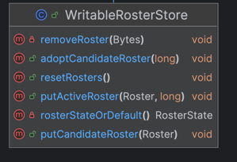
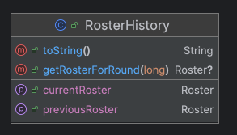

# Current Usage of Roster States in the Platform

## Roster Data Structure in State

The platform's state contains two core components for handling rosters:

* "ROSTER_STATES": A singleton object.

* "ROSTERS": A key-value state (map-like structure).

### RosterStates (Singleton)

The RosterStates object is composed of:

* Candidate Roster Hash (currently unused).

* List of Round-to-Roster-Hash Pairs:

  * Behaves like a stack, always containing two elements during runtime:

  * The first (newest) element: Represents the active roster.

  * The second (older) element: Represents the previous roster.

### Rosters (Key-Value State)

The Rosters object is a map from a roster hash to a roster object.

Each `Roster` object is a pbj object containing:

* A list of RosterEntries.

  Each roster entry includes:
  * A node ID (long).
  * A certificate (as a byte[]).
  * A list of addresses, each consisting of:
  * An address (byte[] representing an ipv4 address).
  * A port (int).
  * A domain name (String).

### Diagram


### Accessing State – Readable and Writable Stores

* Readable Store: - Allows querying-
  * Active Roster
  * Previous Roster
  * Candidate Roster
  * History (list of round-to-roster-hash pairs)


* Writable Store: - supports -
  * Setting the Active Roster (thus setting the previous roster too and updating the history)
  * Setting the Candidate Roster



## Platform

The platform receives both `Roster` pbj objects and `RosterHistory` from the application in the start-up phase, or from the state
in the restart.
Consumes Roster via different utility classes:

* `RosterUtils`: A collection of static methods. Provides navigation of roster elements by node and updates the state.
  

* `RosterHistory`: A POJO. returns the roster applicable to a given round. also returns previous and active roster.



* `RosterRetriever`: Provides access to active, previous, and candidate rosters, also allows to modify the state. It's mostly used by services but is owned by platform.
  

## Identified Problems

* Too many abstractions and entry points with repeated operations
* Navigation Cost: Current implementation requires O(n) operations to retrieve a node information from a roster.
* Lacks support for more expressive or directly usable types (e.g., returning `Certificate` or `Address` instead of raw bytes).
* No memoization or internal caching to avoid repeated parsing or conversion costs.

## Proposed changes

### Misc

- unify naming: activeRoster and currentRoster are used interchangeably.
- unify nullability criteria in all methods (some return null other exception)
- includes some missing operations in ReadableRosterStore (e.g.: getPreviousRoster).
- All uses in services code of RosterHistory and RosterRetriever are replaced with ReadableRosterStore
- Remove RosterHistory and RosterRetriever

### Immutable approach

- Create `RosterSnapshot` as an immutable class, which is a pojo roster with better per node lookup capabilities (internally uses a NodeIdXRosterEntry),
  and it can be created out of a pbj Roster. All translations to better data types are performed in the constructor of this class (i.e.: Certificates or Address instead of bytes)
- Platform code does not use `Roster` anymore, all components and code use a `RosterSnapshot`
- Methods in `RosterUtils` become either a property or a method in `RosterSnapshot` (or a possible RosterSnapshotEntry)
- Introduce a `PlatformRosterStore`, a class that uses `ReadableRosterStore` but instead of returning `Roster` returns `RosterSnapshot`
- `PlatformRosterStore` is a singleton (java pattern) in platform code. Only one instance is shared, all components and code that need to receive a roster receives instead a `PlatformRosterStore`
- platform does not receive anymore a `currentRoster` or a `previousRoster` it receives a `readableRosterStore` which is internally used to create a `PlatformRosterStore`
- When a `PlatformRosterStore` is created, it uses `ReadableRosterStore` and retrieves the active roster and the previous roster and their hashes, creates a `RosterSnapshot` per each, and caches them internally.
- Optional, when `PlatformRosterStore` is required to provide `activeRoster`, `previousRoster` or `rosterForRound`, it first retrieves the hash of the applicable roster from the state,
  and tries to get the corresponding `RosterSnapshot` from its internal cache if existed. This is in case we need to provide support for future use cases where the rosters can be modified in the state in any circumstances and not only upgrade boundaries.

Note:

```
Given that components will interact with a PlatformRosterStore (that has a ReadableRosterStore internally and because of that a reference to the state)
a reference to the state will be mantained in the platform code.
While Service code still use Roster, we wont be able to completelly remove the class, but it will become simpler
```

### Mutable approach (or Wrapper)

- Create `RosterView` as a mutable class, which uses a lazy loading internal cache to provide better lookup capabilities (Internally uses a NodeId -> Roster Entry).
  it wraps a pbj Roster (which is maintained as an internal reference). All translations to better data types are performed when that property is requested for the first time.
- All methods in `RosterUtils` become either a property or a method in `RosterView` (or a possible RosterViewEntry)
- platform does not receive anymore a `currentRoster` or a `previousRoster` it receives a `readableRosterStore`.
- each component that needs to access a roster, uses the `readableRosterStore` and wraps the result in a RosterView.
  If it makes sense for the particular component to save the transformation cost, it can cache the result locally. The component must guard the access and protect that no the same `RosterView` is accessed in different threads.
- Platform code that sporadically uses the Roster object can continue doing so.
