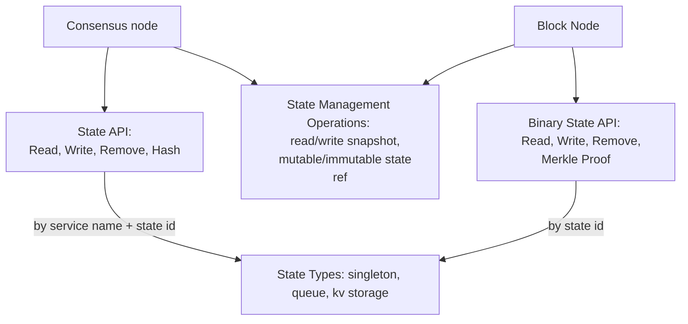
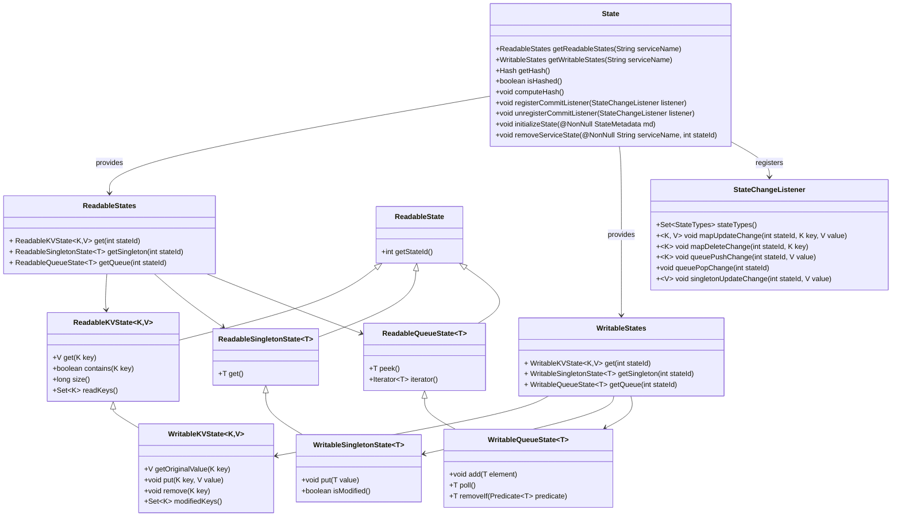
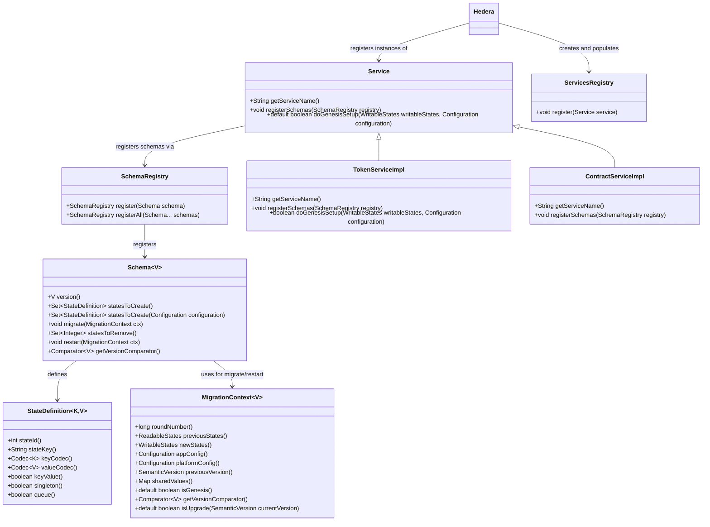
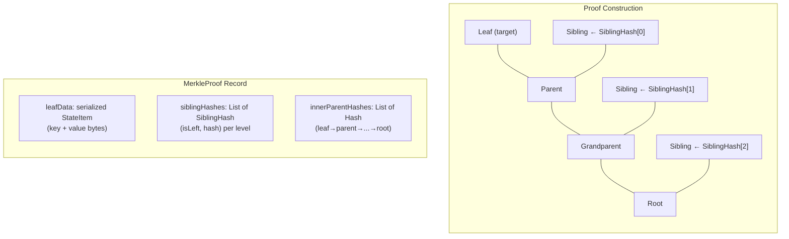
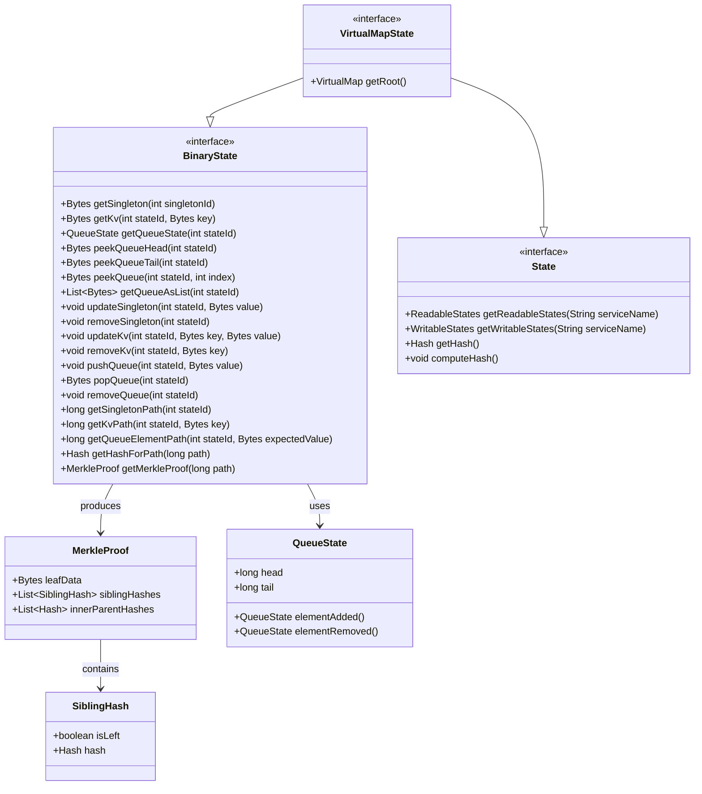

# swirlds-state-api

## Summary

The `swirlds-state-api` module defines the core interfaces and abstractions for state access and management in the application. 
It serves as the API layer for interacting with the state. These interactions include **reading**, **writing**, **removing** elements from the state,
**hashing**, creating **snapshots** and **state proofs**.

At its core, the module provides interfaces for three kinds of state: **singleton**, **queue**, and **key-value** storage. 
These interfaces abstract away storage details, allowing implementations to handle persistence efficiently.

The module offers two different levels of abstraction. The `State` interface operates at the **service level**, focused on convenience for the Consensus Node
application. In contrast, `BinaryState` provides a lower-level abstraction,
enabling work with the **state as a whole** rather than through specific service aspects. It comes in handy for the Block Node application. 

## Key Concepts

This section defines essential terms and concepts used in the `swirlds-state-api` module. 
These concepts form the foundation for understanding how the state is managed, accessed, and manipulated within the application.

### The State
The state represents the totality of all data the application works with. It encompasses all persistent information 
maintained by the system, such as account balances, token relations, or smart contract data in a distributed ledger context. 
The state can be viewed through the "lens" of named services, which group related data logically, or accessed directly 
by state ID in combination with a key object (particularly for key-value states). This dual access model allows for both high-level, 
service-oriented interactions and low-level, granular operations. In the underlying implementation, the state is a Merkle tree, 
enabling efficient verification and hashing. The protobuf definition in `virtual_map_state.proto` outlines how states are serialized.

### Service
A service is a logical grouping of functionality within the application, represented in the state by one or more state 
objects of the supported types (singleton, queue, or key-value). On the application level, a service corresponds to a 
specific part of the system's capabilities, such as account management, token services, or smart contract execution. 
Services are defined via a registry, where each service declares its required states. This abstraction allows the application 
to interact with the state in a modular way, without needing to know the underlying storage details.

### Merkle Proof
A Merkle proof is the cryptographic information required to verify that a specific item belongs to the state or not, without needing the entire state. 
It consists of a path of hashes from the item (leaf node) to the root of the Merkle tree, allowing efficient and secure validation of data inclusion or exclusion. 
In this module, Merkle proofs are particularly useful for state proofs and audits, enabling trustless verification in distributed systems. 
The proof can be generated for individual keys in key-value states or elements in queues, leveraging the Merkle tree structure inherent in the state representation.

### State ID
The state ID is a unique **integer** identifier associated with a particular state (a single object if it's a singleton, or 
multiple objects if it's a queue or key-value storage). It is used to look up and access states. As defined in the protobuf (see `virtual_map_state.proto`), 
state IDs are organized in certain ranges for different state types, ensuring no overlaps and facilitating efficient serialization and deserialization. 
This ID is crucial for bypassing service-level abstractions, allowing direct manipulation or querying of state components 
by their numeric identifier combined with keys or indices.

### Snapshot
A snapshot is a standalone, immutable representation of the state at a specific point in time, stored on disk. It can be 
used to restore the state upon application startup or for recovery purposes. In the context of this module, 
snapshots are created through operations on the `StateLifecycleManager` interface.

### Readable and Writable Interfaces
The module distinguishes between readable (immutable, query-only) and writable (mutable) versions of states 
(e.g., `ReadableKVState` vs. `WritableKVState`). This ensures thread-safety and prevents unintended mutations in consensus-critical paths. 
Also, it allows underlying implementations (such as `VirtualMap`) to optimize memory usage.

### VirtualMap
This is a key data structure (see `swirlds-virtualmap` module) used to store the application data. 
It's a virtualized, disk-backed Merkle tree that allows handling large datasets efficiently without loading everything into memory. 
Even though `VirtualMap` is the main backing data structure for the state, this API module allows using other implementations and doesn't directly depend on it.

### State Registry
A mechanism for registering services and their associated states, mapping service names to state IDs and types. This is essential for service-level access.

### State Hash
The cryptographic hash of the entire state, computed from the Merkle tree root, used for consensus validation and integrity checks.

### State Commit
State commit refers to the process of finalizing and persisting modifications made through writable interfaces 
(such as `WritableKVState`, `WritableQueueState`, and `WritableSingletonState`) to the underlying storage, 
ensuring durability and updating the Merkle tree structure. Writable states buffer changes internally—tracking 
modifications like puts, removes, or adds via dirty-key detection or similar mechanisms—without immediate persistence. 
The commit operation is orchestrated at a higher level by `CommittableWritableStates`, 
which expose a `commit()` method to iterate over contained states, apply pending changes, and flush them to the disk-backed structures 
(e.g., `VirtualMap`). 

## `State` and Related Classes

This section provides a detailed overview of the `State` interface and the related classes and interfaces 
from the `com.swirlds.state.spi` package. These components form the service-level abstraction for state management, 
enabling applications like the Consensus Node to interact with the state conveniently through named services.

The following UML class diagram illustrates the relationships between the `State` interface and key SPI components. 
The `State` acts as a facade, providing access to readable and writable states via service names. 
The SPI interfaces define the behaviors for different state types (KV, queue, singleton), with readable and writable 
variants for immutability and mutation control. The `StateChangeListener` allows monitoring changes to the state.

### Summary of Interfaces and Classes

Below is a summary of the key interfaces and classes, based on their functionality in the module. 
These are derived from the service provider interface (SPI) design, allowing implementations to plug in custom storage 
while adhering to the contracts.

- **State (com.swirlds.state.State)**: The central interface representing the entire application state at the service level. 
It provides methods to access readable and writable states by service name, compute the state hash for verification, 
create copies, and manage lifecycle operations. It is designed for convenience in applications like the Consensus Node, 
where state is mutated during transaction handling and regularly stored to disk as a snapshot. 

- **StateChangeListener (com.swirlds.state.StateChangeListener)**: An interface for listeners that are notified about the accumulated state changes **on the commit.** 
The interface has designated methods for each state type and modification type.

- **ReadableStates / WritableStates (com.swirlds.state.spi)**: These interfaces act as containers for accessing states within a service.
`ReadableStates` provides immutable access to KV, singleton, or queue states via methods like `getKVState(String stateKey)`.
`WritableStates` extends this with mutation capabilities, ensuring changes are tracked for later commitment.

- **ReadableKVState<K, V> / WritableKVState<K, V> (com.swirlds.state.spi)**: Interfaces for key-value storage. The readable 
variant offers query methods like `get(K key)`, `size()`, and `contains(K key)`. It also allows getting a set of keys that were previously read with this instance via `readKeys()`.
`warm(K key)` is an optimization method for cache warm-up, it loads the value of the key into the cache of the underlying storage data structure (e.g., `VirtualMap`). The writable variant adds `put(K key, V value)`, `remove(K key)` methods.

  **Important:** `size()` method is not to be meant to use in production code, as it implies full scan of the underlying VirtualMap.

- **ReadableSingletonState<T> / WritableSingletonState<T> (com.swirlds.state.spi)**: For single-value states. Readable provides `get()` to retrieve the value, while writable adds `put(T value)` for updates.

- **ReadableQueueState<T> / WritableQueueState<T> (com.swirlds.state.spi)**: Interfaces for queue-based states. Readable includes `peek()` and `iterator()`. Writable adds `add(T element)`, `poll()`, and `removeIf(Predicate<E> predicate)` for conditional removals. These support FIFO operations with persistence.

For concrete usage, refer to the implementation module `swirlds-state-impl`.

## State Initialization and Version Migration

This section describes how the state is initialized with services metadata in the `swirlds-state-api` module. 
Initialization involves registering services and their schemas, which define the required states 
(singleton, queue, or key-value) and handle version migrations. The process ensures states are created, migrated, 
or removed as software versions evolve, maintaining compatibility and data integrity. This is orchestrated through 
the `com.swirlds.state.lifecycle` package, with practical application in classes like `Hedera` and 
service implementations in `com.hedera.node.app.service` (e.g., `TokenServiceImpl`, `ContractServiceImpl`).

### Class Diagram

The following UML class diagram illustrates the key relationships in state initialization and migration. 
The `Service` interface is central, registering `Schema` objects via `SchemaRegistry`. 
Each `Schema` defines `StateDefinition` for states and provides migration logic using `MigrationContext`. These classes are parametrized by the version type. 
For Hedera, the version is `SemanticVersion`, but we can't use it directly in the API module, as it would create a dependency on `HAPI` module. 
The `Hedera` class coordinates registration of multiple services.

### Service Registration Flow

The registration process follows these steps:

1. **Application Start**: The `Hedera` class initializes the application.
2. **Create Registry**: Instantiate `ServicesRegistryImpl` to hold services.
3. **Register Services**: Add service implementations (e.g., `ConsensusServiceImpl`, `ContractServiceImpl`) via `registry.register(service)`.
4. **Register Schemas**: For each service, call `registerSchemas(SchemaRegistry registry)` to add version-specific and service-specific schemas.
5. **Define States**: Each `Schema` specifies states using `StateDefinition` factory methods (e.g., `singleton`, `queue`, `keyValue`). `StateDefinition` includes state ID, key codec (for keyValue states only), and value codec.
6. **Handle Migration**: Use `Schema.migrate(MigrationContext ctx)` to transform the data according to the new version definition or init the app context, if necessary.
7. **Handle Restart**: Use `Schema.restart(MigrationContext ctx)` to update the state if necessary or init the app context, if necessary, when the application restarts with the same version.
7. **Genesis Setup**: If at genesis, invoke `doGenesisSetup(WritableStates writableStates, Configuration configuration)` to set defaults to singleton states.
8. **State Ready**: The state is now initialized and ready for use in the app.  

### Version Migration

Version migration is the process of updating the state when the application software version changes, 
ensuring data consistency and compatibility. It is triggered during application startup if the current version differs 
from the previous state version. The `OrderedServiceMigrator` class coordinates this by sequencing migrations based on 
service order (determined by `migrationOrder()` in `Service`, default 0). Lower-order services migrate first, 
allowing dependencies (e.g., entity IDs before tokens).

The migration flow involves:
- **Version Detection**: Compare the previous state version (from loaded state) with the current app version (from configuration).
- **Registry Iteration**: Loop through sorted `ServicesRegistry` registrations.
- **Schema Retrieval**: For each service, use its `MerkleSchemaRegistry` to get schemas for previous and current versions.
- **Context Creation**: Build a `MigrationContextImpl` with round number, previous/new states, configurations, previous version, shared values, and startup networks.
- **State Operations**:
    - Create new states defined in `Schema.statesToCreate(Configuration)`.
    - Migrate data using `migrate(MigrationContext ctx)`, which accesses previous readable states and writes to new writable states.
- **Commit Changes**: After migrations, commit writable states and track changes (e.g., via `MigrationStateChanges` for output).
- **State Metadata Cleanup**: Remove obsolete states defined in `Schema.statesToRemove()`. Note that it **doesn't remove the data** from the state, only the metadata. 
If the data removal is needed, it should be done during the migration.

The `MigrationContext` is key, providing:
- `previousStates()` / `newStates()` for data transfer.
- `appConfig()` / `platformConfig()` for version-specific logic.
- `sharedValues()` as a scratchpad for inter-service communication.
- `isUpgrade(currentVersion)` to detect upgrades.
- `getVersionComparator()` for semantic version ordering.

In service implementations (e.g., `TokenServiceImpl`), schemas define version-specific migrations, such as updating token
structures or initializing defaults. The `Hedera` class initiates this in `doMigrations`, passing the migrator, state, versions, and configs.

## BinaryState

While the `State` interface provides a service-oriented view of the state (accessing data through service names and
typed objects), the `BinaryState` interface (`com.swirlds.state.BinaryState`) offers a lower-level abstraction that
operates directly on numeric state IDs and raw protobuf-encoded `Bytes`. This makes it the primary interface for
consumers that work with the state as a whole rather than through individual services — most notably the **Block Node**
application.

> **Note:** As stated in the source: _"This interface is used in other repositories, such as BlockNode."_
> Changes to `BinaryState` have cross-repository impact and should be treated with care.

### How BinaryState Differs from State

The two interfaces expose the same three state types (singleton, key-value, queue) but through fundamentally
different access patterns.

With `State`, a caller navigates through service names, obtains a typed container, and reads or writes using
domain objects. For example, to read a key-value entry one would call
`getReadableStates("TokenService").getKVState(stateId).get(accountId)`, where `accountId` is a typed key and
the return value is a typed domain object.

With `BinaryState`, the caller skips the service layer entirely. The equivalent operation is
`getKv(stateId, keyBytes)`, where `keyBytes` is raw protobuf-encoded `Bytes` and the return value is also
raw `Bytes`. There is no codec application, no service resolution — just a direct lookup by state ID and binary key.

This design makes `BinaryState` particularly suitable for scenarios where the caller already has protobuf-encoded
data (for instance, when replaying blocks) or needs to work with state generically without importing the full
set of domain codecs.

### Operations Overview

The `BinaryState` interface groups its methods into three categories: **read operations** for retrieving state data,
**write operations** for mutating state, and **Merkle proof operations** for cryptographic verification.
The Merkle proof capability is unique to `BinaryState` — the `State` interface does not provide it.

#### Read Operations

Read operations retrieve data from the state without modifying it. All values are returned as raw
protobuf-encoded `Bytes`, or `null` if the requested entry does not exist.

For **singletons**, `getSingleton(int singletonId)` returns the value for a given singleton state ID.

For **key-value states**, `getKv(int stateId, Bytes key)` returns the value associated with the given key
within the specified map state.

For **queues**, several methods are available. `getQueueState(int stateId)` returns a `QueueState` object
containing the head and tail indices, which describe the queue's bounds. `peekQueueHead(int stateId)` and
`peekQueueTail(int stateId)` return the first and last elements respectively without removing them.
`peekQueue(int stateId, int index)` retrieves an element at a specific index within the queue's
`[head, tail)` range. Finally, `getQueueAsList(int stateId)` returns all elements ordered from head to tail.

> **Warning:** `getQueueAsList` may be expensive for large queues, as it reads every element in sequence.

Although the read methods accept and return raw `Bytes`, callers that have access to a `Codec<V>` for their
domain type can serialize before the call (`codec.toBytes(domainObject)`) and deserialize after
(`codec.parse(resultBytes)`). This keeps `BinaryState` codec-agnostic while still allowing typed usage
when convenient.

#### Write Operations

Write operations mutate the state. Like reads, they operate on raw `Bytes`.

For **singletons**, `updateSingleton(int stateId, Bytes value)` creates or updates the value (null values
are not allowed), while `removeSingleton(int stateId)` deletes it.

For **key-value states**, `updateKv(int stateId, Bytes key, Bytes value)` creates or updates an entry.
If `value` is null, the entry is removed — behaving identically to `removeKv(int stateId, Bytes key)`.

For **queues**, `pushQueue(int stateId, Bytes value)` appends an element to the tail, `popQueue(int stateId)`
removes and returns the head element (or null if empty), and `removeQueue(int stateId)` deletes all elements
and the queue metadata.

> **Warning:** `removeQueue` may be expensive for large queues, as it iterates over every element to remove it.

As with read operations, callers with a `Codec<V>` can serialize domain objects to `Bytes` before passing
them to write methods (e.g., `updateSingleton(stateId, codec.toBytes(myValue))`). The interface itself
remains codec-agnostic, leaving serialization concerns to the caller.

#### Merkle Proof Operations

Merkle proof operations enable cryptographic verification that a specific piece of data belongs to the state.
These are unique to `BinaryState` and form the foundation for state proofs in the Block Node.

The general workflow is a two-step process. First, the caller resolves the **Merkle path** (a `long` value
identifying a node's position in the binary tree) for the target state element. Then, the caller uses that
path to obtain either a hash or a full Merkle proof.

**Path resolution** methods find the Merkle path for each state type:

- `getSingletonPath(int stateId)` — returns the path for a singleton.
- `getKvPath(int stateId, Bytes key)` — returns the path for a key-value entry.
- `getQueueElementPath(int stateId, Bytes expectedValue)` — returns the path for a queue element matching the given value. Internally, this scans from head to tail and compares unwrapped values.

All path resolution methods return `INVALID_PATH` if the state ID is unknown or the element is not found.

**Hash and proof retrieval** methods use the resolved path:

- `getHashForPath(long path)` — returns the hash of the Merkle node at the given path, or null if the path does not exist.
- `getMerkleProof(long path)` — constructs and returns a full `MerkleProof` for the given path.

Consistent with the codec pattern described in the read and write sections, the interface provides
**default convenience methods** for path resolution that accept typed objects along with a `Codec` and
handle serialization internally before delegating to the raw `Bytes` variants:

- `getKvPath(int stateId, V key, Codec<V> keyCodec)`
- `getQueueElementPath(int stateId, V expectedValue, Codec<V> valueCodec)`

### Merkle Proof Construction

A `MerkleProof` provides the cryptographic evidence needed to verify that a specific leaf belongs to the
Merkle tree with a known root hash. The proof is constructed by walking from the target leaf up to the root,
collecting sibling hashes at each level.

The construction process (as implemented in `VirtualMapStateImpl.getMerkleProof`) works as follows:

1. **Precondition check:** The state must already be hashed; otherwise an `IllegalStateException` is thrown.
2. **Leaf lookup:** The leaf record is located by its path. If no leaf exists at the path, `null` is returned.
3. **Tree walk:** Starting from the leaf's path, the algorithm walks upward to the root. At each level it:
  - Computes the **sibling path** (the other child of the same parent).
  - Records the sibling's hash as a `SiblingHash`, noting whether the sibling is a left or right child. If the sibling has no hash (e.g., a sparse region of the tree), `NULL_HASH` is used as a placeholder.
  - Records the **current node's own hash** as an inner parent hash.
  - Moves to the parent path.
4. **Root hash:** The root hash of the VirtualMap is appended as the final inner parent hash.
5. **Leaf data:** The leaf's key and value bytes are serialized into a `StateItem` and included in the proof.

The resulting `MerkleProof` record contains three components:

- **`leafData`** (`Bytes`) — the protobuf-serialized `StateItem` containing the leaf's key and value bytes.
- **`siblingHashes`** (`List<SiblingHash>`) — an ordered list from leaf level to root, where each `SiblingHash` pairs a hash with a boolean indicating whether the sibling is a left child (`isLeft`).
- **`innerParentHashes`** (`List<Hash>`) — the hashes of the nodes along the path from the leaf to the root (inclusive of the root hash itself).

A verifier can use this proof to recompute the root hash independently: starting from the leaf hash, at each level
combine it with the corresponding sibling hash (respecting left/right ordering) to produce the parent hash,
and compare the final result against the known root hash.

### Class Diagram

The following diagram illustrates the `BinaryState` interface, its method groupings, supporting types, and its
relationship to `State` through the `VirtualMapState` unifier.

`VirtualMapState` (in `swirlds-state-impl`) extends both `State` and `BinaryState`, meaning that a single
implementation backed by a `VirtualMap` serves both the service-level codec-based API used by the Consensus Node
execution engine and the binary protobuf API used by the Block Node. This unification ensures that both
abstraction levels always operate on the same underlying Merkle tree.

