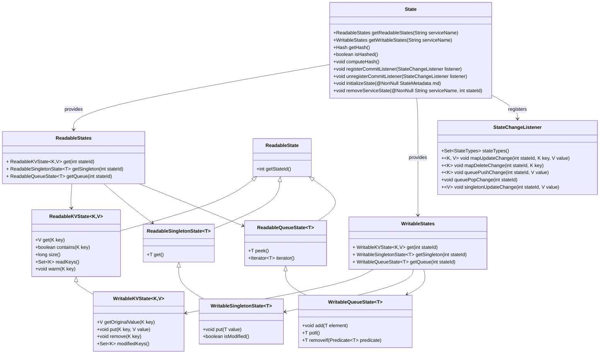
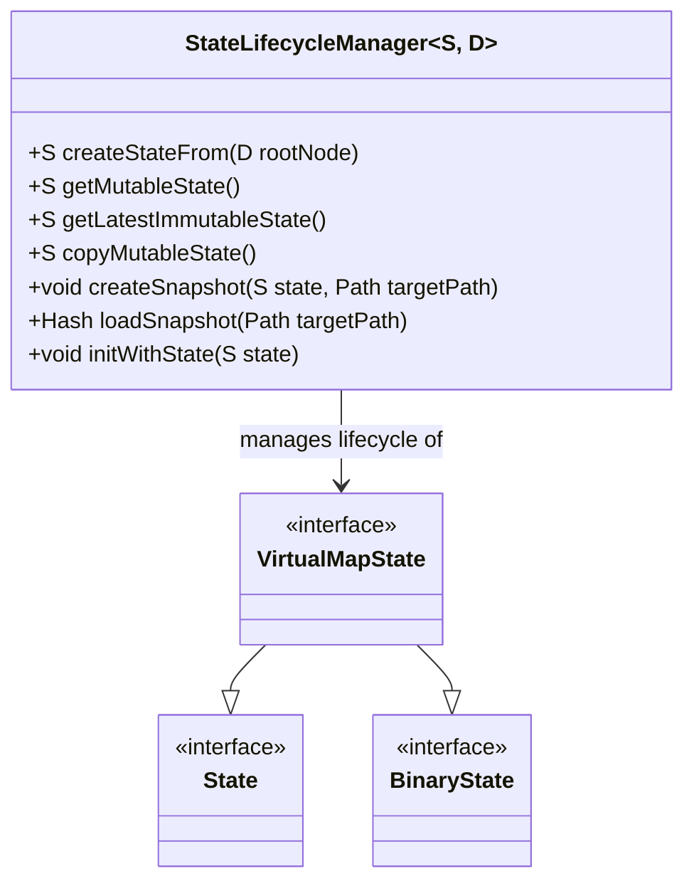
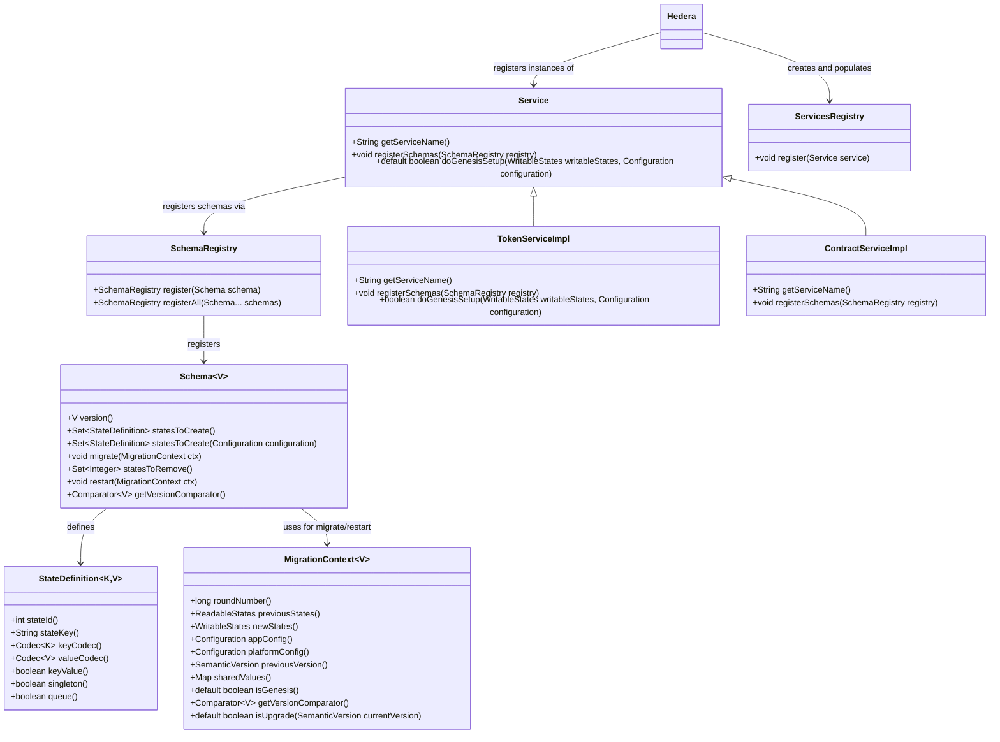
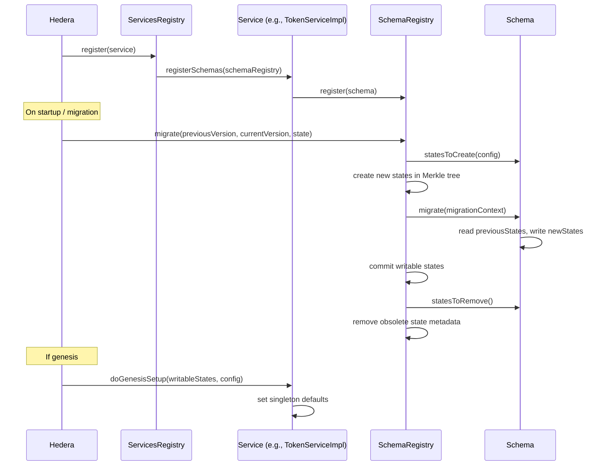
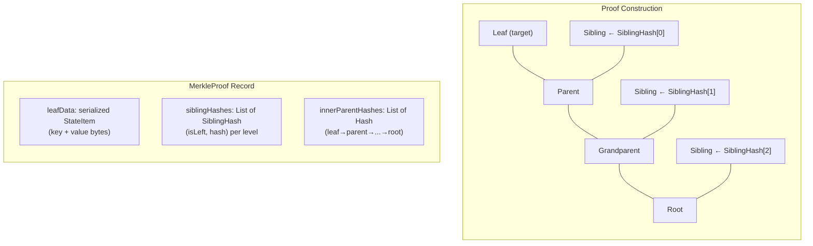
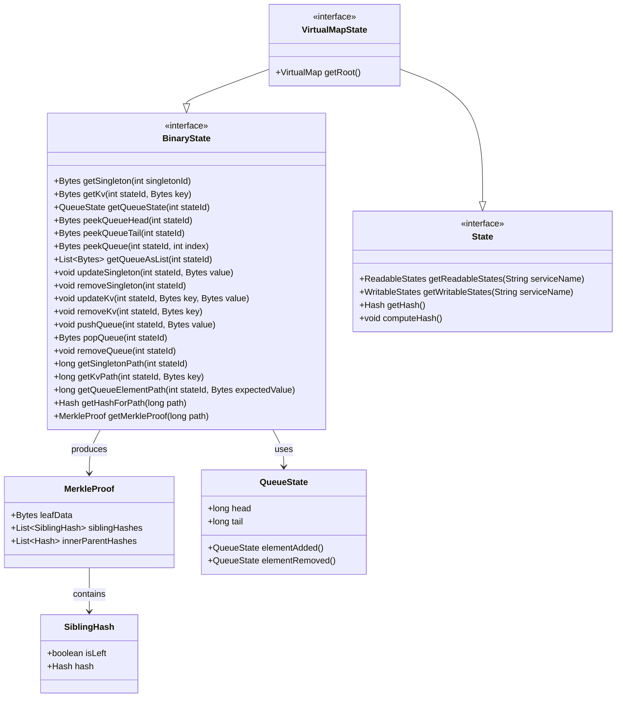

# swirlds-state-api

## Summary

The `swirlds-state-api` module defines the core interfaces and abstractions for state access and management in the application.
It serves as the API layer for interacting with the state. These interactions include **reading**, **writing**, **removing** elements from the state,
**hashing**, creating **snapshots** and **state proofs** and **loading snapshots from disk**.

At its core, the module provides interfaces for three kinds of state: **singleton**, **queue**, and **key-value** storage.
These interfaces abstract away storage details, allowing implementations to handle persistence efficiently.

The module offers two different levels of abstraction for accessing state data. The `State` interface operates at the
**service level**, focused on convenience for the Consensus Node application. In contrast, `BinaryState` provides a
lower-level abstraction, enabling work with the **state as a whole** rather than through specific service aspects.
It comes in handy for the Block Node application. Alternatively, these two layers can be considered as **typed** and **binary**.
Or even **logical** and **physical**. Logical access is to read/write entities from/to the state without knowing how
exactly they are stored. Physical access implies the structure of the storage is very well-defined (virtual merkle tree in Hedera implementation).

Beyond data access, the module defines `StateLifecycleManager` for managing the **state lifecycle** — creating and loading
snapshots, maintaining mutable and immutable state references, and producing copies for concurrent use by hashing and
consensus threads.


```mermaid
graph TD
    A[Consensus Node] --> B[State API:
    Read, Write, Remove, Hash]
    B -->|by service name + state id| F[State Types: singleton, queue, kv storage]
    A --> C[StateLifecycleManager:
    snapshot read/write,
    mutable/immutable state ref,
    fast copy]
    D[Block Node] --> E[Binary State API:
    Read, Write, Remove, Merkle Proof]
    E -->|by state id| F
    D --> C
```

## Key Concepts

This section defines essential terms and concepts used in the `swirlds-state-api` module.
These concepts form the foundation for understanding how the state is managed, accessed, and manipulated within the application.

### The State

The state represents the totality of all data the application works with. It encompasses all persistent information
maintained by the system, such as account balances, token relations, or smart contract data in a distributed ledger context.
The state can be viewed through the "lens" of named services, which group related data logically, or accessed directly
by state ID in combination with a key object (particularly for key-value states). This dual access model allows for both high-level,
service-oriented interactions and low-level, granular operations. In the underlying implementation, the state is a Merkle tree,
enabling efficient verification and hashing. The protobuf definition in `virtual_map_state.proto` outlines how states are serialized.

### State Types

Every piece of data in the state is stored as one of three state types, each suited to a different access pattern:

- **Singleton** — holds a single value per state ID. Suitable for global configuration, counters, or any data where only
  one instance exists (e.g., the next entity ID to assign).
- **Key-value (KV)** — a map from keys to values, both of which are typed. This is the most commonly used state type,
  backing accounts, tokens, NFTs, and other indexed entities.
- **Queue** — an ordered FIFO collection. Elements are appended at the tail and consumed from the head. Used for
  transaction records and other sequentially processed data.

These three types are the fundamental building blocks for both the service-level `State` API and the binary-level
`BinaryState` API. Each state instance is uniquely identified by a **state ID**.

### State ID

The state ID is a unique **integer** identifier associated with a particular state (a single object if it's a singleton, or
multiple objects if it's a queue or key-value storage). It is used to look up and access states. As defined in the protobuf (see `virtual_map_state.proto`),
state IDs are organized in certain ranges for different state types, ensuring no overlaps and facilitating efficient serialization and deserialization.
This ID is crucial for bypassing service-level abstractions, allowing direct manipulation or querying of state components
by their numeric identifier combined with keys or indices.

### Service

A service is a logical grouping of functionality within the application, represented in the state by one or more state
objects of the supported types (singleton, queue, or key-value). On the application level, a service corresponds to a
specific part of the system's capabilities, such as account management, token services, or smart contract execution.
Services are defined via a registry, where each service declares its required states. This abstraction allows the application
to interact with the state in a modular way, without needing to know the underlying storage details.

### Merkle Proof

A Merkle proof is the cryptographic information required to verify that a specific item belongs to the state or not, without needing the entire state.
It consists of a path of hashes from the item (leaf node) to the root of the Merkle tree, allowing efficient and secure validation of data inclusion or exclusion.
In this module, Merkle proofs are particularly useful for state proofs and audits, enabling trustless verification in distributed systems.
The proof can be generated for individual keys in key-value states or elements in queues, leveraging the Merkle tree structure inherent in the state representation.

### Snapshot

A snapshot is a standalone, immutable representation of the state at a specific point in time. Usually, it's stored on disk. It can be
used to restore the state upon application startup or for recovery purposes. In the context of this module,
snapshots are created through operations on the `StateLifecycleManager` interface.

### VirtualMap

This is a key data structure (see `swirlds-virtualmap` module) used to store the application data.
It's a virtualized, disk-backed Merkle tree that allows handling large datasets efficiently without loading everything into memory.

The term "virtualized" refers to the fact that the tree appears as a complete, fully accessible structure to callers,
but internally only a small fraction of its nodes reside in memory at any time — the rest are loaded on demand from
disk. This is conceptually similar to virtual memory, where the operating system presents a contiguous address space
while paging data in and out of physical RAM transparently. This allows the tree to hold billions of entries while
keeping only the actively used subset in memory.

Even though `VirtualMap` is the main backing data structure for the state, this API module allows using other
implementations and doesn't directly depend on it.

## State (Service-Level API)

The `State` interface (`com.swirlds.state.State`) is the primary entry point for the Consensus Node application
to interact with state data. It provides a **service-oriented** access model: the caller specifies a service name
and receives a container of typed state objects — singletons, key-value maps, or queues — scoped to that service.

### Access Pattern

The typical interaction flow has two steps. First, the caller obtains a state container for a specific service.
Then, the caller retrieves individual state objects from that container by state ID and works with typed
domain objects.

For reading, the flow is the following:

```java
final ReadableStates readableStates = state.getReadableStates("TokenService");
final ReadableKVState<AccountId, Token> readableKVState = readableStates.get(stateId);
final Token token = readableKVState.get(accountId);
```

Each call narrows the scope – from the full state, to a service's states,
to a specific key-value pair – and the final return value is a typed domain object (not raw bytes).

For writing, the pattern mirrors reading:

```java
final WritableStates writableStates = state.getWritableStates("TokenService");
final WritableKVState<AccountId, Token> writableKVState = writableStates.get(stateId);
writableKVState.put(accountId, account);
```

The writable variants buffer modifications until `commit()` is called,
at which point changes are flushed to the underlying data source.

This two-level access pattern (service name → state ID) keeps individual services isolated from each other and
allows the framework to control mutation scope and change tracking.

### Readable and Writable Interfaces

The module distinguishes between readable (immutable, query-only) and writable (mutable) versions of every state type.
This separation serves two purposes: it ensures thread-safety by preventing unintended mutations in consensus-critical paths
(e.g., queries always use readable states), and it allows the underlying implementations (such as `VirtualMap`)
to optimize memory usage by tracking exactly which entries have been read or modified.

Each writable interface extends its readable counterpart, so a `WritableKVState<K, V>` is also a `ReadableKVState<K, V>`.
The writable variants buffer all modifications in memory until `commit()` is called, behaving like a changeset or transaction.
This design enables rollback (via `reset()`) and change inspection (via `modifiedKeys()`, `isModified()`).

> **Important:** To be able to read uncommitted changes, the caller must use an instance of the writable state. Readable
> states only reflect the latest committed state.

### State Types in the Service API

**Key-value states** (`ReadableKVState<K, V>` / `WritableKVState<K, V>`) are the most commonly used state type.
The readable variant provides `get(K key)` to look up a value, `contains(K key)` to check existence, and
`readKeys()` to retrieve the set of keys read through this instance (useful for pre-handle validation).
The `warm(K key)` method is an optimization hook that preloads a value into the cache of the underlying
storage without returning it — helpful when a caller knows it will need a value shortly.
The writable variant adds `put(K key, V value)` and `remove(K key)` for mutations, `getOriginalValue(K key)` to
retrieve the value as it was before any modifications in the current changeset, and `modifiedKeys()` to inspect
what has changed.

> **Important:** The `size()` method on `ReadableKVState` is **deprecated** and should not be used in production code.
> It implies a full scan of the underlying VirtualMap. Use `EntityIdService.entityCounts` instead.

**Singleton states** (`ReadableSingletonState<T>` / `WritableSingletonState<T>`) hold a single value per state ID.
The readable variant provides `get()` and the writable variant adds `put(T value)` along with `isModified()`
to check whether the value has been changed in the current changeset.

**Queue states** (`ReadableQueueState<T>` / `WritableQueueState<T>`) support FIFO operations with persistence.
The readable variant provides `peek()` to inspect the head element without removing it, and `iterator()` to
traverse all elements. The writable variant adds `add(T element)` to enqueue at the tail, `poll()` to dequeue from
the head, and `removeIf(Predicate<E> predicate)` for conditional removal of the head element.

### Change Listeners

The `StateChangeListener` interface allows monitoring state mutations. Listeners are registered via
`State.registerCommitListener(listener)` and are notified when writable states are committed. The listener
declares which state types it is interested in (via `stateTypes()`) and receives fine-grained callbacks for
each modification type: `mapUpdateChange` / `mapDeleteChange` for KV states, `queuePushChange` / `queuePopChange`
for queues, and `singletonUpdateChange` for singletons. All callbacks are invoked **on commit**, not when
individual `put` or `remove` calls are made.

### Class Diagram

The following UML class diagram illustrates the relationships between the `State` interface and the SPI components.
`State` acts as a facade, providing access to readable and writable state containers via service names.
The SPI interfaces define behaviors for each state type, with readable and writable variants for immutability
and mutation control.


```mermaid
classDiagram
    class State {
        +ReadableStates getReadableStates(String serviceName)
        +WritableStates getWritableStates(String serviceName)
        +Hash getHash()
        +boolean isHashed()
        +void computeHash()
        +void registerCommitListener(StateChangeListener listener)
        +void unregisterCommitListener(StateChangeListener listener)
        +void initializeState(@NonNull StateMetadata<?, ?> md)
        +void removeServiceState(@NonNull String serviceName, int stateId)
    }

    class ReadableStates {
        +<K,V> ReadableKVState~K,V~ get(int stateId)
        +<T> ReadableSingletonState~T~ getSingleton(int stateId)
        +<T> ReadableQueueState~T~ getQueue(int stateId)
    }

    class WritableStates {
        + WritableKVState~K,V~ get(int stateId)
        + WritableSingletonState~T~ getSingleton(int stateId)
        + WritableQueueState~T~ getQueue(int stateId)
    }

    class ReadableState {
       +int getStateId()
    }

    class ReadableKVState~K,V~ {
        +V get(K key)
        +boolean contains(K key)
        +long size()
        +Set~K~ readKeys()
        +void warm(K key)
    }

    class WritableKVState~K,V~ {
        +V getOriginalValue(K key)
        +void put(K key, V value)
        +void remove(K key)
        +Set~K~ modifiedKeys()
    }

    class ReadableSingletonState~T~ {
        +T get()
    }

    class WritableSingletonState~T~ {
        +void put(T value)
        +boolean isModified()
    }

    class ReadableQueueState~T~ {
        +T peek()
        +Iterator~T~ iterator()
    }

    class WritableQueueState~T~ {
        +void add(T element)
        +T poll()
        +T removeIf(Predicate~T~ predicate)
    }

    class StateChangeListener {
        +Set~StateTypes~ stateTypes()
        +~K, V~ void mapUpdateChange(int stateId, K key, V value)
        +~K~ void mapDeleteChange(int stateId, K key)
        +~K~ void queuePushChange(int stateId, V value)
        +void queuePopChange(int stateId)
        +~V~ void singletonUpdateChange(int stateId, V value)
    }

    State --> ReadableStates : provides
    State --> WritableStates : provides
    ReadableStates --> ReadableKVState
    ReadableStates --> ReadableSingletonState
    ReadableStates --> ReadableQueueState
    WritableStates --> WritableKVState
    WritableStates --> WritableSingletonState
    WritableStates --> WritableQueueState
    State --> StateChangeListener : registers

    ReadableState <|-- ReadableKVState
    ReadableState <|-- ReadableSingletonState
    ReadableState <|-- ReadableQueueState

    ReadableKVState <|-- WritableKVState
    ReadableSingletonState <|-- WritableSingletonState
    ReadableQueueState <|-- WritableQueueState
```

For concrete usage of these interfaces, refer to the implementation module `swirlds-state-impl`.

## State Lifecycle Management

The `StateLifecycleManager<S, D>` interface (`com.swirlds.state.StateLifecycleManager`) is responsible for
managing the full lifecycle of the state object. While `State` and `BinaryState` define *how* to read and
write data, `StateLifecycleManager` defines *when* and *how* the state itself is created, copied, persisted,
and restored.

### Mutable and Immutable State

At any given time, the system maintains two key state references: one **mutable** state and one **latest immutable** state.

The **mutable state** (`getMutableState()`) is the working copy used by the transaction-handling thread.
All modifications during a round are applied to this state. Consecutive calls to `getMutableState()` may
return different instances if `copyMutableState()` has been called on another thread in between — callers
should not cache the reference across round boundaries.

The **latest immutable state** (`getLatestImmutableState()`) is the most recent state that has been frozen
via a copy operation. It is used for answering queries and for pre-handle validation. Like the mutable state,
the reference can change as new copies are produced.

The `copyMutableState()` method performs a **fast copy**: the current mutable state becomes immutable (and
replaces the previous latest immutable state), and a new mutable copy is created for the next round.
This operation is designed to be lightweight — most of the tree is treated as copy-on-write, avoiding
deep copies of the entire state.

### Snapshots

Snapshots provide durable persistence of the state to disk.

`createSnapshot(S state, Path targetPath)` writes a hashed state to the given path. The state must be
hashed before this method is called.

`loadSnapshot(Path targetPath)` reads a previously saved snapshot from disk, initializes the manager with
the loaded state (replacing any previously held state, such as the eagerly-created genesis state), and returns
the hash of the original snapshot as it was on disk. After this call, the loaded state is available as
the mutable state.

### Initialization Scenarios

The `StateLifecycleManager` supports three initialization scenarios:

- **Genesis**: Upon construction, the manager eagerly creates a genesis state. If no snapshot is loaded and
  no reconnect state is provided, this genesis state is used as the initial mutable state.
- **Restart from snapshot**: Calling `loadSnapshot(path)` replaces the genesis state with the state loaded
  from disk.
- **Reconnect**: Reconnecting involves two steps that bridge a gap between the raw Merkle tree received from
  a peer and the fully signed state needed by the platform. When the reconnect synchronization completes, the
  learner has a raw `VirtualMap` but does not yet have a `VirtualMapState` — the
  higher-level wrapper that provides the `State` and `BinaryState` APIs. The method `createStateFrom(D rootNode)`
  bridges this gap: it wraps the received `VirtualMap` into a `VirtualMapState` instance *without* updating the
  manager's mutable or immutable state references. This allows the reconnect code to construct a
  `SignedState` from the received data, attach the signature set received from the teacher, and validate the
  state against the network roster — all before committing it as the active state. Once validation succeeds,
  `initWithState(state)` is called to make the validated state the manager's current state: the provided state
  becomes the latest immutable state and a new mutable copy is created internally.

### Class Diagram


```mermaid
classDiagram
    class StateLifecycleManager~S, D~ {
        +S createStateFrom(D rootNode)
        +S getMutableState()
        +S getLatestImmutableState()
        +S copyMutableState()
        +void createSnapshot(S state, Path targetPath)
        +Hash loadSnapshot(Path targetPath)
        +void initWithState(S state)
    }

    class State {
        <<interface>>
    }

    class BinaryState {
        <<interface>>
    }

    class VirtualMapState {
        <<interface>>
    }

    VirtualMapState --|> State
    VirtualMapState --|> BinaryState
    StateLifecycleManager --> VirtualMapState : manages lifecycle of
```

## State Initialization and Version Migration

This section describes how the state is initialized with services metadata in the `swirlds-state-api` module.
Initialization involves registering services and their schemas, which define the required states
(singleton, queue, or key-value) and handle version migrations. The process ensures states are created, migrated,
or removed as software versions evolve, maintaining compatibility and data integrity. This is orchestrated through
the `com.swirlds.state.lifecycle` package, with practical application in classes like `Hedera` and
service implementations in `com.hedera.node.app.service` (e.g., `TokenServiceImpl`, `ContractServiceImpl`).

### Class Diagram

The following UML class diagram illustrates the key relationships in state initialization and migration.
The `Service` interface is central, registering `Schema` objects via `SchemaRegistry`.
Each `Schema` defines `StateDefinition` for states and provides migration logic using `MigrationContext`. These classes are parametrized by the version type.
For Hedera, the version is `SemanticVersion`, but we can't use it directly in the API module, as it would create a dependency on `HAPI` module.
The `Hedera` class coordinates registration of multiple services.


```mermaid
classDiagram
    class Service {
        +String getServiceName()
        +void registerSchemas(SchemaRegistry registry)
        +default boolean doGenesisSetup(WritableStates writableStates, Configuration configuration)
    }

    class ServicesRegistry {
        +void register(Service service)
    }

    class SchemaRegistry {
        +SchemaRegistry register(Schema schema)
        +SchemaRegistry registerAll(Schema... schemas)
    }

    class Schema~V~ {
        +V version()
        +Set~StateDefinition~ statesToCreate()
        +Set~StateDefinition~ statesToCreate(Configuration configuration)
        +void migrate(MigrationContext ctx)
        +Set~Integer~ statesToRemove()
        +void restart(MigrationContext ctx)
        +Comparator~V~ getVersionComparator()
    }

    class StateDefinition~K,V~ {
        +int stateId()
        +String stateKey()
        +Codec~K~ keyCodec()
        +Codec~V~ valueCodec()
        +boolean keyValue()
        +boolean singleton()
        +boolean queue()
    }

    class MigrationContext~V~ {
        +long roundNumber()
        +ReadableStates previousStates()
        +WritableStates newStates()
        +Configuration appConfig()
        +Configuration platformConfig()
        +SemanticVersion previousVersion()
        +Map sharedValues()
        +default boolean isGenesis()
        +Comparator~V~ getVersionComparator()
        +default boolean isUpgrade(SemanticVersion currentVersion)
    }

    class Hedera {
    }

    class TokenServiceImpl {
        +String getServiceName()
        +void registerSchemas(SchemaRegistry registry)
        +boolean doGenesisSetup(WritableStates writableStates, Configuration configuration)
    }

    class ContractServiceImpl {
        +String getServiceName()
        +void registerSchemas(SchemaRegistry registry)
    }

    Service <|-- TokenServiceImpl
    Service <|-- ContractServiceImpl
    Service --> SchemaRegistry : registers schemas via
    SchemaRegistry --> Schema : registers
    Schema --> StateDefinition : defines
    Schema --> MigrationContext : uses for migrate/restart
    Hedera --> Service : registers instances of
    Hedera --> ServicesRegistry : creates and populates
```

### Service Registration Flow

The registration process follows these steps:

1. **Application Start**: The `Hedera` class initializes the application.
2. **Create Registry**: Instantiate `ServicesRegistryImpl` to hold services.
3. **Register Services**: Add service implementations (e.g., `ConsensusServiceImpl`, `ContractServiceImpl`) via `registry.register(service)`.
4. **Register Schemas**: For each service, call `Service.registerSchemas(SchemaRegistry registry)` to add version-specific and service-specific schemas.
5. **Define States**: Each `Schema` specifies states using `StateDefinition` factory methods (e.g., `singleton`, `queue`, `keyValue`). `StateDefinition` includes state ID, key codec (for keyValue states only), and value codec.
6. **Handle Migration**: Use `Schema.migrate(MigrationContext ctx)` to transform the data according to the new version definition or init the app context, if necessary.
7. **Handle Restart**: Use `Schema.restart(MigrationContext ctx)` to update the state if necessary or init the app context, if necessary, when the application restarts with the same version.
8. **Genesis Setup**: If at genesis, invoke `Service.doGenesisSetup(WritableStates writableStates, Configuration configuration)` to set defaults to singleton states.
9. **State Ready**: The state is now initialized and ready for use in the app.


```mermaid
sequenceDiagram
    participant H as Hedera
    participant SR as ServicesRegistry
    participant Svc as Service (e.g., TokenServiceImpl)
    participant SchR as SchemaRegistry
    participant Sch as Schema

    H->>SR: register(service)
    SR->>Svc: registerSchemas(schemaRegistry)
    Svc->>SchR: register(schema)

    Note over H: On startup / migration
    H->>SchR: migrate(previousVersion, currentVersion, state)
    SchR->>Sch: statesToCreate(config)
    SchR->>SchR: create new states in Merkle tree
    SchR->>Sch: migrate(migrationContext)
    Sch->>Sch: read previousStates, write newStates
    SchR->>SchR: commit writable states
    SchR->>Sch: statesToRemove()
    SchR->>SchR: remove obsolete state metadata

    Note over H: If genesis
    H->>Svc: doGenesisSetup(writableStates, config)
    Svc->>Svc: set singleton defaults
```

### Version Migration

Version migration is the process of updating the state when the application software version changes,
ensuring data consistency and compatibility. It is triggered during application startup if the current version differs
from the previous state version. The `OrderedServiceMigrator` class coordinates this by sequencing migrations based on
service order (determined by `migrationOrder()` in `Service`, default 0). Lower-order services migrate first,
allowing dependencies (e.g., entity IDs before tokens).

The migration flow involves:

- **Version Detection**: Compare the previous state version (from loaded state) with the current app version (from configuration).
- **Registry Iteration**: Loop through sorted `ServicesRegistry` registrations.
- **Schema Retrieval**: For each service, use its `MerkleSchemaRegistry` to get schemas for previous and current versions.
- **Context Creation**: Build a `MigrationContextImpl` with round number, previous/new states, configurations, previous version, shared values, and startup networks.
- **State Operations**:
  - Create new states defined in `Schema.statesToCreate(Configuration)`.
  - Migrate data using `migrate(MigrationContext ctx)`, which accesses previous readable states and writes to new writable states.
- **Commit Changes**: After migrations, commit writable states and track changes (e.g., via `MigrationStateChanges` for output).
- **State Metadata Cleanup**: Remove obsolete states defined in `Schema.statesToRemove()`. Note that it **doesn't remove the data** from the state, only the metadata.
  If the data removal is needed, it should be done during the migration.

The `MigrationContext` is providing:

- `previousStates()` / `newStates()` for data transfer.
- `appConfig()` / `platformConfig()` for version-specific logic.
- `sharedValues()` as a scratchpad for inter-service communication.
- `isUpgrade(currentVersion)` to detect upgrades.
- `getVersionComparator()` for semantic version ordering.

In service implementations (e.g., `TokenServiceImpl`), schemas define version-specific migrations, such as updating token
structures or initializing defaults. The `Hedera` class initiates this in `doMigrations`, passing the migrator, state, versions, and configs.

## BinaryState

While the `State` interface provides a service-oriented view of the state (accessing data through service names and
typed objects), the `BinaryState` interface (`com.swirlds.state.BinaryState`) offers a lower-level abstraction that
operates directly on numeric state IDs and raw protobuf-encoded `Bytes`. This makes it the primary interface for
consumers that work with the state as a whole rather than through individual services — most notably the **Block Node**
application.

> **Note:** Changes to `BinaryState` have cross-repository impact and should be treated with care.

### How BinaryState Differs from State

The two interfaces expose the same three state types (singleton, key-value, queue) but through fundamentally
different access patterns.

With `State`, a caller navigates through service names, obtains a typed container, and reads or writes using
domain objects. For example, to read a key-value entry one would call
`getReadableStates("TokenService").get(stateId).get(accountId)`, where `accountId` is a typed key and
the return value is a typed domain object.

With `BinaryState`, the caller skips the service layer entirely. The equivalent operation is
`getKv(stateId, keyBytes)`, where `keyBytes` is raw protobuf-encoded `Bytes` (the domain key, not the
storage-level `StateKey` envelope) and the return value is also raw domain `Bytes`. There is no codec
application, no service resolution — just a direct lookup by state ID and binary key. The storage-level
wrapping into StateKey / StateValue is handled internally (see Storage Representation below).

This design makes `BinaryState` particularly suitable for scenarios where the caller already has protobuf-encoded
data (for instance, when replaying blocks) or needs to work with state generically without importing the full
set of domain codecs.

### Storage Representation

Although the `BinaryState` API accepts and returns raw domain bytes, the underlying `VirtualMap` does not store
those bytes directly. Each leaf in the `VirtualMap` is a **`StateItem`** — a protobuf message pairing a
**`StateKey`** with a **`StateValue`**. Both `StateKey` and `StateValue` use protobuf `oneof` encoding, where
the **field number encodes the state ID** and the field payload contains the domain-level data.

For **`StateKey`**, the encoding varies by state type:

- **Singletons** use a fixed field number of 1, with the singleton's state ID as a varint payload.
- **Key-value entries** use the KV state ID as the field number, with the domain key bytes as a
  length-delimited payload.
- **Queue elements** use the queue state ID as the field number, with the queue index (a long) as a
  varint payload.

For **`StateValue`**, all state types follow the same pattern: the field number is the state ID and the
payload is the length-delimited domain value bytes.

The `StateItem` itself is simply these two fields together (field 2 = key bytes, field 3 = value bytes),
as defined by the `StateItem` message in `virtual_map_state.proto`.

This wrapping is entirely **transparent to `BinaryState` callers**. When a caller invokes
`getKv(stateId, keyBytes)`, the implementation internally wraps `keyBytes` into a `StateKey` for the
`VirtualMap` lookup, retrieves the `StateValue`, and unwraps it to return only the raw domain value bytes.
Write operations perform the reverse: raw domain bytes are wrapped before being stored. The caller never
needs to construct or parse `StateKey` or `StateValue` envelopes.

> **Implementation note:** The `StateItem`, `StateKeyUtils`, and `StateValue` classes in `swirlds-state-impl`
> are **not** the HAPI-generated classes from `com.hedera.hapi.platform.state`. The `swirlds-state-*` modules
> cannot depend on the HAPI module, so they maintain their own implementations that are **bit-for-bit
> identical** at the wire level. The protobuf schema in `virtual_map_state.proto` is the single source of
> truth for the encoding format, and both sets of classes must produce identical bytes.

This storage model is also visible in the Merkle Proof section below: the `leafData` field of a
`MerkleProof` contains a serialized `StateItem` — that is, the full wrapped `StateKey` + `StateValue`
pair as it exists in the VirtualMap leaf, not the unwrapped domain bytes that the `BinaryState` read
methods return.

### Operations Overview

The `BinaryState` interface groups its methods into three categories: **read operations** for retrieving state data,
**write operations** for mutating state, and **Merkle proof operations** for cryptographic verification.
The Merkle proof capability is unique to `BinaryState` — the `State` interface does not provide it.

#### Read Operations

Read operations retrieve data from the state without modifying it. All values are returned as raw
protobuf-encoded `Bytes`, or `null` if the requested entry does not exist.

For **singletons**, `getSingleton(int singletonId)` returns the value for a given singleton state ID.

For **key-value states**, `getKv(int stateId, Bytes key)` returns the value associated with the given key
within the specified map state.

For **queues**, several methods are available. `getQueueState(int stateId)` returns a `QueueState` object
containing the head and tail indices, which describe the queue's bounds. `peekQueueHead(int stateId)` and
`peekQueueTail(int stateId)` return the first and last elements respectively without removing them.
`peekQueue(int stateId, int index)` retrieves an element at a specific index within the queue's
`[head, tail)` range. Finally, `getQueueAsList(int stateId)` returns all elements ordered from head to tail.

> **Warning:** `getQueueAsList` may be expensive for large queues, as it reads every element in sequence.

Although the read methods accept and return raw `Bytes`, callers that have access to a `Codec<V>` for their
domain type can serialize before the call (`codec.toBytes(domainObject)`) and deserialize after
(`codec.parse(resultBytes)`). This keeps `BinaryState` codec-agnostic while still allowing typed usage
when convenient.

#### Write Operations

Write operations mutate the state. Like reads, they operate on raw `Bytes`.

For **singletons**, `updateSingleton(int stateId, Bytes value)` creates or updates the value (null values
are not allowed), while `removeSingleton(int stateId)` deletes it.

For **key-value states**, `updateKv(int stateId, Bytes key, Bytes value)` creates or updates an entry.
If `value` is null, the entry is removed — behaving identically to `removeKv(int stateId, Bytes key)`.

For **queues**, `pushQueue(int stateId, Bytes value)` appends an element to the tail, `popQueue(int stateId)`
removes and returns the head element (or null if empty), and `removeQueue(int stateId)` deletes all elements
and the queue metadata.

> **Warning:** `removeQueue` may be expensive for large queues, as it iterates over every element to remove it.

As with read operations, callers with a `Codec<V>` can serialize domain objects to `Bytes` before passing
them to write methods (e.g., `updateSingleton(stateId, codec.toBytes(myValue))`). The interface itself
remains codec-agnostic, leaving serialization concerns to the caller.

#### Merkle Proof Operations

Merkle proof operations enable cryptographic verification that a specific piece of data belongs to the state.
These are unique to `BinaryState` and form the foundation for state proofs in the Block Node.

The general workflow is a two-step process. First, the caller resolves the **Merkle path** (a `long` value
identifying a node's position in the binary tree) for the target state element. Then, the caller uses that
path to obtain either a hash or a full Merkle proof.

**Path resolution** methods find the Merkle path for each state type:

- `getSingletonPath(int stateId)` — returns the path for a singleton.
- `getKvPath(int stateId, Bytes key)` — returns the path for a key-value entry.
- `getQueueElementPath(int stateId, Bytes expectedValue)` — returns the path for a queue element matching the given value. Internally, this scans from head to tail and compares unwrapped values.

All path resolution methods return `INVALID_PATH` if the state ID is unknown or the element is not found.

**Hash and proof retrieval** methods use the resolved path:

- `getHashForPath(long path)` — returns the hash of the Merkle node at the given path, or null if the path does not exist.
- `getMerkleProof(long path)` — constructs and returns a full `MerkleProof` for the given path.

Consistent with the codec pattern described in the read and write sections, the interface provides
**default convenience methods** for path resolution that accept typed objects along with a `Codec` and
handle serialization internally before delegating to the raw `Bytes` variants:

- `getKvPath(int stateId, V key, Codec<V> keyCodec)`
- `getQueueElementPath(int stateId, V expectedValue, Codec<V> valueCodec)`

### Merkle Proof Construction

A `MerkleProof` provides the cryptographic evidence needed to verify that a specific leaf belongs to the
Merkle tree with a known root hash. The proof is constructed by walking from the target leaf up to the root,
collecting sibling hashes at each level.

The construction process (as implemented in `VirtualMapStateImpl.getMerkleProof`) works as follows:

1. **Precondition check:** The state must already be hashed; otherwise an `IllegalStateException` is thrown.
2. **Leaf lookup:** The leaf record is located by its path. If no leaf exists at the path, `null` is returned.
3. **Tree walk:** Starting from the leaf's path, the algorithm walks upward to the root. At each level it:

- Computes the **sibling path** (the other child of the same parent).
- Records the sibling's hash as a `SiblingHash`, noting whether the sibling is a left or right child. If the sibling has no hash (e.g., a sparse region of the tree), `NULL_HASH` is used as a placeholder.
- Records the **current node's own hash** as an inner parent hash.
- Moves to the parent path.

4. **Root hash:** The root hash of the VirtualMap is appended as the final inner parent hash.
5. **Leaf data:** The leaf's key and value bytes are serialized into a `StateItem` and included in the proof.

The resulting `MerkleProof` record contains three components:

- **`leafData`** (`Bytes`) — the protobuf-serialized StateItem containing the leaf's wrapped `StateKey` and `StateValue` bytes as they
  exist in the `VirtualMap` (see Storage Representation).
- **`siblingHashes`** (`List<SiblingHash>`) — an ordered list from leaf level to root, where each `SiblingHash` pairs a hash with a boolean indicating whether the sibling is a left child (`isLeft`).
- **`innerParentHashes`** (`List<Hash>`) — the hashes of the nodes along the path from the leaf to the root (inclusive of the root hash itself).

A verifier can use this proof to recompute the root hash independently: starting from the leaf hash, at each level
combine it with the corresponding sibling hash (respecting left/right ordering) to produce the parent hash,
and compare the final result against the known root hash.


```mermaid
graph TD
    subgraph Proof Construction
        direction TB
        L["Leaf (target)"] --- P1["Parent"]
        S1["Sibling ← SiblingHash[0]"] --- P1
        P1 --- P2["Grandparent"]
        S2["Sibling ← SiblingHash[1]"] --- P2
        P2 --- ROOT["Root"]
        S3["Sibling ← SiblingHash[2]"] --- ROOT
    end

    subgraph MerkleProof Record
        direction TB
        LD["leafData: serialized StateItem\n(key + value bytes)"]
        SH["siblingHashes: List of SiblingHash\n(isLeft, hash) per level"]
        IPH["innerParentHashes: List of Hash\n(leaf→parent→...→root)"]
    end
```

### Class Diagram

The following diagram illustrates the `BinaryState` interface, its method groupings, supporting types, and its
relationship to `State` through the `VirtualMapState` unifier.


```mermaid
classDiagram
  class BinaryState {
    <<interface>>
    +Bytes getSingleton(int singletonId)
    +Bytes getKv(int stateId, Bytes key)
    +QueueState getQueueState(int stateId)
    +Bytes peekQueueHead(int stateId)
    +Bytes peekQueueTail(int stateId)
    +Bytes peekQueue(int stateId, int index)
    +List~Bytes~ getQueueAsList(int stateId)
    +void updateSingleton(int stateId, Bytes value)
    +void removeSingleton(int stateId)
    +void updateKv(int stateId, Bytes key, Bytes value)
    +void removeKv(int stateId, Bytes key)
    +void pushQueue(int stateId, Bytes value)
    +Bytes popQueue(int stateId)
    +void removeQueue(int stateId)
    +long getSingletonPath(int stateId)
    +long getKvPath(int stateId, Bytes key)
    +long getQueueElementPath(int stateId, Bytes expectedValue)
    +Hash getHashForPath(long path)
    +MerkleProof getMerkleProof(long path)
  }

  class MerkleProof {
    +Bytes leafData
    +List~SiblingHash~ siblingHashes
    +List~Hash~ innerParentHashes
  }

  class SiblingHash {
    +boolean isLeft
    +Hash hash
  }

  class QueueState {
    +long head
    +long tail
    +QueueState elementAdded()
    +QueueState elementRemoved()
  }

  class State {
    <<interface>>
    +ReadableStates getReadableStates(String serviceName)
    +WritableStates getWritableStates(String serviceName)
    +Hash getHash()
    +void computeHash()
  }

  class VirtualMapState {
    <<interface>>
    +VirtualMap getRoot()
  }

  BinaryState --> MerkleProof : produces
  BinaryState --> QueueState : uses
  MerkleProof --> SiblingHash : contains
  VirtualMapState --|> State
  VirtualMapState --|> BinaryState
```

`VirtualMapState` (in `swirlds-state-impl`) extends both `State` and `BinaryState`, meaning that a single
implementation backed by a `VirtualMap` serves both the service-level codec-based API used by the Consensus Node
execution engine and the binary protobuf API used by the Block Node. This unification ensures that both
abstraction levels always operate on the same underlying Merkle tree.
