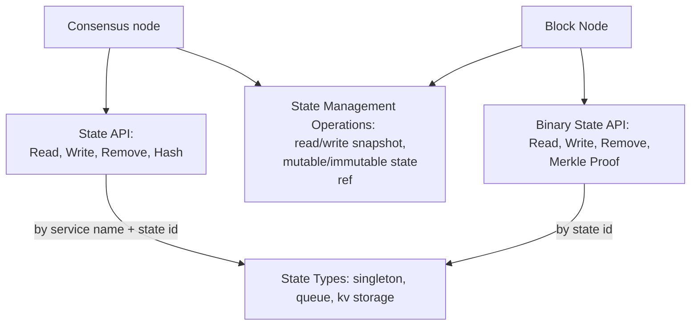
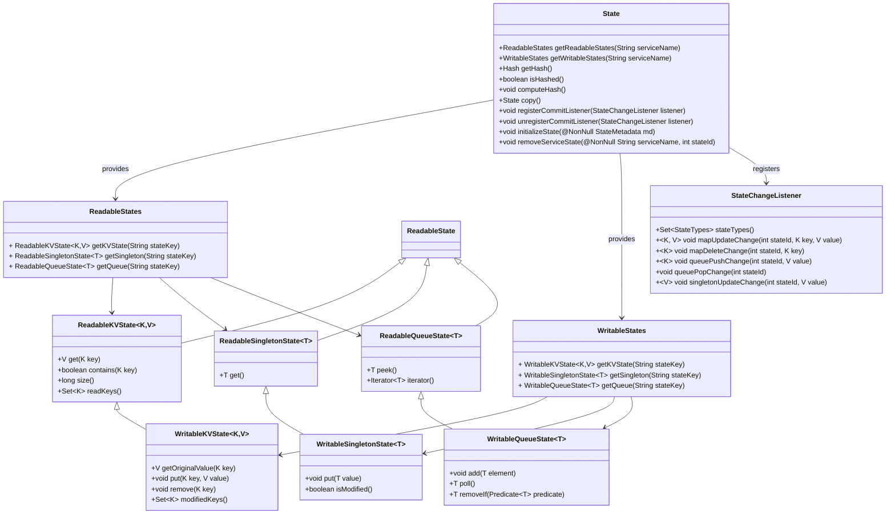

# swirlds-state-api

## Summary

The `swirlds-state-api` module defines the core interfaces and abstractions for state access and management in the application. 
It serves as the API layer for interacting with the state. These interactions include **reading**, **writing**, **removing** elements from the state,
**hashing**, creating **snapshots** and **state proofs**.

At its core, the module provides interfaces for three kinds of state: **singleton**, **queue**, and **key-value** storage. 
These interfaces abstract away storage details, allowing implementations to handle persistence efficiently.

The module offers two different levels of abstraction. The `State` interface operates at the **service level**, focused on convenience for the Consensus Node
application. In contrast, `BinaryState` provides a lower-level abstraction,
enabling work with the **state as a whole** rather than through specific service aspects. It comes in handy for the Block Node application. 

```mermaid
graph TD
    A[Consensus node] --> B[State API: 
    Read, Write, Remove, Hash]
    B -->|by service name + state id| F[State Types: singleton, queue, kv storage]
    A --> C[State Management Operations: 
    read/write snapshot, 
    mutable/immutable state ref]
    D[Block Node] --> E[Binary State API: 
    Read, Write, Remove, Merkle Proof]
    E -->|by state id| F
    D --> C
```

## Key Concepts

This section defines essential terms and concepts used in the `swirlds-state-api` module. 
These concepts form the foundation for understanding how the state is managed, accessed, and manipulated within the application.

### The State
The state represents the totality of all data the application works with. It encompasses all persistent information 
maintained by the system, such as account balances, token relations, or smart contract data in a distributed ledger context. 
The state can be viewed through the "lens" of named services, which group related data logically, or accessed directly 
by state ID in combination with a key object (particularly for key-value states). This dual access model allows for both high-level, 
service-oriented interactions and low-level, granular operations. In the underlying implementation, the state is a Merkle tree, 
enabling efficient verification and hashing. The protobuf definition in `virtual_map_state.proto` outlines how states are serialized.

### Service
A service is a logical grouping of functionality within the application, represented in the state by one or more state 
objects of the supported types (singleton, queue, or key-value). On the application level, a service corresponds to a 
specific part of the system's capabilities, such as account management, token services, or smart contract execution. 
Services are defined via a registry, where each service declares its required states. This abstraction allows the application 
to interact with the state in a modular way, without needing to know the underlying storage details.

### Merkle Proof
A Merkle proof is the cryptographic information required to verify that a specific item belongs to the state or not, without needing the entire state. 
It consists of a path of hashes from the item (leaf node) to the root of the Merkle tree, allowing efficient and secure validation of data inclusion or exclusion. 
In this module, Merkle proofs are particularly useful for state proofs and audits, enabling trustless verification in distributed systems. 
The proof can be generated for individual keys in key-value states or elements in queues, leveraging the Merkle tree structure inherent in the state representation.

### State ID
The state ID is a unique **integer** identifier associated with a particular state (a single object if it's a singleton, or 
multiple objects if it's a queue or key-value storage). It is used to look up and access states. As defined in the protobuf (see `virtual_map_state.proto`), 
state IDs are organized in certain ranges for different state types, ensuring no overlaps and facilitating efficient serialization and deserialization. 
This ID is crucial for bypassing service-level abstractions, allowing direct manipulation or querying of state components 
by their numeric identifier combined with keys or indices.

### Snapshot
A snapshot is a standalone, immutable representation of the state at a specific point in time, stored on disk. It can be 
used to restore the state upon application startup or for recovery purposes. In the context of this module, 
snapshots are created through operations on the `StateLifecycleManager` interface.

### Readable and Writable Interfaces
The module distinguishes between readable (immutable, query-only) and writable (mutable) versions of states 
(e.g., `ReadableKVState` vs. `WritableKVState`). This ensures thread-safety and prevents unintended mutations in consensus-critical paths. 
Also, it allows underlying implementations (such as `VirtualMap`) to optimize memory usage.

### VirtualMap
This is a key data structure (see `swirlds-virtualmap` module) used to store the application data. 
It's a virtualized, disk-backed Merkle tree that allows handling large datasets efficiently without loading everything into memory. 
Even though `VirtualMap` is the main backing data structure for the state, this API module allows using other implementations and doesn't directly depend on it.

### State Registry
A mechanism for registering services and their associated states, mapping service names to state IDs and types. This is essential for service-level access.

### State Hash
The cryptographic hash of the entire state, computed from the Merkle tree root, used for consensus validation and integrity checks.

### State Commit
State commit refers to the process of finalizing and persisting modifications made through writable interfaces 
(such as `WritableKVState`, `WritableQueueState`, and `WritableSingletonState`) to the underlying storage, 
ensuring durability and updating the Merkle tree structure. Writable states buffer changes internally—tracking 
modifications like puts, removes, or adds via dirty-key detection or similar mechanisms—without immediate persistence. 
The commit operation is orchestrated at a higher level by containers like `WritableStates` or `CommittableWritableStates`, 
which expose a `commit()` method to iterate over contained states, apply pending changes, and flush them to the disk-backed structures 
(e.g., `VirtualMap`). 

## `State` and Related Classes

This section provides a detailed overview of the `State` interface and the related classes and interfaces 
from the `com.swirlds.state.spi` package. These components form the service-level abstraction for state management, 
enabling applications like the Consensus Node to interact with the state conveniently through named services.

The following UML class diagram illustrates the relationships between the `State` interface and key SPI components. 
The `State` acts as a facade, providing access to readable and writable states via service names. 
The SPI interfaces define the behaviors for different state types (KV, queue, singleton), with readable and writable 
variants for immutability and mutation control. The `StateChangeListener` allows monitoring changes to the state.

```mermaid
classDiagram
    class State {
        +ReadableStates getReadableStates(String serviceName)
        +WritableStates getWritableStates(String serviceName)
        +Hash getHash()
        +boolean isHashed()
        +void computeHash()
        +State copy()
        +void registerCommitListener(StateChangeListener listener)
        +void unregisterCommitListener(StateChangeListener listener)
        +void initializeState(@NonNull StateMetadata<?, ?> md)
        +void removeServiceState(@NonNull String serviceName, int stateId)
    }

    class ReadableStates {
        +<K,V> ReadableKVState~K,V~ getKVState(String stateKey)
        +<T> ReadableSingletonState~T~ getSingleton(String stateKey)
        +<T> ReadableQueueState~T~ getQueue(String stateKey)
    }

    class WritableStates {
        + WritableKVState~K,V~ getKVState(String stateKey)
        + WritableSingletonState~T~ getSingleton(String stateKey)
        + WritableQueueState~T~ getQueue(String stateKey)
    }

    class ReadableState {
    }

    class ReadableKVState~K,V~ {
        +V get(K key)
        +boolean contains(K key)
        +long size()
        +Set~K~ readKeys()
    }

    class WritableKVState~K,V~ {
        +V getOriginalValue(K key)
        +void put(K key, V value)
        +void remove(K key)
        +Set~K~ modifiedKeys()
    }

    class ReadableSingletonState~T~ {
        +T get()
    }

    class WritableSingletonState~T~ {
        +void put(T value)
        +boolean isModified()
    }

    class ReadableQueueState~T~ {
        +T peek()
        +Iterator~T~ iterator()
    }

    class WritableQueueState~T~ {
        +void add(T element)
        +T poll()
        +T removeIf(Predicate~T~ predicate)
    }

    class StateChangeListener {
        +Set~StateTypes~ stateTypes()
        +~K, V~ void mapUpdateChange(int stateId, K key, V value)
        +~K~ void mapDeleteChange(int stateId, K key)
        +~K~ void queuePushChange(int stateId, V value)
        +void queuePopChange(int stateId)
        +~V~ void singletonUpdateChange(int stateId, V value)        
    }

State --> ReadableStates : provides
State --> WritableStates : provides
ReadableStates --> ReadableKVState
ReadableStates --> ReadableSingletonState
ReadableStates --> ReadableQueueState
WritableStates --> WritableKVState
WritableStates --> WritableSingletonState
WritableStates --> WritableQueueState
State --> StateChangeListener : registers

ReadableState <|-- ReadableKVState
ReadableState <|-- ReadableSingletonState
ReadableState <|-- ReadableQueueState

ReadableKVState <|-- WritableKVState
ReadableSingletonState <|-- WritableSingletonState
ReadableQueueState <|-- WritableQueueState
```

### Summary of Interfaces and Classes

Below is a summary of the key interfaces and classes, based on their functionality in the module. 
These are derived from the service provider interface (SPI) design, allowing implementations to plug in custom storage 
while adhering to the contracts.

- **State (com.swirlds.state.State)**: The central interface representing the entire application state at the service level. 
It provides methods to access readable and writable states by service name, compute the state hash for verification, 
create copies, and manage lifecycle operations. It is designed for convenience in applications like the Consensus Node, 
where state is mutated during transaction handling and regularly stored to disk as a snapshot. 

- **StateChangeListener (com.swirlds.state.StateChangeListener)**: An interface for listeners that are notified about the accumulated state changes **on the commit.** 
The interface has designated methods for each state type and modification type.

- **ReadableStates / WritableStates (com.swirlds.state.spi)**: These interfaces act as containers for accessing states within a service.
`ReadableStates` provides immutable access to KV, singleton, or queue states via methods like `getKVState(String stateKey)`.
`WritableStates` extends this with mutation capabilities, ensuring changes are tracked for later commitment.

- **ReadableKVState<K, V> / WritableKVState<K, V> (com.swirlds.state.spi)**: Interfaces for key-value storage. The readable 
variant offers query methods like `get(K key)`, `size()`, and `contains(K key)`. It also allows getting a set of keys that were previously read with this instance via `readKeys()`.
`warm(K key)` is an optimization method for cache warm-up, it loads the value of the key into the cache of the underlying storage data structure (e.g., `VirtualMap`). The writable variant adds `put(K key, V value)`, `remove(K key)` methods. 

- **ReadableSingletonState<T> / WritableSingletonState<T> (com.swirlds.state.spi)**: For single-value states. Readable provides `get()` to retrieve the value, while writable adds `put(T value)` for updates.

- **ReadableQueueState<T> / WritableQueueState<T> (com.swirlds.state.spi)**: Interfaces for queue-based states. Readable includes `peek()` and `iterator()`. Writable adds `add(T element)`, `poll()`, and `removeIf(Predicate<E> predicate)` for conditional removals. These support FIFO operations with persistence.

For concrete usage, refer to the implementation module `swirlds-state-impl`.