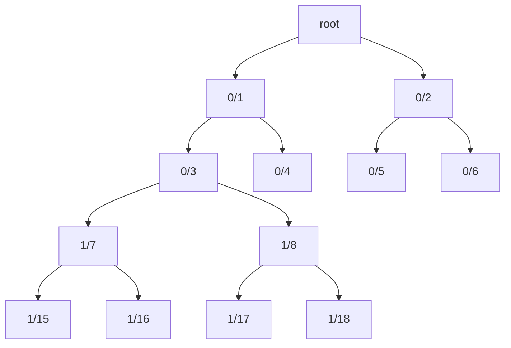
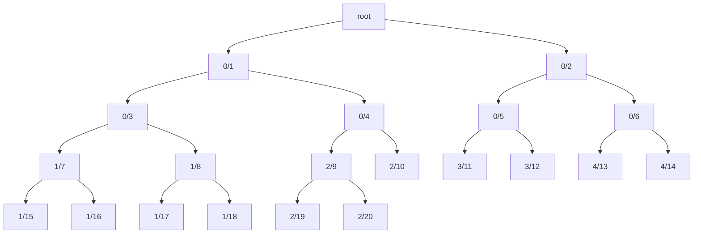

# Virtual Hash Chunks

## Virtual Map recap

Virtual maps are balanced binary trees, where all data is stored in leaves. Every node has two
child nodes, except a tree that stores only one element - in this case the tree contains a
root node with a single leaf, left child node. Every node in a virtual map can be uniquely
identified using a path (long). The root node has path 0. For every node at path `N`, its left
child path is `2N+1`, and the right child path is `2N+2`.

## Virtual hashes

All virtual map data is stored in leaves. Besides leaf data, the map stores hashes for all
nodes, both leaves and internal. For leaves, leaf data is serialized to protobuf and then
hashed as a byte array. For internal nodes, hashes are produced from their left and right
child node hashes.

Historically, hashes are stored on disk by path. MerkleDb has a data collection for hashes,
its index is mapping paths to hash record locations on disk (file + offset). Hash records
contain a path and a hash. This approach has pros

* Individual hash lookups are fast. Disk location lookup in index, plus one disk read
* Memory utilization is great. During hashing, only dirty hashes are stored in the node
  cache and eventually flushed to disk

and cons:

* Multiple disk reads for every dirty leaf during hashing. For example, if a dirty leaf is
  at rank 20, to calculate a root hash needs 20 sibling hash lookups on the path to the root
* Since hashes are stored on disk individually, hash index size is equal to virtual map size,
  which may be large

## Hash chunks

A different approach is to store hashes in chunks. A hash chunk (or just chunk) is a sub-tree
of height N, minus its root. For example, the top-most chunk of height 2 contains hashes for
the following paths: 1, 2, 3, 4, 5, and 6. A chunk of height 2 at path 3 contains hashes for
paths 7, 8, 15, 16, 17, and 18.

Every chunk is identified by a path. The root chunk has path 0. Note that the hash for this
path doesn't belong to the chunk, it's stored in the parent chunk instead. Root chunks
(chunks at path 0) don't have parent chunks, so hashes for path 0 aren't stored anywhere.
These root hashes are calculated for every round, included into block streams, communicated
to other app nodes, but not stored.

All chunks are of the same height. When a virtual map is first created, hash chunk height is
read from config. After that, the height may not be changed, since it would result in rehashing
the whole virtual tree.

Chunks may also be identified by IDs. The root chunk at path 0 has ID 0. Chunk with ID 1 may be
located at path 1 (chunk height 1), or path 3 (chunk height 2), or path 7 (chunk height 3), and
so on. Chunk with ID 2 is a sibling of chunk with ID 1. If chunk height is 1, chunk with ID 3
is at path 3. If chunk height is 2, chunk with ID 2 is at path 4. When chunk height is fixed,
there is 1-1 mapping between chunk IDs and chunk paths.

Chunk paths are handy during hashing. Chunk IDs are used in the node cache and in the data
source.

Here is a diagram for chunk height 2. Node names are `C/P`, where `C` is a chunk ID, and `P` is
a node path.

Hash chunk pros:

* Lower number of disk reads during hashing. For example, a dirty leaf at rank 20 will result
  in only 4 disk reads, when chunk height is 5
* Lower number of disk writes during flushes, since the number of chunks is lower than the
  number of hashes
* Hash index size is times smaller than the number of paths in the virtual map

and cons:

* Despite the number of disk reads during hashing is low, the total number of bytes to read
  is greater than when individual hashes are stored, since some clean (unchanged) hashes are
  read, too. Total number of bytes written during flushes is also greater
* Greater memory consumption in the virtual node cache. Even if a hash isn't changed in some
  round, but some other hash in the same chunk is updated, the whole chunk is stored in the cache

### Chunk math

A few math facts related to chunks:

* Chunks of height `N` cover `2^(N+1)-2` nodes
* Chunks of height `N` have `2^N` child chunks, this is equal to the number of nodes at the lowest
  chunk rank
* A path `P` is a root of a chunk of height `N`, iff `rank(P)%N == 0`

## Partial and complete chunks

Virtual trees are finite, every tree has a leaf path range `[first leaf path, last leaf path]`,
both paths included. Some hash chunks may be completely within `[0, last leaf path]` range, some
may be partially outside the range.

For example, assume chunk height is `2` and leaf path range is `[10, 20]`:

This tree contains 11 leaves (paths `10` to `20`, inclusive). Chunk 0 at path 0 is complete, all its
4 nodes are in the tree. Chunk 1 is at path 3, its nodes 7, 8, 15, 16, 17, and 18, are also in the
tree, so this chunk is complete. Chunk 2 is at path 4. Some its paths, 21 and 22, are not in the tree,
so chunk 2 is partial. Chunks 3 (at path 5) and 4 (at path 6) are partial, too, they contain two hashes
each.

## Chunk storage on disk

There are two ways to identify a chunk: by path and by ID. Chunk path is the parent of the first
two hashes in a chunk, but chunk IDs depend on chunk height. For example, chunk 1 of height 3 is
located at path 7, but chunk 1 of height 4 is at path 15. Chunk height is fixed, when a virtual map
is created, and may not be changed in the future, to make sure chunk path to chunk ID mapping is
never changed.

Chunks are stored on disk in MerkleDb as any other entities like leaf records. There is a hash chunk
index to lookup chunk location on disk (file + offset), and a file collection with chunks as data
items. Index is based on chunk IDs. If it was based on chunk paths, index size would be comparable
to virtual map size. Using IDs reduces index size in hash chunk size times.

### How hashes are stored in chunks

A naive approach is to store all `2^(N+1)-2` hashes in every chunk, one hash for every path
in a chunk (keeping in mind the hash at the chunk path is stored in the parent chunk). Unfortunately,
this appeared to be costly. First, every dirty chunk in the node cache requires `48*2^(N+1)-2`
bytes to store all its hash data. Second, whenever a chunk is read from disk or written to disk,
all hashes need to be read/written, even if some or most of them are dirty.

This is why a different schema is used. **Only hashes at the lowest chunk rank are stored**. For
chunks of height 4 it means only 16 hashes at chunk rank 4 are stored, while the top 14 hashes at
ranks 1, 2, and 3 are not stored. If hashes at these internal ranks are needed, they are calculated
from their grand child nodes at the lowest rank.

### Hashes in partial chunks

Partial chunks are chunks with some paths outside the current leaf range. However, these chunks
still store all `2^N` hashes, this is the number of paths at their lowest, `Nth`, rank. Check the
example above with current leaf range `[10, 20]` and chunk height 2:

* For chunk 2 (at path 4), hash 19 is stored at path 19, hash 20 is stored at path 20, but hash 10
  is stored at path 21, which is the left child path for 10. This happens because paths 21 and 22
  are outside the leaf range
* For chunk 3 (at path 5), only two hashes are stored: hash 11 at path 23 and hash 12 at path 25
* Chunk 4 (at path 6) is similar to chunk 3, its two hashes are stored at paths 27 and 29

There is something to be very careful about here. Given a chunk, there is no way to understand if
a hash at a path is for that very path, or for some of its parents. This really depends on the
current leaf range. If a hash was set for path `P`, which is not at the lowest chunk rank, it must
never be queried for path `P*2+1`, which is a left child of `P`. The hash will be the same, but
the end result will be wrong, since this is not the hash for `P*2+1`.

What if a partial chunk was stored for one leaf range, and later the range increased, so the
chunk now contains more hashes in the range? It may even become a complete chunk. In the example
above, if the current range is changed to `[11, 22]`, hashes 21 and 22 will now be in chunk 2. How
to handle that?

The answer is hashing. If the range is changed from `[10, 20]` to `[11, 22]`, two leaves at paths
21 and 22 must be dirty. Hashes 21 and 22 must not be read from any chunk, they must be recalculated
from leaf data, and then stored in the right chunk at paths 21 and 22.

## Related components

Switching from individual hashes to hash chunks affects many parts of the system. This section
describes changes in a few of them.

### Virtual node cache

Node cache stores leaf, leaf key, and hash mutations for every virtual map copy (version), till
the copy is flushed to disk. A map of hash mutations must be changed from `path to hash` to
`chunk ID to hash chunk`.

During hashing, some hashes in a chunk may be dirty and recalculated, but other hashes in the
same chunk may be clean. This means, every chunk with at least one dirty hash must be loaded
first, then hashes may be updated in it. Loading may happen from the cache, if there is a recent
map copy, where the requested chunk has been updated, or from disk.

### Virtual hasher

### MerkleDb

MerkleDb previously stored individually hashes by paths. Hash index had size equal to full data
source size. Hash file collection contained hash records. With hash chunks, the index becomes
much smaller, since it maps chunk IDs, not paths. The file collection is changed to store chunks
rather than records. Data migration at MerkleDb startup is implemented.

Another change is the root hash. Previously, the root hash was stored as any other hash, at
path 0. Now root hashes aren't stored in MerkleDb. To get a root hash, chunk 0 must be loaded,
and its chunk hash must be calculated.
