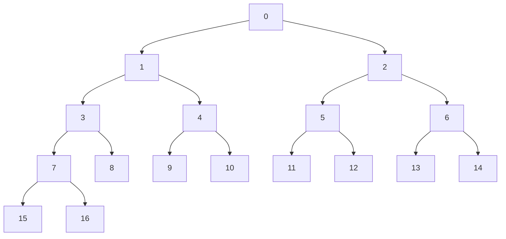

# Virtual Map Hashing

## Background

Every virtual map copy should be hashed. Currently, a new copy is created every round, but
it may change in the future. Virtual maps may be huge. Hashing all map elements may be
prohibitively expensive. Fortunately, the number of changes, or dirty leaves, in every
copy is relatively small. Only this small subset of virtual map data is hashed and then
combined with unchanged hashes from previous rounds to produce a new root hash.

Another use case for hashing is reconnects. On the reconnect learner side, when a state
is received from the teacher, it needs to be rehashed to verify that the state was
synchronized properly. During reconnects, the number of dirty nodes received from the
teacher may be comparable to virtual map size.

### Sample tree

The following virtual tree will be used in this document:

When the chunk height is 2, the tree above has the following chunks:

* chunk at path 0, ID == 0, covers paths 1, 2, 3, 4, 5, and 6
* chunk at path 3, ID == 1, covers paths 7, 8, 15, 16, 17, and 18
* chunk at path 4, ID == 2, covers paths 9, 10, 19, 20, 21, and 22
* chunk at path 5, ID == 3, covers paths 11, 12, 23, 24, 25, and 26
* chunk at path 6, ID == 4, covers paths 13, 14, 27, 28, 29, and 30

Note that some chunks cover paths beyond the current leaf range, [8, 16].

### Node hashes

The result of the virtual map hashing process is a single hash for its root node. For every
internal node, including the root node, a hash is computed from its two child nodes. For
leaf nodes, hashes are just leaf data hashes.

### Hashing algorithm in a nutshell

For every dirty leaf, the leaf data is hashed first to produce the leaf hash. Then a hash of
the leaf sibling node is looked up. If the sibling node is also dirty, its hash is computed
from sibling leaf data. If the sibling node is not changed in this round, its hash is loaded
from the previous round, either from the virtual node cache or from the virtual data source.

The next step is to combine these two hashes into a parent node hash. See VirtualHasher#hashInternal
for details. Then the parent's sibling hash is either computed or loaded from the previous
round, and the process repeats until the root node is reached.

For example, if leaves 9, 13, and 17 are dirty in the sample tree above, the following hashes
are computed:

* Path 9: dirty leaf 9 hash
* Path 13: dirty leaf 13 hash
* Path 17: dirty leaf 17 hash
* Path 8: hash at path 17 combined with clean hash at path 18
* Path 3: hash at path 8 combined with clean hash at path 7
* Path 4: hash at path 9 combined with clean hash at path 10
* Path 6: hash at path 13 combined with clean hash at path 14
* Path 1: hash at path 3 cobined with hash at path 4
* Path 2: hash at path 6 combined with clean hash at path 5
* Path 0 (root hash): hash at path 1 combined with hash at path 2

## Current implementation

Virtual hasher uses a task-based approach to virtual maps. There are two types of tasks:

* Leaf tasks: hash dirty leaves
* Hash chunk tasks: hash chunks (or in rare cases, sub-chunks)

For every dirty leaf, a leaf task is created. Then a hash chunk containing the leaf is found,
and a hash chunk task is created for it. The leaf task is wired to the hash chunk task so that
the leaf hash is sent as an input to the hash chunk task. Then hash chunk task's parent chunk
is found, and a hash chunk task is created for it. The hash from the first hash chunk task is
used as an input to the second hash chunk task. This process continues until the root node is
reached.

For example, for dirty leaf 9 in the sample tree above, the following tasks are created:

* Leaf task at path 9 to hash leaf 9
* Hash chunk task at path 4 to combine hashes 9 and 10
* Hash chunk task at path 0 to combine hashes 3, 4, 5, and 6

When the next dirty leaf is processed, another list of tasks from the leaf to the root node is
created. Since dirty leaves are sorted, all hashes between the two lists of tasks are clean,
they should not be recalculated but can be loaded from disk. In code, virtual hasher stores the
last processed list of tasks in a structure called "stack". The stack is a list of paths at
every chunk rank.

The next dirty hash in the sample tree above is 13:

* Leaf task at path 13 is created to hash leaf 13
* At this point, the stack at rank 3 contains path 9. This is the last processed path at the
  rank. Hashes 10, 11, and 12 are clean
* Hash chunk task at path 6 is created to combine hashes 13 and 14
* Stack at rank 2 is path 4. Therefore, path 5 is clean, its hash is not computed but loaded
  from disk
* Hash chunk at path 0 was created at the previous step, when dirty leaf 9 was processed.
  Processing dirty leaf 13 stops at this point
* The stack is updated: rank 3 value is set to 13, rank 2 value is set to 6, rank 0 value is
  not changed, it's still 0

### Hashing tasks

**Leaf tasks** For every dirty leaf, a leaf hashing task is created. The task needs leaf data,
which is passed in the constructor, and an output hash chunk task. Once an output task is
provided, the leaf task is ready to be executed.

**Chunk tasks** Chunk tasks are used to hash portions of the virtual tree. In most cases,
chunk tasks correspond to virtual hash chunks, but in some cases they may be smaller. One
such case is when a chunk spans beyond the last leaf path. In this case, the corresponding
task will have a smaller height than the default chunk height. Another case is a chunk
that covers the first and the last leaves, when the first and the last leaf ranks are
different. Such task doesn't have a single rank where all input hashes are to be provided.
Some input hashes are at the first leaf rank, some are at the last leaf rank. To hash this
chunk, multiple tasks are created: a number of chunk tasks of height 1 at the last leaf
rank, and one chunk task with the same path as the chunk and height to cover nodes down to
the first leaf rank.

Some hash chunk tasks the sample tree above:

* Hash chunk at path 4. Despite the default chunk height is 2, this task has height 1, because
  all its hashes at rank 2 (which is rank 4 in the whole tree) are outside the leaf range. The
  number of dependencies for this task is 3: 2 input hashes for paths 9 and 10 and an output
  task at path 0
* Hash chunk at path 3. This task also has height 1, since some paths in the corresponding
  chunk are outside the leaf range: paths 17 and 18. This task has two input hashes for paths
  7 and 8. The output task is at path 0
* There is also a chunk task at path 7 to combine leaf hashes 15 and 16 and report the resulting
  hash to task at path 3

All chunk tasks have 2^N + 1 dependencies, where N is the height of the task. 2^N are input
hashes provided either by leaf tasks or by other chunk tasks. One more dependency is the
output task.

**Root task** The root task is a chunk task with no output. The root task is executed, once
all its input hashes are provided. The output hash is reported as the final virtual tree
hash.

### Chunk preloading

When a leaf is clean, i.e. not in the list of dirty leaves, its hash is not calculated. The
corresponding input hash of the parent chunk task is therefore set to null. Chunk tasks at
other ranks may also have null input hashes because of the algorithm: all nodes in between
two consecutive stacks are considered clean, and their hashes are not calculated.

However, to calculate a hash of any chunk, all input hashes are needed. If an input hash is
not provided by another task, it has to be loaded from disk. Therefore every hash chunk
task has a reference to a hash chunk. If at least one of task's input hashes is null, the
task loads its hash chunk from disk using the chunk preloader. If all inputs are available,
there is no need to load anything from disk. The task just creates a new hash chunk.

Regardless of whether the hash chunk is created from scratch or loaded from disk, the task
updates all its input hashes in the chunk and notifies the hashing listener about it using
VirtualHashListener#onHashChunkUpdated method. Since chunks store hashes only at their last
rank, only hashes at this rank are set in the chunk, and hashes at all internal chunk ranks
are not reported anywhere, they are only used to produce the chunk's root hash.

In the sample above, the root chunk task has the following input dependencies:

* Hash at path 3: provided by hash chunk task at path 3
* Hash at path 4: provided by hash chunk task at path 4
* Hash at path 4: set to null, since there is no task at path 5. This indicates the whole
  sub-tree under path 5 is clean
* Hash at path 6: provided by hash chunk task at path 6

The following hash chunks are preloaded in the sample above, when dirty leaves are 9, 13, and 17:

* Hash chunk at path 4
* Hash chunk at path 6
* Hash chunk at path 3. This chunk is loaded twice, by chunk task at path 7 and once more by
  hash chunk task at path 3
* Hash chunk at path 0

If leaf 10 was dirty, too, hash chunk at path 4 would not be loaded, it would be created from
scratch, since all its inputs, paths 9 and 10, are dirty and need to be recalculated. If paths 11
or 12 were dirty, hash chunk at path 0 would not be loaded from disk, since all its inputs, paths
3, 4, 5, and 6, would be calculated.
