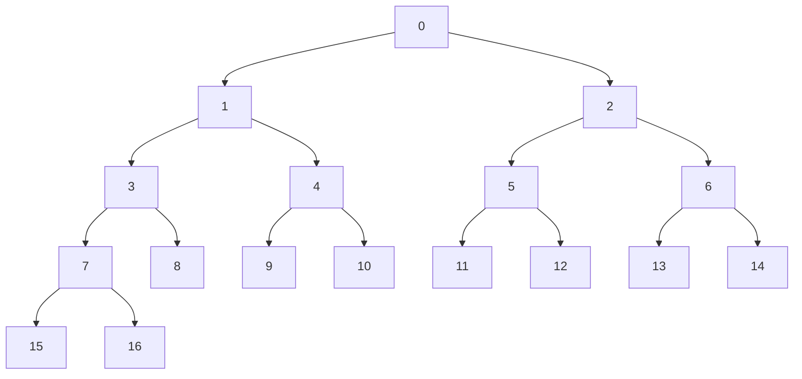

# Virtual Map Hashing

## Overview

Every virtual map copy must be hashed to produce a single root hash. Virtual maps may be huge,
but only a small subset changes each round. `VirtualHasher`
computes the root hash incrementally: it rehashes only the **dirty leaves** and the minimal set
of internal nodes on the path from those leaves to the root. Clean (unchanged) hashes are loaded
from the previous round.

There are two use cases for hashing:

* **Normal rounds:** A new map copy is created periodically. The number of dirty leaves is
  typically small relative to total map size.
* **Reconnects:** On the learner side, after receiving state from a teacher, the entire state
  is rehashed for verification. The number of dirty nodes may be comparable to the full map size.

Hashes are stored in **chunks** rather than individually. See [hash-chunks.md](hash-chunks.md)
for details on hash chunk storage, partial chunks, and the packed disk format.

There should be one `VirtualHasher` instance shared across all copies of a `VirtualMap` "family".

## Concepts

### Tree paths and ranks

Every node in a virtual map is identified by a **path** (a `long`). The root node has path 0.
For a node at path `N`, its left child is at `2N + 1` and its right child is at `2N + 2`.

The **rank** of a path is its depth in the tree. Rank 0 is the root, rank 1 contains paths 1
and 2, rank 2 contains paths 3 through 6, and so on. See `Path.getRank()`.

### Leaf vs internal hash computation

**Leaf hashes** are computed by serializing leaf data and hashing the bytes with SHA-384.

**Internal node hashes** are computed by combining two child hashes using a domain-separated
digest. The method `VirtualHasher.hashInternal()` works as follows:

1. Write a single byte prefix: `0x02` for normal internal nodes (two children), or `0x01`
   for a root node with only one child (single-leaf tree).
2. Write the left child hash bytes.
3. Write the right child hash bytes (omitted in the single-child case).
4. Produce the SHA-384 digest.

The prefix byte ensures that internal node hashes are domain-separated from leaf hashes.

**Single-leaf tree:** When the tree has exactly one leaf (path 1), path 2 does not exist.
A sentinel marker (`NO_PATH2_HASH`) is used as the right input, causing `hashInternal` to
use the `0x01` prefix and omit the right hash bytes.

**Empty tree:** When there are no elements at all, `emptyRootHash()` produces a hash from
a single `0x00` byte.

### Sample tree

The following virtual tree is used in examples throughout this document. It has 9 leaves
(paths 8–16), so `firstLeafPath = 8` and `lastLeafPath = 16`. The first leaf rank is 3
(paths 8–14) and the last leaf rank is 4 (paths 15–16).

```mermaid
graph TB 
    0 --> 1 
    0 --> 2 
    1 --> 3 
    1 --> 4 
    2 --> 5 
    2 --> 6 
    3 --> 7 
    3 --> 8 
    4 --> 9 
    4 --> 10 
    5 --> 11 
    5 --> 12
    6 --> 13 
    6 --> 14
    7 --> 15
    7 --> 16
```

With chunk height 2, the chunks are:

| Chunk ID | Chunk Path | Covered Paths | Notes |
|----------|-----------|---------------|-------|
| 0 | 0 | 1, 2, 3, 4, 5, 6 | Complete |
| 1 | 3 | 7, 8, 15, 16 (and 17, 18 beyond range) | Partial |
| 2 | 4 | 9, 10 (and 19–22 beyond range) | Partial |
| 3 | 5 | 11, 12 (and 23–26 beyond range) | Partial |
| 4 | 6 | 13, 14 (and 27–30 beyond range) | Partial |

Note: chunks cover paths beyond the current leaf range `[8, 16]`. These out-of-range paths
don't correspond to real tree nodes. See [hash-chunks.md](hash-chunks.md) for details.

### Hashing algorithm in a nutshell

For every dirty leaf, the leaf data is hashed first to produce the leaf hash. Then the hash of
the leaf's sibling node is needed. If the sibling is also dirty, its hash is computed from leaf
data too. If the sibling is unchanged, its hash is loaded from the previous round (from the
virtual node cache or from disk as part of a hash chunk).

These two sibling hashes are combined into a parent node hash using `hashInternal()`. Then the
parent's sibling hash is either computed or loaded, and the process repeats upward until the
root node is reached.

For example, if leaves **9** and **13** are dirty in the sample tree above, the following hashes
are computed:

* Path 9: dirty leaf hash
* Path 13: dirty leaf hash
* Path 4: hash at path 9 combined with clean hash at path 10
* Path 6: hash at path 13 combined with clean hash at path 14
* Path 1: hash at path 3 (clean, loaded from disk) combined with hash at path 4
* Path 2: hash at path 5 (clean) combined with hash at path 6
* Path 0 (root hash): hash at path 1 combined with hash at path 2

In practice, the hasher doesn't process individual nodes like this — it works on **chunks**
and **tasks**, as described in the sections below.

## Architecture

### Task types

`VirtualHasher` uses a concurrent task-based approach. There are two types of tasks, both
extending `HashProducingTask` (which extends `AbstractTask`):

**Leaf tasks** — For every dirty leaf, a leaf hashing task is created. The task receives the
leaf data in its constructor. It has a single dependency: an output chunk task. Once the output
is set, the task becomes eligible to execute. On execution, it hashes the leaf data and delivers
the resulting hash to its output chunk task.

**Chunk tasks** — Chunk tasks combine multiple input hashes into a single output hash by
performing a bottom-up pairwise merge. In most cases, a chunk task
corresponds to a full virtual hash chunk, but near the leaf boundary it may be smaller (a
"sub-chunk").

Each chunk task has `2^height + 1` dependencies:

* **1** for its output task assignment
* **2^height** for input hashes at the chunk's lowest rank

Each input is either:
* **Dynamic** — a hash that will be delivered later by a child task (another chunk or leaf task)
* **Static null** — a clean node whose hash will be loaded from disk when the task executes

**Root task** — The root task is simply a chunk task at path 0 with no output. Once all its
inputs are resolved, it executes and produces the final root hash.

### The dependency model

Every task has an atomic dependency counter. The task cannot execute until this counter reaches
zero. Each resolution of a dependency decrements the counter; the final decrement auto-schedules
the task for execution in the pool.

There are two ways an input dependency gets resolved, and they work differently:

* **Dynamic input** (`dynamicHashInput`) — Registered at setup time to indicate a child task
  will deliver a hash later. This does **not** decrement the counter yet. The decrement happens
  when the child task completes and delivers its hash.

* **Static null input** (`staticNullInput`) — Registered at setup time for clean nodes. Since
  no child task will ever deliver a hash, the counter is decremented **immediately**. The
  task will load this hash from disk when it eventually executes. Also marks the task so it
  knows to load the chunk from disk.

* **No more inputs** (`noMoreInputs`) — Called during cleanup for any remaining uninitialized
  slots. Treats them all as static nulls.

This design means that leaf tasks (with just 1 dependency) become eligible as soon as their
output is set, while chunk tasks accumulate dependencies from multiple sources — some from
the setup thread, some from worker threads running child tasks.

### Concurrency

**ForkJoinPool** — A single static pool is shared across all `VirtualHasher` instances and
all virtual map families. It is lazily initialized on the first
`hash()` call. Thread count is configurable via `VirtualMapConfig.getNumHashThreads()`.

If `hash()` is called from within a `ForkJoinPool` already (for example, during reconnect),
the existing pool is reused.

**Shutdown** — The `shutdown()` method sets an `AtomicBoolean` flag. It does not interrupt
threads — it only suppresses error logging when tasks fail due to interruption during a clean
system shutdown.

## The hashing algorithm

### Initialization

The `hash()` method is the public entry point. It:

1. Sets up the listener (defaulting to a no-op if null was provided) and notifies it that
   hashing has started.
2. Selects the ForkJoinPool — reusing the current one if already inside a pool, or obtaining
   the shared static pool.
3. Submits the internal `hashImpl()` method to run inside the pool. This is important: it
   means all task creation and scheduling happens from a pool worker thread, enabling cheaper
   `fork()` calls instead of external `pool.execute()` calls.
4. Waits for the root task to complete and returns its result.

Inside `hashImpl()`, three data structures are initialized:

* **Root task** — A chunk task at path 0 with height `min(firstLeafRank, defaultChunkHeight)`.
  Its output dependency is immediately resolved (the root has no parent).
* **Pending tasks map** — Tracks chunk tasks that have been created but not yet fully initialized
  (still accumulating input registrations). Keyed by path.
* **Stack** — An array indexed by tree rank, tracking the most recently processed path at each
  rank. Initialized to "empty" (`INVALID_PATH`) at all ranks except rank 0 (set to the root).

### The dirty leaf walk

The algorithm iterates over dirty leaves in ascending path order. For each dirty leaf:

1. A leaf task is created for it.
2. An **upward walk** begins: from the leaf, moving up rank by rank toward the root, creating
   chunk tasks as needed.
3. At each rank during the walk, the algorithm wires the current task to its parent chunk task.
   If the parent already exists in the pending tasks map, the walk **stops** (the remaining
   path to the root was already built by a previous dirty leaf). If the parent doesn't exist,
   it's created and the walk continues.

### Clean sibling detection (the stack)

The stack is the mechanism that allows the algorithm to avoid creating tasks for clean nodes.

**The key insight:** Because dirty leaves arrive in ascending path order, any path at rank R
between `stack[R]` (the last processed path at that rank) and the current path must be
**clean** — no dirty leaf exists below it, since all dirty leaves between those paths would
have been processed already.

At each rank during the upward walk, the algorithm performs two checks:

**Check 1 — Did we cross a chunk boundary?**

The algorithm looks at the stack to find the previously processed path at this rank. It then
determines whether the current path and the stack path belong to the **same parent chunk** or
**different parent chunks**.

If they belong to different parent chunks, the old parent chunk has no more dirty inputs
coming from this rank. All paths between the stack path and the end of the old chunk are
marked as clean (static null inputs). If this completes all the old chunk's inputs, it's
removed from the pending tasks map.

**Check 2 — Are there clean paths before the current path in the current chunk?**

After wiring the current task to its parent, the algorithm marks all paths between the start
of the parent chunk (or the stack path if it's in the same chunk) and the current path as
clean. These are paths to the *left* of the current task that have no dirty descendants.

After both checks, the stack is updated: `stack[curRank] = curPath`.

### Worked example

Using the sample tree with dirty leaves at paths **9** and **13** (chunk height 2):

**Processing dirty leaf at path 9:**

* A leaf task is created for path 9.
* Walk up from rank 3: the stack at rank 3 is empty (this is the first dirty leaf), so there
  are no clean siblings to mark.
* The parent chunk for path 9 is at path 4, with height 1. This task doesn't exist yet, so
  it's created and added to the pending tasks map.
* The leaf task is wired to chunk task at path 4. This resolves the leaf task's only dependency,
  making it eligible for execution.
* Walk up from rank 2: the stack at rank 2 is empty, so no clean siblings to mark.
* The parent chunk for path 4 is the root at path 0 — it already exists in the pending map.
* Chunk task at path 4 is wired to the root task. The walk **stops**.
* Stack is now: `[0, _, 4, 9]` (indexed by rank).

**Processing dirty leaf at path 13:**

* A leaf task is created for path 13.
* Walk up from rank 3: the stack at rank 3 is **9** (from the previous leaf).
    * The parent chunk for the stack path 9 is chunk at path 4 (height 1). Its last input
      is at path 10.
    * The current path 13 is beyond the old chunk's last input (path 10), so we've **crossed
      a chunk boundary**. All paths between 9 and the end of chunk 4 are marked as clean —
      that's just path 10. Chunk task at path 4 now has all inputs accounted for, so it's
      removed from the pending map.
    * Meanwhile, paths 11 and 12 are not in the same chunk as path 9 (they belong to chunk
      at path 5), nor in the same chunk as path 13 (chunk at path 6). They're handled
      separately — at the root level, path 5 will be marked clean.
* The parent chunk for path 13 is at path 6, height 1. Created and added to pending map.
* The leaf task is wired to chunk task at path 6.
* Walk up from rank 2: the stack at rank 2 is **4**.
    * The parent chunk for stack path 4 is the root (path 0). Its last input is at path 6.
    * The current path 6 is at the boundary of the root chunk (not beyond it), so we're
      still in the **same parent chunk**. No chunk boundary was crossed.
    * Chunk task at path 6 is wired to the root task. The walk **stops**.
    * All paths between path 4 and path 6 that haven't been seen are marked clean on the
      root task — that's **path 5**.
* Stack is now: `[0, _, 6, 13]`.

**Cleanup phase:**

After all dirty leaves are processed, some tasks in the pending map may still have
uninitialized inputs. In this example, the root task has received inputs for paths 4
(dynamic), 5 (static null), and 6 (dynamic) — but path 3 was never explicitly handled.
The cleanup calls `noMoreInputs()` on all remaining tasks, which treats uninitialized
inputs as static nulls. Path 3 becomes a null input that will be loaded from disk.

### Chunk task sub-types near the leaf boundary

In most cases, chunk tasks correspond 1:1 to hash chunks with the default chunk height.
However, near the leaf boundary there are special cases:

* **Chunks that extend beyond the last leaf path.** In the sample tree, chunk at path 4
  (default height 2) would have its bottom-rank inputs at rank 4 — but paths 19–22 are
  outside the tree. The task is created with height 1 instead, so its inputs are at
  rank 3 (paths 9 and 10, which are valid leaves).

* **Chunks at path 3** face a similar situation: their default bottom rank would include
  paths 17 and 18 (beyond the leaf range). The task gets height 1, taking inputs at
  paths 7 and 8. But path 7 is an internal node (not a leaf — its children 15 and 16 are
  leaves). So there may also be a separate height-1 chunk task at path 7 to combine leaf
  hashes 15 and 16, feeding the result up to chunk task at path 3.

* **When first and last leaf ranks differ** (as in this tree: ranks 3 and 4), a chunk may
  need inputs at two different ranks. To handle this, the algorithm creates separate
  height-1 tasks at the last leaf rank, which feed into the main chunk task at the first
  leaf rank.

## Chunk task execution

When all dependencies on a chunk task are resolved, it executes on a pool worker thread.

### Chunk resolution

The task first needs a `VirtualHashChunk` object — the data structure holding the stored
hashes for this chunk:

* If the task is **aligned with a full chunk** and **all inputs are dynamic** (no nulls —
  meaning every descendant in this chunk is dirty), a fresh empty chunk is created. No disk
  I/O is needed. This is an optimization for write-heavy workloads.
* Otherwise, the chunk is loaded from disk via the `hashChunkPreloader`. The preloader
  reads from the virtual node cache or from MerkleDb. It must return the same object if
  called multiple times for the same chunk path (since multiple sub-chunk tasks may share
  a chunk).

### Bottom-up hash merge

The task performs a tournament-style reduction over its inputs. Starting from the bottom
rank (with `2^height` hashes), it pairs adjacent left/right hashes, combines each pair
via `hashInternal()`, and produces `2^(height-1)` hashes at the next rank up. This repeats
until a single hash remains.

For each left/right pair, the task handles three cases per side:

| Input state | Meaning | Action |
|---|---|---|
| Null | Clean node — hash unchanged | Load from the chunk (either directly from stored hashes, or by computing from stored sub-hashes) |
| Non-null | Dirty — hash delivered by a child task | Use it directly, and write it into the chunk at the appropriate storage rank |
| Right path beyond last leaf | Only possible for the root in a single-leaf tree | Use the `NO_PATH2_HASH` sentinel |

The input array is reused in-place: each iteration overwrites the first half with the
merged results. After the loop, position 0 holds the chunk's output hash.

### Result propagation

After the merge:

1. **Listener notification:** If this task is the canonical owner of the chunk (its path
   matches the chunk path), the listener is notified via `VirtualHashListener.onHashChunkHashed()`.
   This ensures each chunk is reported exactly once, even when multiple sub-chunk tasks
   share the same underlying chunk.
2. **Output delivery:** The computed hash is delivered to the parent chunk task, which
   decrements the parent's dependency counter. If this was the parent's last dependency,
   the parent is scheduled for execution — creating a cascade from leaves to root.

## Chunk preloading

When a chunk task has at least one null (clean) input, it must load the hash chunk from disk
so it can read the unchanged hashes. The `hashChunkPreloader` function is provided by the
caller of `hash()` and typically reads from the virtual node cache or MerkleDb.

**When disk I/O is skipped:** If all inputs at the lowest rank are provided by child tasks
(all dirty), the task creates a fresh `VirtualHashChunk` instead of loading from disk.

Using the sample tree with dirty leaves **9** and **13**:

| Task | Inputs | Loaded from disk? |
|---|---|---|
| Chunk task at path 4 (height 1) | path 9 (dirty), path 10 (clean) | **Yes** — needs hash for path 10 |
| Chunk task at path 6 (height 1) | path 13 (dirty), path 14 (clean) | **Yes** — needs hash for path 14 |
| Root task at path 0 (height 2) | path 3 (clean), path 4 (dirty), path 5 (clean), path 6 (dirty) | **Yes** — needs hashes for paths 3 and 5 |

If paths 9 **and** 10 were both dirty, chunk task at path 4 would create a fresh chunk — no
disk read needed. If all four inputs of the root task (paths 3, 4, 5, and 6) were dirty, the
root chunk would also skip disk I/O entirely.

## Edge cases

* **No dirty leaves:** `hash()` returns `null`.
* **Invalid leaf range with dirty leaves:** Throws `IllegalArgumentException`.
* **Single-leaf tree:** `firstLeafPath = lastLeafPath = 1`. The root hash uses the
  `NO_PATH2_HASH` sentinel for the absent right child, producing a single-child hash
  with the `0x01` prefix.
* **Empty tree:** `emptyRootHash()` produces a hash from a single `0x00` byte, used for
  trees with no elements.
* **Chunks straddling leaf rank boundaries:** When `firstLeafRank ≠ lastLeafRank`, a chunk
  may have inputs at two different ranks. The algorithm creates height-1 tasks at the last
  leaf rank that feed into a larger task covering down to the first leaf rank. See
  `getChunkHeightForInputRank()` for the height calculation logic.